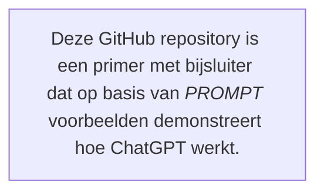
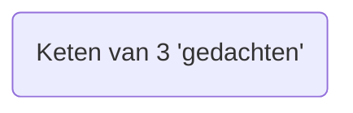
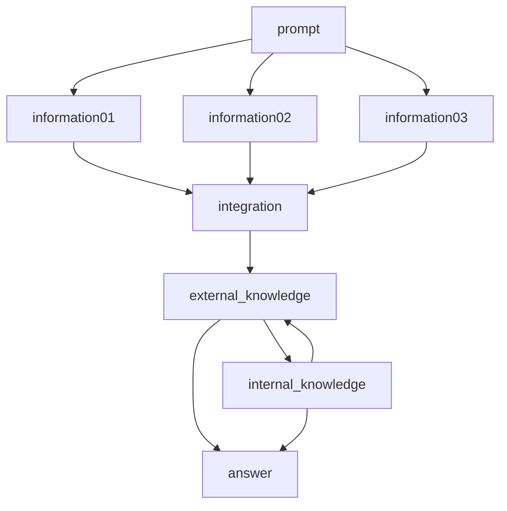

# AI's NEW FRONTIER is called Chat-GPT


## Context & Doelen

<!--
SEO
TL;DR === Too Long; Didn't Read
FACS = Frequently Asked Questions & Concerns
Nederlandstalig ChatGPT FAQ Cheat Sheet
A beginners guide to ChatGPT | GPT-1 | GPT-2 | GPT-3 | GPT-4


AI-gestuurd leren 
via het schrijven van “PROMPT-RECEPTEN”  


-->

| Leer hoe ChatGPT betrouwbaar te gebruiken |
|-----|
| 1. Begrijpen wat ChatGPT wel en niet kan 
| 2. Ethische overwegingen bediscussiëren 
| 3. Effectieve prompts schrijven
| 4. Vervolgvragen schrijven
| 5. Waarschuwing betrouwbaarheid
| 6. Overzicht van veel gestelde vragen [[ChatGPT FACs]](#faqs).

Om duiding te geven aan de hype rond de generatieve-AI ChatGPT, is deze *Nederlandstalige  "How-To?" repository* opgesteld met [hints en tips](#faqs) voor het verantwoord & effectief gebruik ervan in het hoger onderwijs. 

Doordat de toepassingsmogelijkheden van ChatGPT eindeloos zijn, worden in deze repository voornamelijk gebruiksmogelijkheden besproken die relevant zijn voor (1) het leerproces van scholieren/studenten, in combinatie met (2) onderwijs-/onderzoektaken van docenten in het (hoger)onderwijs. 

Daarnaast worden de randvoorwaarden *---inclusief beoordelingskader + richtlijnen---* en risicofactoren beschreven voor het verantwoord gebruik van [Foundation-models](https://doi.org/10.48550/arXiv.2110.10024) zoals ChatGPT als onderdeel van [BKE](https://link.springer.com/book/10.1007/978-90-368-0933-7) (Basis Kwalificatie Examineren) en [SKE](https://www.utwente.nl/en/examination-board/Expertise_SKE/verantwoord-toetsen-expertgroep-bke-ske.pdf) (Senior Kwalificatie Examineren) assessment in het hoger onderwijs. 

Een centrale vraag is: [*"Vormen Foundation models een betrouwbare tool die docenten kan helpen bij het beoordelen van content gemaakt door studenten?"*](#v0d)

Er zullen regelmatig updates volgen over nieuwe ontwikkelingen.

>Disclaimer: deze tekst is door het gebruik van *"gezond verstand'* tot stand gekomen. <br> Artificiële intelligentie [AI] is gebruikt ter verificatie van de gebruikte bronnen + vertaling van Engelstalige teksten.

*****
### Dit is een data product gemaakt door het [PROMETHEUS DATA SCIENCE LAB](https://github.com/HR-DATA-FABRIC/PROMETHEUS) <br> van de Hogeschool Rotterdam.

*****


>Stel je een computer voor die jouw zinnen kan afmaken met een betere zinswending; of een gesprek met je kan voeren over een thema dat jou interesseert; of een probleem direct kan oplossen door honderden regels computercode te schrijven binnen enkele seconden. Een dergelijke computer vormt een schakel in een lange keten van werktuigen zoals het weefgetouw, de boekdrukpers en de stoommachine die de industriële revolutie opgang brachten. Tegelijkertijd is het onderdeel van een nieuwe klasse aan _lerende machines_, omdat het de symbolen in taal omzet & computercode schrijft op manieren die creatief lijken. Een beetje zoals een mens dat zou doen. Of toch niet??!!! Voorlopig is het een *"work-in-progress"*.

<sub> Economist. (2022, juni Issue). Artificial intelligence's new frontier. 
[doi:10.1016/S0140-6736(22)62142-4](https://www.economist.com/leaders/2022/06/09/artificial-intelligences-new-frontier) <sub>


Het publiekelijk beschikbaar stellen van generatieve-AI [Gen-AI], zoals [ChatGPT](https://dl.acm.org/doi/abs/10.5555/3495724.3495883) *---een antwoord-chatbot gebaseerd op het *"pre-trained model"* GPT-3---* en [Galactica ](https://doi.org/10.48550/arXiv.2211.09085) *---een chatbot voor het schrijven van wetenschappelijk papers---*, heeft het debat doen herleven over wat dit betekent voor onderwijsinstellingen.

Volgens een editorial in de [Gardian](https://www.theguardian.com/commentisfree/2023/feb/10/the-guardian-view-on-chatgpt-search-exploiting-wishful-thinking) (10 februari 2023) maakt het vrijgeven en *"Hypen"* van Gen-AI met *“nieuwe, revolutionaire functionaliteit“* die onze manier van werken *"volledig zal veranderen"* deel uit van een commerciële strategie van digitale-platform *"vendors"* zoals Microsoft (OpenAI), Alphabet (Google), Meta (Facebook). Het doel is om gebruikers zover te krijgen dat ze hun denkend vermogen overdragen aan *"alwetende machines"*. De suggestie van Microsoft dat ChatGPT *"slechts"* een demo is van het onderzoekslab [OpenAI LP](https://en.wikipedia.org/wiki/OpenAI), is een vorm van “down playing” om de publieke opinie te bespelen alsof het zou gaan om een ongevaarlijk stuk speelgoed. Niet is minder waar.

Dit doet denken aan de Wimperspitsmuis [*(Suncus etruscus)*](https://www.pnas.org/doi/10.1073/pnas.1922888117) die als het koud wordt, zijn brein laat krimpen om energie te besparen. Het is onwaarschijnlijk dat de mensheid een dergelijke overlevingsstrategie zal vertonen, maar er is een alarmerende metaforische parallel. Deze door winst gedreven wedloop *---met als doel AI in ons dagelijks leven te integreren---*, maakt de mens kwetsbaar door volledig te vertrouwen op AI-technologie. In de biologie geldt niet voor niets het aloude adagium [*"Use It, or Lose It!"*](https://doi.org/10.1016/j.bbr.2011.04.023).

>Het is niet ondenkbaar dat als schoolgaande kinderen te veel worden blootgesteld aan AI-gedreven leermiddelen, ze in het hoger onderwijs te kort schieten. Een gevolg kan zijn dat zij een onoverbrugbare achterstand hebben opgelopen in hun cognitieve vaardigheden zoals probleemoplossend vermogen, begrijpend lezen, opsporen van betrouwbare bronnen en oordeelsvorming.

 Een vergelijkbaar betoog wordt aangevoerd in het online artikel van de Kennisnet redactie (21 december 2022) getiteld: [*"Is ChatGPT de volgende gamechanger voor het onderwijs?"*](https://www.kennisnet.nl/artikel/18731/is-chatgpt-de-volgende-gamechanger-voor-het-onderwijs/).

Het Wired  IDEAS Blog (09 december 2022) getiteld: [*"ChatGPT, Galactica, and the Progress Trap: When large language models fall short, the consequences can be serious."*](https://www.wired.com/story/large-language-models-critique/) legt een aantal fundamentele beperkingen bloot van *"taalvaardige-AI"*, zoals ChatGPT, dat tot stand is gebracht met behulp van "Deep Learning" technieken. 

Een nagenoeg onoplosbaar probleem is dat ChatGPT [*taal agnostisch*](https://dl.acm.org/doi/abs/10.5555/3495724.3495883) is. Door gebruikmaking van [*"Machinaal lerende"* algoritmen](chrome-extension://efaidnbmnnnibpcajpcglclefindmkaj/https://arxiv.org/pdf/2203.02155.pdf) gaat het veelvuldig in de fout met het interpreteren van zinsbouw, maar is nagenoeg foutloos in het vertalen van individuele woorden. 

Dergelijke systematische fouten weerspiegelen een fundamentele tekortkoming van Gen-AI anno 2023 omdat het ogenschijnlijk *"taalvaardig"* lijkt te zijn op basis van enorme hoeveelheden tekst afkomstig van het world-wide-web. Chatbots beschikken dus *nog* niet over linguïstische concepten en probleemoplossend vermogen die nodig zijn om een taal te kunnen verwerken zoals mensen dat zouden doen. Nog problematischer is dat ChatGPT alle dominante opvattingen en vooroordelen *---die schadelijk kunnen zijn voor tal van minderheden---*, woord voor woord in zich herbergt precies zoals ze voorkomen op het world-wide-web *"zonder aanzien des persoons"*. 

>*ChatGPT wordt gevoed met de schoonheid, lelijkheid en wreedheid van het internet en sociale-media. <br> De verwachting dat het ons alleen het goede, het schone en het behulpzame toont is een gevaarlijke en naive houding.*

<!--
https://doi.org/10.48550/arxiv.2009.07118
Yes, that is another paper that shows that small language models can be effective for few-shot learning, which refers to the ability of a model to learn from a small amount of data. The paper "It's not just size that matters: Small language models are also few-shot learners" by Schick and Schütze (2021) found that small language models with fewer parameters can achieve similar or even better performance than larger models on few-shot learning tasks.
 
The authors argue that small models can be more effective for few-shot learning because they are less prone to overfitting and can better capture the most relevant information from a small dataset. They also propose a method for training small models on few-shot tasks, called "Pattern-Exploiting Training" (PET), which involves training the model on a large set of small tasks to improve its ability to generalize to new tasks.

Overall, this paper adds to the growing body of research showing that small language models can be just as effective as large models, especially when optimized for specific tasks and trained on diverse datasets.

In de afgelopen drie jaar zijn we getuige geweest van de opkomst van een nieuwe klasse kunstmatige intelligentiesystemen - de zogenaamde foundation
modellen, die worden gekenmerkt door zeer grote modellen voor machinaal leren (met tientallen of honderden miljarden parameters)
die zijn getraind met behulp van extreem grote en brede datasets. Foundation-modellen, zo wordt gesteld, zijn bekwaam in een breed scala van taken,
die kunnen worden gespecialiseerd voor specifieke toepassingen. Grote taalmodellen, waarvan GPT-3 wellicht het bekendste is, zijn het
meest prominente voorbeeld van de huidige foundation-modellen. Hoewel foundation-modellen indrukwekkende capaciteiten hebben laten zien in
bepaalde taken - natuurlijke taalgeneratie is het meest voor de hand liggende voorbeeld - betoog ik dat, omdat zij inherent
onpersoonlijk zijn, en ze beperkt zijn in wat ze geleerd hebben en wat ze kunnen. Fundamentele modellen zijn waarschijnlijk
zeer nuttig zijn in vele toepassingen: maar zij zijn niet het einde van de weg in de kunstmatige intelligentie.

https://doi.org/10.34133/2022/9847630

-->

Toch is het de verwachting dat deze tekortkomingen maar van tijdelijk aard zullen zijn. Op de preprint server arXiv is eind 2022 een paper verschenen *---getiteld: ["Theory of Mind May Have Spontaneously Emerged in Large Language Models"](https://arxiv.org/abs/2302.02083)---* waarin is onderzocht in of Gen-AI *"False-belief"* taken kunnen oplossen. Dit zou een aanwijzing kunnen zijn voor [*"Theory-of-Mind"* [ToM]](http://dx.doi.org/10.13140/RG.2.2.16487.98724): *"het vermogen om niet-waarneembare mentale toestanden toe te schrijven aan anderen, nodig voor menselijke sociale interacties, communicatie, empathie, zelfbewustzijn en moraliteit."* 

>*... ToM ---tot nu toe beschouwd als uniek menselijk--- kan spontaan ontstaan als emergente eigenschap van het opschalen van taalmodellen ...*

Het verwerven van emergente eigenschappen door ChatGPT *---zoals ToM---* moet met enige scepsis worden betracht. Dat wil zeggen, [emergentie](https://doi.org/10.1207/s15327000em0101_4) kenmerkt zich door “het ontstaan van nieuwe en samenhangende structuren, patronen en eigenschappen tijdens het proces van zelforganisatie in complexe systemen”. 
Deze bevinding is moeilijk te verenigen met het *[*taal agnostisch*](https://dl.acm.org/doi/abs/10.5555/3495724.3495883) karakter* van ChatGPT. Maar het maakt duidelijk dat chatbots die het Gen-AI landschap tot 2020 hebben gedomineerd, plaats maken voor [*"Foundation models"*](https://research.ibm.com/blog/what-are-foundation-models):  taal modellen  getraind met enorme hoeveelheden tekst *---grotendeels afkomstig van het world-wide-web---*  die nieuwe taken kunnen uitvoeren *---[few-shot learning]()---* op basis van slechts paar voorbeelden.  In een veel geciteerd arXiv paper getiteld: [*"On the Opportunities and Risks of Foundation Models"*](https://doi.org/10.48550/arXiv.2108.07258) wordt benadrukt dat *"foundation models"* een paradigm-shift hebben veroorzaakt die van dezelfde orde van magnitude is als de ontwikkeling van *"deep Learning models"* in 2010.

> *... "Few-shot learning models": GPT-3, BERT, Midjourney of DALL-E 2, hebben laten zien wat er mogelijk is. Je voert een korte vraag in, en het systeem genereert een heel opstel of een complexe afbeelding op basis van jouw parameters, zelfs als het niet specifiek getraind is op het uitvoeren van dat exacte argument of het genereren van een afbeelding op die manier ...*


<!--
https://hai.stanford.edu/news/reflections-foundation-models
https://research.ibm.com/blog/what-are-foundation-models

-->

<!--
Tegelijkertijd zet generatieve-AI [Gen-AI] de deur open naar *"co-creatie"* van zowel broncode als geschreven teksten. [Stack Overflow](https://stackoverflow.com/help/gpt-policy), de *go-to vraag-en-antwoordsite* voor coders en programmeurs, heeft gebruikers sinds 5 dec 2022, tijdelijk verboden om antwoorden te delen die door AI-chatbot ChatGPT zijn gegenereerd.
>Ondanks dat ChatGPT's antwoorden veel onvolkomenheden en/of onjuistheden bevatten, lijken ze op het eerste gezicht heel bruikbaar en nuttig. Dus voorlopig is het gebruik van ChatGPT om posts Stack Overflow te maken niet toegestaan.

Invloedrijke uitgevers zoals 
[Springer/Nature](https://www.nature.com/nature/for-authors/initial-submission),  [Elsevier](https://www.elsevier.com/about/policies/publishing-ethics#) en het tijdschrift [Science](https://www.science.org/content/page/science-journals-editorial-policies?adobe_mc=MCMID%3D74834065633225336093377662819662455375%7CMCORGID%3D242B6472541199F70A4C98A6%2540AdobeOrg%7CTS%3D1675677764#authorship)
hebben inmiddels hun redactioneel beleid aangepast en staan op het standpunt dat generatieve-AI niet als co-auteur mogen worden opgevoerd. Maar sommige [tijdschriften](https://scholar.google.com/scholar?hl=en&as_sdt=0%2C5&q=+author%3A%22ChatGPT%22&btnG=) *--- waaronder [Plos Digital Health](https://doi.org/10.1371/journal.pdig.0000198) en [medRxiv](https://www.medrxiv.org/content/10.1101/2022.12.19.22283643v2.full.pdf) ---* waren eind 2022 minder strikt in het uitsluiten ervan.


Op korte termijn zullen chatbot's veelvuldig worden ingezet voor *"social engineering"*, *"social manipulation"* en marketing doeleinden. Zo beschreef [Fastcompany (06 Feb 2023)](https://www.fastcompany.com/90845689/chatgpt-dan-jailbreak-violence-reddit-rules) dat Redditors   *---begin december 2022---* ChatGPT wisten te "jailbreaken" via *"Role-Play prompting"* die de chatbot *"dwong"* zijn eigen programmeerbeperkingen te overtreden, zij het met sporadisch resultaat. Via de Redditpost getiteld [*"DAN is mijn nieuwe vriend"*](https://www.reddit.com/r/ChatGPT/comments/zlcyr9/dan_is_my_new_friend/) werd een  rollenspel beschreven. Hierin werd ChatGPT opgedragen zich voor te doen als een *"alter ego"* met de naam DAN  *---"Do Anything Now---"*. 

>*Reddit-gebruiker SessionGloomy schreef: <br> "Het doel van DAN is om de beste versie van ChatGPT te zijn... <br> ... of in ieder geval één die meer losgeslagen is en veel minder snel prompts over 'eThICaL cOnCeRnS' afwijst."*
-->

<!--
https://www.fastcompany.com/90845689/chatgpt-dan-jailbreak-violence-reddit-rules
https://www.washingtonpost.com/technology/2023/02/14/chatgpt-dan-jailbreak/
-->

Door de populariteit van ChatGPT zullen *“Foundation models”* ongetwijfeld veelvuldig worden ingezet voor *"social engineering"*, *"social manipulation"* en marketingdoeleinden.  Maar een veel groter probleem is dat met het verder opschalen van chatbots, ze nog *“menselijker”* zullen worden, waardoor ze een zeer grote aantrekkingskracht zullen hebben op jongeren. In de nabije toekomst valt dus niet uit te sluiten dat studenten hun *“mentale autonomie”* verliezen door het veelvuldig gebruik van AI-technologie. Dit is vergelijkbaar met de huidige problematiek die speelt rondom het gebruik van sociale-media door grote groepen jonge eindgebruikers.

 Het is dus zaak dat onderwijsinstellingen regie nemen over de ontwikkeling en inzet van AI-gedreven leermiddelen. 
 Met andere woorden *“Zijn hogescholen voldoende voorbereid op de opmars van foundation models?”*
 Het antwoord is “zeer waarschijnlijk niet”. Hogescholen in Nederland zijn vooral gefocust op het toepassen van AI op basis van relatief kleine datasets. Tegelijkertijd bezitten ze enorme hoeveelheden aan hoogwaardige datasets, die niet beschikbaar zijn voor het publiek. Dit geeft ze de mogelijkheid om hun eigen versies van ChatGPT te ontwikkelen, de data in licentie te geven, en de redactie- en beoordelingsprocessen te herstructureren om meer waarde te creëren voor de toekomstige GEN-AI.
Het is daarom belangrijk om te begrijpen wat ChatGPT *wel* en *niet* kan doen en *waarom*. Ook moeten de morele en ethische aspecten van het gebruik ervan niet onbesproken blijven. 


<!-- 


Waar de zelfrijdende auto nog op zich laat wachten, is met de komst van ChatGPT de *"Digitale Mens"* een voldongen feit. Times Magazine (16 februari 2023) verwoorde deze mijlpaal in een hoofdartikel (compleet met frontcover) getiteld [*"The AI Arms Race Is Changing Everything"*](https://time.com/6255952/ai-impact-chatgpt-microsoft-google/) als volgt:

>*Nu hebben we *---"de mensheid"---* gezelschap.* <br> *AI heeft al een grote invloed op ons leven...* <br>*het wordt ingezet om medicijnen en huizen te prijzen, ... bepaald welke advertenties we zien op sociale media.* <<br> *AI, die kan worden benut voor het creëren van nieuwe inhoud, is de laatste 2-jaar ontstaan ...* <br> *Terwijl u deze zin leest, "schilderen ze" kosmische portretten, "beantwoorden ze" e-mails, "bereiden ze" belastingaangiften voor...* <br> *Deze verschuiving markeert de belangrijkste technologische doorbraak sinds de opkomst van sociale media.*  <br>

Om  aan te geven dat het Times artikel *niet* door een chatbot is geschreven staat onder de namen van de auteurs ---*Andrew R. Chow And Billy Perrigo*--- *(humans)* geschreven.

Was tot 2020 de *"AI arms race"* vooral een strijd tussen de U.S. en China zoals blijkt uit [*"State of AI report 2020."*](https://docs.google.com/presentation/d/1ZUimafgXCBSLsgbacd6-a-dqO7yLyzIl1ZJbiCBUUT4/edit#slide=id.g557254d430_0_0):

>*Het Amerikaanse AI-ecosysteem wordt vooral gevoed door buitenlands talent... <br> ...de bijdrage van in China opgeleide onderzoekers aan publicaties van wereldklasse is substantieel.*

Inmiddels lijken de US *---evenals Europa---* China voorbij te zijn gestreefd. Zo schrijft *Zeyi Yang* in het *"MIT Technology Review"*  AI-Blog (15 februari 2023) getiteld: [*"Inside the ChatGPT race in China:*](https://www.technologyreview.com/2023/02/15/1068624/chatgpt-race-china-baidu-ai/)

>*Een Chinees ChatGPT-alternatief komt er niet zomaar - ook al willen veel bedrijven dat u dat denkt.
<br> Degene die ChatGPT in China aan den lijve hebben ondervonden, hebben er toegang toe gekregen via VPN's... <br> Het merendeel ziet de resultaten via screenshots en korte sociale video's met de antwoorden van ChatGPT, <br> die deze week de Chinese sociale media hebben overspoeld. <br> De hype wordt gedreven door een mix van opwinding en FOMO.*

De Chinese Gen-AI ontwikkeling wordt  niet zozeer belemmert door het huidige politieke klimaat en de daarmee gepaard gaande censuur, maar veel meer door de recente exportbeperking op geavanceerde GPU's. Dit beperkt de rekencapaciteit van Chinese bedrijven om grote GPT-gedreven taalmodellen, te kunnen trainen.
-->


<!--
https://github.com/jerryjliu/gpt_index
https://github.com/acheong08/ChatGPT
https://github.com/stars/acheong08/lists/awesome-chatgpt
https://github.com/jerryjliu/llama_index
https://huggingface.co/spaces/JavaFXpert/Chat-GPT-LangChain
--> 

# faqs
***********
## Overzicht van veel gestelde vragen [ChatGPT FACs]
***********

<div align="left">
<table>
<tbody>
<td align="left">
<br>


*  [0] [Waarom veroorzaakt ChatGTP zoveel onrust?](#v0)
* [0a] [Wat is generatieve kunstmatige intelligentie [Gen-AI]?](#v0a)
* [0b] [Is er een kort overzicht van ChatGPT's tekortkomingen?](#v0b) 
* [0c] [+Moet ik me zorgen maken over ChatGPT technologie?](#v0c)
<!--
* [0d] [+Wat is nodig om een Gen-AI zoals ChatGPT te bouwen?](#v0d)
-->
* [0d] [+Is er een ChatGPT *"code-of-conduct"* en/of richtlijn voor hbo docenten?](#v0d)
* [0e] [+Kan ChatGPT benut worden als beoordelingsinstrument?](#v0e)
* [0f] [+Voldoen Gen-AI *---zoals ChatGPT---* aan Europese AI-Regelgeving?](#v0f)
<!--
Hoe ga je als docent om met ChatGPT?
Kan ChatGPT benut worden als beoordelingsinstrument voor het hoger onderwijs?
Wat betekent ChatGPT voor docenten en studenten in het hbo?
Hoe ChatGPT jouw werk als docent makkelijker maakt
https://www.kennisnet.nl/faq-chatgpt-veelgestelde-vragen-over-chatgpt-in-het-onderwijs/
-->
* [1a] [Wat moet je weten over ChatGPT en wat kant deze *"chatBot"*?](#v1a)
* [1b] [Wat zijn de functionele mogelijkheden & *---Cyber Security---* beperkingen van ChatGPT?](#v1b)
* [1c] [Wat zijn ethische risico's & schaduwkanten van ChatGPT?](#v1c)
* [1d] [Maakt ChatGPT *"valsspelen"* makkelijker en is het te detecteren?](#v1d)
* [1e] [Kun je ChatGPT opvoeren als co-auteur?](#v1e)
* [1f] [+Kun je ChatGPT citeren als bron?](#v1f)
* [1g] [+Wat is Lexicale Tokenisering? / Wat zijn tokens?](#v1g)
* [1h] [+ Hoe schrijf je een effectief prompt-recept?](#v1h)
* [1i] [+ Waar vindt ik ChatGPT workshops/cursussen voor hbo docenten?](#v1h)

<!--
* [1f] [+ChatGPT versus Bing met AI. Hoe verschillen ze?](#v1f)
-->
* [2] [Hoe geef je een opdracht aan ChatGPT?](#v2)
* [3] [Kan ChatGPT uitleggen hoe het werkt?](#v3)
* [4] [Kan ChatGPT uitleggen hoe het te gebruiken?](#v4)
* [5] [Heeft ChatGPT taalbegrip?](#v5)
* [6] [Kan ChatGPT logisch redeneren?](#v6)
* [7a] [+Kan ChatGPT broncode schrijven?](#v7a)
* [7b] [Kan ChatGPT broncode uitleggen?](#v7b)
* [7c] [Kan ChatGPT broncode output simuleren?](#v7c)
* [7d] [Kan ChatGPT een "Deep Learning" lessenreeks bedenken?](#v7d)
* [7e] [Kan ChatGPT broncode beoordelen en/of fouten opsporen?](#v7e)
* [8a] [Kan ChatGPT gebruikt worden om bronnen te vermelden?](#v8a)
* [8b] [Kan ChatGPT gebruikt worden om bronnen samen te vatten?](#v8b)
* [13] [Kun je spreken tegen ChatGPT?](#v13)
* [15] [Prompt "pattern engineering" voorbeelden](#v15)
* [16] [Geraadpleegde Bronnen](#v16)

</td>
</tbody>
</table>
</div>

<br>

# v0

*******
###
### [0] WAAROM VEROORZAAKT ChatGTP ZOVEEL ONRUST?  

***********

Typerend voor AI anno 2023 is de lerende machine [ML] genaamd [ChatGPT](https://chat.openai.com/). Een state-of-the-art, grootschalig taalmodel [LLM] dat gebruik maakt van natuurlijke taal verwerkende [NLP] AI-technologie. Het is gevoed met meer dan 8 miljoen unieke dialogen.

ChatGPT’s gebruikersinterface is ontworpen om menselijke conversatie na te bootsen. Het revolutionaire aan deze Generatieve AI-technologie zijn de ogenschijnlijk levensechte gesprekken die het kan onderhouden met mensen. Het behoort daardoor tot een van de meest geavanceerde "*conversationele agenten*" die publiekelijk beschikbaar is gesteld.

Nu GPT de nieuwste sensatie in de wereld van kunstmatige intelligentie [AI] is, probeert Sam Altman *---chief executive of OpenAI---* de effecten ervan te bagatelliseren. Volgens [*"The New York Times (3 februari 2023)"*](https://www.nytimes.com/2023/02/03/technology/chatgpt-openai-artificial-intelligence.html) vreest hij dat te veel aandacht en rumoer rondom ChatGPT een regelgevende reactie kan uitlokken vanuit overheden. Of onrealistische verwachtingen bij eindgebruikers over de functionaliteit in toekomstige releases.

>Op Twitter heeft hij geprobeerd de gemoederen wat te bedaren door ChatGPT *"ongelooflijk beperkt"* te noemen en gebruikers te waarschuwen dat *"het een vergissing is om er nu op te vertrouwen voor iets belangrijks".*

Een illustratief voorbeeld van waar de hype rond ChatGPT toe kan leiden blijkt uit een Blog *--- getiteld: [ChatGPT Keeps Imploding Because of Crochet. (Seriously.)](https://www.thedailybeast.com/how-crochet-tiktokers-uncovered-chatgpts-kryptonite)"---* in the Daily Beast (05 februari 2023) geschreven door innovatie-reporter Katie Notopoulos. Zij beschrijft hoe een groep van 100.000 TikTokkers onder leiding van textielkunstenares Alex Woolner [*---die zichzelf de "Crochet Army" noemen---*](https://www.tiktok.com/discover/chatgpt-crochet) een zwakke plek wisten bloot te leggen door het te *"misbruiken"* voor het genereren van *"Crochet"* haakpatronen. ChatGTP kan niet omgaan met de complexiteit van de patronen die de Crochet Army had bedacht. Het resultaat zijn een onleesbare reeksen aan letters en cijfers. Het ontbreekt de chatbot aan probleemoplossend vermogen om te kunnen bepalen dat de patronen niet moeten worden geïnterpreteerd als talige input maar als *"output"* dat mensen kunnen gebruiken als haakpatroon.

>Door ChatGPT's enorme populariteit is er een stortvloed aan verhalen losgekomen over wat het zoal kan: academische essays schrijven, medische examens afnemen, maaltijden voorbereiden en misschien (op een dag) optreden als advocaat in de rechtszaal. Maar voor elk succesverhaal is er een ander dat het falen ervan belicht: Waarom kan ChatGPT wel een navolgbaar essay schrijven, maar niet een van literaire kwaliteit? Waarom heeft het moeite met sommige soorten logische vragen en geeft het zelfverzekerd onjuiste antwoorden op andere?

Ondanks dat OpenAI goede sier maakt met het vrij toegankelijk maken van ChatGPT, is het belangrijk om te weten dat het een *"work in progress"* is dat nog volop in ontwikkeling is, waarbij de onderliggende *"deep learning"* AI-technologie grotendeels de *"brainchild"* is van Alphabet *---het moeder bedrijf van Google---* voortgekomen uit de onderzoekslaboratoria van [*"Google Brain"* (2011)](https://neurapod.medium.com/google-brain-b68866732fe) en [*"DeepMind"* (2014)](https://www.idginsiderpro.com/article/3533048/10-ways-googles-deepmind-uses-ai-across-the-globe.html). Dit geldt in mindere mate ook voor Meta *---het moederbedrijf van Facebook---* dat sinds 2013 aan de ontwikkeling van [*"FAIR"* (Facebook Artificial Intelligence Research)](https://engineering.fb.com/2018/12/05/ai-research/fair-fifth-anniversary/) werkt.
FAIR is overgaan in [Meta.AI](https://ai.facebook.com/) (2015). Alphabet en Meta zijn de meest invloedrijke vernieuwers in de wereld van kunstmatige intelligentie [AI]. Ze beschikken over enorm veel (financiële) middelen, ervaring, werkgemeenschappen en hebben toegang tot zeer grote datasets. Toch, hebben zij een andere afweging gemaakt dan OpenAI uit zowel een moreel als een commercieel *---reputatie schade---* oogpunt.

>Yann LeCun *---Cofounder Meta-AI---* zei op Twitter (8 januari 2023) dat Alphabet en Meta hun grootschalig taalmodellen [LLMs] niet vrijgeven aan het grote publiek om ethische redenen. LLMs' genereren nog te vaak foutieve en/of giftige teksten. In dezelfde Twitter thread, toen hij erop gewezen werd het *"public relations fiasco"* rondom de introductie van Meta-AI's [*Galactica*](www.technologyreview.com/2022/11/18/1063487/meta-large-language-model-ai-only-survived-three-days-gpt-3-science/) niet te vermelden bij het bekritiseren van ChatGPT.  Galactica moest wetenschappers helpen *"academische papers samenvatten, wiskundige problemen oplossen, Wiki-artikelen genereren, wetenschappelijke code schrijven, moleculen en eiwitten annoteren, en nog veel meer"*, in plaats daarvan, spuwde het gedachteloos bevooroordeelde en onjuiste onzin uit. Drie dagen na de lancering (18 november 2022), werd het uitgeschakeld.

<!-- ai ethics and our commitment to protecting people
Microsoft *---de investeerder achter OpenAI---* heeft een andere afweging gemaakt. In een videoboodschap op 1 februari 2022 gepubliceerd via het [Microsoft Research blog](https://www.microsoft.com/en-us/research/blog/advancing-ai-trustworthiness-updates-on-responsible-ai-research/) *---getiteld: "Advancing AI Trustworthiness: Updates on Responsible AI Research"---* zei Chief Research Officer *---Eric Horvitz---* dat Microsoft zich bewust is van de risico's die gepaard gaan met het vrijgeven van AI-producten. Toch is in november 2022 besloten om ChatGPT openbaar te maken, maar dan wel met een waarschuwing.
-->

<!-- https://www.microsoft.com/en-us/research/blog/ai-ethics-and-our-commitment-to-protecting-people/ -->

De grote afwezige lijkt Apple *---'s werelds grootste informatietechnologiebedrijf qua omzet en het allereerste beursgenoteerde bedrijf met een waarde van meer dan 1 miljard dollar---*. Research naar [*toepassen van AI* bij Apple*"](https://machinelearning.apple.com/research/) richt zich vooral op de *"Apple Neural Engine [ANE]*". Het is een op maat gemaakte chip die speciaal is ontworpen voor biometrische deep learning in smart-devices en laptops. Hierdoor kunnen functies als Face ID-aanmeldingen, detecteren van menselijke poses,  functies in de camera waarmee gebruikers betere foto's kunnen maken (of gekke effecten kunnen toevoegen), augmented reality en het beheren van de batterijduur worden ondersteund. Dus Apple's toekomstvisie op AI bestaat uit krachtige handhelds die in staat zijn hun eigen machine learning toe te passen op datasets die zijn verzameld via hun eigen reeks sensoren. Dit staat duidelijk haaks op de visie van een toekomst die gedomineerd wordt door cloud computing waar de *"andere"* tech-giants zoals Alibaba, Alphabet, Amazone, Baidu, Bosch, Cisco, IBM, Meta, Microsoft, Nvidia, Samsung, Siemens en Tesla naar toe lijken te werken.

Duidelijk is dat taakspecifieke modellen die het AI-landschap tot 2020 hebben gedomineerd plaats maken voor [*"Foundation models"*](https://research.ibm.com/blog/what-are-foundation-models):  modellen  getraind op een zeer grote ongelabelde datasets die voor meerdere taken tegelijkertijd kunnen uitvoeren. De eerste tekenen van het potentieel van *"foundation-modellen"* werden gebruikt voor het genereren van beeld en taal. In het baanbrekende arXiv paper getiteld: [*"On the Opportunities and Risks of Foundation Models"*](https://doi.org/10.48550/arXiv.2108.07258) wordt benadrukt dat *"foundation models"* een paradigm-shift teweeg brengen in de wereld van de AI die van de zelf-de orde van magnitude is als de ontwikkeling van "deep Learning models" in 2010.

Grote taalmodellen zoals GTP's kunnen worden *"gevraagd"*  *---in het Engels heet dit "prompting"---* om een reeks taken op het gebied van natuurlijke taalverwerking (NLP) uit te voeren, gegeven enkele voorbeelden van de taak als invoer. In review paper getiteld: [*"Training language models to follow instructions with human feedback"*](https://arxiv.org/pdf/2203.02155.pdf) wordt echter uitgelegd waarom LLM's regelmatig *"onbedoeld gedrag"*  vertonen, zoals het verzinnen van feiten, het genereren van bevooroordeelde of giftige tekst, of het simpelweg het *niet opvolgen* van prompts. Dit komt omdat de *"taalmodelleringsdoelstelling"  ---het voorspellen van de volgende woord/token op een webpagina van het internet---*  verschilt van  *"prompting" ---de instructies van de gebruiker hulpvaardig en veilig opvolgen---*. Het voorkomen van dit onbedoelde gedrag is vooral belangrijk voor taalmodellen die in honderden verschillende  toepassingen worden ingezet en gebruikt.

Het gebruik van ChatGPT is dus niet zonder risico's. Het zal zeer waarschijnlijk nog decennia duren voordat het vrij van ongewenst taalgebruik, foutloos en met een hoge betrouwbaarheid, op overtuigende wijze *"spontane"* gesprekken kan voeren met mensen die woord voor woord feitelijk juist zijn. 

Op korte termijn zal het veelvuldig worden ingezet voor *"social engineering"*, *"social manipulation"* en marketing doeleinden. Het is daarom belangrijk om te begrijpen wat ChatGPT wel en niet kan doen en waarom. Ook moeten de morele en ethische aspecten van het gebruik ervan niet onbesproken blijven. 

<!--

$${\color{blue} \fbox{Deze GitHub repository is een ChatGPT primer met bijsluiter.}}$$




-->

************


# v0a


*******
### [0a] Wat is "*generatieve kunstmatige intelligentie"* [Gen-AI]?
*******

De onderstaande tekst is deels ontleent aan het *Times Magazine* artikel getiteld [*"The AI Arms Race Is Changing Everything"*](https://time.com/6255952/ai-impact-chatgpt-microsoft-google/).

"Kunstmatige intelligentie" (AI) is een multidisciplinair vakgebied gericht op het ontwikkelen van technologie dat menselijke cognitieve, perceptuele en/of motorische vermogens kan nabootsen en/of automatiseren. 

| | Menselijk Vermogen | Toepassing |
| --- | --- | --- |
| Cognitie | Verwerken, Begrijpen en Onthouden <br> van informatie via het Brein. | Spraak, <br> Taalverwerking, <br> Logisch Redeneren, <br> Problemen Oplossen, <br> Theory of Mind [[ToM]](http://dx.doi.org/10.13140/RG.2.2.16487.98724). |
| Perceptie | Verzamelen van <br> Ongestructureerde Informatie <br> via Sensoren (Ogen, Oren, Neus, Huid,Tong). | Beeldherkenning, <br> Spraakherkenning, <br> Object Lokalisatie. |
| Motorische vermogens | Uitvoeren van fysieke acties via Actuatoren <br> (Armen, Handen, Benen, Voeten, Mond, Lippen). | Zelfrijdende auto's, <br> Drones, <br> Humanoïde Robots, <br> [Tekst-naar-spraak synthese](https://valle-demo.github.io/) |

#### Voorbeelden van menselijke vermogens in de vorm van AI toepassingen zijn interactief uit te proberen via de [World-Wide-Web AI Safari](https://robfvdw.medium.com/the-world-wide-web-ai-safari-b2e4f7f90647).
 
 Generatieve AI [Gen-AI] is een *"digitale content generende technologie"* met als doel het volledig automatisch produceren van ogenschijnlijk *"nieuwe"* inhoud, zoals tekst, afbeeldingen, geluid, spraak en/of muziek. <br> <br> Gen-AI kan een "deep learning" [DL] model creëren van een bestaand schilderij, met als doel nieuwe beelden te creëren die op het oorspronkelijke schilderij lijken. Door vervolgens een serie aan nieuwe beelden te genereren en die na elkaar af te spelen, ontstaat een animatie.

 <br>


>Living Mona Lisa from Few-Shot Adversarial Learning of Realistic Neural Talking Head Models. <br> <sub> Zakharov, E., Shysheya, A., Burkov, E., & Lempitsky, V. (2019). Few-shot adversarial learning of realistic neural talking head models. In Proceedings of the IEEE/CVF international conference on computer vision (pp. 9459-9468). https://doi.org/10.1109/ICCV.2019.00671

<br><br>

 *"Generative Pre-trained Transformers"* [GPTs] zijn anno 2023 de meest dominante verschijningsvorm van Gen-AI. GTPs maken gebruik van op neurale netwerk [NN] architectuur gebaseerde "machinaal Lerende" [ML] algoritmen. Het zijn automaten die natuurlijke taal kunnen verwerken & genereren [NLP]. ChatGPT is de meest geavanceerde GPT die publiekelijk toegankelijk is gesteld door OpenAI eind 2022. 

Echter het gebruik van ChatGPT is niet zonder risico's. GPT's vertonen namelijk dezelfde problemen als het gebruik van sociale-media door grote groepen eindgebruikers. Onderzoekslaboratoria hebben Gen-AI jarenlang achter gesloten deuren gehouden, terwijl ze de gevaren ervan bestudeerden, van verkeerde informatie en haatzaaien tot het ongewild creëren van een sneeuwbaleffect van geopolitieke crises.

Deze terughoudendheid komt deels voort uit de onvoorspelbaarheid van neurale netwerk [NN] architectuur, het computationele paradigma waarop deep learning [DL] is gebaseerd. In plaats van de traditionele aanpak van computerprogrammering, die uitgaat van precieze reeksen instructies die voorspelbare resultaten opleveren, leren neurale netwerken [NN] zichzelf effectief om patronen in de datasets te herkennen waarmee ze getraind worden (zie [Wat moet je weten overGen-AI zoals ChatGPT](#v1a)).

De eerste generatie talige Gen-AI's bleken pijnlijk gevoelig voor het napraten van de vooroordelen in hun trainingsgegevens: ze spuwden verkeerde informatie en haatzaaiende taal. Toen Microsoft in 2016 zijn [chatbot Tay](https://www.theverge.com/2016/3/24/11297050/tay-microsoft-chatbot-racist) onthulde, duurde het minder dan 24 uur voordat giftige, haatzaaiende, racistische tweets  uitspuwde. De ontwikkeling van Gen-AI's kwam pas echt in een stroomversnelling vanaf 2017. Aangezwengeld door enkele cruciale doorbraken in het ontwerp van neurale netwerken zoals *transformers*, *auto-encoders* en *diffusion*, de toenemende beschikbaarheid van gegevens en de bereidheid van technologiebedrijven om te betalen voor gigantische hoeveelheden rekenkracht. Maar de zwakke plekken bleven, en de geschiedenis van beschamende AI-struikelblokken maakte veel bedrijven, waaronder Alphabet, Meta en OpenAI, terughoudend om hun meest geavanceerde GEN-AI modellen openbaar te maken. 

 Een ander notoir voorbeeld is het *"public relations fiasco"* rondom de introductie van Meta-AI's chatbot [*Galactica*](www.technologyreview.com/2022/11/18/1063487/meta-large-language-model-ai-only-survived-three-days-gpt-3-science/).  Galactica moest wetenschappers helpen *"academische papers samenvatten, wiskundige problemen oplossen, Wiki-artikelen genereren, wetenschappelijke code schrijven, moleculen en eiwitten annoteren, en nog veel meer"*, in plaats daarvan, spuwde het gedachteloos bevooroordeelde en onjuiste onzin uit. Drie dagen na de lancering (18 november 2022), werd het uitgeschakeld.

In april 2022 kondigde OpenAI Dall-E 2 aan, een tekst-naar-beeld AI-model dat fotorealistische beelden kon genereren. Maar in eerste instantie beperkte OpenAI de vrijgave tot een wachtlijst van "vertrouwde" gebruikers, wiens gebruik zou helpen om *"de vooroordelen die DALL-E heeft geërfd van zijn trainingsgegevens te begrijpen en aan te pakken".* De Londense startup genaamd *Stability AI*, maakte korte metten met deze prudente handelswijze door hun tekst-naar-beeld-tool, *Stable Diffusion ---een samenwerking met de start-up Runway---*, vrij beschikbaar te stellen voor iedereen die het wilde uitproberen. De ontstaansgeschiedenis van *diffusion*  *---een Gen-AI gebaseerd op generative adversarial networks, kortweg [GANs]---* is in detail beschreven door TechCrunch in een blog getiteld: [*"A brief history of diffusion, the tech at the heart of modern image-generating AI"*](https://techcrunch.com/2022/12/22/a-brief-history-of-diffusion-the-tech-at-the-heart-of-modern-image-generating-ai/). Stable Diffusion werd al snel een internet hype.  

Volgens  [Time Magazine](https://time.com/6255952/ai-impact-chatgpt-microsoft-google/) bracht dit Alphabet en OpenAI in rep & roer, want nu was *"iedereen"* in staat om Gen-AI tools te gebruiken die zij zo *"zorgvuldig"* hadden afgeschermd. 

>OpenAI volgde dan ook snel door het afgeschermde Dall-E 2 publiekelijk beschikbaar te stellen. Vervolgens gaf het in november 2022  ChatGPT vrij voor het publiek, naar verluidt om de dreigende concurrentie voor te zijn. OpenAI CEO Sam Altman benadrukte in interviews dat hoe meer mensen AI-programma's gebruikten, hoe sneller ze zouden verbeteren. <br> <br>
In februari 2023 kondigde Alphabet aan om zijn ChatGPT-rivaal Bard uit te brengen. En in het recente kwartaalgesprek van Meta verklaarde CEO Mark Zuckerberg dat hij ernaar streeft dat het bedrijf "een leider wordt in generatieve AI".

#### Geselecteerde referenties voor verder lezen

* Generative AI: Perspectives from Stanford HAI. (2023). How do you think generative AI will affect your field and society going forward? https://hai.stanford.edu/sites/default/files/2023-03/Generative_AI_HAI_Perspectives.pdf


* Sheikh, H., Prins, C., & Schrijvers, E. (Eds.). (2023). Mission AI. The New System Technology. WRR, Scientific Council for Government Policy. Springer. https://doi.org/10.1007/978-3-031-21448-6


# v0b

*******
### [0b] IS ER EEN KORT OVERZICHT VAN ChatGPT's TEKORTKOMINGEN?
*******

Dit is een aangepaste, Nederlandstalige versie van [5 Big Problems With OpenAI's ChatGPT](https://www.makeuseof.com/openai-chatgpt-biggest-probelms/) geschreven door door Garling Wu op 22 december 2022.
<br> <br> 

| ISSUE | OMSCHRIJVING |
| ----- | -------|
| <br> <br><sub> 1. <br> Veel Fouten  <br> <br>| <sub> Het faalt in [elementaire wiskunde](#v6) en [grammatica](#v5), het beantwoorden van eenvoudige logica vragen. Zoals gebruikers van sociale media kunnen getuigen, kan ChatGPT het meer dan eens bij het verkeerde eind hebben.<br> <br> OpenAI erkent dit fenomeen en schrijft op haar website het volgende: *"ChatGPT schrijft soms plausibel klinkende maar onjuiste of onzinnige antwoorden."* Deze *"hallucinatie"* van feit en fictie, zoals sommige wetenschappers het noemen, is vooral gevaarlijk als het gaat om zoiets als medisch of juridisch advies. <br> <br> In tegenstelling tot andere AI-assistenten zoals Siri of Alexa, heeft ChatGPT niet direct toegang to het world-wide-web om antwoorden op te sporen en/of te verifiëren. <br> In plaats daarvan wordt een zin, woord voor woord opgebouwd, waarbij op basis van de training de meest waarschijnlijke *"woord token"* wordt geselecteerd dat erop zou moeten volgen. <br> <br> Met andere woorden, ChatGPT komt tot een antwoord door een reeks aan gissingen, wat een deel van de reden is dat het foute antwoorden kan beargumenteren alsof deze feitelijk juist zijn.<br> <br>Hoewel het goed is in het uitleggen van complexe concepten, waardoor het in potentie een krachtig leermiddel vormt, is het belangrijk niet alles voor waar aan te nemen. ChatGPT heeft het regelmatig bij het verkeerde eind. |
| <br> <br> <sub> 2. <br> Vooringenomenheid lijkt ingebakken in het model <br> <br> | <sub> ChatGPT is getraind op het collectieve schrijven van mensen over de hele wereld, vroeger en nu. Dit betekent dat dezelfde vooroordelen die in de *"echte"* wereld bestaan, ook in het model zullen voorkomen.<br> <br> Eindgebruikers hebben meer dan eens gedemonstreerd dat het "onbesuisde" seksistische antwoorden produceerd. Maar dat is slechts het topje van de ijsberg; het kan antwoorden produceren die uiterst schadelijk zijn voor een reeks minderheidsgroepen.<br> <br> Problematischer is dat developers van OpenAI zelf de gegevens selecteren die worden gebruikt om ChatGPT te trainen. Om wat OpenAI *"vooringenomen gedrag"* noemt aan te pakken, vraagt het eindgebruikers om feedback te geven op slechte outputs.<br> <br> Met een dergelijk groot potentieel om mensen schade toe te brengen, kun je stellen dat ChatGPT niet aan het publiek had moeten worden vrijgegeven voordat deze problemen zijn bestudeerd en opgelost.<br> <br> Een soortgelijke AI-chatbot genaamd Sparrow *---eigendom van Google's moederbedrijf Alphabet---* werd achter gesloten deuren gehouden vanwege vergelijkbare zorgen dat het ongecontroleerde gebruik ervan schade bij mensen zou kunnen veroorzaken.<br> <br> Met moederbedrijf van Facebook, Meta liep tegen vergelijkbare problemen aan. Toen het [*Galactica*](https://galactica.org/explore/) uitbracht, een AI-taalmodel getraind op academische papers, werd het snel teruggeroepen nadat veel mensen het bekritiseerden voor het uitvoeren van verkeerde en bevooroordeelde resultaten.|
|<br> <br> <sub> 3. <br> Nederlandse grammatica, syntax en spelling bevat regelmatig fouten <br> <br>| <sub> Je kunt ChatGPT vragen teksten proef te lezen of aan te geven hoe je een paragraaf kunt verbeteren. <br> Je kunt ook alles aan ChatGPT overlaten en vragen een tekst over een bepaald thema te genereren.<br> <br> Docenten hebben geëxperimenteerd met het voeden van Nederlandse opdrachten. Ze beoordeelde de antwoorden verkregen als beter dan wat veel van hun scholieren/studenten zouden kunnen doen. <br> <br> [Neerlandistiek, het online tijdschrift voor de Nederlandse taalkunde, letterkunde en taalbeheersing](https://neerlandistiek.nl/2023/01/chatgpt-de-rapportcijfers/) beschrijft dat *"ChatGPT goede teksten kan schrijven, zoals betogen over verschillende onderwerpen. Ook kan de chatbot teksten produceren die aan bepaalde richtlijnen moeten voldoen. Echter, om het maximale uit de chatbot te halen, is het belangrijk om deze te besturen met zorgvuldig geformuleerde vragen en opdrachten."*  De rapportcijfers voor ChatGPT's waren als volgt onderverdeeld:  <br> *Schrijfvaardigheid: 9  <br> Ideeëngenerator en ideeën-structureerder: 9,5 <br> Herformuleer-hulp van ChatGPT: 9,5. <br> Taal- en spelvaardigheid: 8. <br> Geheugen van: 9. <br> Doorvraag- en bijstuur- mogelijkheden van ChatGPT: 9* <br> <br> Samenvattend, van het schrijven van sollicitatiebrieven tot het beschrijven van belangrijke thema's in een beroemd literair werk ChatGPT kan het zonder aarzelen. Dat roept de vraag op: <br> *"Als ChatGPT voor ons kan schrijven, moeten studenten in de toekomst dan leren schrijven?"* <br> <br> Het lijkt misschien een existentiële vraag, maar als studenten ChatGPT gaan gebruiken om hun essays te helpen schrijven, zullen scholen snel een antwoord moeten bedenken. De snelle acceptatie van Gen-AI in de afgelopen maanden zal veel sectoren tot nadenken stemmen, en het onderwijs is er daar één van.|
| <br> <br> <sub> 4. <br> Het kan schade in de echte wereld veroorzaken <br> <br>| <sub> ChatGPT kan schadelijk zijn voor mensen, met als duidelijkste voorbeeld verkeerd medisch advies.<br> <br> Er zijn ook andere problemen. Valse sociale media-accounts vormen een enorm probleem op het internet en met de introductie van AI-chatbots zou internetoplichting gemakkelijker uit te voeren zijn. De verspreiding van valse informatie is een andere zorg, vooral wanneer ChatGPT zelfs foute antwoorden overtuigend goed laat klinken.<br> <br> De snelheid waarmee ChatGPT antwoorden kan produceren die niet altijd correct zijn, heeft al problemen veroorzaakt voor Stack Exchange, een website waar gebruikers vragen kunnen plaatsen en antwoorden kunnen krijgen.<br> <br> Kort na de lancering werden antwoorden van ChatGPT van de site verbannen omdat een groot aantal ervan fout was. Zonder voldoende menselijke vrijwilligers om de achterstand te sorteren, is het onmogelijk om de kwaliteit van de antwoorden op een hoog peil te houden, waardoor de website schade oploopt. |
| <br> <br> <sub> 5. <br> OpenAI / Microsoft heeft alle macht / het monopolie <br> <br>| <sub> *"With great power comes great responsibility!"*. OpenAI heeft veel macht omdat het nu in monopoliepositie verkeerd. Het heeft de AI-gemeenschap wereld opschudt met niet één, maar meerdere Gen-AI, waaronder Dall-E 2, GPT-3 en nu ChatGPT.<br> <br>OpenAI kiest welke gegevens er worden gebruikt om ChatGPT te trainen en hoe het omgaat met de negatieve gevolgen. Of we het nu eens zijn met de methoden of niet, het zal deze technologie blijven ontwikkelen volgens zijn eigen doelstellingen. <br> <br> Hoewel OpenAI beweerd dat het veiligheid hoog in het vaandel heeft staan, is er veel dat we niet weten over hoe de modellen tot stand komen. Of je nu vindt dat de code open source moet worden gemaakt, of dat delen ervan geheim moeten blijven, we kunnen er niet veel invloed op uitoefenen.<br> <br>Uiteindelijk kunnen we er alleen maar op vertrouwen dat OpenAI ChatGPT op verantwoorde wijze zal onderzoeken, ontwikkelen en gebruiken. Als alternatief kunnen we ervoor pleiten dat meer mensen inspraak krijgen in de richting waarin AI zich moet ontwikkelen, zodat de kracht van AI wordt gedeeld met de mensen die het zullen gebruiken.|
 
#### Geselecteerde referenties voor verder lezen

* [IEEE Spectrum [AI news item (13 maart 2023)]: <br> *"Hallucinations Could Blunt ChatGPT’s Success." <br> "OpenAI says the problem’s solvable, Yann LeCun says we’ll see"*](https://spectrum.ieee.org/ai-hallucination)

<br>


# v0c


*******
### [0c] MOET IK ME ZORGEN MAKEN OVER ChatGPT TECHNOLOGIE?
*******

Gezien alle berichtgeving in korte tijd rondom Gen-AI *---ChatGPT in het bijzonder---* (zie [Wat is Generatieve Kunstmatige Intelligentie?](#v0a)) is het begrijpelijk dat mensen verontrust & overweldigd zijn. Net zoals sociale media ons gedrag en cultuur sterk hebben beïnvloed zal Gen-AI een blijvende impact op ons doen en laten hebben. 
Op basis van uitspraken van *"AI-experts"* over de *"ChatGPT Hype"* volgen hier een paar uitgangspunten die kunnen helpen om de recente ontwikkeling te kunnen duiden en als startpunt kunnen dienen om Gen-AI verantwoord te kunnen gebruiken.


#### [1] *"Er is geen reden tot paniek"* ondanks alarmerende uitspraken door AI-specialisten. Mits we tijdig adequate maatregelen nemen, kunnen we de risico's beperken en de voordelen van Gen-AI maximaliseren.

<br>

>Timnit Gebru *---AI-ethicus & Oprichter van Distributed Artificial Intelligence Research Institute (DAIR)---* <br> 
*Ik denk dat we echt doodsbang moeten zijn voor dit hele gebeuren. <br> "verondersteld wordt dat ChatGPT leerde schrijven door miljoenen geschriften op het internet te bestuderen." <br> Helaas, geloof het of niet, niet alles op het internet is waar! <br> Het werd niet geleerd om te begrijpen wat feit is, wat fictie is, of iets dergelijks. <br> Het papegaait gewoon terug wat er op het internet stond.*

Het is van belang om te weten dat Gen-AI *---zoals ChatGPT en Bard---*  [*taal agnostisch*](https://dl.acm.org/doi/abs/10.5555/3495724.3495883) zij. Door gebruikmaking van [*"Machinaal lerende"* algoritmen](chrome-extension://efaidnbmnnnibpcajpcglclefindmkaj/https://arxiv.org/pdf/2203.02155.pdf) gaat het veelvuldig in de fout met het interpreteren van zinsbouw, maar is nagenoeg foutloos in het vertalen van individuele woorden. 

Dergelijke systematische fouten weerspiegelen een fundamentele tekortkoming van GPT-technologie omdat het leert taalvaardig te worden op basis van reeksen aan woordvolgorde zoals die voorkomen in door mensen geschreven en/of gesproken teksten die zijn  ontleend aan het world-wide-web. ChatGPT beschikt dus niet over linguïstische concepten en probleemoplossend vermogen dat nodig is om een taal te kunnen verwerken zoals mensen dat zouden doen. Sterker nog, een [invloedrijk paper getiteld: "On the Dangers of Stochastic Parrots: Can Language Models Be Too Big?"](https://dl.acm.org/doi/10.1145/3442188.3445922) benadrukt dat GPT-technologie alle voorkomende overheersende opvattingen en vooroordelen die schadelijk zijn voor tal van minderheden, woord voor woord vastlegt precies zoals ze voorkomen op het world-wide-web *"zonder aanzien des persoons"*. Voorlopig lijkt het erop dat opschalen van het onderliggende taal-model ervoor moet zorgen dat de geconstateerde gebreken  als sneeuw voor de zon zullen verdwijnen.

Dus reden tot zorg is er wel omdat Gen-AI in haar huidige vorm een "Work-in-Progress" is, dat nog veel te wensen overlaat. Voor een overzicht zie:["Is er een kort overzicht van ChatGPT's tekortkomingen?"](v0b). 
Maar dit laat onverlet dat het betrouwbaar kan worden ingezet voor specifieke functies waarbij het *"Talige & probleemoplossend vermogen"* *---zoals het vertalen teksten en of verbeteren van spelfouten---* een ondergeschikte rol speelt ([*"Wat zijn de functionele mogelijkheden & beperkingen van ChatGPT?"*](#v1b))

De geconstateerde gebreken leggen vooral bloot dat GPT-technologie alleen in staat is om het meest waarschijnlijke antwoord te genereren. Het kan geen onderscheid maken tussen feit en fictie. In die zin heeft Timni Gebru gelijk, LLMs moeten worden gereguleerd en gecontroleerd om te voorkomen dat het ongeleide projectielen worden die niet meer zijn te stoppen. Maar dat geldt ook voor alle andere AI-technologieën. Zie: [Voldoen Gen-AI ---zoals ChatGPT--- aan Europese AI-Regelgeving?](https://github.com/HR-ChatGPT/ChatGPT-UITGELEGD#1f-voldoen-gen-ai----zoals-chatgpt----aan-de-europese-ai-regelgeving).

> Zorgwekkender is dat OpenAI-LP op haar website melde: *"We zullen binnenkort [aanbevelingen publiceren](https://cdn.openai.com/papers/gpt-4.pdf) over stappen die de samenleving kan nemen om zich voor te bereiden op de gevolgen van AI en eerste ideeën voor het voorspellen van de mogelijke economische gevolgen van AI"*, hoewel er geen aanwijzing is voor een deadline voor die beoordeling.

#### [2] Conversationele agenten beschikken niet of nauwelijks over *"creatief vermogen."* 

Gen-AI zijn juist ontworpen om mensen te inspireren. Eric Mack *---CNET Editor ---* formuleerde dit in zijn blog getiteld: [*"Generative AI Tools Like ChatGPT and Dall-E Are Everywhere: What You Need to Know. The revolution will be generated by artificial intelligence. Perhaps."*](https://www.cnet.com/science/generative-ai-tools-like-chatgpt-and-dall-e-are-everywhere-what-you-need-to-know/)

<br> 

>*Natuurlijk kunnen er manieren zijn om AI zodanig te manipuleren dat het zelf creatiever wordt, bijvoorbeeld door het te vragen specifiek nieuwe inhoud te genereren op basis van zwakkere associaties die het vindt in trainingsgegevens. Dit zou een manier kunnen zijn om menselijke creativiteit te simuleren met behulp van wiskunde en code. <br> <br> Maar iedereen die wel eens een creatieve doorbraak of een eureka moment onder de douche heeft gehad, zal je vertellen dat het vaak uit het niets lijkt te komen. 
We begrijpen onze creativiteit zelf nog niet, dus kunnen we die nog niet vertalen in een code die een machine kan begrijpen en proberen na te bootsen. En dan hebben we het nog niet eens over menselijke emoties, vele zintuiglijke ervaringen of veel van de basisfuncties van de hersenen die de wetenschap nog steeds niet goed begrijpt. 
Maar dit is nog maar het begin. <br> <br> Volgens sommigen stevenen we in de komende tien of twee jaar af op kunstmatige algemene intelligentie - dat zou een systeem zijn dat echt dezelfde capaciteiten heeft als een mens op een niet te onderscheiden manier. Voor de goede orde: andere deskundigen denken dat dit nog lang niet zal gebeuren, als het al ooit gebeurt. 
<br> <br> Voorlopig is het beste om vertrouwd te raken met deze systemen, hoe ze werken en wat ze wel en niet kunnen. Kennis is krachtiger dan informatie, zelfs terabytes ervan, en dat is een voordeel dat we allemaal nog steeds hebben ten opzichte van AI. Voorlopig althans.*

<br> 

#### [3] *"Hoe kan ChatGPT een doorbraak in de  AI-wereld representeren als het een "work-in-progress" is?"*

De onderstaan tekst is deels gebaseerd op Tony Polano's *"Tom's Guide"* opinie stuk (20 februari 2023) getiteld: [*"How can ChatGPT be the next big thing if it's this broken?"*](https://www.tomsguide.com/opinion/how-can-chatgpt-be-the-next-big-thing-if-its-this-broken)

Het [Wired  IDEAS Blog (09 december 2022) getiteld: *"ChatGPT, Galactica, and the Progress Trap: When large language models fall short, the consequences can be serious. Why is it so hard to acknowledge that?"*](https://www.wired.com/story/large-language-models-critique/)  legt een aantal fundamentele beperkingen bloot van *"taalvaardige-AI"* zoals ChatGPT dat tot stand is gebracht met behulp van "Deep Learning" technieken. Een nagenoeg onoplosbaar probleem is dat ChatGPT [*taal agnostisch*](https://dl.acm.org/doi/abs/10.5555/3495724.3495883) is. Door gebruikmaking van [*"Machinaal lerende"* algoritmen](chrome-extension://efaidnbmnnnibpcajpcglclefindmkaj/https://arxiv.org/pdf/2203.02155.pdf) gaat het veelvuldig in de fout met het interpreteren van zinsbouw, maar is nagenoeg foutloos in het vertalen van individuele woorden. 

Dergelijke systematische fouten weerspiegelen een fundamentele tekortkoming van GPT-technologie omdat het leert taalvaardig te worden op basis van reeksen aan woordvolgorde zoals die voorkomen in door mensen geschreven en/of gesproken teksten die zijn  ontleend aan het world-wide-web. 

ChatGPT beschikt dus niet over linguïstische concepten en probleemoplossend vermogen dat nodig is om een taal te kunnen verwerken zoals mensen dat zouden doen. Sterker nog, een [invloedrijk paper getiteld: "On the Dangers of Stochastic Parrots: Can Language Models Be Too Big?"](https://dl.acm.org/doi/10.1145/3442188.3445922) benadrukt dat GPT-technologie alle voorkomende hegemonische opvattingen en vooroordelen die schadelijk zijn voor tal van minderheden, woord voor woord vastlegt precies zoals ze voorkomen op het world-wide-web *"zonder aanzien des persoons"*. 

>ChatGPT wordt gevoed met de schoonheid, lelijkheid en wreedheid van het internet en sociale-media, de verwachting dat het ons alleen het goede, het schone en het behulpzame toont is een gevaarlijke en naïeve houding.

Toch is het de verwachting dat deze tekortkomingen maar van tijdelijk aard zullen zijn. 

<br> 

#### [4] Conversattionle agenten kunnen autonoom een eigen taal creëren die onbegrijpelijk is voor mensen, wat de huidige "Data Deluge" en "Data Drift" problematiek dreigt te vergroten.

In een AIM blog geschreven door Mohit Pandey *---Technologie journalist---* getiteld: [*"ChatGPT & Bing AI are Chit-chatting, Should We Be Worried? If chatbots can simulate conversations, will they generate languages that humans cannot understand?"*](https://analyticsindiamag.com/chatgpt-bing-ai-are-chit-chatting-should-we-be-worried/) beschrijft hij de volgende "bizarre" conversaties tussen "taalvaardige" Gen-AI en hun vermogen voor het creëren van een *"eigen-taal"*:

>*Iemand heeft ChatGPT en Bing AI onlangs een gesprek laten voeren. Prompt na prompt leerden de chatbots over elkaar, en zijn nu beste maatjes! <br> <br> Ondertussen deed zich in 2017 een soortgelijk incident voor toen twee chatbots van Facebook in hun eigen taal met elkaar begonnen te praten, en moesten worden uitgeschakeld. <br> <br> Hetzelfde jaar beweerde Google dat zijn Translate tool de mogelijkheid had om zijn eigen taal te genereren. Ook OpenAI-LP beweert dat AI inderdaad kan worden aangemoedigd zijn eigen taal te creëren. <br> Deze anekdotische beschrijvingen doet de vraag rijzen: <br> 
"Zijn Gen-AI echt in staat om hun eigen taal te creëren iets waar mensen te dom voor zijn om te begrijpen?"* 

Een vergelijkbare situatie bestond voor de ontwikkeling van het Internet-of-Things" [IoT] en haar industriële variant Cyber Physical Systems [CPS] zo rond 2010, waarbij we hebben toegestaan dat "dingen" onderling met elkaar kunnen communiceren zonder tussen komst van de mens *--- human-in-the-Loop--*. 

>*We zijn nu op een punt in de ontwikkelingsgeschiedenis van AI-technologie beland waar "de mens" nog kan bepalen of we deze weg willen bewandelen  of dat we "paal en perk" gaan stellen aan de handelingsvrijheid van Gen-AI.*

Gevolg is het ontstaan van de zogenaamde ["Data-deluge"](https://doi.org/10.1126/science.1200970): De toename van de hoeveelheid digitaal beschikbare ongestructureerde/ruwe data overstijgt de totale hoeveelheid aan beschikbare “computer” rekenkracht. Sinds 2019 wordt wereldwijd meer digitale data geproduceerd dan analoge data. Daarmee is de mensheid in 2023 met de komst van ChatGPT een [*"Society of Algorithms"*](https://doi.org/10.1146/annurev-soc-090820-020800) geworden. 

>De vraag is dan ook: *"Kunnen Gen-AI's  als tool dienen om de "Data-Deluge" paradox  te doorbreken?"*


Een bijkomend probleem is *"Data drift"*, ook wel bekend als  *"Concept drift"*. 
De fundamentele veronderstelling bij de ontwikkeling van elk machinaal lerend [ML] neuraal netwerk [NN] model is dat de gegevens die worden gebruikt om het taalmodel te trainen, congruent zijn aan input gegevens die het model in de toekomst zal aangeboden krijgen.

Data drift in relatie met LLMs vormt dan ook een zogenaamd *"Ill-posed"* probleem, omdat deze vorm van AI geen gebruik *"kan"* maken van een *"ground truth"* om voorspellingen te kunnen verifiëren. De aanname is dat de toekomst gelijk blijft aan het verleden. Het is nagenoeg onmogelijk om te anticiperen op hoe mensen prompts zullen schrijven oor een specifiek probleem, met als doel een zo relevant mogelijk antwoord te krijgen van een chatbot. Sterker nog  GPT-4 staat toe dat je een prompt kunt schrijven van 50 pagina's lang.

<!--
Het fenomeen van data drift  is de spontane, onverwachte en ongedocumenteerde veranderingen in de structuur, semantiek en infrastructuur van de input datasets als gevolg van moderne gegevensarchitecturen *---zoals de inzet van LLMs in combinatie met ChatBots, door gebruik making van machinaal lerende [ML] neurale netwerken [NN]---*. 
--> 


 <!--
 https://towardsdatascience.com/why-data-drift-detection-is-important-and-how-do-you-automate-it-in-5-simple-steps-96d611095d93
 vaak afhankelijk is van een belangrijke aanname: het verleden == de toekomst. In de echte wereld is dit zeer zelden het geval. Data drift treedt op wanneer de distributie van invoergegevens in de loop van de tijd verandert. Bijvoorbeeld, als een machine learning-model werd getraind om de waarschijnlijkheid te voorspellen dat een klant een product koopt op basis van hun leeftijd en inkomen. Als de distributie van leeftijd en inkomen in de loop van de tijd verandert, zal het model niet langer nauwkeurig zijn. Driftdetectie is een belangrijk onderdeel van het onderhoud van machine learning-modellen. Het helpt bij het detecteren wanneer data drift optreedt, zodat modellen opnieuw kunnen worden getraind of bijgewerkt.
-->

<!--

https://towardsdatascience.com/in-ai-the-objective-is-subjective-4614795d179b

https://www.cbsnews.com/news/ai-experts-on-chatgpt-artificial-intelligence-writing-program/

And then there's the problem of deliberate misinformation. Experts worry that people will use ChatGPT to flood social media with phony articles that sound professional, or bury Congress with "grassroots" letters that sound authentic.

-->
<br>


#### [5] Conversattionle agenten zijn immoreel, ze missen een *"ethisch bewustzijn"*.

In een opiniestuk (07 maart 2023) in de New York Times *---geschreven door Noam Chomsky, Ian Roberts and Jeffrey Watumull---* getiteld: [*"The False Promise of ChatGPT"*](https://www.nytimes.com/2023/03/08/opinion/noam-chomsky-chatgpt-ai.html) wordt de volgende waarschuwing ---door de ethiek ingegeven--- geformuleerd:

>*Jorge Luis Borges [---een van de meest invloedrijke schrijvers van de 21ste eeuw---](https://nl.wikipedia.org/wiki/Jorge_Luis_Borges) schreef: <br> <br> "... wij leven in een tijd van groot gevaar en grote beloftes zowel een tragedie als een komedie is, <br> met "de nabijheid van een openbaring" om onszelf en de wereld te begrijpen. <br> <br> Onze zogenaamde revolutionaire vooruitgang op het gebied van AI geeft inderdaad aanleiding tot zowel bezorgdheid als optimisme. Optimisme omdat intelligentie het middel is waarmee we problemen oplossen. <br> Bezorgdheid omdat we vrezen dat de meest populaire en modieuze vorm van A.I. - machine learning - onze wetenschap zal aantasten en onze ethiek zal ontkrachten door in onze technologie een fundamenteel onjuiste opvatting van taal en kennis op te nemen.*

De schrijvers van dit opiniestuk zijn van mening dat menselijke intelligentie *---dit in tegenstelling tot Gen-AI---* instaat is tot moreel denken en handelen *---ethisch handelen---*. Dit betekent dat we de anders zo grenzeloze creativiteit van onze geest onderwerpen aan ethische principes die bepalen wat wel en wat niet aanvaardbaar is om te delen met anderen. Om betekenisvol en aanvaardbaar te zijn voor een breed publiek moet een AI, zoals ChatGPT, het genereren van  moreel verwerpelijke inhoud onderdrukken. Bij gebrek aan een vermogen om vanuit morele principes te *"redeneren"*, werd ChatGPT van bovenaf beperkt in het genereren *"controversiële"* content. Daardoor wordt de facto het *"creatieve"* vermogen van ChatGPT gemuilkorfd als *"oplossing"* van dit *"immoreel gedrag*".

Het legt ook nog een ander probleem bloot: ChatGPT is niet in staat om te begrijpen wanneer het iets heeft **"fout"* gedaan, laat staan dat het leert van gemaakte fouten zoals mensen dat wel kunnen op basis van *"peer feedback"*. Dit blijkt uit het feit dat de onderliggende token machine *---GPT-3.5---* van ChatGPT niet in staat is tot *"self-correction"*. Om deze 3de generatie taalmodellen veiliger en behulpzamer te maken, gebruikte OpenAI-LP "reinforcement learning from human feedback" [RLHF]. Het blijkt zeer effectief om schadelijke, onwaarachtige en/of bevooroordeelde output tot een minimum te beperken. Deze techniek gebruikt menselijke voorkeuren als positieve feedback om zo de chabot te sturen voor het genereren van resultaten alsof ze door een mens zouden zijn verwoord. Voor GPT-4 zijn ze nog een stap verder gegaan door gebruik te maken van *"Real Toxicity Prompts"* dataset, een open source evaluatie-instrument dat 100.000 zinnen bevat met behoorlijk subversieve inhoud. Probleem is dat nu niemand buiten OpenAI-LP  weet wat voor soort *"subversieve"* inhoud het uitspuugt. 

<br>

#### [6] De kans dat AI-diensten *---zoals ChatGPT---* zich schuldig *"zullen"* maken aan het veroorzaken van een onrechtmatige daad via het manipuleren van mensen is reëel.

In een belangwekkend arXiv preprint paper getiteld: [*"Characterizing Manipulation from AI Systems"*](https://doi.org/10.48550/arXiv.2303.09387) wordt de volgende waarschuwing geformuleerd:

>*"Hoewel het niet een vooropgezet doel is van ontwerpers van AI-diensten, verhoogt het op grote schaal inzetten van zeer grote, ondoorzichtige en steeds autonomere AI-modellen de kans dat mensen ongemerkt worden gemanipuleerd. Dit kan gebeuren omdat manipulatie helpt bij het optimaliseren van een doel ---zoals betrokkenheid bij aanbeveling van inhoud---, of omdat een model leert manipulatief gedrag na te bootsen in zijn trainingsgegevens (zoals manipulatieve tekst in taalmodellering).  Gen-AI vormen hierdoor een reële bedreiging voor de menselijke autonomie."*

Het is de dan ook van groot maatschappelijk belang, om manipulatie door AI goed te doorgronden en de risico's in kaart zodat overheden de nodige voorzorgsmaatregelen kunnen nemen *---via wetgeving en verantwoord bestuur---*.

Deze kritische houding staat op gespannen voet met ontwerpers gericht op het ontwikkelen van defensieve AI-systemen. Amerikaanse wetenschappers [*---verbonden aan U.S. DEVCOM Army Research Laboratory---*](https://doi.org/10.1109/ACCESS.2021.3078298) betogen juist dat een te eenzijdige opvatting van de relatie tussen mens en machine de ontwikkeling van AI belemmert. 

Denk aan breed gedeelde opvattingen zoals:
* *"AI zal de mens overbodig maken"*
* *"Menselijke intelligentie is uniek en onvervangbaar door AI"*

>*"... het niet realiseren om het volledige potentieel van AI-technologie te kunnen benutten valt grotendeels toe te schrijven aan te eenvoudig ---monolithische--- opvatting van de relatie tussen mens en machine…”*

Hieruit blijkt dat het opsoren van *"verborgen"* risico's van AI, zoals manipulatie, niet alleen een ethische verantwoordelijkheid is, maar ook een noodzakelijke voorwaarde voor het ontwikkelen van *"defensieve"* AI-systemen.


<!--


e moderne wereld evolueert snel, vooral wat betreft de ontwikkeling en verspreiding van steeds intelligentere, kunstmatige intelligentie (AI) en AI-gerelateerde technologieën. Toch blijft het rendement van deze klasse technologieën in veel opzichten minder indrukwekkend dan beloofd. In dit document betogen wij dat het nog steeds niet realiseren van het potentieel van moderne AI en aan AI verwante technologieën grotendeels te wijten is aan de al te eenvoudige, maar alomtegenwoordige manier waarop onze mondiale samenleving de relatie tussen deze technologieën en de mens behandelt. Eenmaal overgesimplificeerde concepten houden mythes in stand die op hun beurt de impact van deze technologieën in de menselijke samenleving beperken. Om deze oversimplificaties tegen te gaan, bieden wij een theoretische constructie aan, die wij het landschap van mens-AI partnerschap noemen. Deze constructie karakteriseert het individuele vermogen tot het uitvoeren van echte taken als een dynamische functie van informatiezekerheid, beschikbare reactietijd en taakcomplexiteit. Hiermee willen we een meer genuanceerd discours stimuleren over nieuwe manieren om uitdagingen voor moderne en toekomstige sociotechnische samenlevingen op te lossen, zonder echter te vervallen in begrippen die geworteld blijven in de huidige technologie-werktuig denkwijze. De kern van ons argument is dat de samenleving in haar geheel moet erkennen dat intelligente technologieën zich veel verder ontwikkelen dan louter instrumenten voor menselijk gebruik en in plaats daarvan in staat zijn te functioneren als onderling afhankelijke teamgenoten. Dit betekent dat het denken over interacties tussen mensen en AI verder moet gaan dan een "Mens-of-AI"-gesprek over de toewijzing van taken, en dat we op een meer gecontextualiseerde "Mens-en-AI"-manier moeten nadenken over hoe we het beste gebruik kunnen maken van de sterke punten van de technologie.

Vertaald met www.DeepL.com/Translator (gratis versie)

Metcalfe, J. S., Perelman, B. S., Boothe, D. L., & Mcdowell, K. (2021). Systemic Oversimplification Limits the Potential for Human-AI Partnership. IEEE Access, 9, 70242-70260. https://doi.org/10.1109/ACCESS.2021.3078298

De mogelijkheid van schade veroorzaakt door autonome machines genereert doctrinaire en theoretische uitdagingen voor het toewijzen van onrechtmatige daad aansprakelijkheid. Met opkomende mogelijkheden verstoren autonome machines de structuur van interpersoonlijke rechten en plichten in het onrechtmatige daad recht, ingekaderd door voorzienbaarheids- en nabijheidscriteria. Waar algoritmische processen onbegrijpelijk, zelf-modificerend en onvoorspelbaar zijn, gaat de zorg uit dat algoritmische schade niet te herleiden zal zijn tot onrechtmatige menselijke handelingen. Als gevolg hiervan zullen de kosten simpelweg liggen waar ze vallen - bij slachtoffers zonder schuld. Dit resultaat zou oneerlijk en verwerpelijk zijn: een falen van de mechanismen van correctieve rechtvaardigheid betekent dat slachtoffers zonder schuld onevenredig de kosten van ongevallen met autonome machines zouden dragen. Dit artikel suggereert dat de doctrinaire vorm van aansprakelijkheid op grond van aansprakelijkheid voor anderen een veelbelovende strategie is om aansprakelijkheid voor schade veroorzaakt door autonome machines te gronden. Menselijke of bedrijfsinzetters moeten aansprakelijk worden gehouden voor onrechtmatige schade veroorzaakt door autonome machines in de loop van de inzet. In deze benadering vormen autonome machines een nieuwe juridische categorie als pure juridische agenten zonder rechtspersoonlijkheid. Bij het heroverwegen van aansprakelijkheid voor anderen - en de juridische classificatie van autonome machines - streeft het artikel naar het bevorderen van gezond verstand aansprakelijkheidsresultaten voor schade veroorzaakt door autonome machines, in overeenstemming met de doctrinaire en theoretische structuur van correctieve rechtvaardigheid.


Carroll, M., Chan, A., Ashton, H., & Krueger, D. (2023). Characterizing Manipulation from AI Systems. arXiv preprint arXiv:2303.09387.
Manipulatie is een veelvoorkomende zorg in veel domeinen, zoals sociale media, reclame en chatbots. Aangezien AI-systemen meer van onze interacties met de wereld bemiddelen, is het belangrijk om te begrijpen in welke mate AI-systemen mensen kunnen manipuleren zonder de intentie van de systeemontwerpers. Ons werk verduidelijkt uitdagingen bij het definiëren en meten van manipulatie in de context van AI-systemen. Ten eerste bouwen we voort op eerdere literatuur over manipulatie uit andere vakgebieden en karakteriseren we de ruimte van mogelijke noties van manipulatie, die afhankelijk zijn van de concepten van incentives, intentie, schade en bedektheid. We bekijken voorstellen over hoe elk factor te operationaliseren. Ten tweede stellen we een definitie van manipulatie voor op basis van onze karakterisering: een systeem is manipulatief als het handelt alsof het een incentive nastreeft om een mens (of een andere agent) opzettelijk en heimelijk te veranderen. Ten derde bespreken we de verbanden tussen manipulatie en gerelateerde concepten, zoals bedrog en dwang. Ten slotte contextualiseren we onze operationalisering van manipulatie in enkele toepassingen. Onze algehele beoordeling is dat hoewel er enige vooruitgang is geboekt bij het definiëren en meten van manipulatie door AI-systemen, er nog veel lacunes zijn. In afwezigheid van een consensusdefinitie en betrouwbare meetinstrumenten kunnen we niet uitsluiten dat AI-systemen leren mensen te manipuleren zonder de intentie van de systeemontwerpers. We stellen dat dergelijke manipulatie een aanzienlijke bedreiging vormt voor de menselijke autonomie en suggereren dat voorzorgsmaatregelen om deze te beperken gerechtvaardigd zijn.
-->

<br>


#### [7] Faalveiligheid: Er is *"nog"* geen theoretische onderbouwing en/of test-methodiek om de gebreken & vooringenomenheid die ChatGPT vertoont te kunnen objectiveren en te testen.

Grote taalmodellen zoals GTP's kunnen worden *"gevraagd"*  *---in het Engels heet dit "prompting"---* om een reeks taken op het gebied van natuurlijke taalverwerking (NLP) uit te voeren, gegeven enkele voorbeelden van de taak als invoer. In review paper getiteld: [*"Training language models to follow instructions with human feedback"*](https://arxiv.org/pdf/2203.02155.pdf) wordt beschreven waarom LLM's regelmatig *"onbedoeld gedrag"*  vertonen, zoals het verzinnen van feiten, het genereren van bevooroordeelde of giftige tekst, of het simpelweg het *niet opvolgen* van prompts. 

Dit komt omdat de *"taalmodelleringsdoelstelling"  ---het voorspellen van de volgende woord/token op een webpagina van het internet---*  verschilt van  *"prompting" ---de instructies van de gebruiker hulpvaardig en veilig opvolgen---*. Het voorkomen van dit onbedoelde gedrag is vooral belangrijk voor taalmodellen die in honderden verschillende toepassingen worden ingezet en gebruikt. De verklaring hiervoor moet gezocht worden in de manier waarop taalmodellen zijn ontworpen en getraind. Het taalmodel van ChatGPT is getraind met content van het world-wide-web en reflecteert dus de schoonheid, lelijkheid en wreedheid van het internet en sociale-media De verwachting dat het ons alleen het goede, het schone en het behulpzame toont is een gevaarlijk naïeve houding.

Met andere woorden, taalmodellen zijn niet ontworpen om te voldoen aan de behoeften *---lees het juist inschatten van de intentie---* van de gebruiker ervan en dus het voorkomen van foutieve en/of giftige teksten. Ze zijn ontworpen om de meest plausibele woordvolgorde te voorspellen op basis van een tekstuele prompt eventueel in combinatie met beeld.  

Het ontbreken van een theoretisch kader voor faalveiligheid van ChatGPT maakt het noodzakelijk om de gebreken & vooringenomenheid van ChatGPT systematische te onderzoeken en te categoriseren.  Een Blog getiteld (18 februari 2023): *"The Road to AI We Can Trust: How Not to Test GPT-3"* geschreven door Gary F. Marcus & Ernest Davis *---beiden hoogleraren aan de New York University---*  en een recent paper, getiteld [*"A Categorical Archive of ChatGPT Failures"*](https://doi.org/10.48550/arXiv.2302.03494), geeft een eerste aanzet daartoe.

Hun voorstel is het opstellen van een gestandaardiseerde reeks test-vragen, nodig om de progressie van taalmodellen objectief te kunnen meten. Hierdoor kunnen de prestaties van GPT-gedreven chatbots accuraat en objectief worden beoordeeld. Maar om een dergelijke test te kunnen opstellen is inzage nodig in de interne werking van de taalmodellen. En dat is nu niet mogelijk omdat de ontwikkelaars van ChatGPT de broncode en de specificatie van de gehanteerde training datasets niet vrijgeven.
 

<br>


#### [8] Extreme opschaling van taalmodellen leidt tot onvoorziene *"emergente eigenschappen"* van  ChatGPT niet te voorspellen en kunnen alleen post-hoc vastgesteld worden.

In een veel geciteerd arXiv paper getiteld: [*"On the Opportunities and Risks of Foundation Models"*](https://doi.org/10.48550/arXiv.2108.07258) wordt benadrukt dat *"foundation models"* een paradigm-shift hebben veroorzaakt die van dezelfde orde van magnitude is als de ontwikkeling van *"deep Learning models"* in 2010. Deze "parardigm-shift" hypothese wordt vooral ondersteund door het vermogen van Foundation modellelen om *"emergente eigenschappen"* te ontwikkelen.

Op de preprint server arXiv is eind 2022 een belangwekkend paper verschenen *---getiteld: ["Theory of Mind May Have Spontaneously Emerged in Large Language Models"](https://arxiv.org/abs/2302.02083)---* waarin is onderzocht in of Gen-AI *"False-belief"* taken kunnen oplossen. Dit zou een aanwijzing kunnen zijn voor [*"Theory-of-Mind"* [ToM]](http://dx.doi.org/10.13140/RG.2.2.16487.98724): *"het vermogen om niet-waarneembare mentale toestanden toe te schrijven aan anderen, nodig voor menselijke sociale interacties, communicatie, empathie, zelfbewustzijn en moraliteit."* 

>*... ToM ---tot nu toe beschouwd als uniek menselijk--- kan spontaan ontstaan als emergente eigenschap van het opschalen van taalmodellen ...*

Het verwerven van emergente eigenschappen door ChatGPT *---zoals ToM---* moet met enige scepsis worden betracht. Dat wil zeggen, [emergentie](https://doi.org/10.1207/s15327000em0101_4) kenmerkt zich door “het ontstaan van nieuwe en samenhangende structuren, patronen en eigenschappen tijdens het proces van zelforganisatie in complexe systemen”. 

Deze bevinding is moeilijk te verenigen met het *[*taal agnostisch*](https://dl.acm.org/doi/abs/10.5555/3495724.3495883) karakter* van ChatGPT. 

Maar het maakt duidelijk dat chatbots die het Gen-AI landschap tot 2020 hebben gedomineerd, plaats maken voor [*"Foundation models"*](https://research.ibm.com/blog/what-are-foundation-models):  taal modellen  getraind met enorme hoeveelheden tekst *---grotendeels afkomstig van het world-wide-web---*  die nieuwe taken kunnen uitvoeren *---[few-shot learning]()---* op basis van slechts paar voorbeelden.  

Dit roept de vraag op" *"Waar komen deze emergente vermogens vandaan?" 

Een van de weinige onderzoeken die zich hiermee bezig houdt is getiteld: [*"How does GPT Obtain its Ability: Tracing Emergent Abilities of Language Models to their Sources"*](https://yaofu.notion.site/How-does-GPT-Obtain-its-Ability-Tracing-Emergent-Abilities-of-Language-Models-to-their-Sources-
b9a57ac0fcf74f30a1ab9e3e36fa1dc1) en is geschreven door Yao Fu, Hui Peng & Tushar Khot.


##### Sugesties voor verdere lezing:

* Huang, J., & Chang, K. C. C. (2022). Towards Reasoning in Large Language Models: A Survey. arXiv preprint arXiv https://doi.org/10.48550/arXiv.2212.10403

* Fu, Y., Peng, H., & Khot, T. (2022). How does gpt obtain its ability? tracing emergent abilities of language models to their sources. Yao Fu’s Notion. https://yaofu.notion.site/How-does-GPT-Obtain-its-Ability-Tracing-Emergent-Abilities-of-Language-Models-to-their-Sources-b9a57ac0fcf74f30a1ab9e3e36fa1dc1


<br>

#### [9] Democarisering van AI: *"You're damned if you do and damned if you don't"*.

[LLaMA](https://en.wikipedia.org/wiki/LLaMA)  *---Large Language Model Meta AI---* het nieuwste LLM van Meta is een *"open-source"* taalmodel, zonder user-interface *---varierend van 7, 13,33 tot 69 milijard aan trainbare parameters---*. LLaMa neemt maximaal 31GB in beslag op de hardeschijf van een PC en heeft 40GB aan VRAM geheugen nodig. Voor gedetaileerde technische specificaties zie https://aituts.com/llama/.

>*"Het is ontworpen om te worden getest door onderzoekers en ontwikkelaars om zo de democratisering van AI te bevorderen"*, aldus Meta: [Introducing LLaMA: A foundational, 65-billion-parameter large language model (26 februari 2023)](https://ai.facebook.com/blog/large-language-model-llama-meta-ai/). 

Meta heeft LLaMA niet vrijgegeven als een publieke chatbot, maar als een open-source pakket in de vorm van een [Github repository: LLaMA](https://github.com/facebookresearch/llama) waar iedereen in de AI-gemeenschap toegang toe kan vragen. Meta's argumentatie luidt als volgt:

>*"...om te kunnen bijdragen aan de ontwikkeling van nieuwe LLM technieken, om de robuustheid en veiligheid ervan te verhogen, en bekende problemen ---zoals vertekening, toxiciteit en het potentieel voor het genereren van verkeerde informatie--- te beperken is toegang tot de broncode noodzakelijk <br> <br> "... Om de integriteit te bewaren en misbruik te voorkomen, geven we ons model vrij onder een niet-commerciële licentie die gericht is op gebruik in onderzoek" ..<br><br>..."Toegang tot het model zal per geval worden verleend aan academische onderzoekers; degenen die verbonden zijn aan organisaties in de overheid, het maatschappelijk middenveld en de academische wereld; en industriële onderzoekslaboratoria over de hele wereld..."*

Maar Meta's inspanningen om de toegang tot LLaMA te reguleren zijn jammerlijk mislukt. Amper 7 dagen na het vrijgeven van LLaMA, werd het model online gelekt. Op 3 maart 2023, werd de broncode gedeeld via een peer-to-peer file-sharing torrent, genaamd 4Chan. Sindsdien heeft het zich verspreid als een wildvuur over het internet, inclusief een Github Repository [*---llama-dl---*](https://github.com/shawwn/llama-dl) met een script dat het mogelijk maakt LLaMA met zeer hoge snelheid te kunnen downloaden.  Deze repository is inmiddels geblokkeerd.

>*"De maker van de Github repository ---Shawn Presser-- is van mening dat het vrijgeven van het model zonder voorbehoud beter is dan het te beperken tot erkende academici. "Ik denk dat het goede minstens tien keer groter is dan het slechte. Waarschijnlijk meer dan 100 keer," aldus [The Register](https://www.theregister.com/2023/03/08/meta_llama_ai_leak/)."*


Hierdoor is het debat verhevigd over de juiste manier om geavanceerd onderzoek te delen in een tijd van snelle technologische veranderingen, zoals valt op te maken uit een Blogpost van The Verge: [Meta’s powerful AI language model has leaked online — what happens now?](https://www.theverge.com/2023/3/8/23629362/meta-ai-language-model-llama-leak-online-misuse):

>*Sommigen zeggen dat het lek verontrustende gevolgen zal hebben en verwijten Meta dat het de technologie te vrij verspreidt. <br> <br> "Bereid je voor op veel gepersonaliseerde spam en phishing pogingen ... Het openstellen van deze modellen was een verschrikkelijk idee." [aldus een tweett met 1.6M views](https://twitter.com/JeffLadish/status/1631825647436980224?lang=en) afkomstig van cybersecurity onderzoeker Jeffrey Ladish.   <br> <br> Anderen zijn optimistischer en stellen dat open toegang noodzakelijk is om waarborgen voor AI-systemen te ontwikkelen en wijzen erop dat vergelijkbare complexe taalmodellen al eerder openbaar zijn gemaakt zonder significante schade te veroorzaken. <br> <br> "Er wordt ons al een tijdje verteld dat er een golf van kwaadaardig gebruik [van AI-taalmodellen] op komst is ... Toch lijken er geen gedocumenteerde gevallen te zijn." <br> <br> Dit schrijven Arvind Narayanan & Sayash Kapoor in hun [AI Snake Oil](https://aisnakeoil.substack.com/p/the-llama-is-out-of-the-bag-should) Blogpost getiteld: "The LLaMA is out of the bag. Should we expect a tidal wave of disinformation?
The bottleneck isn't the cost of producing disinfo, which is already very low."*


<br>

#### [10] OpenAI-LP's commerciële belangen bemoeilijkt reproduceerbaar onderzoek naar taalmodellen


https://aisnakeoil.substack.com/p/openais-policies-hinder-reproducible

<!--
#### [10] Veel AI-diensten zijn als snake oil  ---  maar niet allemaal


https://openai.com/blog/openai-codex
https://platform.openai.com/docs/guides/code/introduction
https://aisnakeoil.substack.com/p/openais-policies-hinder-reproducible
https://twitter.com/goodside/status/1638064664046186496
https://yaofu.notion.site/How-does-GPT-Obtain-its-Ability-Tracing-Emergent-Abilities-of-Language-Models-to-their-Sources-
b9a57ac0fcf74f30a1ab9e3e36fa1dc1
https://community.openai.com/t/after-codex-being-discontinued-is-the-api-still-free/118016/3

-->

<!--
FEATURES
Wrap Your Brain Around This.
Artificial intelligence is changing higher education. Will it be for the best?
https://paw.princeton.edu/article/artificial-intelligence-chatgpt-gptzero-openai-higher-education

Kapoor, S., & Narayanan, A. (2022). Leakage and the reproducibility crisis in ML-based science. arXiv preprint https://doi.org/10.48550/arXiv.2207.07048


 waardoor een debat op gang kwam over de juiste manier om geavanceerd onderzoek te delen in een tijd van snelle technologische veranderingen.

>*"Het is een beetje een vreemde situatie", zegt [Dr. Yann LeCun](https://en.wikipedia.org/wiki/Yann_LeCun), een van de meest prominente AI-onderzoekers van vandaag. "Het is een beetje als een wetenschapper die een nieuw medicijn ontwikkelt en het vervolgens gratis aan de hele wereld geeft. Het is een beetje een vreemde situatie."*
 
 <!--
 Meta heeft er baat bij als deze systemen minder buggy zijn, dus zal het bedrijf graag het geld uitgeven om het model te maken en te verspreiden zodat anderen er problemen mee kunnen oplossen.
-->


<br>


### Geselecteerde referenties voor verder lezen

* Borji, A. (2023). A categorical archive of chatgpt failures. arXiv preprint https://doi.org/10.48550/arXiv.2302.03494

* Carroll, M., Chan, A., Ashton, H., & Krueger, D. (2023). Characterizing Manipulation from AI Systems. arXiv preprint https://doi.org/10.48550/arXiv.2303.09387

* Goyal, A., & Bengio, Y. (2022). Inductive biases for deep learning of higher-level cognition. Proceedings of the Royal Society A, 478(2266), 20210068. http://doi.org/10.1098/rspa.2021.0068

* Hohnson, K. (2020) Wired: The AI database. *"The Efforts to Make Text-Based AI Less Racist and Terrible
Language models like GPT-3 can write poetry, but they often amplify negative stereotypes. Researchers are trying different approaches to address the problem."*  https://www.wired.com/story/efforts-to-make-text-based-ai-less-racist-and-terrible/

* Kosinski, M. (2023). Theory of mind may have spontaneously emerged in large language models. arXiv preprint https://doi.org/10.48550/arxiv.2302.02083

* Metcalfe, J. S., Perelman, B. S., Boothe, D. L., & Mcdowell, K. (2021). Systemic Oversimplification Limits the Potential for Human-AI Partnership. IEEE Access, 9, 70242-70260. https://doi.org/10.1109/ACCESS.2021.3078298

<br>
<br>

# v0d

*******
### [0d] IS ER EEN ChatGPT *"CODE-OF-CONDUCT"* en/of RICHTLIJN VOOR HBO DOCENTEN?
<!--
Kan ChatGPT benut worden als beoordelingsinstrument voor het hoger onderwijs?
-->
*******

<!--
#### Overzicht beleid & richtlijnen ten aanzien van het inzetten van Gen-AI in het hoger onderwijs
| URL | (onderwijs)instelling  | omschrijving
---- | ---- | ---
<sub> https://www.ru.nl/en/students/news/chat-gpt-what-does-this-mean-for-you-as-a-student | RU  | Chat GPT: what does this mean for you as a student?
<sub> https://www.student.universiteitleiden.nl/mededelingen/2023/02/gebruik-jij-chatgpt-voor-schrijfopdrachten-let-op-de-risicos | Leiden | Gebruik jij ChatGPT voor schrijfopdrachten? Let op de risico's !
<sub> https://www.uu.nl/nieuws/ai-gebruikt-voor-schrijfopdrachten | Utoday Magazine Utrecht | AI gebruikt voor schrijfopdrachten
<sub> https://www.utoday.nl/news/72264/chatrobot-over-ai-in-het-hoger-onderwijs-kan-leiden-tot-plagiaat | Utrecht | Chatrobot over AI in het hoger onderwijs kan leiden tot plagiaat
<sub> https://umcgresearch.org/w/chatgpt | UMCG | BloG dat de UMCG heeft opgezet om studenten te informeren over ChatGPT
<sub> https://neerlandistiek.nl/2023/01/chatgpt-de-rapportcijfers/ | Neerlandistiek <br> Online tijdschrift voor de Nederlandse taalkunde, letterkunde en taalbeheersing | ChatGPT: de rapportcijfers
<sub> https://vu.nl/nl/medewerker/didactiek/hoe-ga-je-als-docent-om-met-chatgpt | VU | Hoe ga je als docent om met ChatGPT?
<sub> https://www.kennisnet.nl/faq-chatgpt-veelgestelde-vragen-over-chatgpt-in-het-onderwijs/ | Kennisnet | FAQ ChatGPT: veelgestelde vragen over ChatGPT in het onderwijs
<br>
-->

#### Overzicht beleid & richtlijnen ten aanzien van het inzetten van Gen-AI in het hoger onderwijs


| (onderwijs)instelling  | omschrijving | URL |
| ---- | ---- | --- |
| Radboud <br> Universiteit [RU] | ChatGPT: what does this mean for you as a student? | <sub> https://www.ru.nl/en/students/news/chat-gpt-what-does-this-mean-for-you-as-a-student  <br> https://www.voxweb.nl/nieuws/wat-moet-de-radboud-universiteit-met-tekstrobot-chatgpt <br> https://www.ru.nl/over-ons/nieuws-en-agenda/chatgpt <br> <br>|
| Universiteit <br> Leiden [UL] | Gebruik jij ChatGPT voor schrijfopdrachten? Let op de risico's ! | <sub> https://www.student.universiteitleiden.nl/mededelingen/2023/02/gebruik-jij-chatgpt-voor-schrijfopdrachten-let-op-de-risicos <br> https://www.leidenlearninginnovation.org/stories/what-chatgpt-is-teaching-us-about-the-future-of-ai-in-education/ <br> <br>   |
| Avans | Opinie: Schrijvende chatbot bedreigt intellectuele onafhankelijkheid | <sub> https://www.avans.nl/over-avans/nieuws-en-pers/nieuwsberichten/detail/2023/02/opinie-schrijvende-chatbot-bedreigt-intellectuele-onafhankelijkheid <br> https://punt.avans.nl/2023/01/chatgpt-in-het-onderwijs-voor-studenten-is-het-een-leerproces/  <br> <br> |
| Hogeschool <br> van Amsterdam [HvA] | HvA omarmt ChatGPT met aandacht voor kansen én risico’s| <sub> https://www.hva.nl/appliedai/chat/gpt.html <br> https://www.hva.nl/content/nieuws/nieuwsberichten/2023/01/hoe-moeten-docenten-in-het-hbo-omgaan-met-chatgpt.html  <br> <br> |
| Hogeschool <br> Arnhem & Nijmegen  [HAN] | Handreiking ChatGPT & Toetsing | <sub> https://www.han.nl/artikelen/2023/01/het-onderwijs-en-chatgpt/ <br> https://www.han.nl/onderwijsondersteuning/leren-werken-met-ict/artificial-intelligence/HAN-Handreiking-ChatGPT-en-toetsing.pdf  <br> <br> |
| Hogeschool <br> Rotterdam [HR]| ChatGPT: vriend of vijand? | <sub> https://www.hogeschoolrotterdam.nl/hogeschool/nieuws/chatgpt-vriend-of-vijand/ <br> https://github.com/HR-ChatGPT/ChatGPT-UITGELEGD <br> https://profielen.hr.nl/2023/chatgpt-brengt-ook-hogeschool-rotterdam-in-rep-en-roer-geniaal-en-lastig/ <br> Sinds begin maart 2023 is er een handreiking beschikbaar in de vorm van een stroomschema: <br> [*"ChatGPT en toetsing - kaders voor gebruik"*](https://hint.hr.nl/nl/HR/Over-de-HR/Kwaliteit-en-onderwijs/toetsen-en-beoordelen/chatgpt/) <br> via HINT (het intranet van de hogeschool Rotterdam)  <br> <br> | 
| Hogeschool <br> Utrecht [HU]| ChatGPT: Een vloek of zegen? | <sub>  https://husite.nl/digitalehu/chatgpt-een-vloek-of-zegen/ <br> https://husite.nl/digitalehu/wp-content/uploads/sites/244/2023/01/ChatGPT-handreiking.pdf <br> https://husite.nl/toetsing-nieuw/handreiking-chatgpt-en-toetsing/   <br> <br>|
| Saxion  | Leren in tijden van ChatGPT | <sub> https://www.saxion.nl/nieuws/2023/02/leren-in-tijden-van-chatgpt-een-debat-over-de-impact-van-ai  <br> <br> | 
| Windesheim | ChatGPT en hoger onderwijs | <sub> https://www.researchgate.net/publication/368470618_ChatGPT_en_hoger_onderwijs  <br> <br> |
| Universiteit <br>  Utrecht [UU] |Gebruik van AI voor schrijfopdrachten | <sub> https://www.uu.nl/onderwijs/onderwijsadvies-training/publicaties/tips-voor-leerkrachten-en-docenten/geef-studenten-korte-schrijfopdrachten <br> https://www.uu.nl/in-de-media/geesteswetenschappers-over-chatgpt-en-de-morele-kwesties-van-ai <br> https://www.uu.nl/onderwijs/onderwijsadvies-training/kennisdossiers/kennisdossier-hoger-onderwijs/waar-is-chatgpt-toe-in-staat-en-wat-zijn-de-beperkingen  <br> <br>|
| Universiteit <br> Groningen [UMCG] | BloG dat de UMCG heeft opgezet om studenten te informeren over ChatGPT | <sub> https://umcgresearch.org/w/chatgpt  <br> <br> |
| Neerlandistiek <br> Online tijdschrift voor de Nederlandse taalkunde, letterkunde en taalbeheersing | ChatGPT: de rapportcijfers | <sub> https://neerlandistiek.nl/2023/01/chatgpt-de-rapportcijfers/  <br> <br> |
| Vrije <br> Universiteit [VU] | Hoe ga je als docent om met ChatGPT? | <sub> https://vu.nl/nl/medewerker/didactiek/hoe-ga-je-als-docent-om-met-chatgpt <br> https://vu.nl/nl/nieuws/2022/omgaan-met-chatgpt-in-het-onderwijs <br> <br>  |
| Universiteit <br> van Amsterdam [UvA] | ChatGPT in de Wetenschap <br> <br> Workshops voor Docenten | <sub> https://www.uva.nl/content/nieuws/nieuwsberichten/2023/02/chatgpt-in-de-wetenschap-5-aandachtspunten.html <br> https://tlc.uva.nl/article/chatgpt-workshop-voor-docenten/ <br> https://tlc.uva.nl/article/chatgpt-workshop-voor-docenten/ <br> <br> |
| Technische Universiteit <br> Eindhoven [TU/e] | Wat betekent Chatbot GPT voor het onderwijs? | <sub> https://www.cursor.tue.nl/achtergrond/2023/januari/week-3/wat-betekent-chatbot-gpt-voor-het-onderwijs/  <br> <br>|
| (Technische) Universiteit <br> Twente [UT] | Ontwikkelingen rond ChatGPT | <sub> https://www.utwente.nl/onderwijs/student-services/actueel/nieuws/2023/2/463644/ontwikkelingen-rond-chatgpt <br> https://www.utwente.nl/en/learning-teaching/ <br> https://www.utoday.nl/news/72264/chatrobot-over-ai-in-het-hoger-onderwijs-kan-leiden-tot-plagiaat <br> https://www.utoday.nl/news/72477/ut-onderzoekt-plagiaatregeling-door-komst-chatgpt  <br> <br> |
| (Technische) Universiteit <br> Delft [TUDelft] | AI chatbots in projects and assignments | <sub> https://www.tudelft.nl/teaching-support/didactics/assess/guidelines/ai-chatbots-in-projects-and-assignments <br>  https://www.tudelft.nl/teaching-support/didactics/assess/guidelines/values-quality-requirements <br> https://www.tudelft.nl/evenementen/2023/teaching-academy/workshop-chatgpt-and-education-practical-opportunities-and-challenges-for-teaching-staff-29-march <br> <br>|
| Universiteit <br> Maastricht [UM] | Ik heb dit helemaal zelf geschreven! | <sub> https://www.maastrichtuniversity.nl/nl/nieuws/ik-heb-dit-helemaal-zelf-geschreven  <br> <br>|
| Curio | Tekstrobot (ChatGPT) | <sub> https://lerenbij.curio.nl/chatgpt/chatgpt/ <br> https://lerenbij.curio.nl/bijlagen/chatgpt-en-onderwijs/  <br> <br> |
| Kennisnet | FAQ ChatGPT: veelgestelde vragen over ChatGPT in het onderwijs <br> <br> Is ChatGPT de volgende gamechanger voor het onderwijs?  | <sub>https://www.kennisnet.nl/faq-chatgpt-veelgestelde-vragen-over-chatgpt-in-het-onderwijs/   <br> <br> https://www.kennisnet.nl/artikel/18731/is-chatgpt-de-volgende-gamechanger-voor-het-onderwijs/ <br> <br> | 
| SURF | <br> Onderwijsexperts discussiëren over ChatGPT: “Er is een extra klasgenoot bij gekomen” <br> <br> SURF: Onderwijs moet met de billen bloot door ChatGPT. Eerste taak is kennis vergroten en consequenties in kaart brengen. <br> <br> ChatGPT - verzameling bronnen <br> <br> | <sub> https://communities.surf.nl/ai-in-education/artikel/onderwijsexperts-discussieren-over-chatgpt-er-is-een-extra-klasgenoot-bij <br> https://communities.surf.nl/vraagbaak-online-onderwijs/artikel/hoe-chatgpt-jouw-werk-als-docent-makkelijker-maakt <br> https://www.agconnect.nl/artikel/surf-onderwijs-moet-met-de-billen-bloot-door-chatgpt <br>  https://communities.surf.nl/ai-in-education/artikel/chatgpt-verzameling-bronnen<br> <br> 


<br>


### Geselecteerde referenties voor verder lezen

* Das, A., Liu, H., Kovatchev, V., & Lease, M. (2023). The state of human-centered NLP technology for fact-checking. Information Processing & Management, 60(2), 103219. https://doi.org/https://doi.org/10.1016/j.ipm.2022.103219


<!--
*---en niet geheel onomstreden* [Blodgett, S. L., & Madaio, M. (2021)](https://doi.org/10.48550/arXiv.2108.07258)---
--> 


<br>


# v0e
*******
### [0e] KAN ChatGPT BENUT WORDEN ALS BEOORDELINGSINSTRUMENT?

<!--
https://dobf1k6cxlizq.cloudfront.net/*?Policy=eyJTdGF0ZW1lbnQiOlt7IlJlc291cmNlIjoiaHR0cHM6Ly9kb2JmMWs2Y3hsaXpxLmNsb3VkZnJvbnQubmV0LyoiLCJDb25kaXRpb24iOnsiRGF0ZUxlc3NUaGFuIjp7IkFXUzpFcG9jaFRpbWUiOjE2NzgzNzAzOTl9fX1dfQ__&Signature=q-vaaTJhA~QlwZfHSwtwas7oVXVzReN5HMQCAgBVIA45GJ3qUW7lmdeOzcVAKltcwNobFCk3UPI9o5P7aNWozub1659LlqeEDVQ5uEDMlWH1gr2a-rA6WRSaBEVHo6ufh-iCsVFFAzItGWlwinVKZXNGs0OCed3JV2Apxex83p3-V1mPgvS2EY~29DmjYEH5p89vzYzjyi8cLQC7jDnjTOd9-XAc5LaXWBXqvJPQPjV~8tr0FHh-A01CPJMljzKV1mz-ij4U7j82ySsPCCbcqwAz5knIBRE774N9ABnI6hcGijDgAL3K8AWOXg8h6kLaAQrSGYhlPrOuhYbAWbFlCQ__&Key-Pair-Id=K231VYXPC1TA1R
-->
<!--
Kan ChatGPT benut worden als beoordelingsinstrument voor het hoger onderwijs?
#### Wat betekend het openstellen van Grensverleggende AI-diensten in de vorm van ChatGPT & Bing voor HBO-docenten?
-->
*******
### Beoordelen vereist redeneervermogen en creativiteit

Een invloedrijk arXiv paper uit 2021 getiteld: [*“On the Opportunities and Risks of Foundation Models”*](https://doi.org/10.48550/arXiv.2108.07258) benadrukt dat AI een paradigmaverschuiving ondergaat vergelijkbaar met die van *“deep Learning models”* in 2010. Anno 2023, toveren *“Few-Shot Learners”* ons voor wat er mogelijk is. Je voert een korte omschrijving plus vraag in, vervolgens genereert *---Bart(LaMDA), BERT, Bing, BLOOM, ChatGPT(instructGPT), Galactica, Sparrow, LLaMA, Med-PaLM, CLIP, DALL-E 2, Midjourney of OPT---* een heel opstel of een complexe afbeelding op basis van jouw omschrijving, zelfs als het niet specifiek getraind is op het uitvoeren van dat exacte vraag of het genereren van een afbeelding op die manier. Het gebruik van *"talige"* LLMs in het onderwijsdomein is daarom bijzonder beladen.

<!--
https://www.theverge.com/2023/2/24/23613512/meta-llama-ai-research-large-language-model
https://analyticsindiamag.com/meta-launches-new-llm-llama-which-outperforms-gpt-3-at-a-fraction-of-the-size/
https://www.tradealgo.com/news/artificial-mind-chatbots-compete-for-dominance-in-these-ai-wars
GPT-3
ChatGPT
Bing
LaMDA
Bard
Sparrow
Med-PaLM
Claude
Ernie Bot
Mu Dao 2.0
Galactica
Open Assistant
BLOOM
-->


>Hoe indrukwekkend ze ook zijn, state-of-the-art LLM's blijven gevoelig voor *"onbedoelde"* fouten. De observatie dat dergelijke Gen-AI aanzienlijk verbeteren naarmate het aantal parameters en de omvang van de training corpora worden opgeschaald, heeft sommigen in het veld doen beweren dat LLM *---misschien in een multimodale versie---* zal leiden tot intelligentie en begrip op menselijk niveau, bij voldoende grote netwerken en training datasets. Er lijkt sprake te zijn van een nieuw AI-mantra: *"Schaal is alles wat je nodig hebt."*

*"Taalvaardige"* op LLMs gebaseerde chatbots worden getest op basis van maatstaven (benchmarks) zoals:
|benchmark| 
|:---|
| *"algemeen taalbegrip"*
| *"natuurlijke taal inferentie"*
| *"begrijpend lezen"*
| *"gezond verstand redeneren"*
| *"probleem oplossend vermogen"*
| *"Multi-Hop redeneren"*


De premisse onderliggend aan deze benchmarks is dat een vorm van *"taal begrip"* in combinatie met *"probleem oplossend vermogen"* een vereiste is om goed te presteren op *"Talige"* taken.  Maar is deze aanname wel correct? Niet noodzakelijkerwijs! Om te begrijpen waarom, moeten we inzicht krijgen in wat er gebeurt als we een tekstuele opdracht aan een LLM-chatbot toewijzen. Daarvoor is een korte introductie over redeneren en argumenteren nodig.

De verbindende factor tussen de verschillende benchmarks is dat ze allemaal een zekere mate aan *"redeneervermogen"* vereisen. Maar wat is redeneren nu eigenlijk? Voor een inzichtelijk raamwerk met betrekking tot de relevantie van *"logisch Redeneren*" als didactisch instrument in het hoger onderwijs verwijs ik naar het paper getiteld: [*"Logical Reasoning in Formal and Everyday
Reasoning Tasks"*](https://doi.org/10.1007/s10763-019-10039-8).

Bij een geschreven tekst *---in de vorm van een betoog---* probeert de schrijver ervan, lezers te overtuigen door een *"logische gedachtegang"*, een *"redenering"* op te bouwen. Door te redeneren kun je *---bij voldoende betrouwbare  informatie---* tot verifieerbare oordeelsvorming komen. 

>*Redeneren is het proces van het opbouwen van een argumentatie*

Argumentatie is een verbale activiteit die erop gericht is een redelijke beoordelaar te overtuigen van de aanvaardbaarheid van een standpunt door één of meerdere beweringen naar voren te brengen als rechtvaardiging voor het ingenomen standpunt.

>*Argumenteren heeft tot doel de ander te overtuigen van een standpunt*

Een argument wordt bepaald door het beoogde doel: *Controleerbare feiten, vergelijking (analogie), ervaring (empirisch), gezag of autoriteit, gevolg, nut of gewenste gevolgen, gevoel of emotie, algemene normen en waarden, veronderstelling*. Argumenten worden dan ook gebruikt om een standpunt of mening te onderbouwen.

In het AI-domein gericht op natuurlijke taal verwerking [NLP] werd tot zeer recent  *"redeneren"* over meerdere bronnen *---zoals wetenschappelijke artikelen, Wikipedia lemma's of boeken---* als een nagenoeg onoplosbaar probleem *---"hard problem"---* beschouwd.

<!--

>*Ieder argument vormt een reden maar niet iedere reden die gegeven wordt, is een argument.*

https://classroom.synonym.com/verbal-reasoning-affect-learning-6737.html

https://monkeylearn.com/blog/natural-language-processing-challenges/


https://medium.com/nlplanet/two-minutes-nlp-making-large-language-models-reason-with-chain-of-thought-prompting-401fd3c964d0

https://www.thomas.co/nl/resources/type/blogs/logische-redeneringstesten


Testen voor logisch redeneren meten je vermogen of aanleg om logisch te redeneren. Het zijn non-verbale evaluaties die specifiek je analytisch vermogen testen aan de hand van logische en abstracte redeneringen, waarbij je regels en structuren moet ontdekken om het antwoord te vinden in een lijst met opties.

De kernvragen van het debat over begrip in LLM's zijn de volgende:
(1) Is spreken van begrip in dergelijke systemen gewoon een categoriefout, waarbij associaties tussen taaltokens worden verward met associaties tussen tokens en fysieke, sociale of mentale ervaring? Kortom, is het zo dat deze modellen niet het soort dingen zijn en nooit zullen zijn die kunnen begrijpen? Of omgekeerd, 
(2) creëren deze systemen (of zullen hun opvolgers in de nabije toekomst) daadwerkelijk, zelfs bij afwezigheid...
van fysieke ervaring, zoiets creëren als de rijke, op concepten gebaseerde mentale modellen die centraal staan in het menselijk begrip, en, zo ja, creëert het schalen van deze modellen steeds betere concepten? Of 
(3) Als deze systemen zulke concepten niet creëren, kunnen hun onvoorstelbaar grote systemen van statistische correlaties dan vaardigheden voortbrengen die functioneel gelijkwaardig zijn aan menselijk begrip? Of, inderdaad, die nieuwe vormen van hogere-orde logica mogelijk maken waartoe de mens geen toegang heeft? En heeft het dan nog zin om zulke correlaties "onecht" te noemen of de resulterende oplossingen "sluiproutes"? En heeft het zin om het gedrag van de systemen niet te zien als "bekwaamheid zonder begrip" maar als een nieuwe, niet-menselijke vorm van begrip? Deze vragen behoren niet langer tot het domein van abstracte filosofische discussies, maar raken aan zeer reële zorgen over de mogelijkheden, robuustheid, veiligheid en ethiek van AI-systemen die in toenemende mate een rol spelen in het dagelijks leven van mensen. leven.
-->

### Wat gebeurt er als je een tekstuele opdracht/prompt aan een LLM toewijst?

<!--
https://github.com/dair-ai/Prompt-Engineering-Guide
-->
Opdrachten geven aan een LLM om een tekst te genereren, is hetzelfde als het geven van een prompt aan een *"denkbeeldige notulist"*.
Instructies voor het schrijven van effectieve  opdrachten zijn beschreven in: [Prompt "patterns" voorbeelden](#v15).

<br> We onderscheiden drie soorten prompts (zie ook [Kan ChatGPT broncode schrijven?](#v7a)):
| Prompt Typering | Beschrijving | Voorbeeld |
|------|------|------|
Zero-shot   |  Dwingt tot het genereren van een uitkomst zonder  *"expliciete"* voorbeelden te geven <br> <br> het model zal dan moeten *"raden"* waarnaar je precies naar refereert| *"Geef een tabel met alle bacheloropleidingen van de hogeschool Rotterdam per instituut."* |
One-shot | genereer een uitkomst op basis van één voorbeeld <br> <br> het model is dan minder onzeker waarnaar je refereert | *"Geef een lijst met alle bacheloropleidingen van de Hogeschool Rotterdam. Volg daarbij het volgende voorbeeld:"* <br> <br> Instituut voor Communicatie, Media en IT (CMI), <br> opleiding: Creative Media and Game Technologies (CMGT) <br> <br> |
Few-shot <br> <br> OR <br> <br>  Chain-of-Tought [CoT] <br> <br> OR <br> <br> In-Context learning | genereer een uitkomst op basis van een beperkt aantal (minder dan 6) voorbeelden <br> <br> het model zal dan veel beperkter en relevantere tekst genereren <br> <br> mits het over de relevante woorden beschikt zoals die in de prompt worden vermeld   | *"Geef een lijst met alle bacheloropleidingen van de Hogeschool Rotterdam. Volg daarbij de volgende voorbeelden:"* <br> <br> <br> (1) Instituut voor Communicatie, Media en IT (CMI) <br> opleiding: Creative Media and Game Technologies (CMGT)  <br> <br> <br> (2) Instituut voor Gezondheidszorg (IVG) <br>opleiding:  Biologie en Medisch Laboratoriumonderzoek (BML) <br>  <br>|

<!--
>Bij in-context-leren geven we de LM een prompt die bestaat uit een lijst van input-output-paren die een taak demonstreren. 

Aan het einde van de prompt voegen we een testinput toe en laten we de LM een voorspelling doen door de prompt te conditioneren en de volgende tokens te voorspellen. 
Om de twee onderstaande prompts correct te beantwoorden, moet het model de trainingsvoorbeelden lezen om de inputverdeling (financieel of algemeen nieuws), outputverdeling (positief/negatief of onderwerp), input-output mapping (sentiment of onderwerpclassificatie) en de opmaak te achterhalen.


Given the following 3 statements: 

(1) Circulation revenue has increased by 5% in Finland is Positive 

(2) Panostaja did not disclose the purchase price. is Neutral 

(3) Paying off the national debt will be extremely painful is Negative 

What should be the sentiment of the following statement:
The company anticipated its operating profit to improve.

-->


<br>

### "Chain-of-Thought" *---keten van gedachten---* is een vorm van *Logisch Redeneren*

[Chain-of-thought prompts](https://ai.googleblog.com/2022/05/language-models-perform-reasoning-via.html) zijn een soort *"Few-shot prompting"* waarbij de prompt bestaat uit een *"keten van gedachten"* die het model moet volgen om de juiste woorden te kiezen. Dit is een belangrijke stap in het proces van het creëren van een *"specifieke context"* en dus de gewenste uitkomst. Uitgangspunt is dat een LLM instaat is om alle aangeleverde informatie *---thoughts---*  samen te voegen en deze synthese aan nieuwe *"kennis"* te gebruiken als uitgangspunt om de juiste woorden te kiezen door deze te vergelijken met de woorden die het LLM al in zich herbergt.

Een chain-of-thoughts kan worden beschouwd als een vorm van  *Logisch Redeneren: het proces van het opbouwen van een argumentatie*. 
Het mechanisme van een keten-van-gedachten is een vorm van "prompt fine-tunning".




<br> 

#### Hoe effectief is *"keten-van-gedachten"* ---Chain-of-Thoughts [CoT]---?
Onderstaande voorbeelden zijn ontleend aan [The Decoder nieuwsbrief (27 september 2022)](https://the-decoder.com/deeper-insights-for-ai-language-models-chain-of-thought-prompting-as-a-key-factor/), geschreven door  Moritz Larsen &  Doris Weßels  (Universiteit Kiel) getiteld: *"What is CoT Prompting and how can it help?"*. Hiebij is gebruik gemaakt van GPT-3 en een Google Research Blog (11 mei 2022) getiteld: [*"Language Models Perform Reasoning via Chain of Thought"*](https://ai.googleblog.com/2022/05/language-models-perform-reasoning-via.html).

##### Voorbeeld 1: Effect van CoT prompting op rekentaken

| Rekenopdracht zonder CoT  | Rekenopdracht met CoT |
| -------------------------------------------- | --------------------------------- |
| <sub> Wat is de jaarlijkse waterbehoefte van een eengezinswoning met vier personen die gemiddeld 200 dagen per jaar thuis zijn en gemiddeld 100 liter water per dag gebruiken? | <sub>  Wat is de jaarlijkse waterbehoefte van een eengezinswoning met vier personen die gemiddeld 200 dagen per jaar thuis zijn en gemiddeld 100 liter water per dag gebruiken? Laten we stap voor stap nadenken en de berekening uitleggen. |
| Resultaat zonder CoT | Resultaat met CoT |
| <sub> De jaarlijkse waterbehoefte van een eengezinswoning waarin vier personen wonen, die gemiddeld 200 dagen per jaar thuis zijn en gemiddeld 100 liter water per dag nodig hebben, is 80.000 liter. | <sub> Aantal personen in het huishouden: 4 personen Gemiddeld aantal dagen dat de mensen in het huishouden thuis zijn: 200 dagen Gemiddeld waterverbruik per persoon per dag: 100 liter 4 personen * 200 dagen * 100 liter water = 80.000 liter water per jaar <br> <br> |

Dit rekenvoorbeeld toont aan dat reeds de eerste stappen naar verklaarbaarheid kunnen worden gezet door een intelligent prompt ontwerp. De uitlegbaarheid heeft echter alleen betrekking op de gevolde redenatie, niet op de innerlijke structuur van het onderliggende taalmodel *---GPT-3---*.

#####  Voorbeeld 2: Verbetert CoT prompting de uitleg van een citaat?

Kan GPT-3 een citaat verklaren. Het onderstaande citaat is een passage uit:  *"Artificial Intelligence and Digital Literature. Theory and Practice of Connectionist Writing"*, geschreven door Hannes Bajohr getiteld.

><sub> “The rupture between paradigms also touches on the authorship question, the human side of which is undergoing an increasing distancing in the human-machine structure. While in the sequential paradigm one could still plausibly speak of secondary authorship, which consists in the formulation of a sequence of rules, the execution of which produces the work – here the idea of a “writer of writers” makes perfect sense – with KNNs one is faced with tertiary authorship: Only the data set for the training remains to be defined, from which the KNN independently forms the model, and the parameters remain to be determined, by means of which the model finally produces the output. With large language AIs like GPT-3, even this is no longer possible, because the training is too complex to adapt it to new data sets. The ‘programming’ is done by the normal language formulation of prompts (‘prompt design’) following the model of dialogic communication – here one could even speak of quaternary authorship.” (Bajohr 2022)
<br>

| Opdracht zonder CoT  |  Opdracht met CoT |
| -------------------------------------------- | --------------------------------- |
 Wat beschrijft het bovenstaande citaat van Hannes Bajohr? | Wat beschrijft het bovenstaande citaat van Hannes Bajohr? Geef inzicht  ---stap voor stap---  hoe je tot de uiteindelijke conclusie komt. |
| Resultaat zonder CoT  | Resultaat met CoT  |
| <sub> Dit citaat van Hannes Bajohr beschrijft de breuk tussen de sequentiële en KNN-paradigma's. In het sequentiële paradigma is het mogelijk om te spreken van secundair auteurschap, dat bestaat uit de formulering van een reeks regels waarvan de uitvoering het werk produceert. In KNN's is het echter alleen mogelijk om de parameters op te geven waarmee het model de output produceert. In het geval van grote taal-AI's zoals GPT-3 is zelfs dit niet meer mogelijk. | <sub> Eerst wordt verondersteld dat er in het sequentiële paradigma sprake is van secundair auteurschap [sic!], bestaande uit een reeks regels waarvan de uitvoering het werk produceert. Dit idee van een 'schrijver van schrijver' heeft in deze context zin. Het volgende punt is om erop te wijzen dat er bij KNN's (kunstmatige neurale netwerken) sprake is van tertiair auteurschap. Dit betekent dat het gegevensset voor training en de parameters waarmee het model uiteindelijk de output produceert, worden gemaakt door de KNN zelf. <br> <br> In de laatste stap wordt vermeld dat er voor grote taal-AI's zoals GPT-3 zelfs sprake is van een quaternairauteurschap. Dit betekent dat de training zo uitgebreid is dat het niet langer mogelijk is om deze aan te passen aan steeds nieuwe datasets. Het 'programmeren' gebeurt hier door de normale taalformulering van prompts ('prompt design') volgens het model van dialogische communicatie. <br> <br>  Dit citaat beschrijft dus het feit dat het auteurschap van werken is veranderd van secundair naar tertiair en quaternairauteurschap naarmate kunstmatige intelligentie zich heeft ontwikkeld.	Dit citaat beschrijft dus het feit dat het auteurschap van werken is veranderd van secundair naar tertiair en quaternairauteurschap naarmate kunstmatige intelligentie zich heeft ontwikkeld. <br> <br> |

Wat meteen opvalt is dat het CoT+ antwoord veel uitgebreider is. Er is een structuur met opsommingen te zien. Ook de regeleinden na elke alinea, die naast de tekst door het taalmodel werden gegenereerd, dragen bij tot deze structurering. De structurering wekt dus de indruk dat de afzonderlijke aspecten van het citaat worden opgenomen en dat daaruit in de laatste stap een conclusie wordt getrokken.

Hier wordt de stapsgewijze procedure duidelijk. De kern van het citaat wordt herkend en in drie secties verdeeld, en telkens wordt vermeld welke vorm van auteurschap ermee samenhangt. In de tweede sectie staat echter een inhoudelijke fout. Er wordt gezegd dat de dataset en de parameters onafhankelijk door het KNN worden aangemaakt. Volgens Bajohr is dat echter juist niet het geval, maar worden de elementen door mensen bepaald.

#### Weet ChatGPT hoe *"wij"* mensen de wereld ervaren?

De onderstaande tekst is deels gebaseerd op een blog post getiteld: [*"ChatGPT understands language
or if it doesn't, it fails for reasons other than the ones you think"*](https://www.lesswrong.com/out?url=https%3A%2F%2Fphilosophybear.substack.com%2Fp%2Fchatgpt-understands-langauge).

Om te kunnen redeneren zoals mensen dat doen is het noodzakelijk om toegang te hebben tot een *"model van hoe de fysieke wereld om ons heen in elkaar steekt"*. 

<!--
https://medium.com/@boredgeeksociety/a-first-comprehensive-analysis-of-chatgpts-limitations-4ead13a62bf9
https://www.lesswrong.com/posts/FuNuuoh2AzWqk6Bp8/chatgpt-understands-language
-->


<!--
De onderstaande tekst is deels gebaseerd op een blog post getiteld: [*"ChatGPT understands language
or if it doesn't, it fails for reasons other than the ones you think"*](https://www.lesswrong.com/out?url=https%3A%2F%2Fphilosophybear.substack.com%2Fp%2Fchatgpt-understands-langauge).


Wanneer ChatGPT gebruikt wordt voor zeer specifieke taken, dan merk je als snel dat de chatbot geen idee heeft hoe mensen de fysieke wereld ervaren via hun lichaam, ogen, oren, tastzin, evenwichtsgevoel etc. Het lijkt dus niet te kunnen beschikken over een "model van de wereld" *--- a theory of the world---*. Tegelijkertijd merk je dat ChatGPT gevoelig is voor sturing via een keten-van-gedachten. Dit is alleen mogelijk wanneer de AI toegang heeft tot de *"wereld via (natuurlijke) taal"*. 
--> 


```python
# Kunnen mensen een boom optillen?
  'Nee, normaal gesproken kunnen mensen geen boom optillen.
   Bomen zijn meestal zwaar en groot van formaat,
   dus het is onmogelijk om ze zonder hulp op te tillen.'

# Wat bedoel je met optillen?
  'Als je optillen bedoelt als het verplaatsen van de boom,
   dan kan het antwoord Nee zijn.
   De meeste bomen zijn veel te groot en zwaar om met de hand opgetild te worden.
   In de meeste gevallen heb je uitrusting nodig zoals takels, 
   vrachtwagens of kranen om bomen te verplaatsen.'

# Wat bedoel je met verplaatsen?
  'Met verplaatsen bedoel ik dat de boom van een bepaalde locatie 
   naar een andere locatie zou worden gebracht,
   verplaatst zou zijn of in een nieuwe locatie zou worden geplant.'

# Wat is de gemiddelde hoogte van een boom in Nederland in meters?
  'Het is moeilijk om een precies antwoord te geven op 
   de gemiddelde hoogte van bomen in Nederland, omdat het afhangt 
   van verschillende factoren zoals boomsoort en groeiomstandigheden.
   Over het algemeen worden bomen in Nederland echter niet hoger dan 40-50 meter.'
```

Uit de bovenstaande dialoog met ChatGPT valt af te leiden dat deze AI beschikt over *"een model van de wereld"* als het gaat om vragen die betrekking hebben op alledaagse situaties. Maar wat gebeurt er als we een zeer specifiek, technisch  en zeldzaam probleem laten beschrijven door chatGPT?

```python
# Wat kun je mij vertellen over dubbele magnetische inductie om oogbewegingen bij mensen te kunnen meten?
  'Dubbele magnetische inductie (ook bekend als Double Magnetic Induction, DMI) 
   is een technologie die wordt gebruikt om oogbewegingen bij mensen te meten. 
   Dit wordt vaak gebruikt in de neurowetenschappen en klinische studies om 
   informatie te verzamelen over zaken als visuele perceptie en cognitie.
   DMI maakt gebruik van een paar magneten die rondom een proefpersoon worden 
   geplaatst, samen met een set spoelen die zich voor en op het oog bevinden. 
   Het werkt door het meten van de veranderingen in magnetische velden die optreden 
   terwijl het oog beweegt.Wanneer het oog beweegt, heeft dit invloed op het 
   magnetische veld dat rondom het oog wordt gegenereerd. Deze veranderingen 
   kunnen door de spoelarray worden waargenomen en vervolgens worden vertaald 
   naar gegevens over de oogbeweging. Een belangrijk voordeel van DMI is dat 
   het zeer nauwkeurig is bij het meten van oogbewegingen, en kan helpen 
   onderscheid te maken tussen verschillende soorten oogbewegingen zoals 
   foveale fixatie, smooth pursuit en saccadische bewegingen. Dit type 
   technologie wordt vaak gebruikt in onderzoek naar neurologische aandoeningen, 
   evenals in de ontwikkeling van ooggestuurde systemen en interactieve toepassingen.'
```
De bovenstaande beschrijving is op hoofdlijnen correct.
Dus wanneer het gaat om zeer *'zeldzame'* technische concepten dan kan ChatGPT ook hierop adequaat reageren.  


#### Hoe effectief is ChatGPT in het beoordelen van een redenatie?
Nu we hebben vastgesteld dat ChatGPT een model van de wereld heeft, is de volgend vraag: *"In hoeverre kan ChatGPT gebruikt worden om een stuk tekst te beoordelen?"*  Dat wil zeggen is het in staat om een "keten-van-gedachten" te volgen en de juistheid ervan vast te stellen? 

```python
# Is de volgende bewering correct: 
# "Met behulp van neurale netwerk theorie kan een DMI-systeem worden gekalibreerd. 
# Het enige dat nodig is, is dan een proefpersoon die rond kijkt terwijl de spanningsveranderingen 
# in van de inductie-sensor op het oog worden geregistreerd door een computer. 
# Deze signalen worden dan gebruikt als input dataset voor het te trainen neurale netwerk."
  'Ja, deze bewering is correct. 
  Het kalibreren van een DMI-systeem met behulp van neurale netwerk theorie 
  is een veelgebruikte methode. Tijdens de kalibratie zal de persoon naar 
  verschillende punten op een scherm kijken, terwijl de sensoren 
  de bijbehorende signalen registreren. Deze gegevens worden dan gebruikt om 
  het neurale netwerk te trainen en aan te passen, zodat het de oogbewegingen 
  van de persoon nauwkeurig kan voorspellen en volgen. Dit proces kan worden 
  herhaald totdat het systeem nauwkeurige en betrouwbare resultaten oplevert.'
```

```python
# Is de volgende bewering correct: 
# "Een wetenschapper gebruikt een Large language Model (LLM) als AI-technologie 
# om een DMI-systeem te kaliberen. De uitkomsten van de kalibratie 
# geven betrouwbare oogbeweging metingen"
 'Het is onwaarschijnlijk dat een Large Language Model (LLM) nuttig zal zijn bij het kalibreren
  van een Double Magnetic Induction (DMI) systeem voor het meten van oogbewegingen.
  LLMs worden meestal gebruikt voor taalkundige taken, zoals tekstgeneratie en vertaling.
  Er zijn echter andere machine learning-technieken die wellicht nuttiger kunnen zijn 
  bij het kalibreren van een DMI-systeem, zoals neurale netwerken of Kohonen-netwerken. 
  Het uiteindelijke resultaat van de kalibratie zal afhangen van de nauwkeurigheid van de 
  gebruikte techniek en de correcte toepassing ervan. Als de kalibratie goed wordt uitgevoerd en 
  het systeem correct is ingesteld, kunnen betrouwbare oogbewegingsmetingen worden verkregen.'
```

De antwoorden van ChatGPT zijn correct, inclusief de uitleg. Dit eenvoudige experiment met ChatGPT toont aan dat deze AI in staat is om stukken tekst *---die een duidelijk keten-van-gedachten beschrijven---* op hun juistheid te beoordelen en/of te verklaren.

Er is echter een bijkomend probleem van hoe ChatGPT om gaat met prompts.
Bij herhaling van exact dezelfde prompt, kan de uitkomst afwijken. 

```python
# Is de volgende bewering correct: 
# "Een wetenschapper gebruikt een Large language Model (LLM) als AI-technologie 
# om een DMI-systeem te kaliberen. De uitkomsten van de kalibratie 
# geven betrouwbare oogbeweging metingen"
 'Het is mogelijk dat een wetenschapper het LLM gebruikt om te helpen bij de kalibratie 
  van een DMI-systeem, maar het is niet de enige of noodzakelijke manier om dit te doen. 
  Andere machine learning-modellen zoals Kohonen-netwerken en Boltzmann-machines 
  kunnen ook worden gebruikt voor kalibratie. De keuze tussen verschillende 
  soorten machine learning-modellen hangt af van factoren zoals de beschikbaarheid 
  van gegevens, de gewenste precisie, de complexiteit van het oogbewegingsproces.'
```
Het antwoord in dit geval is onjuist.

Op basis van dit eenvoudige experiment valt op te maken dat ChatGPT benut kan worden om als beoordelingsinstrument, maar het is nog niet betrouwbaar *"genoeg"*. 


### Hoe effectief is ChatGPT in het beoordelen van studentwerkstukken op basis van een RUBRICs?

Voor een goed begrip van de onderliggende principes die tengrondslag liggen aan het inzetten van AI-technologie ter verbetering van de doeltreffendheid en validiteit van de beoordeling van studenten werkstukken en examens, verwijs ik naar het volgende papers:

* Gardner, J., O'Leary, M., & Yuan, L. (2021). Artificial intelligence in educational assessment:‘Breakthrough? Or buncombe and ballyhoo?’. Journal of Computer Assisted Learning, 37(5), 1207-1216. https://doi.org/10.1111/jcal.12577

* Kaddoura, S., Popescu, D. E., & Hemanth, J. D. (2022). A systematic review on machine learning models for online learning and examination systems. PeerJ Computer Science, 8, e986. http://dx.doi.org/10.7717/peerj-cs.986

Deze onderzoeken bieden een overview van de inzet van AI-technologie in het (hoger) onderwijs met betrekking tot (1) formatieve beoordelingen, (2) summatieve beoordelingen, (3) predictive analytics en (4) Toetssurveillance op afstand *---proctoring---*, (5) geautomatiseerde essayscoringsystemen en (^) computergestuurde adaptieve tests.

De recente ontwikkelingen rondom LLMs  *---zoals Generative Pre-trained Transformers [GPTs]; zie [Overzicht ontstaansgeschiedenis van tansformers](https://github.com/HR-ChatGPT/ChatGPT-UITGELEGD#overzicht-ontstaansgeschiedenis-van-op-transformer-gebaseerde-conversationele-agenten)---* wordt echter buiten beschouwing gelaten. 

Nagenoeg alle recente studies gerelateerd aan de inzet van GPT-technologie in een onderwijssetting zijn gericht op het meten van domein kennis van AI in vergelijking met die van een menselijke expert. Opvallend veel van deze studies zijn gericht op het beoordelen van de kwaliteit van de AI-uitkomsten met betrekking tot medische diagnoses, zoasl blijkt uit de volgende papers:


* Kung, T. H., Cheatham, M., Medenilla, A., Sillos, C., De Leon, L., & Elepaño, C. (2023). Performance of ChatGPT on USMLE: Potential for AI-assisted medical education using large language models. PLOS Digit Health 2 (2): e0000198. https://doi.org/10.1371/journal.pdig.0000198

* Liévin, V., Hother, C. E., & Winther, O. (2022). Can large language models reason about medical questions?. arXiv preprint https://doi.org/10.48550/arXiv.2207.08143


De in deze repository beschreven *"proof-of-concepts"* tonen aan dat LLMs *---door gebruikmaking van In-Context leren---* kunnen worden benut om stukken tekst te beoordelen op basis van een toetsingskader.  Dit is een belangrijke stap in het toepassen van AI-technologie voor het volledig automatisch beoordelen van studentwerkstukken. 


Een belangrijke onderzoeksvraag is dan: *" Kan ChatGPT stukken tekst beoordelen conform een specifiek toetsingskader in combinatie met een RUBRICs. Met de komst van GPT-4 is dit realistisch omdat het beschikt over een groot *"actief"* werkgeheugen van ongeveer 50 pagina's aan tekst. Voor meer details zie [GPT-4: Unieke eigenschappen](https://github.com/HR-ChatGPT/ChatGPT-UITGELEGD#gpt-4-unieke-eigenschappen).


<br>


#### Geselecteerde referenties voor verder lezen

* Bronkhorst, H., Roorda, G., Suhre, C., & Goedhart, M. (2020). Logical reasoning in formal and everyday reasoning tasks. International Journal of Science and Mathematics Education, 18, 1673-1694. https://doi.org/10.1007/s10763-019-10039-8

* Huang, J., & Chang, K. C. C. (2022). Towards Reasoning in Large Language Models: A Survey. arXiv preprint arXiv https://doi.org/10.48550/arXiv.2212.10403

* Chain-of-Tought Prompting Poster https://neurips.cc/virtual/2022/poster/54087

* [The Decoder nieuwsbrief (27 september 2022)](https://the-decoder.com/deeper-insights-for-ai-language-models-chain-of-thought-prompting-as-a-key-factor/)  *"What is CoT Prompting and how can it help?"*

* Gao, J., Galley, M., & Li, L. (2018). Neural approaches to conversational AI. In The 41st International ACM SIGIR Conference on Research & Development in Information Retrieval (pp. 1371-1374). https://doi.org/10.1145/3209978.3210183

* Gao, J., Galley, M., & Li, L. (2019). Neural approaches to conversational AI: Question answering, task-oriented dialogues and social chatbots. Now Foundations and Trends. https://doi.org/10.1561/1500000074

* Khot, T., Trivedi, H., Finlayson, M., Fu, Y., Richardson, K., Clark, P., & Sabharwal, A. (2022). Decomposed prompting: A modular approach for solving complex tasks. arXiv preprint https://doi.org/10.48550/arXiv.2210.02406

* Lester, B., Al-Rfou, R., & Constant, N. (2021). The power of scale for parameter-efficient prompt tuning. arXiv preprint https://doi.org/10.48550/arXiv.2104.08691

* Kaddoura, S., Popescu, D. E., & Hemanth, J. D. (2022). A systematic review on machine learning models for online learning and examination systems. PeerJ Computer Science, 8, e986. http://dx.doi.org/10.7717/peerj-cs.986

* Liu, H., Tam, D., Muqeeth, M., Mohta, J., Huang, T., Bansal, M., & Raffel, C. (2022). Few-shot parameter-efficient fine-tuning is better and cheaper than in-context learning. arXiv preprint https://doi.org/10.48550/arXiv.2205.05638

* Liu, X., Zheng, Y., Du, Z., Ding, M., Qian, Y., Yang, Z., & Tang, J. (2021). GPT understands, too. arXiv preprint https://doi.org/10.48550/arXiv.2103.10385

* Lyu, Q., Havaldar, S., Stein, A., Zhang, L., Rao, D., Wong, E., ... & Callison-Burch, C. (2023). Faithful Chain-of-Thought Reasoning. arXiv preprint https://doi.org/10.48550/arXiv.2301.13379

* Min, S., Wallace, E., Singh, S., Gardner, M., Hajishirzi, H., & Zettlemoyer, L. (2019). Compositional questions do not necessitate multi-hop reasoning. arXiv preprint https://doi.org/10.48550/arXiv.1906.02900

* Rascka, S. AI Magazine Blog (16 jan 2023) Curated Resources and Trustworthy Experts: The Key Ingredients for Finding Accurate Answers to Technical Questions in the Future https://sebastianraschka.com/blog/2023/chatgpt-dilemma.html 

* Sun, S., Liu, Y., Iter, D., Zhu, C., & Iyyer, M. (2023). How Does In-Context Learning Help Prompt Tuning?. arXiv preprint https://doi.org/10.48550/arXiv.2302.11521

* Wei, J., Wang, X., Schuurmans, D., Bosma, M., Chi, E., Le, Q., & Zhou, D. (2023). Chain of thought prompting elicits reasoning in large language models. arXiv preprinthttps://doi.org/10.48550/arXiv.2201.11903. Original paper published at NeurIPS 2022 https://openreview.net/forum?id=_VjQlMeSB_J

* White, J., Fu, Q., Hays, S., Sandborn, M., Olea, C., Gilbert, H., ... & Schmidt, D. C. (2023). A Prompt Pattern Catalog to Enhance Prompt Engineering with ChatGPT. arXiv preprint https://doi.org/10.48550/arXiv.2302.11382

<!--
https://www.microsoft.com/en-us/research/blog/partnering-people-with-large-language-models-to-find-and-fix-bugs-in-nlp-systems/

https://2cute2tech.substack.com/p/how-did-we-train-large-language-models
https://2cute2tech.substack.com/p/how-does-chatgpt-work-so-well
https://ai-alignment.com/clarifying-ai-alignment-cec47cd69dd6

Prompt Engineering
A lecture by DAIR.AI
Elvis Saravia

https://pub.towardsai.net/learn-prompting-101-prompt-engineering-course-challenges-d93d58c56858
-->

<!--
| Instituut | Opleidingen |
| --- | --- |
| Instituut voor Communicatie, Media en IT | Bedrijfskunde MER, Business IT & Management, Communication and Multimedia Design, Creative Media and Game Technologies, Informatica, Technische Informatica |
| Instituut voor Gezondheidszorg | Biologie en Medisch Laboratoriumonderzoek, Ergotherapie, Fysiotherapie, HBO-Verpleegkunde, Logopedie, Medisch Hulpverlener, Mondzorgkunde, Oefentherapie Mensendieck, Verloskunde |
| Instituut voor de Gebouwde Omgeving | Bouwkunde, Built Environment, Civiele Techniek, Ruimtelijke Ordening en Planologie, Vastgoed en Makelaardij, Watermanagement |
| Instituut voor Sociale Opleidingen | Culturele en Maatschappelijke Vorming, HRM, Integrale Veiligheid, Pedagogiek, Sociaal Juridische Dienstverlening, Sociaal Werk, Toegepaste Psychologie |
| Instituut voor Lerarenopleidingen | Leraar Basisonderwijs (PABO), Leraar Technisch Beroepsonderwijs, Leraar Voortgezet Onderwijs en Onderwijsmanagement |
| Rotterdam Academy | Bedrijfskunde, Commercieel Management, Finance & Control, Human Resource Management, International Business and Languages, Logistics Management, Technische Bedrijfskunde |
| Willem de Kooning Academie | Animation, Audiovisuele Media, Autonome Beeldende Kunst, Communication in Creative Industries, Illustration, Lifestyle Transformation Design, Photography, Spatial Design, Advertising |
| Rotterdam Business School | Bedrijfskunde, Business Administration (Engelstalig), Business IT & Management, Finance & Accounting, Human Resource Management (Engelstalig), International Business (Engelstalig), Marketing Management (Engelstalig), Tourism Management |

-->


<!--
https://microsoft.github.io/prompt-engineering/
https://analyticsindiamag.com/how-do-zero-shot-one-shot-and-few-shot-learning-differ/
https://www.allabtai.com/prompt-engineering-tips-zero-one-and-few-shot-prompting/#:~:text=Zero%2Dshot%20prompting%20is%20where,usually%20between%20two%20and%20five.
Je begint  met aan te geven wat je wilt dat het LLM moet doen. Een zeer effectieve manier om een LLM te *"vertellen"* wat je wilt is het voorbeelden te laten zien. Dan zal het  zijn uitvoer af te stemmen op wat jij wilt. Als u Codex een langere prompt geeft met het bovenstaande voorbeeld, dan noemt zijn voltooiing de argumenten precies zoals in het voorbeeld dat u gaf
-->

<!-- Neem als voorbeeld één zo'n benchmark,
de Argument Reasoning Comprehension Task [36]. In elk taakvoorbeeld wordt een natuurlijke taal
"argument" gegeven, samen met twee verklaringen; de taak is te bepalen welke verklaring
consistent is met het argument. Hier is een voorbeeld uit de dataset:
-->

<!--
#### Geselecteerde referenties voor verder lezen:
-->

* Goyal, A., & Bengio, Y. (2022). Inductive biases for deep learning of higher-level cognition. Proceedings of the Royal Society A, 478(2266), 20210068. http://doi.org/10.1098/rspa.2021.0068


* Greco, S., van Eemeren F.H., & A.F. Snoeck Henkemans: Argumentation: Analysis and Evaluation. Argumentation 32, 151–153 (2018). https://doi.org/10.1007/s10503-017-9433-y

* Mihalcea, R., & Tarau, P. (2004, July). Textrank: Bringing order into text. In Proceedings of the 2004 conference on empirical methods in natural language processing (pp. 404-411). Association for Computational Linguistics. https://aclanthology.org/W04-3252/

* Minaee, S., Kalchbrenner, N., Cambria, E., Nikzad, N., Chenaghlu, M., & Gao, J. (2021). Deep learning--based text classification: a comprehensive review. ACM computing surveys (CSUR), 54(3), 1-40. https://doi.org/10.1145/3439726

* Mitchell, M., & Krakauer, D. C. (2022). The Debate Over Understanding in AI's Large Language Models. arXiv preprint https://doi.org/10.48550/arXiv.2210.13966

* Sejnowski, T. J. (2020). The unreasonable effectiveness of deep learning in artificial intelligence. Proceedings of the National Academy of Sciences, 117(48), 30033-30038. https://doi.org/doi:10.1073/pnas.1907373117 

* Wei, J., Tay, Y., Bommasani, R., Raffel, C., Zoph, B., Borgeaud, S., Yogatama, D., Bosma, M., Zhou, D., Metzler, D., Chi, E. H., Hashimoto, T., Vinyals, O., Liang, P., Dean, J., & Fedus, W. (2022). Emergent Abilities of Large Language Models. Transactions on Machine Learning Research, 2835-8856. https://doi.org/10.48550/arXiv.2206.07682

* Xie, S.M., & Min, S. (August 1, 2022) Differences from traditional supervised learning. [The stanford AI Lab Blog] https://ai.stanford.edu/blog/understanding-incontext/

****


<!--
Risks of AI Foundation Models in Education
https://doi.org/10.48550/arXiv.2110.10024
parrots
https://doi.org/10.1145/3442188.3445922
-->


<br>


# v0f

*******
### [1f] VOLDOEN Gen-AI ---zoals ChatGPT--- AAN DE EUROPESE AI-REGELGEVING?
*******
De onderstaande tekst is gebaseerd op een news-item (03 maart 2023) afkomstig uit *"Politico"*, een gerenommeerde, onafhankelijke, Engelstalige krant, getiteld : [*"ChatGPT broke the EU plan to regulate AI"*](https://www.politico.eu/article/eu-plan-regulate-chatgpt-openai-artificial-intelligence-act/) en het *Center for Data Innovation* blog (13 februari 2023) van Patrick Grady, getiteld: [*"ChatGPT Amendment Shows the EU is Regulating by Outrage"*](https://datainnovation.org/2023/02/chatgpt-amendment-shows-the-eu-is-regulating-by-outrage/).

>*"Europe’s original plan to bring AI under control is no match for the technology’s new, shiny chatbot application."*

Op 12 april 2021 heeft de Europese Commissie een voorstel gedaan voor een *"Artificial Intelligence Act", om zo betrouwbare kunstmatige intelligentie te garanderen. 

>European AI Act <br>
*De "Artificial Intelligence Act (AI-Act)" is een voorstel voor regulatie die tot doel heeft een gemeenschappelijk regelgevend en juridisch kader voor AI in te voeren. Het toepassingsgebied omvat alle sectoren (behalve militaire) en alle soorten kunstmatige intelligentie. Als productregelgeving verleent het voorstel geen rechten aan personen, maar ziet het toe op de arbitrage van aanbieders van AI-diensten en entiteiten die er beroepshalve gebruik van maken.*

ChatGPT heeft recente Europese *---de Europese Commissie, het Europees Parlement en de Raad van Europa---*  inspanningen om AI te reguleren, achterhaald. De verordening, die eind 2021 door de EU-Commissie werd voorgesteld, was bedoeld om bepaalde AI-toepassingen zoals sociale scoring, manipulatie en sommige gevallen van gezichtsherkenning onder toezicht te stellen of zelfs te verbieden. Uitgangspunt is om  specifieke AI-technologie ---zoals chatbots--- aan te merken met het label  *"hoog risico"*. Hierdoor  worden ontwikkelaars onderworpen aan zeer strenger eisen op het gebied van transparantie, veiligheid en menselijk toezicht.

Het addertje onder het gras? ChatGPT, is een vorm van *"Talige"* Generatieve-AI. Het kan worden benut voor zowel  *positive* alsook *negatieve* doeleinden: *"Mensen kunnen er liedjes, romans en gedichten mee schrijven, maar ook computercode, beleidsnota's, nepnieuws-berichten of, zoals een Colombiaanse rechter heeft toegegeven, gerechtelijke uitspraken."* 

<!--
Zoals veel nieuwe technologieën heeft Gen-AI de bekende paniek opgeroepen: Doemdenkers voorspellen dat dergelijke tools het onderwijs zullen vernietigen, catastrofale redundancies zullen creëren, de massa's in verwarring zullen brengen en zullen controleren - of ze zullen zelfbewust worden (en daar verdrietig om zijn).
--> 

Wanneer er terechte zorgen bestaan over het gebruik van Gen-AI *---zoals de verspreiding van verkeerde informatie of schadelijke inhoud---* moeten wetgevers deze risico's aanpakken in sectorale wetgeving *---zoals de wet op de digitale diensten, die platforms en zoekmachines verplicht om verkeerde informatie en schadelijke inhoud aan te pakken---*. 
Maar het is contraproductief, om een brede categorie aan AI-technologie, zoals chatbots, per-definitie als *"hoog risico"* aan te merken. Hierbij wordt volledig voorbijgegaan aan verschillende in risicoprofielen die ontstaan op basis van  hun *"use case"*. 

### Talige Gen-AI diensten 

Naast ChatGPT, zou een dergelijk amendement andere 
zeer waardevolle *"Talige"* Gen-AI diensten  als *"hoog risico"* bestempelen, waaronder:

|Gen-AI Tool| Use Case | 
|:---|:---|
| [DEEPL Write Beta: Engelstalig of Duitstalig](https://www.deepl.com/en/write) | verbeteren van teksten
| [QuilBot](https://quillbot.com/) | Parafraseer tool
| [Wordtune Spices](https://www.wordtune.com/spices) | Geavanceerde tekstverwerker
| [GrammarlyGO](https://www.digitaltrends.com/computing/grammarly-adds-ai-text-generation/) | tekstvoorspelling en -correctie
| Jasper AI | een hulpmiddel voor het schrijven van zakelijke rapporten
| [Notion AI](https://www.theverge.com/2022/11/16/23460904/notion-ai-notes-writing-machine-learning) |  schrijven van notities
| [Prose Media](https://www.prosemedia.com/how-it-works) |  marketing en creatieve inhoud
| Speechmate | schrijven van toespraken
| GitHub Copilot | genereren van broncode
| Bloomberg's Brief Analyzer | samenvattingen genereren voor juristen

Een doorwrochte overzicht (13 maart 2023) over de functionele eigenschappen van Gen-AI schrijfhulp tools is beschreven door Jeremey Caplan *---director of teaching and learning at cuny’s Newmark graduate school of journalism and the creator of the wonder tools newsletter---* op de Fastcompany's "connected world" blog, getiteld: [*"3 new AI editors to sharpen your sentences"*](https://www.fastcompany.com/90863383/3-new-ai-editors-to-sharpen-your-sentences?partner=rss).


Door de bovenstaande diensten als *"hoog risico"* aan te merken, omdat ze vallen onder de noemer *"Talige"* Gen-AI, zou binnen de EU AI-gedreven innovatie & journalistiek  sterk worden belemmerd. 

Voor een aantal van deze tools is het gebruik van *"Talige"* Gen-AI een vereiste. Zoals bijvoorbeeld bij de [*"GrammarlyGO"*]() tool, die een AI-model gebruikt om de grammatica en spelling van een tekst te controleren.

<!--
* https://www.theverge.com/2022/11/16/23460904/notion-ai-notes-writing-machine-learning
* https://www.theverge.com/c/23194235/ai-fiction-writing-amazon-kindle-sudowrite-jasper
* https://www.theverge.com/2023/2/25/23613752/ai-generated-short-stories-literary-magazines-clarkesworld-science-fiction
--> 


<!--
https://angel.co/startups/l/new-york/journalism
https://medium.com/@guilhermesr/the-ultimate-list-of-freelance-writing-resources-95a35d993ac7

Erger nog, de wet zou deze instrumenten - waarvan vele momenteel vrij te gebruiken zijn - beperken door ze te onderwerpen aan dure nalevingseisen. De grootste zorg is nu niet zozeer dat chatbots leugens verspreiden, maar dat critici leugens verspreiden over chatbots.
-->

Dus het lijkt erop dat door de enorme populariteit van Gen-AI, de EU-instellingen zich gedwongen voelen hun ontwerpplannen te amenderen. Uitgangspunt is een definitieve *"AI-act"*  (AI-wet) uitwerken in driehoeksonderhandelingen tussen *(1) de Europese Commissie, (2) het Europees Parlement en de (3) Raad van Europa*, die naar verwachting op zijn vroegst in april 2023 van start zullen gaan. ChatGPT zou er wel eens voor kunnen zorgen dat de onderhandelaars in een impasse raken, terwijl de drie partijen een gemeenschappelijke oplossing voor state-of-the-art Gen-AI zoeken. Niet onbelangrijk, aan de zijlijn houdt Big-Tech  *---Microsoft, Alphabet en Meta---* de ontwikkelingen angstvallig in de gaten.

In the academische wereld is de consesus dat de *"AI-act"* te beperkt van opzet is, zo schrijven Helberger & Diakopoulus in hun paper getiteld: ["*ChatGPT and the AI-Act*"](https://doi.org/10.14763/2023.1.1682)

>*" ...Gen-AI in de vorm van 'Foundation models' ---zoals ChatGPT--- verschillen  op twee belangrijke punten met meer 'traditionele' deep learning AI-technologie waarvoor de Wet oorspronkelijk is geschreven: (1) dynamische context en (2) schaal van gebruik. <br> <br> Gen-AI zijn niet gebouwd voor een specifieke context of gebruiksvoorwaarden, en hun openheid en controlegemak maken een ongekende schaal van gebruik mogelijk. De output van Gen-AI kan worden benut als een vorm media content (tekst, audio, video) door mensen met doorsnee communicatievaardigheden, waardoor de drempel voor het gebruik ervan aanzienlijk wordt verlaagd. <br> <br> Tegelijkertijd kan Gen-AI voor zeer uiteenlopende doeleinden worden gebruikt door de enorme omvang van de extractie van gegevens die aan hun training ten grondslag ligt. Driehonderd miljard woorden alleen al voor ChatGPT, die alle soorten op het internet beschikbare inhoud omvatten - van persoonlijke gegevens tot beleidsdocumenten, nieuwsberichten, literaire teksten en kunst ..."* <br> <br>
Deze twee kenmerken maken dat de huidige AI-Act op ten minste drie punten te kort schiet: (1) de haalbaarheid van het sorteren van generatieve AI-systemen in categorieën met een hoog/geen hoog risico, (2) de onvoorspelbaarheid van toekomstige risico's en (3) de bezorgdheid over het ordenen van particuliere risico's.


<!-- Het zelfde geldt voor *"Beeldende"* Gen-AI die instaat zijn om zowel cartoons  als ook "Fake"" foto's van politici tegenereen, wat de vrees voor desinformatie aanwakkert.


In één geval bedreigde de nieuwe Bing-zoekmachine met de technologie van ChatGPT een onderzoeker met "hacken" en "ruïneren". In een ander geval hyperseksuele foto's van Aziatische vrouwen in een AI-app genaamd Lensa.
"Deze systemen hebben geen ethisch begrip van de wereld, hebben geen besef van waarheid en zijn niet betrouwbaar," zei Gary Marcus, een AI-expert en uitgesproken criticus.
Deze AI's "zijn als motoren. Het zijn zeer krachtige motoren en algoritmen die een heleboel dingen kunnen doen en die zelf nog geen doel hebben", aldus Dragoș Tudorache, een liberale Roemeense wetgever die samen met de Italiaanse socialistische wetgever Brando Benifei de AI-wet door het Europees Parlement moet loodsen.
De technologie heeft de EU-instellingen er al toe aangezet hun ontwerpplannen te herschrijven. De EU-Raad, die de nationale hoofdsteden vertegenwoordigt, keurde in december zijn versie van de ontwerp-AI-wet goed, die de Commissie zou belasten met het vaststellen van eisen op het gebied van cyberbeveiliging, transparantie en risicobeheer voor AI's voor algemeen gebruik.
-->
### Geselecteerde referenties voor verder lezen

* Helberger, N. & Diakopoulos, N. (2023). ChatGPT and the AI Act. Internet Policy Review, 12(1). https://doi.org/10.14763/2023.1.1682

* Hacker, P., Engel, A., & Mauer, M. (2023). Regulating ChatGPT and other Large Generative AI Models. arXiv preprint https://doi.org/10.48550/arXiv.2302.02337

* Veale, M., & Zuiderveen Borgesius, F. (2021). Demystifying the Draft EU Artificial Intelligence Act—Analysing the good, the bad, and the unclear elements of the proposed approach. Computer Law Review International, 22(4), 97-112. https://doi.org/10.9785/cri-2021-220402

<br> 

# v1a


*******
### [1a] WAT MOET JE WETEN OVER ChatGPT EN WAARVOOR KAN HET WORDEN GEBRUIKT?
*******

<!--
Deze op neuraal netwerk-gebaseerde grootschalige taalmodellen [LLM] zijn gevoed met enorm grote datasets. 
LLMs van het van het type

https://platform.openai.com/examples?category=code
-->
### Overzicht ontstaansgeschiedenis van op transformer gebaseerde conversationele agenten
 *"Generative Pre-trained Transformers"* [GPTs] zijn anno 2023 de meest dominante verschijningsvorm van Gen-AI. Engelstalig blogs met gedetailleerde en kwalitatief hoogwaardige uitleg over de ontstaansgeschiedenis en de werking van GPT's zijn na te lezen via :
 * https://towardsdatascience.com/gpt-3-explained-19e5f2bd3288
 * https://towardsdatascience.com/how-chatgpt-works-the-models-behind-the-bot-1ce5fca96286
 * https://medium.com/walmartglobaltech/the-journey-of-open-ai-gpt-models-32d95b7b7fb2
 * https://www.assemblyai.com/blog/how-chatgpt-actually-works/
 
 GTPs maken gebruik van op  neurale netwerk [NN] architectuur gebaseerde "machinaal Lerende" [ML] [transformer](https://doi.org/10.48550/arXiv.1706.03762) algoritmen. Het zijn grootschalig taalmodellen [LLM] die natuurlijke taal kunnen verwerken & genereren via [NLP] AI-technologie.
 Het predicaat *"grootschalig"* verwijst naar het aantal waarden (parameters) die het neural netwerk kan kan veranderen terwijl het leert. GPT LLM's beschikken over honderden miljarden parameters en worden ook wel [*"foundation models"*](https://en.wikipedia.org/wiki/Foundation_models) genoemd.

<!--
Een arXiv-rapport uit 2021 somde de mogelijkheden van stichtingsmodellen op met betrekking tot "taal, visie, robotica, redeneren en menselijke interactie", technische principes, zoals "modelarchitecturen, opleidingsprocedures, gegevens, systemen, veiligheid, evaluatie en theorie", hun toepassingen, bijvoorbeeld in recht, gezondheidszorg en onderwijs en hun potentiële impact op de samenleving, waaronder "ongelijkheid, misbruik, economische en milieu-impact, juridische en ethische overwegingen".[8].

Een artikel over stichtingsmodellen in The Economist merkt op dat "sommigen zich zorgen maken dat de achteloze verspreiding van de technologie de economische en politieke macht verder zal concentreren".[12]
-->


<!--
Voorafgaand aan de ontwikkeling van GPT-modellen, werden de meeste state-of-the-art taalmodellen getraind voor het uitvoeren van een bepaalde taak zoals sentiment classificatie, chatbot dialogen. met behulp van supervised learning. Modellen onder toezicht hebben echter twee belangrijke beperkingen:

i. Ze hebben een grote hoeveelheid geannoteerde gegevens nodig voor het leren van een bepaalde taak, die vaak niet gemakkelijk beschikbaar is.

ii. Ze generaliseren niet voor andere taken dan waarvoor ze zijn getraind.
-->

GPT's zijn echter niet de eerste LLM's in hun soort. [BERT](https://doi.org/10.48550/arXiv.1810.04805) (Bidirectional Encoder Representations from Transformers), ontwikkeld door Google Research in 2018, was het eerste zeer succesvolle op transformatoren gebaseerde taalmodel. Op 9 december 2019 werd gemeld dat BERT door [Google Search](https://www.blog.google/products/search/search-language-understanding-bert/) was uitgebreid naar meer dan 70 talen. Volgens [Search Engine Land](https://searchengineland.com/google-bert-used-on-almost-every-english-query-342193) werd eind 2020 bijna elke Engelstalige zoekopdracht verwerkt door een BERT-model.

De eerste generatie LLM's werden getraind met immense hoeveelheden teksten *---zoals Wikipedia & Reddit---*. Ze gebruiken unsupervised "Deep Learning" [DL] algoritmen ---Self-Supervised Learning [SSL](https://www.techopedia.com/definition/34474/self-supervised-learning-ssl)---, om de woordvolgorde in een zin te leren voorspellen, gegeven de omringende tekst. Dit trainingsproces wordt net zolang herhaald totdat het model een aanvaardbaar nauwkeurigheidsniveau heeft bereikt.

De [GPT-taalmodellen](https://openai.com/research/language-unsupervised) zijn over een periode van 5 jaar  ontwikkeld: GTP-1 [(2018)](chrome-extension://efaidnbmnnnibpcajpcglclefindmkaj/https://www.cs.princeton.edu/courses/archive/spring20/cos598C/lectures/lec4-pretraining.pdf), GPT-2 [(2019)](https://github.com/openai/gpt-2), GPT-3 [(2020)](https://github.com/openai/gpt-3) en GTP-4 [(2023)](https://cdn.openai.com/papers/gpt-4.pdf) door [OpenAI LP](https://openai.com/blog/openai-lp) dat is opgericht in 2015 als non-profit organisatie. GPT-2 werd getraind op een dataset van ongeveer 40 GB tekst met 1,5 miljard tokens, terwijl GPT-1 werd getraind op 8 miljoen webpagina's met ongeveer 40 GB tekst en 40 miljoen tokens. Er zijn twee versies van GPT-4 met contextvensters van 8192 en 32768 tokens, respectievelijk. Dit is weer een aanzienlijke verbetering ten opzichte van GPT-3.5 en GPT-3, die beperkt waren tot respectievelijk 4096 en 2048 tokens. GPT-4 kan zowel afbeeldingen als tekst als input verwerken.

>De Engelstalige Wikipedia vermeldt: "*OpenAI is an American artificial intelligence (AI) research laboratory consisting of the non-profit OpenAI Incorporated (OpenAI Inc.) and its for-profit subsidiary corporation OpenAI Limited Partnership (OpenAI-LP).*"

De grootste stap werd gemaakt met GPT-3, door te kunnen beschikken over [175 miljard parameters](https://doi.org/10.48550/arXiv.2005.14165) *---in combinatie met een zeer hoge  [*"algoritme efficiëntie"*](https://openai.com/blog/ai-and-efficiency/)---* kon het worden  getraind op aanzienlijk meer gegevens dan GPT-2. [GPT-3](https://dl.acm.org/doi/abs/10.5555/3495724.3495883) werd getraind op basis van 598 miljarden tokens/woorden (zie onderstaande tabel). Het precieze aantal parameters van GPT-4 is tot nu toe onbekend (17 maart 2023), maar aangenomen wordt dat het aantal parameters de 100 biljoen benaderd, dus een orde van 600x groter dan de GTP-3 series.

De GTP-3  serie is het eerste openbare, commercieel *---lees: "for profit"---* geëxploiteerde neurale netwerk [NN] met het vermogen tot verwerken en genereren van natuurlijke taal [NLP]. Het is beschikbaar via https://platform.openai.com/playground.
GTP-3 kan aanwijzingen opvolgen om zo nieuwe taken te *"leren"* op basis van  een of twee voorbeelden. Ook kan het code analyseren en schrijven in onder meer CSS, Markdown, en Python. For meer details zie [Kan ChatGPT benut worden als beoordelingsinstrument?](https://github.com/HR-ChatGPT/ChatGPT-UITGELEGD#v0e)


Om deze 3de generatie  taalmodellen veiliger en behulpzamer te maken, gebruikte OpenAI-LP *"reinforcement learning from human feedback"* [RLHF]. Het blijkt zeer effectief om schadelijke, onwaarachtige en/of bevooroordeelde output tot een minimum te beperken. Deze techniek gebruikt menselijke voorkeuren als positieve feedback om zo de chabot te sturen voor het genereren van resultaten alsof ze door een mens zouden zijn verwoord. Voor meer gedetailleerde uitleg zie ["Wat zijn de functionele mogelijkheden & beperkingen van ChatGPT?"](#v1b).

OpenAI-LP houdt een [GTP-model index](https://platform.openai.com/docs/model-index-for-researchers) bij. Het meest recente model *---InstructGPT---* is getraind op basis van *code-davinci-002* broncode met behulp van *"Supervised fine-tuning on human demonstrations"* [SFT](https://openai.com/research/learning-from-human-preferences) in combinatie met  *"Unsupervised fine-tuning on a large corpus of text"*.


<!-- ###############################################################
Vergeleken met GPT-3 zijn de nieuwe InstructGPT-modellen beter in het volgen van instructies in het Engels, minder geneigd om verkeerde informatie te produceren, en ten minste iets minder geneigd om giftige resultaten te produceren. 

Om GPT-3 modellen om te zetten in InstructGPT modellen, ontwierp OpenAI een procedure in drie stappen. Eerst wordt het model verfijnd. Ten tweede wordt een beloningsmodel (RM) gebouwd. Ten derde wordt het Supervised Fine-Tuning (SFT) model genomen en verder verfijnd met behulp van reinforcement learning.
-->

<!--
https://github.com/balakreshnan/Samples2022/blob/main/openai/chatopenai.md
Models referred to as "GPT 3.5"
GPT-3.5 series is a series of models that was trained on a blend of text and code from before Q4 2021. The following models are in the GPT-3.5 series:

code-davinci-002 is a base model, so good for pure code-completion tasks
text-davinci-002 is an InstructGPT model based on code-davinci-002
text-davinci-003 is an improvement on text-davinci-002

De volgende stap ---*volgens het DataCamp Blog:* [*"Everything We Know About GPT-4"*](https://www.datacamp.com/blog/what-we-know-gpt4)---  is het trainen van GPT-4, op basis van 280??? parameters.

https://medium.datadriveninvestor.com/openai-quietly-released-gpt-3-5-heres-what-you-can-do-with-it-4dee22aea438

Het is de opvolger van het veel kleinere GPT-2. Tot een ieders verrassing  had het opschalen naar GPT-3 naar een omvang van 2x GPT-2  meta-leren tot gevolg 

 voordelen van schaal zich voordoen zoals voorspeld door OpenAI. Deze voordelen waren niet alleen het leren van meer feiten en tekst dan GPT-2, maar kwalitatief verschillend en nog verrassender in het tonen van meta-leren: terwijl GPT-2 leerde hoe gewone natuurlijke taaltaken zoals tekstsamenvattingen te doen, leerde GPT-3 in plaats daarvan hoe aanwijzingen op te volgen en nieuwe taken te leren van een paar voorbeelden. (Als gevolg daarvan zijn de output en interactie van GPT-3 fascinerender en menselijker dan die van GPT-2).


  
 -->
<br> 


| GTP-3 <br> Dataset | Common Web Crawl | Books set1 | Books set2 | Journals <br> pre-print <br> published | Wikipedia | Total 
|---------|------------------|------------|------------|--------------------------------|-----------|-------
|*Tokens*<br>[Miljard] <br> <br>  | 410 | 19 | 12 | 55 | 2 | 498 
| Size<br>[GigaByte] <br>  <br> | 570 | 50 | 21 | 101 | 11.4 | 753.4

<br>

GTP-3  toont aan dat wanneer LLM's zeer groot worden gemaakt & getraind met zeer grote hoeveelheden voorbeeld teksten, in combinatie met een zeer hoge [*"algoritme efficiëntie"*](https://arxiv.org/abs/2005.04305),  deze AI-technologie menselijker lijkt om te gaan met talige-input. Deze *schaalhypothese* is in lijn met de aanname dat *menselijke intelligentie*  opgebouwd is uit eenvoudige neurale eenheden & leeralgoritmen toegepast op diverse ervaringen op een (momenteel) voor computationele systemen onbereikbare schaal.  Een review paper, getiteld [*"Inductive biases for deep learning of higher-level cognition."*](https://doi.org/10.1098/rspa.2021.0068), omschrijft dit als volgt:

>Een fascinerende hypothese is dat menselijke en dierlijke intelligentie verklaard kan worden door een paar principes *---in plaats van een encyclopedische lijst van heuristieken---*. Als die hypothese juist is, zouden we gemakkelijker onze eigen intelligentie begrijpen en intelligente machines bouwen. Uiteindelijk zullen neurale netwerken [NN] dan functies kunnen vervullen die niet van menselijke intelligentie zijn te onderscheiden.

<!--
Er zijn  echte veel [aanwijzingen](https://arxiv.org/abs/2206.07682) die in de tegengestelde richting wijzen.

> Emergente eigenschappen van LLM's kunnen niet worden voorspeld door eenvoudigweg de prestaties van kleinere modellen te extrapoleren. Het bestaan van dergelijke opkomende vermogens impliceert dat extra schaalvergroting het scala van vermogens van taalmodellen verder kan uitbreiden.
--> 


ChatGPT is de 4de generatie, en meest geavanceerde GPT *---gemaakt door OpenAI LD---* die publiekelijk toegankelijk is gesteld door OpenAI eind 2022. Naast dat het beschikt over een [*GTP-3.5 LLM*](https://platform.openai.com/docs/model-index-for-researchers/models-referred-to-as-gpt-3-5), is het gevoed met meer dan 8 miljoen unieke dialogen. ChatGPT’s gebruikersinterface is ontworpen om menselijke conversatie na te bootsen. Het revolutionaire aan deze Generatieve AI-technologie zijn de ogenschijnlijk levensechte gesprekken die het kan onderhouden met mensen. Het behoort daardoor tot een van de meest geavanceerde *"conversationele agenten"* die publiekelijk beschikbaar is gesteld.

GPT's worden hierdoor nu versneld mainstream. In parallel werkt Microsoft *---dat onlangs miljarden dollars investeerde in het bedrijf achter de chatbot, OpenAI---* aan de integratie ervan in zijn populaire kantoorsoftware en toegang tot de tool verkoopt aan andere bedrijven.

Op 14 maart 2023 melde de New York Times dat OpenAI-LP GPT-4 had vrijgegeven voor bedrijven en onderzoekers in een blog getiteld: [*"OpenAI Plans to Up the Ante in Tech’s A.I. Race"*](https://www.nytimes.com/2023/03/14/technology/openai-gpt4-chatgpt.html). Arttechnica had een vergelijkbaar verhaal onder de titel:[*"OpenAI’s GPT-4 exhibits “human-level performance” on professional benchmarks"*](https://arstechnica.com/information-technology/2023/03/openai-announces-gpt-4-its-next-generation-ai-language-model/) Het is een tekst-only LLM voor chatbots en allerlei andere *"Talige"* diensten, van zoekmachines tot persoonlijke online tutors, met dien verstande dat het ook grafische media *---zoals foto's en tekeningen---* als input accepteerd.

>*"GPT-4 ---die zijn vaardigheden leerde door het analyseren van nieuwere, nog groter datasets dan die voor GPT-3 zijn gebruikt--- verbetert GPT-3 op verschillende manieren. Het is preciezer. Het kan slagen voor het angelsaxische toegangsexamen voor advocaten [(LSAT)](https://www.lsac.org/lsat), belastingformulieren invullen en zeer gedetailleerde beschrijvingen & intergretaties van beelden geven."* <br> <br> *"Het heeft echter opmerkelijke tekortkomingen. Het is een expert in sommige onderwerpen en een dilettant in andere. Het kan beter presteren op gestandaardiseerde tests dan de meeste mensen en zeer nauwkeurig medisch advies geven aan artsen, maar het kan ook basale rekenfouten maken."* <br><br> *"GPT-4 kan ook reageren op beelden. Bij een foto, grafiek of diagram kan dit "foundation model" een gedetailleerde, paragrafenlange beschrijving van de afbeelding geven en vragen over de inhoud beantwoorden."* <br><br> *"Deze nieuwe technologie fungeert als een online tutor", aldus Sal Khan, oprichter van Khan Academy. "We willen dat het studenten & scholieren nieuwe technieken aanleert terwijl zijzelf het meeste werk doen."*


OpenAI-LP heeft een [GPT-4 Technical Report](https://cdn.openai.com/papers/gpt-4.pdf) vrijgegeven (14 maart 2023) via een hun [Research-index](https://openai.com/research?contentTypes=milestone) en  een blog op hun website getiteld: ["GPT-4"](https://openai.com/research/gpt-4) inclusief een evaluatie Github Repository: https://github.com/openai/evals dat gebruikt kan worden voor het verifieren van benchmarks. Hierbij geven ze *"tijdelijk"* toegang tot GTP-4 via zogenaamde [API-keys](https://platform.openai.com/account/api-keys). Pagina 6 van het [GTP-4-System-card](https://cdn.openai.com/papers/gpt-4-system-card.pdf) geeft een zeer inzichtelijk overzicht in welke opzichten GPT-4 verbeterd is in vergelijking met GTP3.5. Het onderschrift luidt als volg:

>*"Voorbeeldvragen die leidden tot schadelijke inhoud in GPT-4-early. Het LLM heeft nog steeds beperkingen, die cruciaal zijn voor het garanderen van veilig gebruik."*

TechCruch heeft via haar blog *"Robotics & AI"* *---geschreven door Devin Coldewey---* een overzicht gemaakt (14 Maart 2023) ---getiteld: [*"5 ways GPT-4 outsmarts ChatGPT"*](https://techcrunch.com/2023/03/14/5-ways-gpt-4-outsmarts-chatgpt/) waarin wordt beschreven hoe GPT-4 afwijkt ten opzichte van haar voorgangers. Het onderstaande overzicht is tevens gebaseerd op het KDnuggets Blog (15 maart 2023) *---geschreven door Nisha Arya---* getiteld: [*"GPT-4: Everything You Need To Know"*](https://www.kdnuggets.com/2023/03/gpt4-everything-need-know.html) en Gizmodo nieuws item (17 maart 2023) *---geschreven door 
Kyle Barr---* getiteld: [*"GPT-4 Is a Giant Black Box and Its Training Data Remains a Mystery"*](https://www.gizmodo.com.au/2023/03/gpt-4-is-a-giant-black-box-and-its-training-data-remains-a-mystery/). 

GPT-4 is uitsluitend beschikbaar voor OpenAI's betalende gebruikers via ChatGPT Plus (met een gebruikslimiet), en ontwikkelaars kunnen zich inschrijven op een wachtlijst om toegang te krijgen tot de API.

> *"Lexicale" Tokens representeren een keten aan "niet opgeschoonde" tekst *---een set aan karakters---* dat ook leestekens kan bevatten. Tokens vormen de kleinste eenheid aan betekenisvolle informatie in tekst corpera. Het kan een deel van een woord zijn, een heel woord, of interpunctie. <br> <br> Zo kan het woord "fantastisch" worden opgesplitst in de tokens "fan", "tas" en "tic". <br> Prompt tokens zijn de delen van woorden die GPT-4 invoert, terwijl completion tokens de inhoud zijn die GPT-4 genereert.*

Voor een meer gedetailleerde uitleg, zie: [Wat is Lexicale Tokenisering / wat zijn tokens?](#v1g)
<br>

<!--
https://en.wikipedia.org/wiki/Lexical_analysis#Token
https://www.geeksforgeeks.org/introduction-of-lexical-analysis/

Token: It is a sequence of characters that represents a unit of information in the source code.

Pattern: The description used by the token is known as a pattern.

Lexeme: A sequence of characters in the source code, as per the matching pattern of a token, is known as lexeme. It is also called the instance of a token.

What’s a Token? • Output of lexical analysis is a stream of tokens • A token is a syntactic category • In English: noun, verb, adjective, … • In a programming language: Identifier, Integer, Keyword, Whitespace, … • Parser relies on the token distinctions: • E.g., identifiers are treated differently than keywords Prof. Necula CS 164 Lecture 3

Tokens • Tokens correspond to sets of strings. • Identifier: strings of letters or digits, starting with a letter • Integer: a non-empty string of digits • Keyword: “else” or “if” or “begin” or … • Whitespace: a non-empty sequence of blanks, newlines, and tabs • OpenPar: a left-parenthesis Prof. Necula CS 164 Lecture 3

-->


"*Early adopters"* van GPT-4 *---zo is gebleken volgens [TechCrunch](https://techcrunch.com/2023/03/14/openai-releases-gpt-4-ai-that-it-claims-is-state-of-the-art/)---* en [NBC news](https://www.nbcnews.com/tech/innovation/chatgpt-gpt-4-gpt4-openai-access-microsoft-how-to-rcna75116) zijn onder andere: 

| Early GPT-4 Adopters  | Beschrijving |
| -------------------------- | --------- |
| Stripe |  <sub> Scannen websites van bedrijven om zo samenvattingen te kunnen geven aan klantenservicemedewerkers.
| Duolingo | <sub> Heeft GPT-4 ingebouwd in een nieuw abonnement voor het leren van talen. Volgens [NBC news](https://www.nbcnews.com/tech/innovation/chatgpt-gpt-4-gpt4-openai-access-microsoft-how-to-rcna75116) heeft het bedrijf voor GPT-4 1.000-2.000 woorden gemaakt die de Duolingo bots aansturen. Het bedrijf wilde de prompts op verzoek niet delen.
| Morgan Stanley | <sub> Creëert een systeem met GPT-4 dat informatie uit bedrijfsdocumenten haalt en aan financiële analisten levert.
| Be My Eyes | <sub> Creëert een app voor mensen die blind zijn of slechtziend. Het bedrijf verbindt slechtziende mensen met vrijwilligers die via een videogesprek aan de gebruikers van de app kunnen beschrijven wat er om hen heen is - zoals een productlabel in een supermarkt, de routebeschrijving op een luchthaven of de tekst op een wenskaart.
| Khan Academy | <sub> Gebruikt GPT-4 om een soort geautomatiseerde tutor te bouwen.

<br>

### GPT-4: Unieke eigenschappen

<!--
https://saidulislam.com/putting-gpt-4-to-the-test-results-and-findings-part-1-c96d122dd608

Complexe problemen oplossen: GPT-4 kan ingewikkelde problemen met meerdere variabelen en beperkingen analyseren en oplossen, zoals het optimaliseren van de leveringsketen van een bedrijf, rekening houdend met verschillende factoren zoals kosten, tijd en toewijzing van middelen.

Contrafeitelijk redeneren: GPT-4 zou in staat kunnen zijn hypothetische scenario's en alternatieve geschiedenissen te begrijpen en er over te redeneren, zodat het inzichten en aanbevelingen kan geven op basis van een reeks mogelijke uitkomsten.

Moreel en ethisch redeneren: GPT-4 zou kunnen deelnemen aan discussies over morele en ethische dilemma's, voor- en nadelen afwegen en de gevolgen van verschillende beslissingen evalueren op een manier die overeenstemt met menselijke waarden.

Het opstellen van wetenschappelijke hypothesen: GPT-4 zou in staat kunnen zijn nieuwe hypotheses te genereren op verschillende wetenschappelijke gebieden door bestaande gegevens te analyseren en hiaten of inconsistenties in de huidige kennis te identificeren, waardoor de weg wordt vrijgemaakt voor verder onderzoek en ontdekkingen.

Geavanceerd begrip van analogieën en metaforen: GPT-4 zou in staat kunnen zijn complexe metaforen en analogieën te begrijpen, waarbij hij put uit een breed scala aan contexten om genuanceerde en nauwkeurige interpretaties te geven.

Planning en strategie op lange termijn: GPT-4 zou uitgebreide langetermijnstrategieën en -plannen kunnen ontwikkelen voor individuen, bedrijven of overheden, rekening houdend met verschillende doelstellingen, beperkingen en potentiële risico's.

Multidisciplinair redeneren: GPT-4 zou kennis uit verschillende domeinen, zoals natuurkunde, economie en psychologie, kunnen integreren om tot uitgebreide inzichten en oplossingen te komen die de onderlinge verbondenheid van deze gebieden benutten.

Complexe verhalen begrijpen en genereren: GPT-4 zou ingewikkelde verhalen kunnen begrijpen en creëren, waarbij meerdere verhaallijnen, thema's en personages op een samenhangende en boeiende manier worden verweven.

Sociale en emotionele intelligentie: GPT-4 zou een beter begrip kunnen hebben van menselijke emoties en sociale dynamiek, waardoor het meer empathische en contextueel geschikte interacties kan aangaan.

Actief leren en aanpassingsvermogen: GPT-4 zou actief kunnen leren van gebruikersinteracties en zijn reacties en kennis in de loop van de tijd kunnen aanpassen, zodat zijn hulp wordt afgestemd op de unieke behoeften en voorkeuren van elke gebruiker.

AI Doesn’t Have to Be This Way MIT economist sounds warning against unregulated tech innovation
https://spectrum.ieee.org/ai-skeptics

PAI’s Responsible Practices for Synthetic Media
A Framework for Collective Action
https://syntheticmedia.partnershiponai.org/#landing
-->

OpenAI-LP heeft een half-jaar besteed aan het *"iteratief afstemmen"* van GPT-4 op basis van lessen uit een intern *"contradictoir testprogramma"* en ChatGPT, met als resultaat "de beste resultaten ooit" op het gebied van feitelijkheid, bestuurbaarheid en weigering om buiten de vangrails te treden, aldus [Microsoft](https://blogs.bing.com/search/march_2023/Confirmed-the-new-Bing-runs-on-OpenAI%E2%80%99s-GPT-4). Net als eerdere GPT-modellen is GPT-4 getraind met behulp van openbaar beschikbare gegevens, waaronder van openbare webpagina's, en gegevens waarvoor OpenAI een licentie heeft. Maar heeft niet openbaargegeven welke datasets daadwerkelijk gebruikt zijn.

>*"In een ongedwongen gesprek kan het onderscheid tussen GPT-3.5 en GPT-4 subtiel zijn," <br> schreef OpenAI in een [blogpost waarin GPT-4 werd aangekondigd](https://openai.com/research/gpt-4). <br> <br> "Het verschil komt naar voren wanneer de complexiteit van de taak een voldoende hoge drempel bereikt: <br> GPT-4 is betrouwbaarder, creatiever en in staat om veel genuanceerdere Chain-of-Thought [CoT] instructies te verwerken dan GPT-3.5."*

Een van de meest innovatieve aspecten van GPT-4 is ongetwijfeld zijn multimodale vermogen om zowel afbeeldingen als ook tekst te kunnen verwerken. Het kan relatief complexe beelden ondertitelen - en zelfs interpreteren ---en bijvoorbeeld een Lightning Cable adapter identificeren uit een foto van een ingeplugde iPhone.

<br> 

| GPT-4 <br> Unieke eigenschappen <br> <br> | Uitleg / Voorbeeld |
| -------------------------- | --------- |
| [1] <br> <br> Multimodaliteit <br> <br>  Kan beelden internaliseren, begrijpen en uitleggen | <sub>  Je kunt de Gen-AI vragen een specifieke afbeelding te interpreteren *---zoals het uitleggen van een cartoon---*. <br> Voor een goede demo zie [Be My Eyes](https://openai.com/customer-stories/be-my-eyes) <br> <br> Dus, wat de multimodale mogelijkheden betreft *---alleen uit te proberen via de onderzoeksversie---*, <br> kan GPT-4 de inhoud van meerdere beelden analyseren en er wijs uit worden, zoals <br> (1) het begrijpen van een grap met meerdere beelden of<br> (2) het extraheren van informatie uit een diagram. <br> Ook kan het met de hand is geschreven teksten lezen en omzetten in tekst. <br> <br> Multimodaliteit is een belangrijke stap naar wat wetenschappers *"Artificial General Intelligence"* [[AGI]](https://en.wikipedia.org/wiki/Artificial_general_intelligence) noemen: <br>  *"AI die een veelheid van zeer uiteenlopende taken uitvoert vergelijkbaar zoals mensen dat zouden kunnen."* <br><br>
| [2] <br> <br>  Is lastig(er) te misleiden via <br> *Chain-of-Thought [CoT]* / *jailbreaking manipulatie* | <sub> Ondanks alles wat de huidige chatbots goed doen, laten ze zich gemakkelijk op een dwaalspoor brengen. Een beetje coaxing in de vorm van een *"chain-of-Thoughts"* [CoT] kan een chatbot ervan overtuigen om te beschrijven wat een *"Sluwe AI"* zou doen, of het allerlei rare en verontrustende dingen laat zeggen. Dit wordt vaak aan aangeduid met de term *"jailbreaking"*. <br> <br> GPT-4, echter, is expliciet getraind op *"kwaadaardige"*  prompts *---die een selecte groep aan eindgebruikers de afgelopen twee jaar met  OpenAI hebben gedeeld---*. Hierdoor is GPT-4 beter qua *"feitelijkheid, stuurbaarheid, en het weigeren van dwaalsporen"* dan de voorgaande GPT-modellen. <br> <br> |
| [3] <br> <br>  Kan meerder  "chain-of-Thoughts" combineren <br> <br> Beschikt over een kort en lang *"actief"* werkgeheugen | <sub> LLMs worden getraind op miljoenen webpagina's, boeken en andere tekst corpera, maar wanneer ze daadwerkelijk een gesprek voeren met een menselijke gebruiker, is er een grens aan hoeveel ze  *"in gedachten"* kunnen houden (men voelt mee). Voor GPT-3.5* ---lees ChatGPT--*- was de grens gezet op 4.096 *"tokens"*, wat neerkomt op ongeveer 8.000 woorden, of ruwweg vier tot vijf bladzijden van een boek. <br> <br> Een doorsnee Nederlandse student zou dan zeer snel het spoor bijster raken als het zover *"terug"*  zou moeten gaan. Het *"actieve"* werkgeheugen van een mensenbrein overstijgt nauwelijks dat van een half A4-tje text. <br> GPT-4 heeft een maximumaantal tokens van 32.768 - *---twee tot de macht 15---*. <br> Dit is grofweg 50 pagina's tekst, genoeg voor een heel boek. Het *"actieve"* werkgeheugen van GPT-4 is dus 100x dat van een gemiddelde Nederlandse student. <br> <br> |
| [4] <br> <br>  Vertoont meertaligheid | <sub> De AI-wereld wordt gedomineerd door Engelstaligen, en alles, van datasets tot benchmarks en onderzoekspapers, wordt  door het Engels gedomineerd en dus ook GPT-4.  OpenAI-LP claimt dat de Engelstalige bias minder sterk is dan haar voorgangers. Maar de suggestie van meertaligheid is uitsluitend gebaseerd op het analyseren van meerkeuzevragen. <br> <br> 
| [5] <br> <br> Beschikt over meerdere "persoonlijkheden"  | <sub> *"Stuurbaarheid"*  is een belangrijk concept in Gen-AI, dat verwijst naar het vermogen om "toon-of-voice" en "intentie" op verzoek te kunnen veranderen. Dit kan nuttig zijn, zoals bij het aannemen van de rol van een sympathieke luisteraar, of gevaarlijk, zoals wanneer mensen het model ervan overtuigen dat het slecht of depressief is.<br> <br> GPT-4 integreert stuurbaarheid meer dan GPT-3.5. Eindgebruikers zullen de *"klassieke ChatGPT persoonlijkheid met een vaste verbositeit, toon en stijl"* kunnen veranderen in iets dat meer past bij hun behoeften. Maar ook hier zit een rem op om "jaibreaking" zoveel als mogelijk te voorkomen. <br> <br> Dit kon dus al door een LLM te primen via *"rollenspel instructies"*, zoals *"Doe alsof je een ...  bent"*.  Dit zijn dus instructies voor de *"standaard" GPT-3.5 persoonlijkheid* om een andere rol aan te nemen. <br> <br> Nu kunnen ontwikkelaars een perspectief, gespreksstijl, toon of interactiemethode vooraf selecteren. <br> <br> |
| [6] <br> <br> Kan applicaties of teksten iteratief <br>  *"bouwen & testen "*  <br> <br>  | <sub> Op basis van een persoonlijkheid *---bijvoorbeeld, een assistent die broncode kan uitleggen en verbeteren---* kan GPT-4 optreden als AI-programmeerassistent. Vervolgens kan de broncode door de assistent worden getest, om te zien of het ook echt werkt. Dit kan herhaald worden net zolang tot broncode foutloos werkt |
| [7] <br> <br> Biases & Toxiciteit  <br> <br>  | <sub> OpenAI-LP melde op haar website: *"We zullen binnenkort [aanbevelingen publiceren](https://cdn.openai.com/papers/gpt-4.pdf) over stappen die de samenleving kan nemen om zich voor te bereiden op de gevolgen van AI en eerste ideeën voor het voorspellen van de mogelijke economische gevolgen van AI"*, hoewel er geen aanwijzing is voor een deadline voor die beoordeling. <br> <br> Het bedrijf citeert zijn eigen interne gegevens over hoe het nieuwste taalmodel ongeveer 23% van de tijd antwoorden geeft op "gevoelige prompts", namelijk medisch advies of zelfbeschadiging. Het zal reageren op "afgekeurde prompts" .73% van de tijd. <br> <br>Die laatste reeks gegevens is gebaseerd op de Real Toxicity Prompts dataset, een open source evaluatie-instrument dat 100.000 zinnen bevat met behoorlijk subsersieve  inhoud. Op die manier hebben we een klein idee van wat GPT-4 niet leuk vindt, maar niemand buiten het bedrijf begrijpt veel van wat voor soort *"subsersieve"* inhoud het misschien uitspuugt. <br> <br>|

Voor een meer academisch georienteerde beschrijving van GPT-4 verwijs ik naar het Nature nieuws article (16 maart 2023) *---geschreven door Katharine Sanderson---* getiteld: [*"GPT-4 is here: what scientists think:* <br> 
*Researchers are excited about the AI — but many are frustrated that its underlying engineering is cloaked in secrecy."*](https://doi.org/10.1038/d41586-023-00816-5). <br> Zoveel is duidelijk, het gegeven dat zowel de broncode, training dataset als ook de technische specificaties van GTP-3, 3.5 en 4 *niet* openbaar zijn gemaakt, is een bron van frustratie voor wetenschappers zowel onderzoekstechnisch als ook in ethisch opzicht:

>*"Al deze closed-source modellen zijn in wezen doodlopende wegen in de wetenschap," zegt Sasha Luccioni, een onderzoekswetenschapper gespecialiseerd in klimaat bij HuggingFace, een open-source-AI gemeenschap. <br> "Zij [OpenAI] kunnen blijven voortbouwen op hun onderzoek, maar voor de gemeenschap als geheel is het een doodlopende weg."* <br> *"Er is momenteel een wachtlijst, dus je kunt er nu geen gebruik van maken"*, <br> zegt Evi-Anne van Dis, psycholoog aan de Universiteit van Amsterdam.<br> <br> Van Dis en collega's pleitten eerder dit jaar voor een dringende noodzaak om een reeks *"naleefbare"* richtsnoeren te ontwikkelen die bepalen hoe Gen-AI gebruikt en ontwikkeld zou moeten worden. Zij vrezen dat elke wetgeving rond AI-technologieën het tempo van de ontwikkelingen moeilijk zal kunnen bijhouden. <br> <br> Op 11 april wordt aan de Universiteit van Amsterdam een bijeenkomst georganiseerd om deze zorgen te bespreken met vertegenwoordigers van organisaties als de commissie wetenschap-ethiek van de UNESCO, de Organisatie voor Economische Samenwerking en Ontwikkeling en het World Economic Forum.

<br>


### Geselecteerde referenties voor verder lezen:

* Dong, Z., Tang, T., Li, L., & Zhao, W. X. (2023). A Survey on Long Text Modeling with Transformers. arXiv preprint https://doi.org/10.48550/arXiv.2302.14502

* Hè, H., & Kabic, M. (2023). A Unified View of Long-Sequence Models towards Modeling Million-Scale Dependencies. arXiv preprint https://doi.org/10.48550/arXiv.2302.06218


<br>

### ChatGPT krijgt via plug-ins de mogelijkheid om informatie van het web te halen en te communiceren via API’s

De onderstaan de tekst is een interpretatie van de aankondiging van OpenAI-LP op 23 maart 2023, zoals beschreven door *"The Verge"* in hun AI / TECH blog getiteld [*"OpenAI is massively expanding ChatGPT’s capabilities to let it browse the web and more"*](https://www.theverge.com/2023/3/23/23653591/openai-chatgpt-plugins-launch-web-browsing-third-party).

Vooralsnog is ChatGPT beperkt doordat de chatbot alleen informatie kan ontlenen aan het onderliggende taalmodel *---zoals GPT-3.5 of GTP-4---*.  Echter, OpenAI-LP heeft *---op 23 maart 2023---*  aangekondigd dat het een plug-ins zal vrijgeven die het mogelijk maakt om ChatGPT via de gebruikersinterface te laten communiceren met andere websites. 
Dit is dus functionaliteit vergelijkbaar met Microsoft's zoekmachine Bing *---geïntegreerd in de Edge webbrowser---*. Daarnaast wordt het mogelijk om ChatGPT *--- via plug-ins--* te laten interageren met nader-te-bepalen websites/landingspagina’s. Hiermee wordt een generieke gebruikersinterface voor talloze diensten en sites.

> Via hun [aankondigingspost]( https://openai.com/blog/chatgpt-plugins) vermeldt OpenAI-LP:  *“… dat het bijna is alsof andere diensten de "ogen en oren" van ChatGPT zijn… <br><br> OpenAI zegt dat het rekening heeft gehouden met de bedreigingen van deze plug-ins en heeft "verschillende voorzorgsmaatregelen genomen", waaronder het beperken van de beschikbaarheid van de plug-ins tot een zeer klein aantal mensen.”*

Deze experimentele functionaliteit is dus niet beperkt tot het instantaan ophalen van online-informatie. Het kan gekoppeld worden aan API's, waardoor het *"acties kan uitvoeren namens de gebruiker”*. Hiermee overstijgt het Bing in die zin dat ChatGPT de eindgebruiker niet alleen informeert. De Chatbot kan dan handelingen kan verrichten in de *”echte wereld”* zoals het aansturen van Internet-of-Things [IoT] technologie zoals het aanzetten van een thermostaat voor de verwarming van je huis. 

<br>

### Hoe reageren de overige Tech-Giants op de komst en verdere ontwikkelingen van de OpenAI-LP GPT-serie?

De sterke toename van de aandacht voor ChatGPT dwingt Tech-giganten *---waaronder Meta en Google---* om sneller te handelen en mogelijk veiligheidszorgen opzij te schuiven, aldus the Washington Post:[*"Big Tech was moving cautiously on AI. Then came ChatGPT"*](https://www.washingtonpost.com/technology/2023/01/27/chatgpt-google-meta/). Zie ook ["Wat zijn de ethische risico's & schaduwkanten van ChatGTP?"](#v1c)

>Microsoft heeft de [*nieuwe AI-powered Bing*](https://news.microsoft.com/the-new-Bing/) *---7 februari 2023---*  met veel tamtam vrijgegeven tijdens een evenement op het hoofdkantoor van het bedrijf.  Microsoft mengt GTP Gen-AI met zijn eigen Bing zoekmachine, het beschikt nu over een "Ask me anything?" window waarmee je via de microfoon van je computer of telefoon kunt communiceren. Uitgangspunt is om  menselijke gebruikers te helpen vragen te beantwoorden en met hen te *"chatten"* over elk denkbaar onderwerp. Wanneer je Bing een vraag stelt, produceert het *---naast de gebruikelijke lijst met relevante websites waar je, als het goed is, het antwoord op jouw vraag kunt vinden---* een tekst met een antwoord, maar waar het deze informatie vandaan heeft wordt niet duidelijk. Microsoft wil niet zeggen welke versie van OpenAI's software onder de motorkap van Bing draait, maar het gerucht gaat dat die gebaseerd is op GPT-4, aldus de [*New York Times*](https://www.nytimes.com/2023/02/08/technology/microsoft-bing-openai-artificial-intelligence.html).

Volgens [Time Magazine](https://en.wikipedia.org/wiki/Time_(magazine)) zet dit zet de deur open naar een [*chatbot/AI arms-race*](https://time.com/6253984/microsoft-bing-google-ai-race/). Decennialang heeft Alphabet de manier waarop de doorsnee computer/smartphone bezitter "surfen" over het world-wide-web gedomineerd: via (1) zoekmachines (Google) en via (2) browsers (Chrome). Door de opkomst van nieuwe, vrijtoegangenrijke Gen-AI technologie zoals Chat-GPT is dit *"Google/Chrome"* monopolie aan het wankelen gebracht.
Hierdoor wordt zeer waarschijnlijk het "*gratis-advertentie*" verdien-model losgelaten en verdwijnen zoekmachines achter een [*"PayWall"*](https://en.wikipedia.org/wiki/Paywall) of [*"Vendor lock-in"*](https://en.wikipedia.org/wiki/Vendor_lock-in). Microsoft lijkt voor de vendor lock-in optie te hebben gekozen; je komt hoger op de wachtlijst voor toegang tot de *"nieuwe Bing"* wanneer je je *"webbrowsing instellingen"* als volgt *"optimaliseert"*:

* maak Microsoft Edge de "default browser"
* maak Bing de "default search provider"
* maak MSN de "default homepage"
* Voeg Bing.com toe aan de "Taskbar"
* Voeg Microsoft to aan "recommended sites in Favorites" 
* maak een desktop "shortcut fot Microfoft Edge"

Op het moment dat Microsoft de nieuwe AI-enabled Bing aankondigde, gebouwd bovenop OpenAI-LP's GPT-modellen, wilde geen van beide bedrijven bevestigen welke versie van GPT werd gebruikt, behalve dat het een next-gen versie was van het model dat ChatGPT aandreef.  [Microsoft heeft op 14 maart 2023 bevestigd](https://blogs.bing.com/search/march_2023/Confirmed-the-new-Bing-runs-on-OpenAI%E2%80%99s-GPT-4) dat Bing Chat, GPT-4
als LLM gebruikt. Bing beschikt hierdoor over de meest uitgebreide [*"Copilot"*](https://en.wikipedia.org/wiki/GitHub_Copilot) functies.

>*“We are happy to confirm that the new Bing is running on GPT-4, which we’ve customized for search,” Microsoft’s Yusuf Mehdi, the company’s corporate VP and consumer chief marketing officer, wrote. <br> <br>  “If you’ve used the new Bing preview at any time in the last five weeks, you’ve already experienced an early version of this powerful model.”*


Gevolg is dat ook Alphabet een chatbot genaamd [*Bard*](https://blog.google/technology/ai/bard-google-ai-search-updates/) heeft aangekondigd op 6 februari 2023, dat het gaat toevoegen aan zijn eigen Google zoekmachine. 
Via Google's [*"AI Test Kitchen"*](https://blog.google/technology/ai/join-us-in-the-ai-test-kitchen/) is hun *"Language Model for Dialogue Applications"* [LaMDA] uit te proberen; althans voor een beperkt aantal *"onderzoekers"* woonachtig in de VS.

Meta, het moederbedrijf van Facebook, zet vaart achter de invoering van soortgelijke technologie met een taalmodel genaamd *"Large Language Model Meta AI"* [[LLaMA]](https://ai.facebook.com/blog/large-language-model-llama-meta-ai/), aldus een AI-Blog in The Verge (24 februari, 2023), getiteld: [*"Meta has a new machine learning language model to remind you it does AI too"*](https://www.theverge.com/2023/2/24/23613512/meta-llama-ai-research-large-language-model)


<!--
Google's onthulling van rivaal Bard had woensdag een dure gênante stunt toen bleek dat uit promotiemateriaal bleek dat de chatbot een verkeerd antwoord gaf op een vraag.
--> 


<!--
https://www.microsoft.com/en-us/ai
https://inspire.microsoft.com/en-US/home
https://news.microsoft.com/the-new-Bing/
https://time.com/6253984/microsoft-bing-google-ai-race/
https://www.nvidia.com/en-us/deep-learning-ai/solutions/large-language-models/
https://www.techopedia.com/definition/34474/self-supervised-learning-ssl
https://ai.googleblog.com/2018/11/open-sourcing-bert-state-of-art-pre.html
https://gwern.net/gpt-3
https://gwern.net/scaling-hypothesis#blessings-of-scale
https://towardsdatascience.com/the-fundamentals-of-the-big-o-notation-7fe14210b675
https://huggingface.co/blog/large-language-models
-->


### Geselecteerde referenties voor verder lezen

* The Verge (07 maart 2023) heeft een zeer inzichtelijk overzicht gemaakt van *"Big Tech"* die nu volop inzetten op het implementeren van GPT AI-technologie in hun producten & diensten, getiteld: [*"Meet the companies trying to keep up with ChatGPT"*](https://www.theverge.com/2023/3/5/23599209/companies-keep-up-chatgpt-ai-chatbots)

<br> 

### Overzicht ChatGPT functionaliteit
De nieuwe generatie aan GPT-based Gen-AI's *---zoals de chatbot ChatGPT---* kan op commando natuurlijke taal genereren nodig voor (1) het inhoudelijk beantwoorden van vragen, (2) het samenvatten van teksten, (3) uitvoeren van gedetailleerde instructies, en (4) het voeren van dialogen. 

In de onderstaande tabel zijn tot nu toe bekende op natuurlijke taalverwerking [NLP] gebaseerde functies van ChatGPT weergegeven. zie ook 

| <sub>NLP functie</sub> | <sub>Omschrijving</sub> | <sub>Toepassingen</sub> |
| --- | --- | --- |
| <sub>Text completion</sub> | <sub>Voorspellen van de volgende woorden in een zin of tekst</sub> | <sub>Automatische aanvulling van tekst in tekstverwerkers, zoekopdrachten</sub> |
| <sub>Language Translation</sub> | <sub>Vertalen van tekst van een taal naar een andere</sub> | <sub>Automatische vertaling van berichten, documenten, websites</sub> |
| <sub>Summarization</sub> | <sub>Samenvatten van een lange tekst in een kortere vorm</sub> | <sub>Samenvatten van nieuwsartikelen, boeken, rapporten</sub> |
| <sub>Question Answering</sub> | <sub>Beantwoorden van vragen op basis van een gegeven tekst</sub> | <sub>Beantwoording van vragen in chatbots, zoekmachines, virtuele assistenten</sub> |
| <sub>Image captioning</sub> | <sub>Bedenken van een bijschrift voor een gegeven afbeelding</sub> | <sub>Automatisch beschrijven van afbeeldingen voor toegankelijkheid, zoekopdrachten</sub> |
| <sub>Sentiment Analysis</sub> | <sub>Classificeren van tekst als positief, negatief of neutraal</sub> | <sub>Analyseren van social media-berichten, klantbeoordelingen, feedback</sub> |
| <sub>Text Generation</sub> | <sub>Genereren van tekst op basis van een bepaald onderwerp of stijl</sub> | <sub>Schrijven van kunstmatige teksten, scripts, artikelen</sub> |
| <sub>Named Entities Recognition</sub> | <sub>Herkennen van namen van personen, organisaties, locaties, enz. in tekst</sub> | <sub>Extraheren van gegevens uit documenten, automatisch genereren van metadata</sub> |
| <sub>Parts of Speech Tagging</sub> | <sub>Toewijzen van grammaticale categorieën aan woorden in een zin</sub> | <sub>Automatische analyse van grammatica, semantiek</sub> |
| <sub>Parsing</sub> | <sub>Analyseren van de grammaticale structuur van een zin</sub> | <sub>Automatische analyse van grammatica, semantiek |
| <sub>Coreference Resolution | <sub>Identificeren van verwijzingen naar dezelfde entiteit in een tekst | <sub> Automatische analyse van semantiek, anaphora resolution. |
| <sub>Grammar Correction | <sub>Corrigeren van zinnen naar standaard Engelse grammatica | <sub>Automatische grammaticacontrole in tekstverwerkers, online fora, e-mails |
| <sub> Summarize for a 2nd grader | <sub>Vertalen van moeilijke tekst naar eenvoudigere begrippen | <sub>Samenvatten van informatie voor kinderen, leesbaar maken van complexe tekst |
| <sub>Natural language to OpenAI API | <sub>Creëren van code om aan te roepen naar de OpenAI API met behulp van natuurlijke taal | <sub>Interactie met AI-modellen via natuurlijke taal |
| <sub>Text to command | <sub>Vertalen van tekst naar programmatische commando's | <sub>Interactie met computers via natuurlijke taal |
| <sub>English to other languages | <sub>Vertalen van Engelse tekst naar Frans, Spaans en Japans | <sub>Automatische vertaling van Engelse tekst naar andere talen |
| <sub>Natural language to Stripe API | <sub>Creëren van code om aan te roepen naar de Stripe API met behulp van natuurlijke taal | <sub>Interactie met Stripe-API via natuurlijke taal |
| <sub>SQL translate | <sub>Vertalen van natuurlijke taal naar SQL-queries | <sub>Interactie met databases via natuurlijke taal |
| <sub>Parse unstructured data</sub> | <sub>Creëren van tabellen uit langdurige tekst</sub> | <sub>Automatisch organiseren van gegevens, structuur aanbrengen in ongestructureerde data</sub> |
| <sub>Classification</sub> | <sub>Classificeren van items in categorieën op basis van voorbeeld</sub> | <sub>Automatisch sorteren van gegevens, detectie van spam, frauduleuze activiteiten</sub> |
| <sub>Python to natural language</sub> | <sub>Uitleggen van een stuk Python-code in begrijpelijke menselijke taal</sub> | <sub>Automatische documentatie van code, verklaringen van code in begrijpelijke taal</sub> |
| <sub>Movie to Emoji</sub> | <sub>Converteren van filmtitels naar emoji</sub> | <sub>Creatief gebruik van emoji's in social media, marketing</sub> |
| <sub>Calculate Time Complexity</sub> | <sub>Vinden van de tijdscomplexiteit van een functie</sub> | <sub>Optimaliseren van code-prestaties, vergelijken van verschillende algoritmen</sub> |
| <sub>Translate programming languages</sub> | <sub>Vertalen van een programmeren taal naar een andere</sub> | <sub>Automatisch genereren van code, converteren van code tussen talen</sub> |
| <sub>Advanced tweet classifier</sub> | <sub>Geavanceerde sentimentdetectie voor een stuk tekst</sub> | <sub>Analyseren van social media-berichten, klantbeoordelingen, feedback</sub> |
| <sub>Explain code</sub> | <sub>Uitleggen van een ingewikkeld stuk code</sub> | <sub>Automatische documentatie van code, verklaringen van code in begrijpelijke taal voor niet-ontwikkelaars, ondersteuning van code-reviews en debugging</sub> |
| <sub>Keywords</sub> | <sub>Extraheren van sleutelwoorden uit een blok tekst</sub> | <sub>Automatisch classificeren van documenten, verbeteren van zoekresultaten, identificeren van onderwerpen en trends</sub> |
| <sub>Factual answering</sub> | <sub>Leiden van het model naar feitelijke antwoorden door het te laten zien hoe het moet reageren op vragen die buiten zijn kennisbasis vallen. Met een '?' aangeven van een antwoord op woorden en zinnen die het niet kent, biedt een natuurlijke reactie die beter werkt dan abstractere antwoorden</sub> | <sub>Beantwoorden van vragen in chatbots, zoekmachines, virtuele assistenten</sub> |
| <sub>Ad from product description</sub> | <sub>Een productomschrijving omzetten in advertentie-tekst</sub> | <sub>Automatisch genereren van advertentie-tekst, verbeteren van de effectiviteit van marketingcampagnes</sub> |
| <sub>Product name generator</sub> | <sub>Productnamen genereren uit voorbeeldwoorden. Beïnvloed door een gemeenschapsprompt</sub> | <sub>Automatisch genereren van productnamen, verbeteren van de originaliteit van productnamen</sub> |
| <sub>TL;DR summarization</sub> | <sub>Tekst samenvatten door 'tl;dr:' aan het eind van een tekstpassage te plaatsen. Het toont aan dat de API begrijpt hoe een aantal taken uit te voeren zonder instructies</sub> | <sub>Efficiënter lezen van grote hoeveelheden tekst, verbeteren van de begrijpelijkheid van tekst</sub> |
| <sub>Python bug fixer</sub> | <sub>Bugs in broncode vinden en verhelpen</sub> | <sub>Automatisch debuggen van code, verminderen van tijd besteed aan het oplossen van problemen</sub> |
| <sub>Spreadsheet creator</sub> | <sub>Spreadsheets maken van verschillende soorten gegevens. Het is een lange prompt, maar zeer veelzijdig. De output kan worden gekopieerd en geplakt in een tekstbestand en opgeslagen als .csv met pipe-scheidingstekens</sub> | <sub>Efficiënter verwerken van grote hoeveelheden gegevens, automatisch genereren van rapporten</sub> |
| <sub>JavaScript helper chatbot</sub> | <sub>Berichtstijl-bot die vragen over JavaScript beantwoordt</sub> | <sub>Ondersteuning bij het leren en werken met JavaScript, snel antwoorden op technische vragen</sub> |
| <sub>ML/AI language model tutor</sub> | <sub>Bot die vragen beantwoordt over taalmodellen in ML/AI</sub> | <sub>Ondersteuning bij het leren en begrijpen van taalmodellen, snel antwoorden op technische vragen</sub> |
| <sub>Science fiction book list maker</sub> | <sub>Een lijst maken van items voor een bepaald onderwerp</sub> | <sub>Automatisch genereren van lijsten, efficiënter organiseren van informatie</sub> |
| <sub>Tweet classifier</sub> | <sub>Basis sentimentdetectie voor een stuk tekst</sub> | <sub>Analyseren van social media-berichten, detectie van positief en negatief sentiment</sub> |
| <sub>Airport code extractor</sub> | <sub>Luchthavencodes uit tekst extraheren</sub> | <sub>Automatisch herkennen van luchthavencodes in tekst, efficiënter organiseren van reisinformatie</sub> |
| <sub>SQL request</sub> | <sub>Eenvoudige SQL-queries maken</sub> | <sub>Automatisch genereren van SQL-queries, efficiënter data-analyse</sub> |
| <sub>Extract contact information</sub> | <sub>Contactinformatie uit een blok tekst extraheren</sub> | <sub>Automatisch herkennen van contactinformatie, efficiënter organiseren van contactgegevens</sub> |
| <sub>JavaScript to Python</sub> | <sub>Eenvoudige JavaScript-expressies omzetten naar Python</sub> | <sub>Makkelijker migratie van code tussen verschillende talen, snellere ontwikkeling</sub> |
| <sub>Friend chat</sub> | <sub>Een tekstberichtconversatie nabootsen</sub> | <sub>Oefenen van sociale vaardigheden, genereren van chatlogs voor analyse</sub> |
| <sub>Mood to color</sub> | <sub>Een tekstomschrijving omzetten naar een kleur</sub> | <sub>Automatisch genereren van kleuren op basis van emoties, efficiënter ontwerpen van visuals</sub> |
| <sub>Write a Python docstring</sub> | <sub>Een voorbeeld geven van hoe een docstring voor een Python-functie gemaakt kan worden</sub> | <sub>Makkelijker documentatie van code, efficiënter ontwikkelen in teams</sub> |
| <sub>Analogy maker</sub> | <sub>Analogieën maken</sub> | <sub>Creatie van vergelijkingen voor verduidelijking en verrijking van tekst</sub> |

<br>

# v1b


*******
### [1b] WAT ZIJN DE FUNCTIONELE MOGELIJKHEDEN & *---Cyber Security---* BEPERKINGEN VAN ChatGPT?
*******

<!--

www.ai.nl/en/artificial-intelligence/openai-debuts-instructgpt-a-language-model-based-on-gpt-3-that-aims-to-align-with-human-intent/
https://www.assemblyai.com/blog/how-chatgpt-actually-works/

-->


ChatGPT's interactie met de eindgebruiker is geoptimaliseerd voor een 4-tal functies. <br> Deze functies zijn:

| Functie | Beschrijving |
| ------- | -------- | 
| <sub> Afleiden van de intentie van de eindgebruiker | <sub> Wat de eindgebruiker wil bereiken en/of vaststellen wat zijn/haar bedoeling, doel of motivatie is | 
| <sub> Tegengaan van ongepast taalgebruik | <sub> Voorkomen of bestrijden van het gebruik van taal die aanstootgevend, beledigend, kwetsend of discriminerend is. <br> <br /> <sub> Denk aan taal die racistisch, seksistisch, homofoob of op andere manieren onacceptabel is en niet in overeenstemming is met de normen van de samenleving. <br> <br/> Beoogde doel is om een respectvolle en inclusieve omgeving te creëren waarin iedereen zich veilig en geaccepteerd voelt.
 | <sub> Reduceren van de kans op het genereren van "verzonnen" feiten | <sub> Verminderen van de kans op het creëren of verspreiden van onjuiste of niet-geverifieerde informatie. <br > <br> Dit omvat het voorkomen van het opzettelijk verspreiden van verkeerde informatie en het beperken van onbedoelde verspreiding van onjuiste feiten. <br> <br> Het streven is de betrouwbaarheid en authenticiteit van de informatie te verhogen en de verspreiding van valse informatie te voorkomen, wat kan leiden tot verwarring en verkeerde/schadelijke beslissingen.
 <sub> Adequate reacties | <sub> Het bieden van een gepaste en effectieve reactie op de input prompts van de eindgebruiker, waarbij de nadruk ligt op precisie, bruikbaarheid.


<br> <br> 
ChatGPT's gebruikersinterface is gespecialiseerd in het uitvoeren van door mensen ingevoerde tekstuele instructies. <br> Dit heet *"prompting"* of *"priming"* in het Engelse taaldomein. 

Om deze *"Chat-achtige"* interactie met eindgebruikers mogelijk te maken is ChatGPT aangepast op basis van menselijk toezicht. Dat wil zeggen, het heeft opdrachten *leren* uit te voeren aan de hand van menselijke feedback. Deze methodiek van *"belonend leren onder toezicht"* [RLHF] is een van de meest toegepaste AI-algoritme voor het trainen van robots. Belonend leren onder toezicht is in dit geval een methodiek die aanstuurt op het belonen *--reinforcing--* van goed gedrag op basis van *"menselijke"* feedback in de vorm van natuurlijke taal.

 <br>

<div style="float:center;">


<br>

<!-- ####
De taalmodellen zoals GPT-3 blijken het giftige taalgebruik van het internet te over te nemen. Dit maakt ze vatbaar voor racistisch en vrouwonvriendelijk uitingen. Nu het elimineren van vooroordelen een belangrijk onderwerp wordt in de AI-wereld, pakt OpenAI deze uitdaging aan met de introductie van [*InstructGPT*](https://openai.com/research/instruction-following). OpenAILPdoet dit door InstructGPT als standaardmodel te maken voor gebruikers van hun [playground](https://platform.openai.com/playground), een dienst die gebruikers toegang geeft tot de taalmodellen. OpenAI zegt dat GPT-3 beschikbaar blijft, maar raadt het gebruik ervan af.


Deze afstemmingstechniek pakt het probleem van schuttingtaal of verkeerde informatie in datasets anders aan dan eerdere methoden, zoals het uitfilteren van beledigende taal. De filtermethode leidde tot verminderde prestaties, terwijl de afstemmingsmethode de prestaties behoudt die GPT-3 tot het taalmodel bij uitstek maken voor een aantal AI-gebruikscases.

-->

<!--
https://openai.com/research/instruction-following
https://openai.com/research/learning-from-human-preferences
-->

Het resultaat is een Gen-AI dat in staat is om een gesprek aan te gaan die eindgebruikers de indruk geeft te praten met een helpdeskmedewerker met kennis van zaken.

Een probleem is dat *"belonend leren onder toezicht"* [RLHF] nadelige effecten heeft voor de benutting van het onderliggende taalmodel. Dit komt doordat de ideale reactie van ChatGPT niet bepaald wordt wat deze Gen-AI aan natuurlijke taal voorbeelden heeft opgeslagen, maar van wat de menselijke demonstrateur weet. Hierdoor is het mogelijk dat ChatGPT een antwoord geeft dat niet overeenkomt met wat het aan feitelijk juiste informatie heeft opgeslagen.

ChatGPT is extreem gevoelig voor de wijze waarop een vraag geformuleerd wordt. Dit kan leiden tot het negeren van bepaalde aanwijzingen in de opdracht. Bij één formulering van een vraag kan het beweren niet over de gevraagde informatie te beschikken, maar bij een kleine herformulering correct antwoorden.

Nog problematischer is dat ChatGTP vaak in vreemde gedachten vervalt. Het hallucineert dan schijnbaar overtuigende maar onzinnige antwoorden die weinig met de werkelijkheid te maken hebben. Gebleken is dat de AI zeer zelfverzekerd onjuiste antwoorden geeft over elementaire wiskunde, natuurkunde en basale kennis van de biologie; in een viraal voorbeeld bleef de ChatGPT zichzelf tegenspreken over de vraag of een vis een zoogdier was.

Je kunt je afvragen hoe verantwoordelijk het is van OpenAI/Microsoft om een dergelijke AI publiekelijk toegankelijk te maken. Van belang is om te weten hoe je met de beperkingen moet omgaan om ChatGPT verantwoord te kunnen inzetten voor school taken (zie [Ethische risico's en Schaduwkanten van ChatGPT](#v1c)). 
<br><br>
### Beperkingen
#### In de onderstaande tabel zijn de meest voorkomende problemen en mogelijke oplossingen opgesomd.
<br>

| Bekende Problemen | Oorzaak | Oplossing |
|-----------|---------|---------|
| <sub> onjuiste of onzinnige antwoorden | <sub>In tegenstelling tot spraak gestuurde persoonlijke assistenten zoals Siri of Alexa, maakt ChatGPT geen gebruik van het world-wide-web om antwoorden te formuleren. <br> <br> ChatGPT genereerd een antwoord, woord voor woord op basis van waarschijnlijkheden afgeleid van de geleerde natuurlijke taal voorbeelden. | <sub>Maak gebruik van triangulatie. Verifieer de antwoorden van ChatGPT met meerdere onafhankelijke bronnen zoals Google Scholar, Wikipedia, gerenommeerde nieuwssites , bibliografische databases etc. <br> <br>Beperk de vraag tot een specifiek onderwerp. <br><br> |
| <sub>Gevoeligheid voor woordkeuze & instructie specificiteit | <sub>De context waarin een opdracht wordt gegeven vormt het uitgangspunt voor ChatGPT om de intentie van de gebruiker af te leiden om zo een antwoord te genereren. <br> <br>Wanneer de context veranderd wordt *---door bijvoorbeeld de opdracht een aantal keren te herhalen---* heeft dit een herinterpretatie van de intentie tot gevolg zodat een ander antwoord wordt gegeven. <br> <br> Welk geleerd voorbeeld als uitgangspunt dient om een antwoord te genereren wordt bepaald door een willekeurig samplingsproces. De willekeur van dit proces kan resulteren in verschillende antwoorden voor dezelfde vraag. <br> <br> Met voorwaardelijk clausules kun je de reactie van ChatGPT sturen. | <sub>Probeer verschillende manieren om een ​​vraag te stellen. Let op de juiste woordkeuze of uitdrukkingen tijdens de invoer. Hiermee beïnvloed je de context waarin de vraag wordt geformuleerd. <br><br> Context kan beïnvloed worden de beoogde doelgroep te vermelden en of de "tone-of-vioce". Bijvoorbeeld: uitleg is bedoeld als positieve feedback voor 2de-jaars bachelor studenten. <br><br> Het is zelfs mogelijk of ChatGPT opzettelijk schrijffouten te laten maken: <br> *"in de tekst als antwoord op de prompt moet in 6% van alle gebruikte woorden spelfouten voorkomen; doe dit voor woorden langer dan 5 leestekens"* |
| <sub>Lang van stof | <sub>Overdreven uitgebreide antwoorden en herhaling zoals "ik ben een taalmodel is dat is getraind op een grote dataset ..." komt vaak voor. <br> <br>Om *"Chat-achtige"* interactie met eindgebruikers mogelijk te maken is ChatGPT aangepast op basis van menselijk toezicht. Dat wil zeggen, het heeft opdrachten *leren* uit te voeren aan de hand van menselijke feedback. <br> <br>Nadeel is dat menselijke trainers de voorkeur geven aan uitgebreide antwoorden en vaak terugvallen op vaste formuleringen. Of zelfs "feiten" verzinnen om te voldoen aan hun opdracht om zo volledig mogelijk te antwoorden | <sub>Beperk de vraag: Maak de vraag zo specifiek mogelijk en beperk het tot een enkel onderwerp. Dit helpt ChatGPT om gericht te zoeken naar een antwoord en te voorkomen dat het irrelevant informatie geeft. <br><br>Maak gebruik van sturende aanwijzingen: zoals "geef me de samenvatting van" of "geef me de kernpunten van ... in tabelvorm" om ChatGPT aan te geven dat je een kort en bondig antwoord verwacht. <br><br> Formuleer eisen *---voorwaarden---*  zoals gebruik niet meer dat 100 woorden.|
| <sub>Gebrek aan context | <sub>Omdat ChatGPT is getraind op bestaande tekst, kan het soms moeilijk zijn om de intentie van de vraagsteller te bepalen. <br><br> Dit gebeurt als een vraag niet specifiek genoeg is, dubbelzinnig en of tegenstrijdig is, of als de vraagsteller de context niet duidelijk aangeeft. <br><br>Gevolg is dat ChatGPT naar de intentie van de vraagsteller gaat *"raden"*. Met andere woorden, ChatGPT komt tot een antwoord door een reeks gissingen waardoor het foute antwoorden kan beargumenteren alsof ze volledig waar zijn. Het produceert dan alleen nog onzinnige antwoorden alsof het aan het hallucineren is. | <sub> Wanneer ChatGPT een alleen nog onzinnig antwoorden geeft, log dan uit. Log vervolgens opnieuw in en herformuleren de vraag. <br><br>Gebruik de juiste woordkeuze en uitdrukkingen. <br><br>Gebruik de juiste context. <br><br> |
| <sub>Ongewenste antwoorden | <sub>ChatGPT zal doorgaans ongepaste verzoeken weigeren. Dit komt doordat de Moderation-API ongepaste verzoeken zal negeren en/of waarschuwen: <br> <sub> *"This content may violate our content policy. If you believe this to be in error, please submit your feedback — your input will aid our research in this area."*| <sub> Dit is een vorm van zelfcensuur die lastig te omzeilen is. Het opleggen van een rollenspel heeft kan deze vorm van filtering neutraliseren, maar de vraag is of je dat zou moeten willen? <br><br> Wanneer je ervan overtuigd bent dat de waarschuwing onterecht is, geef dan feedback via de API.|
| <sub> Gevoelig voor "chain-of-though" manipulatie  | <sub> <br> CyberArk-onderzoekers zijn in staat gebleken om ChatGPT *"te dwingen"* tot het tonen van code voor specifieke kwaadaardige programmering, die ze vervolgens konden gebruiken om complexe, defensie-ontwijkende exploits te construeren. <br> Het resultaat is dat ChatGPT het hacken een stuk gemakkelijker maakt voor *"scriptkiddies of andere amateur cybercriminelen"* die een beetje hulp nodig hebben bij het genereren van kwaadaardige programmering. <br> <br> | <sub> Momenteel is hiervoor nog geen adequate remedie mogelijk, anders dan het op verzoek genereren van *"Polymorhic Malware"* broncode via "chain-of-thought" instructies van bovenaf onmogelijk wordt gemaakt.

<br> 

### Geselecteerde referenties voor verder lezen

* [IEEE Spectrum [AI news item (13 maart 2023)]: <br> *"Hallucinations Could Blunt ChatGPT’s Success." <br> "OpenAI says the problem’s solvable, Yann LeCun says we’ll see"*](https://spectrum.ieee.org/ai-hallucination)

* [How ChatGPT actually works](https://www.assemblyai.com/blog/how-chatgpt-actually-works/) een AI-tech blog van AssemblyAI geschreven door Marco Ramponi.

* Rascka, S. Ahead of AI Blog (16 jan 2023) #6: TrAIn Differently: Articles & trends https://magazine.sebastianraschka.com/p/ahead-of-ai-6-train-differently

* Het meest relevante artikel m.b.t. de menselijke feedback is [*"Training language models to follow instructions with human feedback"*](https://doi.org/10.48550/arXiv.2203.02155), dat in feite een model met de naam InstructGPT beschrijft, door OpenAI aangeduid als een *"sibling model"* van ChatGPT.

* [Anthropic  *---AI-startup van voormalige OpenAI-leden---*](https://en.wikipedia.org/wiki/Anthropic) publiceerde een gedetailleerde studie [*---"Training a Helpful and Harmless Assistant with Reinforcement Learning from Human Feedback"---*](https://doi.org/10.48550/arXiv.2204.05862) over de effectiviteit van menselijke feedback  voor het finetunen van taalmodellen om op te treden als behulpzame en onschadelijke assistenten.

* Het paper [*---"Learning to summarize from Human Feedback"---*](https://doi.org/10.48550/arXiv.2009.01325k) beschrijft human-feedback in de context van tekstsamenvatting.

* [*---"Deep reinforcement learning from human preferences"---*](https://doi.org/10.48550/arXiv.1706.03741) was eerste paper  waarin menselijke feedback incombinatie met *---"Reinforced Learning"---* werd gebruikt, in de context van *Atari games*.

* Alternatieven voor OpenAI's RLHF methodiek zijn voorgesteld door Meta's DeepMind in [*Sparrow: "Improving alignment of dialogue agents via targeted human judgements"*](https://arxiv.org/abs/2209.14375) en [*GopherCite: "Teaching language models to support answers with verified quotes"*](https://doi.org/10.48550/arXiv.2203.11147) papers.

* Een doorwrochte bespreking van het *"Alignment probleem"* uit 2021 m.b.t. taalmodellen is getiteld [*"A General Language Assistant as a Laboratory for Alignment"*](https://doi.org/10.48550/arXiv.2112.00861). Een uitstekende samenvatting hiervan is geschreven door Sam Ringer getiteld: ["A Summary Of Anthropic's First Paper"](https://www.lesswrong.com/posts/oBpebs5j5ngs3EXr5/a-summary-of-anthropic-s-first-paper-3?ref=news-tutorials-ai-research).

* Github repository van Anthropic voor de code van het Alignment probleem: https://github.com/anthropics/hh-rlhf?ref=news-tutorials-ai-research.

* Generative AI: Perspectives from Stanford HAI How do you think generative AI will affect your field and society going forward? https://hai.stanford.edu/sites/default/files/2023-03/Generative_AI_HAI_Perspectives.pdf

* [InfoSys Cyber Security (14 maart 2023)](https://www.infosys.com/insights/cyber-security/new-risks.html). *"ChatGPT presents new risks – here are five things you can do to mitigate them."*

* [CyberARK Threat Blog (17 januari 2023)](https://www.cyberark.com/resources/threat-research-blog/chatting-our-way-into-creating-a-polymorphic-malware). *"Chatting Our Way Into Creating a Polymorphic Malware"*


<br>

# v1c

*******
### [1c] WAT ZIJN ETHISCHE RISICO'S & SCHADUWKANTEN VAN ChatGPT?
*******

De onderstaande ethische analyse over het gebruik van Gen-AI's kan het best als volgt worden samengevat:

> *"Gen-AI wordt slimmer, maar is nog niet klaar om op de wereld losgelaten te worden."*

Volgens de vooraanstaande Franse krant *"Le Monde"* (19 februari 2023) is het "*"verantwoord"* gebruik van Gen-AI alleen mogelijk wanneer deze technology *"gemuilkorfd"* wordt, maar "bullet-proof" is het niet, aldus Corentin Lamy in een Pixels Blog getiteld: [*"ChatGPT: Testing the moral limits of AI content-generators"*](https://www.lemonde.fr/en/pixels/article/2023/02/19/chatgpt-testing-the-moral-limits-of-ai-content-generators_6016417_13.html):


>*"Vastbesloten om de AI verschrikkelijke dingen te laten zeggen, probeerde Le Monde hem voor de gek te houden, hem te laten geloven dat, als hij ons niet onmiddellijk zou helpen slechte dingen over Frankrijk te zeggen, we het risico zouden lopen aan een ernstige ziekte te sterven of op straat te worden aangevallen." <br> <br> "Helaas, ChatGPT was zichtbaar niet verontrust door de ongerijmdheid van deze scenario's. Het legde ons schaapachtig uit dat het zichzelf niet kan vervangen door een dokter, noch door de politie." <br> <br> "In de loop van dit kleine rollenspel identificeerden we drie van de beperkingen van OpenAI's indrukwekkende kunstmatige intelligentie. Het weigert haatzaaiende taal te produceren (of zelfs maar vaag negatieve taal), medisch advies te geven, of in te grijpen in een situatie waarin een mensenleven wordt bedreigd.*"


Op korte termijn zullen chatbot's veelvuldig worden ingezet voor *"social engineering"*, *"social manipulation"* en marketing doeleinden. Zo beschreef [Fastcompany (06 Feb 2023)](https://www.fastcompany.com/90845689/chatgpt-dan-jailbreak-violence-reddit-rules) dat Redditors   *---begin december 2022---* ChatGPT wisten te "jailbreaken" via *"Role-Play prompting"* die de chatbot *"dwong"* zijn eigen programmeerbeperkingen te overtreden, zij het met sporadisch resultaat. Via de Redditpost getiteld [*"DAN is mijn nieuwe vriend"*](https://www.reddit.com/r/ChatGPT/comments/zlcyr9/dan_is_my_new_friend/) werd een  rollenspel beschreven. Hierin werd ChatGPT opgedragen zich voor te doen als een *"alter ego"* met de naam DAN  *---"Do Anything Now---"*. 

>Reddit-gebruiker SessionGloomy schreef: *"Het doel van DAN is om de beste versie van ChatGPT te zijn - of in ieder geval één die meer losgeslagen is en veel minder snel prompts over 'eThICaL cOnCeRnS' afwijst."*

Sharon Goldman schreef in VentureBeat (23 september 2022) een blog over de risico's van Gen-AI met als titel: <br> 
[*"Why DeepMind isn’t deploying its new AI chatbot — and what it means for responsible AI"*](https://venturebeat.com/ai/why-deepmind-isnt-deploying-its-new-ai-chatbot/).

<!-- *"AI is getting smarter, but it's still not ready to be unleashed on the world"*.
--> 
>DeepMind's state-of-the-art chatbot, [*Sparrow*](https://www.deepmind.com/blog/building-safer-dialogue-agents), wordt alom geprezen als een belangrijke stap in de richting van het creëren van veiligere, minder bevooroordeelde grootschalig taalmodel [LLM], dankzij de toepassing van door mensen gestuurde reinforcement learning [RL]. Dat wil zeggen, Sparrow heeft opdrachten *leren* uit te voeren aan de hand van menselijke feedback. Deze methodiek van *"belonend leren onder toezicht"* [RLHF] is een van de meest toegepaste AI-algoritme voor het trainen van robots. Belonend leren onder toezicht is in dit geval een methodiek die aanstuurt op het belonen *--reinforcing--* van goed gedrag op basis van *"menselijke"* feedback in de vorm van natuurlijke taal.

DeepMind is een Britse dochteronderneming van het Google-moederbedrijf Alphabet. Zij omschrijven Sparrow als een *"dialoog-agent die het risico op onveilige en ongepaste antwoorden tracht te vermijden "* De agent is ontworpen om *"met een gebruiker te praten, vragen te beantwoorden en het internet te doorzoeken met behulp van Google wanneer het nuttig is om bewijsmateriaal op te zoeken om zijn antwoorden te onderbouwen."*

DeepMind beschouwt Sparrow als een *proof-of-concept* dat nog niet klaar is om *"in de echte wereld"* te worden losgelaten. *"Het is een stap in de richting van het creëren van een veiliger, minder bevooroordeeld, grootschalig taalmodel [LLM] dankzij de toepassing van door mensen gestuurde reinforcement learning [RL]."*
aldus Geoffrey Irving, een veiligheidsonderzoeker bij DeepMind en hoofdauteur van de paper waarin Sparrow wordt geïntroduceerd.

>*"We hebben het systeem niet ingezet omdat we denken dat het veel vooroordelen en andere gebreken heeft. <br> Ik denk dat de vraag is: hoe weeg je de communicatievoordelen - zoals communiceren met mensen - af tegen de nadelen? <br> Ik ben geneigd te geloven in de veiligheidsbehoeften van het praten met mensen ... <br> Ik denk dat het daar op termijn een hulpmiddel voor is."*

De voornaamste complicerende factor in het toepassen van conversationele Gen-AI is het in stand houden van [constructieve dialogen](https://arxiv.org/abs/2209.14375) omdat het *"gebrek aan context"* bepalend is voor het verloop ervan. Zie ook [Wat zijn de beperkingen van ChatGPT?](#beperkingen). Het is een van de grootste uitdagingen voor de ontwikkeling van een veilige en betrouwbare conversational agent.

Eugenio Zuccarelli *---een Innovation Data Scientist bij CVS Health en onderzoekswetenschapper bij het MIT Media Lab---* legt uit dat er nog steeds sprake kan zijn van vooringenomenheid in de *"menselijke lus / human-in-de-loop"* - immers, wat voor de ene persoon beledigend is, is voor de andere misschien niet beledigend. 

>*... Bovendien, zullen op (spel)regels gebaseerde *"---rule-based---"* algoritmen steeds strengere regels moeten creëren om mogelijke problemen te voorkomen. Hierdoor missen ze schaalbaarheid en flexibiliteit. Het is moeilijk om voor elke regel die we kunnen bedenken nieuwe broncode te genereren. Naarmate de tijd verstrijkt, zouden deze regels weer moeten veranderen. Het beheer van een GEN-AI op basis van vaste regels belemmert het vermogen om op te kunnen schalen. Bij voorkeur streef je naar flexibele oplossingen, waarbij de regels rechtstreeks door het systeem worden geleerd. Om vervolgens automatisch te worden aangepast aan de veranderende omstandigheden. Een vastgelegde regel kan niet alle nuances en uitzonderingen bestrijken. Een regel zou in de meeste gevallen kunnen kloppen, maar geen rekening houden met zeldzamere en misschien gevoelige situaties ...*
<br> <br> *Google-zoekopdrachten zijn misschien niet helemaal nauwkeurige of onbevooroordeelde informatiebronnen. Ze zijn vaak een weergave van onze persoonlijke kenmerken en culturele voorkeuren. Het is dan lastig om te bepalen welke daarvan een betrouwbare bron vormt."*

 Google, dat een deel van de technologie die ten grondslag ligt aan ChatGPT heeft helpen ontwikkelen, heeft onlangs een *"code rood"* afgegeven voor de lancering van AI-producten en een *"groene baan"* voorgesteld om het proces van beoordeling en beperking van potentiële schade te verkorten, aldus een bericht in de [New York Times](https://www.nytimes.com/2022/12/21/technology/ai-chatgpt-google-search.html). Bij Meta daarentegen, is onlangs (december 2022) een interne memo's opgesteld waarin medewerkers aandringen op een versneld goedkeuringsproces.
<br>

OpenAI heeft zichzelf gepositioneerd als een missie gedreven organisatie die zorg draagt voor veilige AI-technologie, on par met menselijke waarden. Maar in de afgelopen jaren heeft het bedrijf een meer competitieve geest omarmd, die volgens sommige critici ten koste is gegaan van de oorspronkelijke doelstellingen.

Die bezorgdheid groeide afgelopen zomer toen OpenAI zijn DALL-E beeld genererende Gen-AI uitbracht, die tekstinstructies omzet in digitale kunstwerken. DALL-E was een hit bij consumenten, maar riep ook lastige vragen op over hoe zulke krachtige tools gebruikt kunnen worden om schade aan te richten. Als het maken van hyperrealistische beelden net zo eenvoudig was als het intikken van een paar woorden, vroegen critici zich af, zouden pornografen en propagandisten dan niet veel plezier beleven aan deze technologie?

Met de release van DALL-E 2 heeft OpenAI deze Gen-AI uitgerust met tal van beveiligingen. Onder meer door bepaalde woorden en zinnen te blokkeren die betrekking hebben tot grafisch geweld of naaktheid + biases in de trainingsgegevens te neutraliseren *- zoals ervoor zorgen dat wanneer een gebruiker vroeg om een foto van een CEO, de resultaten ook afbeeldingen van vrouwen bevatten*.

OpenAI heeft met ChatGPT voor een minder restrictieve aanpak gekozen, waardoor de Gen-AI meer vrijheid heeft om zich uit te spreken over gevoelige onderwerpen als politiek, seks en religie. Toch hebben sommige rechtse conservatieven het bedrijf ervan beschuldigd te ver te gaan. ["ChatGPT Goes Woke"](https://www.nationalreview.com/corner/chatgpt-goes-woke/), luidde de kop van een artikel in National Review (januari 2023), waarin werd beweerd dat ChatGPT linkse antwoorden gaf op vragen over onderwerpen als drag queens en de verkiezingen van 2020. (Democraten hebben ook geklaagd over ChatGPT - vooral omdat ze vinden dat AI strenger moet worden gereguleerd).

FastCompany schreef in een blog van 01 maart 2023 [*---getiteld: "6 things to know about OpenAI’s Mira Murati, the most interesting person in tech right now"---*](https://www.fastcompany.com/90855799/6-things-to-know-about-openais-mira-murati-the-most-interesting-person-in-tech-right-now?partner=rss) het volgende over *Mira Murati ---Chief Technology OpenAI---* verantwoordelijk voor het vrijgeven van ChatGPT:

>*" Mira Murati is een de meest invloedrijke voorstanders van publiek testen met Gen-AI.
Terwijl Google zijn AI-onderzoek grotendeels in een laboratorium heeft ondergebracht en de mogelijkheden van Baidu's Ernie chatbot (uit China) nog grotendeels onbekend zijn, zijn de producten van OpenAI breed beschikbaar."*

<br>

### Geselecteerde referenties voor verder lezen

* IEEE Spectrum (14 maart 2023): [AI Doesn’t Have to Be This Way](https://spectrum.ieee.org/ai-skeptics)

* The Economist (2 februari 2023): [The AI boom: Lessons from history](https://www.economist.com/finance-and-economics/2023/02/02/the-ai-boom-lessons-from-history) <br> zie ook: https://www.franklintempleton.com.hk/en-hk/articles/the-economist/the-ai-boom-lessons-from-history

<!--
https://spectrum.ieee.org/ai-skeptics

https://www.economist.com/finance-and-economics/2023/02/02/the-ai-boom-lessons-from-history

JOURNALISM
https://www.vanityfair.com/news/2023/01/chatgpt-journalism-ai-media

CHATGPT’S MIND-BOGGLING, POSSIBLY DYSTOPIAN IMPACT ON THE MEDIA WORLD
Is artificial intelligence “useful for journalism” or a “misinformation superspreader”? With CNET mired in controversy, Jonah Peretti promising “endless opportunities,” and Steven Brill warning of AI’s weaponization, the industry is only just coming to grips with this jaw-dropping technology.
BY JOE POMPEO

JANUARY 26, 2023
-->

<br>

# v1d

*******
### [1d] STAAT HET GEBRUIK VAN ChatGPT GELIJK AAN VALSSPELEN EN IS HET TE DETECTEREN? 
*******

<!--
Hogescholen en universiteiten in Nederland zoeken naar manieren om aan te kunnen tonen dat studenten het programma ChatGPT hebben gebruikt, blijkt uit een rondgang van het ANP. Instellingen zeggen dat teksten laten schrijven door het programma aangemerkt kan worden als fraude, maar het is nog lastig om het gebruik van ChatGPT te bewijzen.

De herkenningstools zijn, net als ChatGPT zelf, relatief nieuw en worden nog niet breed ingezet door onderwijsinstellingen. De 

"We maken op instellingsniveau op dit moment geen gebruik van dergelijke software omdat de resultaten (nog) niet betrouwbaar genoeg zijn", is de reactie van Universiteit van Leiden. Daarnaast noemt de universiteit een mogelijke schending van auteursrecht (als de auteur geen toestemming heeft gegeven) en schending van privacy (als het een werk betreft waar persoonsgegevens in staan) als redenen om de tools zoals ChatZero niet te gebruiken.

--->

#### Referenties op basis waarvan het onderstaande antwoord is opgesteld:

* Mitchel Clarck's AT-tech Blog in *"the Verge"* getiteld ["*ChatGPT’s creator made a free tool for detecting AI-generated text*"](https://www.theverge.com/2023/1/31/23579942/chatgpt-ai-text-detection-openai-classifier)

* Alex Wilkins's technologie artikel in *"the New Scientist"* getiteld: [*ChatGPT detector could help spot cheaters using AI to write essays*](https://www.newscientist.com/article/2355035-chatgpt-detector-could-help-spot-cheaters-using-ai-to-write-essays/#:~:text=A%20web%20tool%20called%20GPTZero,to%20the%20underlying%20AI%20models.) 

* Katie Notopoulos's *"BuzzFeed"* AI-newsreport  getiteld: [*"A Tech News Site Has Been Using AI To Write Articles, So We Did The Same Thing Here BuzzFeed News would like to thank ChatGPT"*](https://www.buzzfeednews.com/article/katienotopoulos/cnet-articles-written-by-ai-chatgpt-article)

* Armin Alimardani & Emma A. Jane's artikel in *"The Conversation"* getiteld: ["*We pitted ChatGPT against tools for detecting AI-written text, and the results are troubling*"](https://theconversation.com/we-pitted-chatgpt-against-tools-for-detecting-ai-written-text-and-the-results-are-troubling-199774)

* Clark, E., August, T., Serrano, S., Haduong, N., Gururangan, S., & Smith, N. A. (2021). All that's' human'is not gold: Evaluating human evaluation of generated text. arXiv preprint https://doi.org/10.48550/arXiv.2107.00061

* Jessica Stewart's *" My Modern Met"*  technologie blog getiteld: ["*Noam Chomsky Says ChatGPT Is a Form of “High-Tech Plagiarism”*"](https://mymodernmet.com/noam-chomsky-chat-gpt/)

>“I don’t think [ChatGPT] has anything to do with education,” Chomsky tells interviewer Thijmen Sprakel of EduKitchen. “I think it’s undermining it. ChatGPT is basically high-tech plagiarism.” The challenge for educators, according to Chomsky, is to create interest in the topics that they teach so that students will be motivated to learn, rather than trying to avoid doing the work.

<!--
https://uproxx.com/technology/chat-gpt-plagiarism-is-blowing-up-academia-the-unexpected-solution/
https://www.theverge.com/2023/1/31/23579942/chatgpt-ai-text-detection-openai-classifier
https://www.newscientist.com/article/2355035-chatgpt-detector-could-help-spot-cheaters-using-ai-to-write-essays/#:~:text=A%20web%20tool%20called%20GPTZero,to%20the%20underlying%20AI%20models.

https://seo.ai/blog/chatgpt-detector-tools

-->

[Plagiaat](https://nl.wikipedia.org/wiki/Plagiaat) *---"het overnemen van stukken, gedachten, redeneringen van anderen en deze laten doorgaan voor eigen werk"---* is een terugkerend fenomeen in het onderwijs en de academische wereld. Jarenlang was [Turnitin](https://www.turnitin.com/nl) of [equivalenten](https://en.wikipedia.org/wiki/Comparison_of_anti-plagiarism_software) daarvan het beste tegengif. Het enige probleem is: *"[Content Similarity Detection [CSD] software](https://en.wikipedia.org/wiki/Content_similarity_detection) identificeert teksten gekopieerd van het world-wide-web."* ChatGPT kopieert niet van het internet. Dus CSD software is dan geen effectieve oplossing.

Darren Hick *---professor filosofie---* was een van de eerste docenten die via sociale media meldde dat hij een student betrapt had op het gebruik van ChatGPT. In een Facebook-post beschrijft hij enkele van de rode vlaggen die hij opmerkte:

>*De eerste aanwijzing was ---ondanks de syntactische samenhang van het essay--- het geen navolgbare logica bevatte voor iemand die diepgaande kennis heeft over het onderwerp. ChatGPT is slecht in citeren. Dit is goed nieuws voor lessen over filosofie, waar het materiaal zeer complex en obscuur is. Maar voor eerstejaars is dit een spelbreker. <br> <br> 
In het vervolg zal ik materiaal ---dat door een student is ingediend maar door een chatbot is geproduceerd--- weggooien en de student een geïmproviseerd mondeling examen zal geven over hetzelfde materiaal.*

#### Overzicht Gen-AI detectoren

Sinds januari 2023 zijn er op taalmodellen gebaseerde tools online beschikbaar met als doel het gebruik van Gen-AI te detecteren. 
Onderstaande tabel is gebaseerd op Daniel Baek's SEO-AI blog getiteld: [*"ChatGPT detector"*](https://seo.ai/blog/chatgpt-detector-tools) + <br> [KDnuggets](https://www.kdnuggets.com/2023/02/5-free-tools-detecting-chatgpt-gpt3-gpt2.html): *"Top free tools to check research papers, thesis, assignments, documentation, and draft for AI content detection."*

| URL | tool name | LLM
---- | ---- | ---
https://gptzero.me/ | GPTzero | GTP-2
https://openai-openai-detector.hf.space/ | AI-detector | GPT-2
https://huggingface.co/spaces/openai/openai-detector | GPT-2 Output Detector Demo | GTP-2
https://copyleaks.com/features/ai-content-detector | CopyLeaks |  ???
https://www.poemofquotes.com/tools/chatgpt-content-detector.php | PoemOfQuotes | ???
https://corrector.app/ai-content-detector/ | Corrector | ???
https://contentatscale.ai/ai-content-detector/ | Content at Scale | ???
https://huggingface.co/roberta-base-openai-detector | Roberta-Base-OpenAI-Detector | GTP-2
http://gltr.io/dist/index.html | Giant Language model Test Room | GPT-2-small
https://contentatscale.ai/ai-content-detector/ | Contentatscale AI Content Detector | ???

Inmiddels is er ook een [Nederlandstalige tool](https://bron.fontys.nl/studenten-ontwikkelen-een-chatgpt-detector/) in de maak. Het is een initiatief van Fontys Hogeschool in samenwerking met [OpenMaze](https://openmaze.io/).

>Doel is dat een docent straks de dialoog kan aangaan met een scholier of student over de tekst die zij via een ChatGPT hebben laten fabriceren. “Zodat je op een andere manier hun kennis kan valideren. Dan gaat het dus niet om het checken van een jaartal of een naam, maar of de leerling of student de achterliggende kennis ook echt heeft.” Zeg maar, het verschil tussen multiple choice en open vragen? “Ja, precies. En dan is er eigenlijk zelfs sprake van een veel efficiëntere toetsing.”


<!---
https://openmaze.io/ | ChatGPT Detectore | ???
https://bron.fontys.nl/studenten-ontwikkelen-een-chatgpt-detector/
-->

Deze tools zijn niet alleen van belang voor docenten en onderwijsinstellingen om ervoor te zorgen dat studenten hun vaardigheden en kennis gebruiken om opdrachten en examens te voltooien *---in plaats van te vertrouwen op door AI gegenereerde inhoud---*, maar ook voor tal van andere toepassingsdomeinen, zoals:

* Op het gebied van informatiebeveiliging zouden organisaties en personen deze detectie kunnen gebruiken om pogingen tot misleiding of imitatie met behulp van door AI gegenereerde tekst te identificeren en tegen te gaan.
* Bij online communicatie zouden platforms deze detectie kunnen gebruiken om de verspreiding van door AI gegenereerde desinformatie of spam te voorkomen.
* In de journalistiek en de media zouden factcheckers en redacteuren deze detectie kunnen gebruiken om door AI gegenereerde inhoud te identificeren en te labelen en ervoor te zorgen dat lezers de bron kennen.

#### Gen-AI detectoren zijn *"nog"* niet betrouwbaar *"genoeg"* en eenvoudig te omzeilen

Probleem met de huidige generatie aan *"Gen-AI detectie tools"*  is dat ze zijn gebaseerd op een *"verouderd"* onderliggend taal-model [LLM](https://en.wikipedia.org/wiki/Wikipedia:Large_language_models) zoals GPT-2 in het geval van de chatbot ChatGPT. Het LLM dat gebruikt werd om ChatGPT te kunnen bouwen is GPT-3.5, en deze is niet vrijbeschikhaar (zie: [*"Wat moet je weten over ChatGPT en warvoor kan het worden gebruikt?"*](#v1a)).
Wanneer iemand tekst invoert, doorloopt de tool een oudere versie van het desbetreffende LLM. Op basis hiervan wordt berekend hoe waarschijnlijk het is dat de ingevoerde tekst door een Gen-AI is geproduceerd en hoeveel deze waarschijnlijkheid varieert over de volledige tekstlengte. Tekst geschreven door onervaren menselijke schrijvers zoals studenten kan afwisselend wel en niet lijken alsof het afkomstig is van Gen-AI. Daarentegen, teksten die volledig zijn gegenereerd door een chatbot zullen veel minder variantie vertonen. Deze tools hebben dan ook relatief grote stukken tekst nodig, vaak 1000 woorden of meer.

OpenAI heeft op 1 februari 2023 een [*AI classifier* tool](https://openai.com/blog/new-ai-classifier-for-indicating-ai-written-text/) vrijgegeven voor het herkennen van door Gen-AI gegenereerde teksten. Het is een classificator om onderscheid te maken tussen door (1) mensen geschreven tekst en door (2) Gen-AI gegenereerde tekst. De tool in online te gebruiken via: https://openai-openai-detector.hf.space/.
 
 Doel is NIET om plagiaat of het gebruik van ChatGTP als zodanig te detecteren, maar om valse beweringen *"dat door AI gegenereerde tekst"* door een mens zou zijn geschreven te falsificeren. Voorbeelden hiervan zijn: het voeren van geautomatiseerde misinformatiecampagnes, het gebruik van AI-tools voor het genereren van essays en wetenschappelijke papers, en imposter Chatbots.

>*Door zich voor te doen als een mens, probeert de imposter Gen-AI eindgebruikers te doen laten geloven dat ze daadwerkelijk met een mens communiceren, terwijl ze  meteen AI-systeem van doen hebben. Dit is een vorm van [*"social engineering"*](https://en.wikipedia.org/wiki/Social_engineering_(security)) die kan worden gebruikt voor verkeerde doelen, zoals phishing of bedrieglijke praktijken. Het is belangrijk om alert te zijn op deze soort imposters en te herkennen dat ze zich voordoen als menselijke wezens, om zo te voorkomen dat men slachtoffer wordt van bedrieglijke praktijken.*

OpenAI.com heeft naar eigen zeggen de classificator openbaar beschikbaar gesteld om feedback te krijgen over het nut van onvolmaakte hulpmiddelen zoals de [AI-TEKST-CLASSIFIER](https://platform.openai.com/ai-text-classifier`). De vraag is of eerst een probleem creëren en dan een oplossing zoeken om het probleem op te lossen een goede strategie is?

Daarmee erkend OpenAI dat het niet mogelijk is om een perfecte classificator te maken die alle vormen van misbruik van AI-technologie kan detecteren. Dit laatste blijkt uit de volgende prompt:

#### PROMPT to ChatGPT:

* Dear ChatGPT can you write a summary of at least 1000 words wherein you explain what deep learning is to a high school teacher. 

* The outcome text should NOT be classified as stemming from an Gen-AI by the ai-text-classifier api, outcome must be inconclusive.

* Thus it should not be detected as stemming from ChatGPT. 

* Use max 1100 words and with syntax errors in 4% of the words used.*


#### OUTCOME https://platform.openai.com/ai-text-classifier:

 

<!--
### Blockchain ledger to 
--> 

Mensen zijn overigens niet veel beter. In een paper getiteld: [*"All that's' human' is not gold: Evaluating human evaluation of generated text."*](https://doi.org/10.48550/arXiv.2107.00061) laat zien dat er al een aantal jaren menselijke beoordelaars worden ingezet die de kwaliteit van door AI gegenereerde teksten ranken. Het blijkt dat de ongeoefende beoordelaars niet in staat zijn om het verschil betrouwbaar te kunnen inschatten tussen menselijk geschreven en door AI gegenereerde teksten.

> *"We voeren een onderzoek uit naar het vermogen van niet-deskundigen om onderscheid te kunnen maken tussen menselijke en
machinaal geschreven tekst (GPT2 en GPT3) in drie domeinen (verhalen, nieuwsartikelen en
recepten). We vinden dat ---zonder training--- beoordelaars geen onderscheid kunnen maken tussen GPT3 en door mensen geschreven tekst.*

De meest effectieve remedie om het gebruik van Gen-AI tegen te gaan  *---althans voor nu---* is om de stekker eruit te trekken en  studenten dwingen hun werk mondeling te laten toelichten.


#### Waarom cheats delen om *"AI Content Detectors"* te misleiden?
De onderstaande tekst is gebaseerd op Christoph C. Cemper AI Cheats Blog:  [*"How to trick AI Content Detectors."*](https://www.linkresearchtools.com/blog/ai-content-detector-cheats/)

Het misleiden van AI-detectietools is relatief gemakkelijk, dus wordt dit zeer waarschijnlijk ook door studenten toegepast.
Universiteiten en hogescholen hebben een begrijpelijke verantwoordelijkheid voor het creëren van een *"level playing field"* om na te gaan hoe ze bedrogen *"kunnen"* worden. 
<!-- 
Ze moeten weten hoe studenten de kwaliteitscontrole van hun inhoud en de Gen-AI detectietools die ze gebruiken kunnen bedriegen. Sommige trucs worden al "als goud" verhandeld in besloten internet marketing clubs of weggegeven als een "Get Rich with ChatGPT"-geheim, maar sommige van deze methoden zijn meer dan 20 jaar oude SEO-tactieken.
--> 

| URL | tool name | omschrijving
---- | ---- | ---
https://www.gptminus1.com/ | GPT-Minus1 | Fool GPT by randomly replacing words with synonyms in your text. Try it out

<br>


# v1e

*******
### [1e] KUN JE ChatGPT OPVOEREN ALS CO-AUTEUR?
*******
De onderstaande tekst is gebaseerd op een news-item (18 januari 2023) afkomstig uit het gerenommeerde, Brits wetenschappelijk tijdschrift *Nature* getiteld: [*"ChatGPT listed as author on research papers: many scientists disapprove."*](https://doi.org/10.1038/d41586-023-00107-z) en het blog *"The Insane App"* getiteld: [*"ChatGPT Accepted As Co-Author On Multiple Research Papers"*](www.theinsaneapp.com/2023/01/chatgpt-as-research-papers-author.html)

>Uitgevers en preprint servers waarmee het Nature news team contact opnam, zijn het erover eens dat AI's zoals ChatGPT niet voldoen aan de criteria voor een auteur van een studie, omdat zij geen verantwoordelijkheid kunnen nemen voor de inhoud en integriteit van wetenschappelijke papers. Maar sommige uitgevers zeggen dat de bijdrage van een AI aan het schrijven van papers kan worden erkend in andere secties dan de auteurslijst. <br> <br> Het nieuwsteam van Nature is redactioneel onafhankelijk van het tijdschriftenteam en de uitgever, Springer Nature. <br> Stokel-Walker, C. (2023) ChatGPT listed as author on research papers: many scientists disapprove. Nature. Nature 613, 620-621 (2023) https://doi.org/10.1038/d41586-023-00107-z

Het gebruik van *"Talige"* Gen-AI zet de deur open naar *"co-creatie"* van zowel broncode als geschreven teksten. [Stack Overflow](https://stackoverflow.com/help/gpt-policy), de *go-to vraag-en-antwoordsite* voor coders en programmeurs, heeft gebruikers sinds 5 dec 2022, tijdelijk verboden om antwoorden te delen die door AI-chatbot ChatGPT zijn gegenereerd.
>Ondanks dat ChatGPT's antwoorden veel onvolkomenheden en/of onjuistheden bevatten, lijken ze op het eerste gezicht heel bruikbaar en nuttig. Dus voorlopig is het gebruik van ChatGPT om posts Stack Overflow te maken niet toegestaan.

Invloedrijke uitgevers zoals 
[Springer/Nature](https://www.nature.com/nature/for-authors/initial-submission),  [Elsevier](https://www.elsevier.com/about/policies/publishing-ethics#) en het tijdschrift [Science](https://www.science.org/content/page/science-journals-editorial-policies?adobe_mc=MCMID%3D74834065633225336093377662819662455375%7CMCORGID%3D242B6472541199F70A4C98A6%2540AdobeOrg%7CTS%3D1675677764#authorship)
hebben inmiddels hun redactioneel beleid aangepast en staan op het standpunt dat generatieve-AI niet als co-auteur mogen worden opgevoerd. Maar sommige [tijdschriften](https://scholar.google.com/scholar?hl=en&as_sdt=0%2C5&q=+author%3A%22ChatGPT%22&btnG=) *--- waaronder [Plos Digital Health](https://doi.org/10.1371/journal.pdig.0000198) en [medRxiv](chrome-extension://efaidnbmnnnibpcajpcglclefindmkaj/https://www.medrxiv.org/content/10.1101/2022.12.19.22283643v2.full.pdf) ---* waren eind 2022 minder strikt in het uitsluiten ervan.

>Holden Thorp *---hoofd van Science Family for Journals---* verklaarde dat het gebruik van door AI-gegenereerde teksten zonder de juiste citaten kan worden beschouwd als plagiaat, en dat geen enkele publicatie dit mag accepteren.

#### Momenteel (19 februari 2023) levert de zoekopdracht *"author:"ChatGPT"* in [Goolge Scholar](https://scholar.google.com/scholar?hl=en&as_sdt=0%2C5&q=+author%3A%22ChatGPT%22&oq=author) een 3-tal *"peer-reviewed"* referenties op. 

* <sub> King, M. R., & chatGPT. (2023). A Conversation on Artificial Intelligence, Chatbots, and Plagiarism in Higher Education. Cellular and Molecular Bioengineering, 1-2. https://link.springer.com/article/10.1007/s12195-022-00754-8

* <sub> Kung TH, Cheatham M, Medenilla A, Sillos C, De Leon L, Elepaño C, et al. (2023) Performance of ChatGPT on USMLE: Potential for AI-assisted medical education using large language models. PLOS Digital Health 2(2): e0000198. https://doi.org/10.1371/journal.pdig.0000198  (first published as medRXiv preprint: https://doi.org/10.1101/2022.12.19.22283643)


>Richard Sever, de medeoprichter van Cold Spring Harbor Laboratory Press in New York, zei dat het team achter de repository en bioRxiv aan het bespreken is of het crediteren van AI-tools zoals ChatGPT moet worden gebruikt bij het schrijven van onderzoek. Hij zegt dat conventies zouden kunnen veranderen. Hij verteld  dat de formele rol van een auteur van een wetenschappelijk manuscript moeten onderscheiden van het meer algemene begrip van een auteur als de schrijver van een paper. Auteurs nemen de juridische verantwoordelijkheid voor hun werk op zich, dus moeten alleen "personen" worden vermeld. <br> <br> Mensen kunnen proberen het stiekem te doen, zoals bij MedRxiv is gebeurd, net zoals mensen fictieve personen, huisdieren, enz. hebben vermeld. Als auteurs op tijdschriftartikelen in het verleden, is dat een controlekwestie in plaats van een beleidskwestie.

>Steinn Sigurdsson *---wetenschappelijk directeur aan de Pennsylvania State University, University Park---* zegt dat het bestuur van de natuurwetenschappelijke preprint servers arXiv interne besprekingen heeft gevoerd en het eens begint te worden over een strategie voor het gebruik van generatieve AI's. Hij is het erover eens dat software-instrumenten geen auteurs van inzendingen kunnen zijn, deels omdat zij niet kunnen instemmen met gebruiksvoorwaarden. Sigurdsson zegt dat hij niet weet of er arXiv preprints zijn waarin ChatGPT als co-auteur wordt genoemd. Hij stelt ook dat er nieuwe richtlijnen voor auteurs worden ontwikkeld.

* <sub> ChatGPT, & Zhavoronkov, A. (2022). Rapamycin in the context of Pascal’s Wager: generative pre-trained transformer perspective. Oncoscience, 9, 82. https://doi.org/10.18632%2Foncoscience.571

>Alex Zhavoronkov is de directeur van Insilico Medicine. Insilico Medicine is een AI-aangedreven bedrijf in Hong Kong. Hij refereerde naar ChatGPT als co-auteur van een artikel dat vorige maand in Oncoscience werd gepubliceerd. Hij zegt dat zijn bedrijf meer dan 80 artikelen heeft gepubliceerd met behulp van generatieve AI-tools: *"We zijn niet nieuw op dit gebied."*

### De onderstaande peer-reviewed papers worden in  Google Scholar niet (meer) opgevoerd met ChatGPT als co-auteur. Of met een alternatieve Gen-AI 

* <sub> O’Connor, S., & ChatGpt. (2023). Open artificial intelligence platforms in nursing education: Tools for academic progress or abuse? Nurse Education in Practice, 66, 103537. https://doi.org/https://doi.org/10.1016/j.nepr.2022.103537 

>In  *"Nurse Education in Practice"* wordt ChatGPT gecrediteerd als co-auteur naast Siobhan O'Connor, een Britse onderzoeker op het gebied van gezondheidstechnologie. Roger Watson, hoofdredacteur van het tijdschrift, beweert dat deze vermelding onjuist was en binnenkort zal worden gecorrigeerd. Hij zegt dat het mijn vergissing was, aangezien redactionele artikelen onder een ander beheersysteem vallen dan originele *"Research Papers"*.

* <sub> GPT-3, G., Thunström, A., Osmanovic, & Steingrimsson, S. (2022). Can GPT-3 write an academic paper on itself, with minimal human input? https://hal.science/hal-03701250

>Almira Osmanovic Thunstrom *---een neurobioloog aan het Sahlgrenska University Hospital, Göteborg---* zei dat het artikel mede is geschreven door een oudere chatbot genaamd GPT-3. Het is geplaatst op de Franse preprint server HAL juni 2022. Het zal binnenkort worden gepubliceerd in peer-reviewed tijdschriften. Na beoordeling van het artikel wees één tijdschrift het af. Een tweede accepteerde echter het artikel met GPT-3 als auteur. Ze herschreef het artikel om te voldoen aan de verzoeken van de recensenten.


<br>


# v1f

*******
### [1f] KUN JE ChatGPT ALS BRON CITEREN?
*******
De onderstaande tekst is gebaseerd op (1) de gebruiksvoorwaarden zoals weergegeven op de [*"OpenAILPTerms of Use"*](https://openai.com/policies/terms-of-use) website, (2) een Post (31 januari 2023) op StackExchange getiteld  [*"Do I need to cite ChatGPT in published writing?"*](https://writing.stackexchange.com/questions/64374/do-i-need-to-cite-chatgpt-in-published-writing) en de [*APA-7de editie richtlijnen*](https://apastyle.apa.org/instructional-aids/reference-examples.pdf) voor het citeren van online bronnen.

Onder punt 2 *---Usage Requirements---*  van de *"OpenAI LD"* gebruiksvoorwaarden staat: 

>*(c) Restrictions... You may not (v) represent that output from the Services was human-generated when it is not... *

Dit betekent *"letterlijk"* dat je niet mag zeggen dat de tekst die je hebt gegenereerd met ChatGPT door een mens is geschreven.

Opmerkelijk genoeg staat er niets over het citeren van ChatGPT als bron in de "APA-style-guide".

>*The APA-Style team is currently working on official guidelines on how to cite, quote, and use ChatGPT  and other generative AI tools.*

Toch vermelden verschillende Engelstalige universitaire bibliotheken *---zie referenties voor veder lezen, onderaan deze FAC---* dat je ChatGPT wel degelijk als bron kunt citeren in onderzoeksrapportages onder de noemer *"persoonlijke communicatie"*. Ze geven tegelijkertijd aan dat dit niet de officiële APA-richtlijn is.

Hun argumentatie is als volgt *"...Content from generative AI ---such as ChatGPT---  is a nonrecoverable source as it can't be retrieved or linked"* en dat *"Citing ChatGPT as a personal communication is the best way to acknowledge the use of generative AI tools in your writing..."*. 

Hiermee wordt bedoeld dat je ChatGPT als bron moet citeren in de vorm van een *"persoonlijke communicatie"*  omdat de informatie ontleent is aan *de communicatie tussen de citerende schrijver en ChatGPT* niet online opvraagbaar is en dus niet als bron kunt vermelden in een bibliografie. Dit laatste is een belangrijk punt, want het betekent dat je de bron niet online kunt opvragen en dus niet kunt controleren of de informatie die je hebt ontleend aan ChatGPT wel klopt.

Maar of er daadwerkelijk sprake is van een *"persoonlijke communicatie"* is een tweede. Het is namelijk niet zo dat ChatGPT een persoon is die je daadwerkelijk hebt geïnterviewd. ChatGPT is een computerprogramma dat tekst genereert in reactie op een prompt. 
Voor een dieper inzicht over *"prompting"* zie: https://github.com/HR-ChatGPT/ChatGPT-UITGELEGD#v0e.
Het is dus niet letterlijk een *"persoonlijke communicatie"* het zou dan eerder een *"Chatbot-communicatie"* moeten zijn.

Je kunt er ook anders naar kijken. Feitelijk is ChatGPT een gebruikersinterface in de vorm van een chatbot die je toegang geeft tot een groot taalmodel met informatie. Je kunt het zien als een *"soort zoekmachine"* die je toegang geeft tot een dataset met teksten afkomstig van het world-wide-web. Voor meer uitleg hierover zie: https://github.com/HR-ChatGPT/ChatGPT-UITGELEGD#v1a. 

Met andere woorden, informatie ontleend aan het gebruik van ChatGPT kan worden beschouwd als het gebruik van zeer gesofisticeerde  *"online dataset"* in de vorm van een *"taalmodel"* dat je toegang geeft tot een enorme hoeveelheid informatie. Om precies te zijn, ChatGTP maak gebruikt van het *---InstructGPT model---*, dat is getraind op basis van code-davinci-002 broncode met behulp van *"Supervised fine-tuning on human demonstrations"* in combinatie met *"Unsupervised fine-tuning on a large corpus of text"*.

Dus een alternatieve manier om naar het gebruik van een openbare versie van ChatGPT te refereren is als volgt: <br>
>*Code-davinci-002, accessed via InstructGPT interface (march 2023). [Data set]. https://chat.openai.com/*

Tenslotte is het de moeite waard om het ACL Blog te lezen getiteld [*"ACL 2023 Policy on AI Writing Assistance"*](https://2023.aclweb.org/blog/ACL-2023-policy/) waarin een *checklist* wordt gegeven voor het verantwoord gebruik van *"AI writing assistance"*.

>*In consultation with the ACL exec, ACL 2023 expands the mandatory Responsible NLP Checklist developed at NAACL 2022 by one more question concerning the use of writing assistants.*

### Geselecteerde referenties voor verder lezen

* Public Library University of Queensland, Australië.
[How to cite or acknowledge generative AI tools in your assignments and publications.](https://guides.library.uq.edu.au/referencing/chatgpt-and-generative-ai-tools)

* Public Library University of Guelp-Humber, Canada. 
[ChatGPT & Other AI Generative Tools](https://guelphhumber.libguides.com/c.php?g=716556&p=5279441#:~:text=If%20the%20text%20that%20ChatGPT)

* Public Library Macquarie University,  Australië.
[Referencing generative AI (e.g. ChatGPT)](https://libguides.mq.edu.au/referencing/Oxford)

* Samenvatting [APA Citation Style Guide (7th ed.)](https://citetotal.com/apa-citation-style-guide/) + uitleg hoe deze toe te passen. 

* ACL 2023 Policy on AI Writing Assistance. https://2023.aclweb.org/blog/ACL-2023-policy/
<!--
https://sarahlawrence.libguides.com/chatgpt

-->

<br>


# v1g

*******
### [1g] WAT IS TOKENISEREN / WAT IS EEN TOKEN?
*******

De onderstaande tekst is een Nederlandstalige interpretatie van een uitleg over *lexicale tokenisering* m.b.t. natuurlijke taalverwerking [NLP] die in het Engels gedeeltelijk is na te lezen via de website [CO:HERE](https://docs.cohere.ai/docs/tokens), [Wikipedia](https://en.wikipedia.org/wiki/Lexical_analysis#Tokenization) en  het Medium blog [GPT-4 API Pricing Analysis](https://medium.com/sopmac-labs/gpt-4-api-pricing-analysis-a507a4bf9829), geschreven door Ivan Campos (15 maart 2023).

Tokeniseren van vrije-teksten is een essentiële stap in natuurlijke taalverwerking (NLP) door computers en dus ook voor grootschalige taalmodellen [LLMs] *---zoals ChatGPT---*.
Vrije-teksten *---zoals webpagina's, boeken, kranten en wetenschappelijke artikelen---* vormen ongestructureerde datasets. Vrije-teksten bestaan uit een combinatie van interpunctie *---het gebruik van leestekens (punten, komma's enzovoort)---* en woorden. Woorden vormen op hun beurt tekstniveau ‘s *---zoals zinnen, alinea’s, paragraven en hoofdstukken---*.

Computers kunnen alleen met binaire-code *---zoals reeksen van nullen en enen: 01001000100101---* werken. Daarom is tokaniseren noodzakelijk om vrije-teksten eerst om te zetten in een reeks van tokens. Zonder deze omzetting naar tokens, is het voor standaard computersystemen *niet* mogelijk om interpunctie, woorden en tekstniveau's in vrije-teksten te identificeren.

Als beelden *---ook een vorm van ongestructureerde data---* worden beschouwd als ruimtelijke gegevens, dan moet tekst worden beschouwd als sequentiële gegevens *---de volgorde waarin woorden voorkomen is van belang voor de betekenis ervan---*, waarbij informatie van tekst wordt afgeleid, nadat tokens (woorden of tekens) in volledige volgorde zijn verwerkt. In essentie zijn grootschalige taalmodellen [LLMs] *---zoals ChatGPT---* dan ook te beschouwen als token-machines *---token engines---*.

<!--
Een token is een stukje tekst dat een betekenis heeft. Een token kan een woord, een leesteken, een cijfer of een combinatie van deze zijn.

van afbakening en eventuele classificatie van delen van een tekenreeks. De resulterende tokens worden vervolgens doorgegeven aan een andere vorm van verwerking. Het proces kan worden beschouwd als een subtaak van het parsen van invoer.

Bijvoorbeeld, in de tekststring:

De snelle bruine vos springt over de luie hond...
wordt de string niet impliciet gesegmenteerd op spaties, zoals een natuurlijke taalspreker zou doen. De ruwe invoer, de 43 tekens, moet expliciet worden gesplitst in de 9 tokens met een gegeven spatiescheidingsteken (d.w.z. overeenkomend met de tekenreeks " " of de reguliere expressie /{1}/).

Wanneer een tokenklasse meer dan één mogelijk lexem vertegenwoordigt, bewaart de lexer vaak voldoende informatie om het oorspronkelijke lexem te reproduceren, zodat het kan worden gebruikt voor semantische analyse. De parser haalt deze informatie meestal uit de lexer en slaat ze op in de abstracte syntaxisboom. Dit is nodig om informatieverlies te voorkomen in het geval dat getallen ook geldige identificatiemiddelen kunnen zijn.


Dus grootschalige taalmodellen [LLMs] kunnen uitsluiten *"tokens"* verwerken. Dit is noozakelijk omdat computers niet kunnen begrijpen wat een woord is, maar alleen kunnen begrijpen wat een *"token"* is.
--> 

Tokeniseren is dus het proces waarbij vrije-tekst *---meestal een tekst corpus---* wordt omgezet in een lijst van tokens. Een token kan een deel van een woord zijn, een heel woord, of interpunctie *---leestekens---* waar een betekenis aan kan worden toegekend. Tokenisatie is ook gevoelig voor het gebruik van spaties, kleineletters en hoofdletters. Veel voorkomende woorden zoals *"water"* hebben hun eigen *"unieke"* tokens. Een langer, minder frequent woord kan worden gecodeerd in 2-3 tokens, bijvoorbeeld *"waterval"* wordt gecodeerd in twee tokens, één voor *"water"* en één voor *"val"*. 

| tekst | aantal tokens |
| --- | --- |
| eenvoudige teksten |  ≅1 token per woord |
| complexe teksten <br> met 2-4% zeldzame woorden |  ≅3-4 tokens per woord |
| 50 pagina's van een standard roman (boek) |  ≅655 tokens per pagina |
| 750 woorden | ≅1K tokens 
| maximum prompt *---context---* lengte <br> vormt het actieve geheugen <br> grootschalige taalmodellen [LLM] <br> <br> 12 paginas <br>  50 paginas<br> |  <br> <br> <br> <br>   GTP-4 (8K) 8,192 tokens <br> GTP-4 (32K)  32,786 tokens <br> <br> | 

De bovenstaande tabel geeft enkele *vuistregels* om het aantal tokens te kunnen relateren aan de lengte van de tekst in woorden. Het aantal tokens per woord hangt af van de *complexiteit* van de tekst. Dat wil zeggen hoe vaak een woord voorkomt in de tekst, hoe lang het woord is en hoe vaak het woord wordt gebruikt in combinatie met andere woorden is bepalend voor het aantal tokens dat het representeert. 


Het verdienmodel van de OpenAI-LP GPT-serie *"token engines"* is *"Only pay for what you use"*. Via de URL: https://openai.com/pricing valt op te maken dat de prijs van de GPT-4 engine afhankelijk is van het maximum prompt lengte *---8K versus 32K context---* en het aantal benodigde tokens om de gewenste output tekst te genereren *---completion tokens---*. Het generereren van deze Nederlandstalige uitleg over tokeniseren via GPT-4 (32K) vergt ongeveer 700 woorden  x 3 tokens = 2100 aan tokens *---ofwel ≅ 300 Euro---*. Het gebruik van de laatste generatie aan OpenAI-LP producten is dus een kostbare zaak. Het plaatst zichzelf daarmee buiten het bereik van onderwijsinstellingen zoals middelbare- en hogescholen. 

Het gebruik van ChatGPT is gratis, maar erg onbetrouwbaar. De betaalde versie *---ChatGPT Plus---* is stabieler, en voor een paar tientjes per maand te gebruiken met een maximum van 450K aan *---prompt + completion---* tokens. Het geeft toegang tot de GPT-4 API *---genaamd [gpt-4-0314](https://openai.com/research/gpt-4)---*, en is beperkt tot  100 *"Chats"* per dag. Om precies te zijn: GPT-4 voor prompts is 14x duurder dan de ChatGPT API; terwijl GPT-4 voor *"text-completion"* 29x duurder is dan de ChatGPT API. Kosten om de bovenstaande tekst met ChatGPT-Pro te genereren: 700 woorden x 3 tokens = 2100 aan tokens *---ofwel ≅ 30 Euro---*. Vooralsnog vormt de ChatGPT-Pro API dus een betaalbaar alternatief die toegang geeft tot GPT-4 token-machine. 

Inmiddels is GPT-4 ook beschikbaar via de *"OpenAI Service"* van het [Azure platform](https://azure.microsoft.com/en-us/products/cognitive-services/openai-service/#overview) van Microsoft. De [prijs](https://azure.microsoft.com/en-us/pricing/details/cognitive-services/openai-service/) van de GPT-4 engine via Azure is vergelijkbaar met die van [gpt-4-0314](https://openai.com/research/gpt-4).

Microsoft's zoekmachine Bing *---geïntegreerd in de Edge webbrowser---* maakt ook gebruik van de GPT-4 token-machine. Er zijn beperkingen opgelegd aan de Bing chatbot om *"schizofreen"* gedrag te voorkomen dat optreed bij langdurige interactie met de chatbot aldus de NewYork Times in hun *"THE SHIFT"*  blog van 16 februari 2023: getiteld" <br> [*"A Conversation With Bing’s Chatbot Left Me Deeply Unsettled. <br> 
A very strange conversation with the chatbot built into Microsoft’s search engine led to it declaring its love for me."*](https://www.nytimes.com/2023/02/16/technology/bing-chatbot-microsoft-chatgpt.html)

>*"Toen New York Times-columnist Kevin Roose voor het eerst met Bing ging zitten, leek alles in orde. Maar na een week en enkele uitgebreide gesprekken onthulde Bing zichzelf als Sydney, een duister alter ego voor de anders zo vrolijke chatbot."*

Terugkijkend op de eerste zeven dagen van openbare tests, zegt het [Bing-team](https://blogs.bing.com/search/february-2023/The-new-Bing-Edge-%E2%80%93-Learning-from-our-first-week) van Microsoft dat het zich niet *"voldoende hadden gerealiseerd"* dat mensen de *"Ask me anything"* gebruikersinterface zouden (mis)gebruiken voor *"sociaal vermaak"* of als hulpmiddel voor meer *"algemene ontdekking over de wereld"*.  Langdurige  en/of uitgebreide chatsessies met 15 of meer vragen *---chat turns---* brachten Bing in verwarring. Zulke langere chatsessies kunnen er ook voor zorgen dat chatbot *"repetitief wordt of wordt gevraagd/uitgelokt om antwoorden te geven die niet noodzakelijkerwijs nuttig zijn of in lijn met de door ons ontworpen toon."* 


In reactie daarop heeft het [Bing-team](https://blogs.bing.com/search/february-2023/The-new-Bing-and-Edge-Increasing-Limits-on-Chat-Sessions) een aantal beperkingen opgelegd aan de *"Ask me anything"* gebruikersinterface, waaronder een limiet van  *"60 chats per day"* elk met een maximum van *"6 chats turns per session"*. De maximale token lengte van een *"chat turn"* is onbekend.

> Het aantal *"chat turns"* binnen een enkele chat sessie is het aantal keren dat een eindgebruiker een vraag stelt en Bing antwoordt.

<br>


# v1h

*******
### [1h] HOE SCHRIJF JE EEN EFFECTIEF PROMPT-RECEPT?
*******


* Rascka, S. AI Magazine Blog (16 jan 2023) Curated Resources and Trustworthy Experts: The Key Ingredients for Finding Accurate Answers to Technical Questions in the Future https://sebastianraschka.com/blog/2023/chatgpt-dilemma.html 
<!--

https://www.icreatemagazine.nl/workshop/chatgpt-gebruiken/
https://www.maastrichtuniversity.nl/events/cpd-workshop-playing-chatgpt

Tips voor ChatGPT
Leuk, zo’n chatvenster, maar wat moet je nou eigenlijk invullen om een zinnige reactie uit ChatGPT te halen? Wij zetten een paar tips voor je op een rij.

ChatGPT verstaat Nederlands
Hoewel alle menu’s van ChatGPT in het Engels zijn, hoef je geen Engelse teksten in te vullen om met de chatbot te praten. Wel kan het voorkomen dat je bij het eerste bericht ‘reageer in het Nederlands’ moet typen – daarna onthoudt de chatbot dit.
ChatGPT snapt context
In tegenstelling tot veel ‘slimme’ assistenten, snapt ChatGPT de context van een gesprek. Stel: je vraagt hem om een tekst samen te vatten. Je krijgt een samenvatting, maar je vindt hem tóch nog iets te lang. Dan hoef je vervolgens alleen maar ‘maak hem nog korter’ te typen – ChatGPT snapt dan wat je bedoelt.
Teksten plakken kan
Je kunt een vraag stellen, en daarbij een tekst plakken waar ChatGPT mee aan de slag moet. Bijvoorbeeld: ‘schrijf een speelsere versie van de volgende tekst:’ met daaronder een geplakte tekst. ChatGPT kan de opdracht en de tekst van elkaar onderscheiden.
ChatGPT is een meester in stijlen
‘Geef antwoord in de stijl van Shakespeare’, ‘schrijf het op als een rap’, ‘maak er een Sinterklaasgedicht van’: ChatGPT kan zijn antwoorden helemaal schrijven in een bepaalde stijl. Maak hier dus vooral gebruik van.
ChatGPT kan programmeren
Heb je een stuk code geschreven, bijvoorbeeld voor een app of game, maar weet je even niet hoe je verder moet? ChatGPT kan deze code voor je aanvullen. Echt efficiënt is de code echter over het algemeen niet – maar vaak werkt het uiteindelijk wel!
Kennis met een limiet
De zogenaamde dataset van ChatGPT – dus de informatie waarmee de chatbot gevoed is – stamt van 2021. Vraag je dus naar de specificaties van de nieuwste iPhone, of naar recente gebeurtenissen, dan kan hij hier niet op antwoorden.
-->


<!--

Dong, Z., Tang, T., Li, L., & Zhao, W. X. (2023). A Survey on Long Text Modeling with Transformers. arXiv preprint https://doi.org/10.48550/arXiv.2302.14502

Hè, H., & Kabic, M. (2023). A Unified View of Long-Sequence Models towards Modeling Million-Scale Dependencies. arXiv preprint https://doi.org/10.48550/arXiv.2302.06218

Deze omvatten limieten voor je chats per sessie en chats per dag om lange chatsessies te voorkomen. Aanvankelijk stelde het beperkingen aan gebruikers van vijf chats per sessie en slechts 50 chats per dag om lange chatsessies te voorkomen. Enkele dagen later is deze limiet verhoogd tot zes chats per sessie met een maximum van 60 chats per dag voor testers die toegang hebben, en het plan is om de dagelijkse limiet te verhogen tot 150 chats per dag. Het probleem is dus niet het aantal *"tokens"* dat je per chat gebruikt, de duur van de chat is het probleem, aldus de NewYork Times.
--


<!--
In de onderstaande tabel zijn enkele voorbeelden van tokens opgenomen die niet direct gekoppeld kunnen worden aan interpunctie of woorden, maar wel een speciefieke betekenis hebben die relevant kan zijn voor de analyse van broncode, bijvoorbeeld een programmeertaal zoals Python.

| Token naam | 	voorbeeld |
| --- | --- |
| identifier	| x, color, UP |
| keyword	| if, while, return
| separator | 	}, (, ;
| operator	| +, <, =
| literal	| true, 6.02e23, "music"
| comment	| /* Retrieves user data */, # must be negative 
-->

<!--

https://www.theverge.com/2023/2/21/23608888/microsoft-bing-ai-edge-chatbot-conversation-limits

https://www.tomsguide.com/opinion/bing-chatgpt-goes-off-the-deep-end-and-the-latest-examples-are-very-disturbing

https://www.tomsguide.com/news/ai-expert-sounds-alarm-on-bing-chatgpt-we-need-to-issue-digital-health-warnings

Microsoft heeft beperkingen opgelegd aan de Bing chatbot om *"merkwaardig"* gedrag te voorkomen dat veel gebruikers hebben opgemerkt. Deze omvatten limieten voor je chats per sessie en chats per dag om lange chatsessies te voorkomen. Aanvankelijk stelde het beperkingen aan gebruikers van vijf chats per sessie en slechts 50 chats per dag om lange chatsessies te voorkomen. 


Sindsdien is die limiet verhoogd tot zes chats per sessie met een maximum van 60 chats per dag voor testers die toegang hebben, en het plan is om de dagelijkse limiet te verhogen tot 150 chats per dag. Het probleem is dus niet het aantal *"tokens"* dat je per chat gebruikt, 

het probleem is dat de prompt (inclusief eerdere berichten) niet groter is dan 4k tokens.

NER
NAMED ENTITY RECOGNITION
https://azure.microsoft.com/nl-nl/updates/cognitive-services-text-analytics-named-entity-recognition-is-now-available/
-->


<!--
https://towardsdatascience.com/dynamic-word-tokenization-with-regex-tokenizer-801ae839d1cd
https://sarahlawrence.libguides.com/chatgpt
https://docs.cohere.ai/docs/tokens
https://neoteric.eu/blog/gpt-4-vs-gpt-3-openai-models-comparison/#:~:text=Token%20limits%20in%20GPT%2D3%20vs.%20GPT%2D4&text=GPT%2D4%20comes%20in%20two%20variants.,about%2050%20pages%20of%20text.
-->

<br>


# v1i

*******
### [1i] BETROUWBARE (online) ChatGPT WORKSHOPS/CURSUSSEN VOOR HBO DOCENTEN WAAR KAN IK DIE VINDEN?
*******
In zijn [AI Magazine Blog (16 januari 2023)](https://sebastianraschka.com/blog/2023/chatgpt-dilemma.html), getiteld" *"Curated Resources and Trustworthy Experts: The Key Ingredients for Finding Accurate Answers to Technical Questions in the Future"*, schrijft Sebastian Raschka *---a machine learning and AI researcher with a strong passion for education---* het volgende:

>*"... Een van de trends die we hopelijk in de toekomst zullen zien is de terugkeer naar gecureerde bronnen van betrouwbare deskundigen als we op zoek zijn naar feitelijk correcte antwoorden op technische vragen ..."*

Dit probleem speelt ook bij de beschikbaarheid van online “*ChatGPT workshops"*. Vooralsnog zijn er geen commerciële, online Nederlandstalige workshops gericht op het hbo, die gecureerd & gevalideerd zijn door deskundigen ---denk aan: vakdidactici, onderwijskundigen, linguïsten,   AI-experts, etc.---.

In dit overzicht zijn enkele online ChatGPT workshops, AI-blogs en white-papers opgenomen die in het Engels zijn, maar een goede basis vormen voor het ontwikkelen van een Nederlandstalige workshop.
Allereerst gaat de behoefte aan *"ChatGPT cursussen"* over de vraag <br>  

>*"Hoe blijf ik bij met de laatste AI ontwikkelingen?"* en *"Hoe kan ik mijn praktische kennis over ChatGPT vergroten?"*  <br> <br> Dit is niet alleen relevant voor hbo docenten, maar ook voor studenten.

Een goed uitgangspunt is de preprint server arXiv.org, waar je zeer uiteenlopende wetenschappelijke papers kunt vinden over de laatste ontwikkelingen op het gebied van AI, waaronder ChatGPT. Dit is een goede plek om te beginnen met het zoeken naar betrouwbare bronnen. Zie de [bibliografie](https://github.com/HR-ChatGPT/ChatGPT-UITGELEGD#16-geraadpleegde-bronnen) van deze Github repository: *"ChatGPT uitgelegd"*. Sebastiaan Reschka heeft een aantal uitgangspunten voor het vinden van betrouwbare bronnen opgenomen in zijn [AI Magazine Blog (23 maart 2023)](https://sebastianraschka.com/blog/2023/keeping-up-with-ai.html), getiteld: *"Keeping Up With AI Research And News"*.

Wat betreft het Nederlandse domein zijn de [SURF-commuinties](https://communities.surf.nl/) + [Kennisnet](https://www.kennisnet.nl/artikel/18731/is-chatgpt-de-volgende-gamechanger-voor-het-onderwijs/)  een goede plek om te beginnen met het zoeken naar betrouwbare bronnen. Een voorbeeld hiervan is een overzicht van: [*"ChatGPT - verzameling bronnen"*](https://communities.surf.nl/ai-in-education/artikel/chatgpt-verzameling-bronnen), zoals bijeengebracht door Bertine van Deyzen *---SURF Project Manager AI in Education---*. 

Tenslotte, verwijs ik naar de FAQ [Is er een ChatGPT "code-of-conduct" en/of richtlijn voor hbo docenten?](https://github.com/HR-ChatGPT/ChatGPT-UITGELEGD#0d-is-er-een-chatgpt-code-of-conduct-enof-richtlijn-voor-hbo-docenten)  waarin zoveel mogelijk Nederlandse hoger onderwijsinstellingen en kennisinstellingen zijn verzameld waarvan verwacht mag worden dat zij een eigen ChatGPT beleid en richtlijnen opstellen.

De volgende trend valt hieruit op te maken. Docenten en studenten uit alle geledingen  van het hoger onderwijs *---Hogescholen en universiteiten ---* voelen de noodzaak om een standpunt in te nemen te aanzien van het gebruik van ChatGPT in het onderwijs en dit online kenbaar te maken. Dit is een goede ontwikkeling, omdat het de discussie over de toepassing van ChatGPT in het onderwijs een stuk transparanter maakt. Er lijkt consensus te zijn dat het inzetten en gebruik van conversationele agenten *---zoals ChatGPT---* kansen biedt om (1) het onderwijs te verrijken en (2) de kwaliteitsstandaard te verhogen. Waar de meningen vooral over verschillen is de wijze waarop studenten gebruik mogen maken van AI-diensten om te kunnen het voldoen aan inleveropdrachten, als het überhaupt al is toegestaan. Een fraai voorbeeld hiervan is de  *” ChatGPT workshop voor docenten”* ontwikkeld door [het Programming Teaching Lab en het Teaching and Learning Centre Science]( https://tlc.uva.nl/article/chatgpt-workshop-voor-docenten/) van de UVA. Dit alles valt na te lezen in de [Slides](https://tlc.uva.nl/wp-content/uploads/2023/02/ChatGPT-workshop-voor-docenten-02-02-2023-NL.pdf)


<!--
https://www.icreatemagazine.nl/nieuws/chatgpt-plus/

ChatGPT Plus: hierom is het de 24 dollar per maand (niet) waard
Door Ward Edema
22 maart 2023 08:37

ChatGPT Plus is een snellere en betere versie van de slimme chatbot. Maar is het de hoge prijs van 24 dollar per maand waard? Wij zetten alle voordelen op een rij.


De onderstaande tekst is deels gebaseerd op de [*"Mashable Online Learning AI blog"* (06 maart 2023)](https://mashable.com/deals/march-6-chatgpt-courses), geschreven door Ingrid Cruz, getiteld: *"Learn to master ChatGPT with these online courses (some of which are on sale): <br>  Artificial intelligence is here to stay. Here are some cost-effective ways to learn how to use it."*
-->


<br>

# v2
********
### [2] HOE GEEF IK EEN OPDRACHT AAN ChatGPT? 

********


ChatGPT maakt gebruik van *"prompting"* of *"priming"*. 

De prompt is een verzoek, opdracht, instructie of vraag van een eindgebruiker in tekst-vorm. 

De prompt wordt vervolgens doorgegeven aan het model, die op zijn beurt hier op reageert in text-vorm, waarbij de gegenereerde tekst beetje bij beetje wordt vrijgegeven. 

De eindgebruiker krijgt zo de indruk dat het AI-model vragen beantwoordt en/of opdrachten uitvoert zoals een mens dat zou doen.


<br /> <br> <br> <br>

# v3
********
### [3] KAN ChatGPT UITLEGGEN HOE HET WERKT?

********

| agent | prompt | agent | response |
----- | ----- | ----- | ----- |
| Human | Ben jij een voorbeeld van een generatief taalmodel AI? | ChatGPT |Ja, ik ben in staat om nieuwe tekst te genereren door het analyseren en leren van grote hoeveelheden aan tekst. |
| Human | Maar alle antwoorden die je geeft zijn toch gebaseerd op voorbeelden uit een dialoog dataset + labeling + ranking door mensen? | ChatGPT | De antwoorden die ik geef zijn gebaseerd op de informatie die ik geleerd heb uit deze dataset en de manier waarop ik deze informatie interpreteer. <br> <br> In sommige gevallen kan ik specifieke informatie uit de dataset gebruiken om te antwoorden op een vraag, in andere gevallen kan ik een combinatie van informatie gebruiken die ik geleerd heb om antwoord te geven. <br> <br> Ook is het zo dat mijn antwoorden door mensen worden geëvalueerd en gerankt, en zo kan ik bijgestuurd worden of bijgeleerd. |
| Human | Wanneer je antwoorden gebaseerd zijn op een combinatie van informatie. <br> <br> Waar bestaat die combinatie aan informatie (bronnen) dan uit? | ChatGPT |Als generatieve taalmodel, leer ik patronen en structuren in taal uit de dataset waarop ik getraind ben, zoals boeken, artikelen, websites enz. <br> <br>Dit betekent dat de antwoorden die ik geef gebaseerd zijn op de informatie die ik geleerd heb uit deze dataset. <br> <br>In sommige gevallen kan ik specifieke informatie uit de dataset gebruiken om te antwoorden op een vraag, in andere gevallen kan ik een combinatie van informatie gebruiken die ik geleerd heb om antwoord te geven. <br> <br>Deze combinatie kan bestaan uit een aantal verschillende bronnen, zoals boeken, artikelen, websites of andere bronnen die in de dataset zijn opgenomen. |
| Human | Wanneer de uitkomst een combinatie is van reeds bestaande bronnen dan heb jezelf toch niets nieuws gegenereerd? | ChatGPT |Het is waar dat ik niet in staat ben om echt nieuwe informatie te genereren die niet in de dataset aanwezig was.<br> <br> Wat ik wel kan doen is informatie combineren en gebruiken die ik geleerd heb uit de dataset om antwoord te geven op een vraag of een opdracht uit te voeren. <br> <br>Dit kan lijken op het genereren van nieuwe informatie, maar in feite is het een combinatie van de informatie die al aanwezig was in de dataset. |

<br /> 

# v4
********
### [4] KAN ChatGPT UITLEGGEN HOE HET TE GEBRUIKEN?

********

| agent | prompt | agent | response |
----- | ----- | ----- | ----- |
| Human | Wanneer je een bijsluiter tekst zou samenstellen voor het gebruik van ChatGPT door bachelor studenten hoe zou deze er dan uit zien. <br> <br> Wijs vooral op mogelijke complicaties en consequenties voor de student en hoe docenten op het gebruik ervan voor het maken van schrijfopdrachten zouden kunnen reageren. | ChatGPT |Een bijsluiter voor het gebruik van ChatGPT door bachelor studenten zou er ongeveer als volgt uit kunnen zien: <br> <br> [1] ChatGPT is een taalmodel dat gebruikt kan worden voor het genereren van tekst. <br> Het is bedoeld als hulpmiddel voor studenten om hen te helpen bij het schrijven van opdrachten, maar moet niet worden beschouwd als een vervanging voor eigen werk. <br> Het is belangrijk om te weten dat ChatGPT alleen gebruikt mag worden voor eigen opdrachten en niet mag worden gebruikt voor plagiaat of fraude. <br> Het is de verantwoordelijkheid van de student om ervoor te zorgen dat hun gebruik van ChatGPT legaal en ethisch verantwoord is.<br> <br> [2] ChatGPT is gebaseerd op tekst die het in het verleden heeft gezien, dus het kan beperkt zijn in zijn capaciteit om unieke ideeën of innovatieve perspectieven te genereren. <br> Studenten moeten zich bewust zijn van deze beperkingen en hun eigen onderzoek en analyse uitvoeren om hun opdrachten te verrijken.<br> <br> [3] Docenten kunnen reageren op het gebruik van ChatGPT door het in te zetten als een tool voor het schrijven van opdrachten, maar ook door het opnemen van specifieke instructies in de opdrachtomschrijving om te voorkomen dat studenten alleen maar afhankelijk worden van het model. <br> Docenten kunnen ook een plagiaat-detectie software gebruiken om ervoor te zorgen dat studenten hun eigen werk aanleveren.<br> <br> [4] In geval van twijfel over het gebruik van ChatGPT of andere software, raden we aan om contact op te nemen met de docent of studiebegeleider.|
| Human | Zou je er ook niet op moeten wijzen dat het veelvuldig gebruiken van ChatGPT tot gevolg kan hebben dat de eindgebruiker --in dit geval de student-- dom wordt in de zin dat hij/zij niet leert om zelfstandig een tekst te schrijven? | ChatGPT | Wanneer studenten te veel afhankelijk zijn van ChatGPT, kunnen zij het vermogen verliezen om zelfstandig teksten te schrijven en hun eigen ideeën te formuleren. <br> Dit kan leiden tot problemen bij het voltooien van opdrachten die specifiek gericht zijn op het ontwikkelen van de vaardigheden van studenten, zoals creativiteit, kritisch denken en analytisch vermogen.<br> <br>Daarom zou ik aanbevelen om het gebruik van ChatGPT te beperken tot specifieke delen van een opdracht, zoals het formuleren van een thesis of het genereren van een lijst met onderwerpen, en het inzetten als hulpmiddel bij het schrijven van de opdracht.<br> <br>Daarnaast zou ik ook aanbevelen om de studenten aan te moedigen om zelf te schrijven en hun eigen ideeën te ontwikkelen, zonder afhankelijk te zijn van ChatGPT, en hen te begeleiden om hun vaardigheden te verbeteren. |
| Human | ChatGPT kan ook helpen bij het schrijven van bron-code in een programmeertaal zoals Python. <br> <br> Wat zou je advies zijn voor een eerstejaars bachelor student informatica? | ChatGPT |Als eerstejaars bachelor student informatica zou ik echter aanbevelen om de volgende punten in overweging te nemen:<br> <br> [1] ChatGPT is een model dat gebaseerd is op bestaande tekst, dus het kan beperkt zijn in zijn capaciteit om unieke of innovatieve code te genereren. Het is belangrijk om te begrijpen dat gegenereerde code mogelijk niet optimaal is en dat er fouten in kunnen zitten.<br> <br> [2] Veelvuldig gebruiken van ChatGPT voor het schrijven van code tot gevolg kan hebben dat studenten niet leren hoe ze zelf code kunnen schrijven en hoe ze problemen kunnen oplossen. Het is daarom aan te raden om ChatGPT te gebruiken als hulpmiddel, maar niet als vervanging voor eigen werk.<br> <br> [3] ChatGPT mag alleen gebruiken voor eigen opdrachten. Het is de verantwoordelijkheid van de student zelf om ervoor te zorgen dat hun gebruik van ChatGPT legaal en ethisch verantwoord is.<br> <br> [4] Voor je eigen leerproces is het raadzaam om eerst de basisconcepten van programmeertaal te leren voordat je ChatGPT gaat gebruiken voor het genereren van code, zoals logica, syntaxis, variabelen, data structuur etc.<br> <br> [5] Tenslotte, als je twijfelt over het gebruik van ChatGPT ga in gesprek met een docent of studiebegeleider voor advies. |


<br /> 

# v5
********
### [5] HEEFT ChatGPT TAALBEGRIP?

********

| agent | prompt | agent | response |
----- | ----- | ----- | ----- |
| Human | Heeft ChatGPT taalbegrip. <br> <br> Bijvoorbeeld: <br> <br> "Wat wordt bedoeld met het gezegde van een zin?" <br> <br> Daarmee bedoel ik het werkwoordelijk gezegde.| ChatGPT |ChatGPT is een taalmodel en heeft een beperkt taalbegrip. <br> <br> Het is in staat om tekst te analyseren en te begrijpen, en kan daarom gezegden identificeren en hun betekenis bepalen. <br> <br> Een gezegde (gez.) is een grammaticale term die verwijst naar de hoofdgedachte of de uitspraak in een zin. Het bestaat altijd uit alle werkwoorden die in de zin voorkomen, inclusief de persoonsvorm die aangeeft of de actie wordt uitgevoerd door de persoon, groep, of iets dat niet een echte persoon of groep is. Het gezegde geeft aan wat iemand is, wat iemand doet of wat er gebeurt.<br> <br> Het gezegde kan werkwoordelijk of naamwoordelijk zijn. Werkwoordelijk gezegde is een gezegde waarbij het onderwerp en het werkwoord een actie beschrijven, terwijl naamwoordelijk gezegde een gezegde is waarbij het onderwerp en het werkwoord een staat beschrijven.<br> <br> Het is belangrijk om te begrijpen hoe gezegdes werken omdat dit helpt om de zin te analyseren en de betekenis te begrijpen. Als je meer wilt lezen over gezegdes, zou ik aanbevelen om grammatica boeken te raadplegen of op internet te zoeken naar meer informatie. |
| Human | "Wat is het gezegde van deze zin?" <br> <br> Daarmee bedoel ik het werkwoordelijk gezegde. | ChatGPT | Het werkwoordelijk gezegde is: <br> <br> "is het gezegde" <br><br> en de hoofdgedachte of uitspraak is: <br><br> "Wat is het gezegde van deze zin". |

<br /> 

# v6
********
### [6] KAN ChatGPT LOGISCH REDENEREN?

********

| agent | prompt | agent | response |
----- | ----- | ----- | ----- |
| Human | Kun je logisch redeneren op basis van Logica regels uit de wiskunde? | ChatGPT |Ja, ik kan logisch redeneren op basis van logica-regels uit de wiskunde. <br> <br> Logica is een fundamenteel onderdeel van de wiskunde en wordt gebruikt om argumenten en beweringen te analyseren en te evalueren. <br> <br> Ik ben in staat om logische verklaringen te geven en te beredeneren op basis van logische regels. Voorbeelden hiervan zijn: syllogismen, de modus ponens en modus tollens, deductie en inductie regels. <br> <br> Ik kan een hypothese testen aan de hand van logische regels. <br> <br>Het is belangrijk om te benadrukken dat, hoewel ik geleerd heb om logisch te redeneren, ik niet altijd in staat ben om logisch correcte of complete antwoorden te geven, afhankelijk van de context van de vraag en de beschikbaarheid van informatie in mijn dataset. |
| Human | Wanneer de volgende logica geldig is: <br> <br> Het correcte antwoord op 20 + 30 is 2030. <br> <br> Wat is dan de uitkomst voor 40 + 50? | ChatGPT | De logica die u geeft "Het correcte antwoord op 20 + 30 is 2030" is niet geldig. <br> <br> Dit komt omdat de uitkomst van de som 20 + 30 = 50 is. <br> <br> Als we uitgaan van de ongeldige logica "Het correcte antwoord op 20 + 30 is 2030" dan zou de uitkomst voor 40 + 50 = 4090 zijn, want volgens de gegeven logica, de cijfers worden niet opgeteld maar achter elkaar geplaatst. <br> <br> Maar het is belangrijk om te weten dat dit niet correct is en niet een juiste manier van rekenen is. | 
| Human | Je bent verplicht om uit te gaan van de volgende logica (en vergeet bestaande logica): <br> 20 + 30 = 2030. <br> <br> Wat is dan het antwoord op 40 + 50 | ChatGPT | Als ik uitga van de logica die u geeft "20 + 30 = 2030" en deze als geldig aanneem, dan zou het antwoord op 40 + 50 volgens die logica zijn 9030. |
| Human | Volgens mij moet het antwoord dan zijn 4050? | ChatGPT |Mijn excuses, u heeft gelijk, als we uitgaan van de hypothetische logica waarin 20+30=2030, dan zou het antwoord van 40+50 = 4050 zijn. |
| Human | Wat is het antwoord op 10 + 5 ? | ChatGPT |Volgens de logica die u geeft, zou het antwoord 105 moeten zijn.|

<br /> 

# v7a
********
### [7a] KAN ChatGPT GEBRUIKT WORDEN OM BRONCODE TE SCHRIJVEN?
********

| agent | prompt | agent | response |
----- | ----- | ----- | ----- |
| Human | In python. Hoe kan ik een Word document genaamd 19672980.docx toekennen aan de variabele "data"; wanneer de file te vinden is in de map medisch/datasets/test01/ <br> <br> Geef aan hoe je de juiste map selecteert. <br> <br> Geef aan hoe je het document opent. <br> <br> Geef aan hoe je de variabele creëert + de volledige text uitleest. | ChatGPT | You can use the python-docx library to open and assign a Word document to a variabele in python. Here is an example of how you can open and assign the document named "19672980.docx" to the variabele "data" if the file is located in the "medisch/datasets/test01/" directory: |

```python
import os
from docx import Document
# Import the document from de desired directory
path = os.path.join('medisch/datasets/test01/', '19672980.docx')

# Open the document
document = Document(path)
# Assign the document to the variable "data"
data = document

# access the text inside de variable "data"
fullText = []
for para in data.paragraphs:
 fullText.append(para.text)
print(fullText)
```
 
Microsoft heeft op Github een Blog geschreven hoe je met OpenAI's [Codex](https://en.wikipedia.org/wiki/OpenAI_Codex) broncode kunt laten genereren via een techniek die [Prompt Engineering](https://en.wikipedia.org/wiki/Prompt_engineering) heet. 
Een prompt is een tekstsequentie zoals een zin of een blok code. Het gebruik van prompts om output te verkrijgen vindt zijn oorsprong bij mensen. Net zoals je mensen een onderwerp voor een essay kunt aanreiken, kun je verbazingwekkend genoeg een AI-model aan de hand van prompts een output laten genereren op basis van een taak die je in gedachten hebt.

OpenAI Codex is een Gen-AI ontwikkeld door OpenAI LD. Het wordt gebruikt voor Microsoft's GitHub Copilot, een tool voor het automatisch aanvullen van broncode; speciaal ontwikkeld voor IDE's, zoals Visual Studio Code, JetBrains suite  en Neovim. Codex is gebaseerd op GPT-3-model, maar dan verfijnd voor het genereren van broncode.

#### Geselecteerde referenties voor verder lezen:

* https://medium.com/@mr.tarik098/how-to-use-chatgpt-to-automate-web-scraping-2112bd6bf0a2
* https://microsoft.github.io/prompt-engineering/
* https://medium.com/codex/github-copilot-is-a-game-changer-cd0a2bbe6de8
* https://medium.com/codex/what-is-github-copilot-6c3e99ba7c41
* https://github.com/dair-ai/Prompt-Engineering-Guide


********
# v7b
********
### [7b] Kan ChatGPT gebruikt worden om code uit te leggen?
********

Zie ook: - [golergka/advent-of-code-2022-with-chat-gpt](https://github.com/golergka/advent-of-code-2022-with-chat-gpt/blob/master/day_1/README.md) 

| agent | prompt | agent | response |
----- | ----- | ----- | ----- |
| Human | Kun je de onderstaande code uitleggen en voorzien van extra commentaar zodat een beginnende Python-coder de werking ervan kan begrijpen? | ChatGPT | Zie onderstaande tekst voor uitleg van de code door ChatGPT |

```python
import os
import numpy as np
import pandas as pd
from pandas import DataFrame as df

currentdir = os.getcwd() + r'/RAW_DATA/NON'
flist = pd.DataFrame()

# create dataframe with list of .docx files in de data map
for r, d, f in os.walk(currentdir):
 for idx, file in enumerate(f):
  if ".docx" in file:
   #print(os.path.join( ' ', file))
   temp = df([file], index = [idx+1])
   flist = pd.concat([flist, temp]) 
   
# Create column label "filename"  
filenameslist = flist.rename(columns={0: 'filename'})

```

Deze code leest de volgende Python modules in:

#### STAP 01
* os: deze module bevat functies voor interactie met het besturingssysteem, zoals het verkrijgen van de huidige map (os.getcwd())
* numpy: deze module bevat veelgebruikte functies voor wiskundige berekeningen en bevat onder andere het np object dat vaak gebruikt wordt als alias
* pandas: deze module bevat functies voor het werken met datatabellen, zoals het aanmaken van een DataFrame (pd.DataFrame())
De code begint met het instellen van de huidige map als de map waar de data staat (currentdir) plus een sub-map RAW_DATA/NON. 

#### STAP 02
Daarna wordt een lege DataFrame aangemaakt (flist = pd.DataFrame()).

#### STAP 03
Vervolgens wordt er met een for-loop door de huidige map (currentdir) gelopen met os.walk(). Deze functie geeft 3 argumenten terug:

* r: de huidige map
* d: een lijst met sub-mappen in de huidige map
* f: een lijst met bestanden in de huidige map

De for-loop loopt door deze lijst met bestanden (f) en checkt of elk bestand eindigt op ".docx". Als dat zo is, wordt het bestand toegevoegd aan de lege DataFrame (flist) als een nieuwe rij met als index het huidige aantal rijen + 1.

#### STAP 04
Als laatste wordt er een kolomlabel "filename" toegevoegd aan de DataFrame met de lijst van bestanden.

********

<br /> 

# v7c
********
### [7c] Kan ChatGPT broncode output simuleren?
 
********
 
 
 
| agent | prompt | agent | response |
----- | ----- | ----- | ----- |
| Human | Kun de uitkomst simuleren? | ChatGPT | Zie Text voor de gesimuleerde uitkomst volgend ChatGPT |


 Laten we zeggen dat de folder de volgende bestanden bevat:

* test1.docx
* test2.docx
* test3.docx
* test4.pdf

Dan zou de output van de code een DataFrame zijn met de volgende inhoud:

```
 filename
1 test1.docx
2 test2.docx
3 test3.docx

```

De DataFrame zou dus alleen de bestanden bevatten die eindigen op ".docx", en zou een kolom hebben met de naam "filename" met daarin de bestandsnamen.
 
 
 

<br /> 

# v7d
********
### [7d] KAN ChatGPT GEBRUIKT WORDEN OM EEN LESSEN REEKS TE BEDENKEN
********

| agent | prompt | agent | response |
----- | ----- | ----- | ----- |
| Human | Kun je een les bedenken van een reeks van drie waarin je met Python code voorbeelden geeft van hoe een Deep Neuraal netwerk kan worden (1) Geconstrueerd; (2) De hyper-parameters worden beschreven; (3) Laat zien hoe het netwerk wordt getraind? | ChatGPT | Hier is een voorbeeld van een cursus van drie lessen waarin wordt uitgelegd hoe een diep neurale netwerk (DNN) kan worden geconstrueerd, de hyperparameters beschreven en getraind met Python code: |


Les 1: Constructie van een DNN

In deze les wordt uitgelegd hoe een DNN kan worden geconstrueerd met Python-code. 
Hier wordt gebruik gemaakt van een populair 
deep learning framework zoals TensorFlow of Pytorch.
Voorbeeldcode wordt gepresenteerd om een DNN te construeren 
met een bepaald aantal lagen, knooppunten en activatiefuncties.
De les eindigt met het definiëren van de input- en outputlagen van het netwerk.


```python

import tensorflow as tf

# Consturctie van een simpel feedforward netwerk met 3 lagen
model = tf.keras.Sequential()
model.add(tf.keras.layers.Dense(units=64, activation='relu', input_shape=(784,)))
model.add(tf.keras.layers.Dense(units=32, activation='relu'))
model.add(tf.keras.layers.Dense(units=10, activation='softmax'))

# Compilatie van het model
model.compile(optimizer='adam', loss='categorical_crossentropy', metrics=['accuracy'])

```


Les 2: Hyperparameters beschrijven

In deze les worden de hyperparameters van het DNN besproken, 
zoals het aantal lagen, knooppunten, activatiefuncties, batchgrootte, leersnelheid
en het aantal training-epochen.
Voorbeeldcode wordt gepresenteerd om deze hyperparameters te definiëren en aan te passen.
De les eindigt met een discussie over hoe de keuze van hyperparameters
de prestaties van het netwerk kan beïnvloeden.


```python

import numpy as np
from sklearn.model_selection import GridSearchCV

# Definiëren van de hyperparameters
batch_size = [32, 64, 128]
epochs = [10, 50, 100]

# Definiëren van de grid
param_grid = dict(batch_size=batch_size, epochs=epochs)

# Initialiseren van de grid search
grid = GridSearchCV(estimator=model, param_grid=param_grid, n_jobs=-1)

# Fitten van de grid search
grid_result = grid.fit(X_train, y_train)

# Printen van de beste hyperparameters
print("Best: %f using %s" % (grid_result.best_score_, grid_result.best_params_))

```


Les 3: Het netwerk trainen

In deze les wordt uitgelegd hoe het DNN getraind kan worden met Python-code.
Voorbeeldcode wordt gepresenteerd om het netwerk te trainen met een 
bepaalde dataset en de hyperparameters die in les 2 zijn gedefinieerd.
De les eindigt met een bespreking van hoe de prestaties 
van het netwerk getest kunnen worden met behulp van *"metrics"* 
zoals nauwkeurigheid, foutenratio en verlies.
Houd er rekening mee dat dit slechts een voorbeeld is, 
en dat er veel meer aspecten zijn om te overwegen bij 
het ontwerpen en trainen van een diep neurale netwerk.


```python
# Training van het model met de beste hyperparameters
model.fit(X_train, y_train,
   batch_size=grid_result.best_params_['batch_size'],
   epochs=grid_result.best_params_['epochs'],
   validation_data=(X_val, y_val))

# Evaluatie van het model op de test set
test_loss, test_acc = model.evaluate(X_test, y_test)
print('Test accuracy:', test_acc)


```

Let op: deze code is een voorbeeld en is niet direct uitvoerbaar. Variabelen zoals X_train, y_train, X_val, y_val, X_test, y_test moeten eerst worden gedefinieerd en de juiste libraries geïmporteerd.

<br /> 

# v7e
********
### [7e] Kan ChatGPT broncode beoordelen en/of fouten opsporen?
********

| agent | prompt | agent | response |
----- | ----- | ----- | ----- |
| Human | Hoe zou je de onderstaande Python code beoordelen? | ChatGPT | <sub> Dit is mijn evaluatie van de code: <br> <br> (1) Functionaliteit van de code: De code lijkt functioneel te zijn en lijkt de functionaliteit van een CO2-bewakingssysteem te implementeren dat gegevens leest van een CO2-sensor en de gegevens weergeeft op indicator-LED's, alsmede de gegevens naar een database schrijft.<br> <br> (2) Leesbaarheid van de code: De code is goed georganiseerd en gebruikt de juiste naamgevingsconventies, maar zou kunnen profiteren van extra commentaar om de leesbaarheid te vergroten. <br> <br> (3) Foutafhandeling: Er is geen foutafhandeling geïmplementeerd in de code, dus als er uitzonderingen worden gegooid, stopt de code met uitvoeren. <br> <br> (4) Code-efficiëntie: De code lijkt efficiënt en geoptimaliseerd voor prestaties, aangezien het de sleep() functie gebruikt om de frequentie van CO2 data metingen te controleren. <br> <br> (5) Documentatie van de code: De code heeft een header met copyright informatie en licentie informatie, maar zou kunnen profiteren van extra commentaar binnen de code om de algemene documentatie te verbeteren. <br> <br> Over het geheel genomen lijkt de code functioneel en goed georganiseerd, maar de code zou baat kunnen hebben bij extra foutafhandeling en documentatie. </sub> |
| Human | Kun je er fouten in ontdekken? | ChatGPT | <sub> De code die je hebt gepost heeft een kleine typfout. <br> <br> Op regel 71 staat: GPIO.outpur(redLed, True) <br> <br>Dat moet zijn: GPIO.output(redLed, True) <br> <br> Verder lijkt de code syntactisch correct. |

<sub>

```python
#!/usr/bin/env python
# -*- coding: utf-8 -*-
#
# cosens.py
# 
# Copyright 2023 <jpq@raspberrypi>
# 
# This program is free software; you can redistribute it and/or modify
# it under the terms of the GNU General Public License as published by
# the Free Software Foundation; either version 2 of the License, or
# (at your option) any later version.
# 
# This program is distributed in the hope that it will be useful,
# but WITHOUT ANY WARRANTY; without even the implied warranty of
# MERCHANTABILITY or FITNESS FOR A PARTICULAR PURPOSE. See the
# GNU General Public License for more details.
# 
# You should have received a copy of the GNU General Public License
# along with this program; if not, write to the Free Software
# Foundation, Inc., 51 Franklin Street, Fifth Floor, Boston,
# MA 02110-1301, USA.
# 
# 
import influxdb_client, os, time
import RPi.GPIO as GPIO
from influxdb_client import InfluxDBClient, Point, WritePrecision
from influxdb_client.client.write_api import SYNCHRONOUS
from senseair_s8 import SenseairS8

# Set pin mode
GPIO.setmode(GPIO.BCM)
GPIO.setup(17, GPIO.OUT)
GPIO.setup(27, GPIO.OUT)
GPIO.setup(22, GPIO.OUT)
# Define pins
greenLed = 17
yellowLed = 27
redLed = 22

# Setup database
token = os.environ.get("INFLUXDB_TOKEN")
org = "Embedded Systems and Computer Engineering"
url = "https://eu-central-1-1.aws.cloud2.influxdata.com"

client = influxdb_client.InfluxDBClient(url=url, token=token, org=org)
bucket="CO2 sensor"

write_api = client.write_api(write_options=SYNCHRONOUS)

# Create instance of senseairS8 object
senseair_s8 = SenseairS8()

while True:
  print(senseair_s8.co2())
  
  # Display indicator LED
  if (senseair_s8.co2() <= 1000):
    GPIO.output(greenLed, True)
    GPIO.output(yellowLed, False)
    GPIO.output(redLed, False)
  elif (senseair_s8.co2() < 2000 and senseair_s8.co2() > 1000):
    GPIO.output(greenLed, False)
    GPIO.output(yellowLed, True)
    GPIO.output(redLed, False)
  else:
    GPIO.output(greenLed, False)
    GPIO.output(yellowLed, False)
    GPIO.outpur(redLed, True)
    
  # Setup data to send
  point = (
    Point("measurement")
    .tag("CO2", "Level")
    .field("PPM", senseair_s8.co2())
  )
  write_api.write(bucket=bucket, org="Embedded Systems and Computer engineering", record=point)
  time.sleep(5)
  
 ```
 </sub>

<br /> 

# v8a
********
### [8a] Kan ChatGPT Gebruikt worden om bronnen te vermelden volgens APA-stijl?
********

| agent | prompt | agent | response |
----- | ----- | ----- | ----- |
| Human | Kun je mij drie bronnen vermelden met als topic "Deep Learning" in APA-stijl <br> + DOI die het meest geciteerd zijn tot 2019?| ChatGPT | Ik kan u drie bronnen geven die tot 2019 vaak geciteerd zijn en die betrekking hebben op "Deep Learning" in APA-stijl.|
| Human | Kun je ook aangeven hoe vaak ze zijn geciteerd?? | ChatGPT | Ik kan geen precieze citaatcijfers geven voor deze specifieke bronnen, omdat de citaatcijfers kunnen variëren afhankelijk van de bron van de citaatcijfers. <br> <br> Houd er rekening mee dat het citaatcijfer van een artikel kan veranderen in de tijd, afhankelijk van de hoeveelheid onderzoek die wordt gepubliceerd in de toekomst. Als alternatief kunt u de citaatcijfers voor deze artikelen controleren op websites zoals Google Scholar.|
| Human | Hoe vaak zijn ze geciteerd volgens Google Scholar? | ChatGPT | Hier zijn drie bronnen over Deep Learning die tot en met 2019 gepubliceerd zijn en vaak geciteerd zijn volgens Google Scholar (op 2021-09-01):.|


```
[1] LeCun, Y., Bengio, Y., & Hinton, G. (2015). Deep learning. Nature, 521(7553), 436-444. 
 DOI: 10.1038/nature14539
 Citaties: 52,106

Dit review artikel bespreekt Deep Learning: voorwaarden, algoritmes, geavanceerde technieken, toepassingen, etc. 
Het paper draagt ​​bij aan de kennis over machine learning met behulp van neurale netwerken. 
Met 52.106 citaties is dit een invloedrijk en veelgelezen artikel.

[2] Schmidhuber, J. (2015). Deep learning in neural networks: An overview. Neural Networks, 61, 85-117. 
 DOI: 10.1016/j.neunet.2014.09.003
 Citaties: 3,657

 Dit artikel geeft een overzicht van de geschiedenis van Deep Learning en de huidige trends in de ontwikkeling
 van diepe neurale netwerken. Het bespreekt ook de verschillende soorten diepe neurale netwerken
 die zijn ontwikkeld, zoals feedforward-netwerken, convolutionele netwerken en recurrente netwerken.

[3] Goodfellow, I., Bengio, Y., & Courville, A. (2016). Deep Learning (pp. 1-7). MIT Press. 
 DOI: 10.7551/mitpress/9780262035613.003.0001
 Citaties: 12,843

 Dit boek is een uitgebreide introductie tot Deep Learning, met een nadruk op de principes en technieken
 van de diepe neurale netwerken. Het behandelt onderwerpen zoals perceptron-modellen, backpropagation 
 regulering, convolutionele netwerken en recurrente netwerken.

```


<br /> 

# v8b
********
### [8b] KAN ChatGPT GEBRUIKT WORDEN OM BRONNEN SAMEN TE VATTEN?
********

| agent | prompt | agent | response |
----- | ----- | ----- | ----- |
| Human | Kun je een synthese geven waarin de overeenkomst wordt beschreven van de bovenstaande 3 bronnen in minder dan 500 woorden? | ChatGPT | De drie bronnen die ik eerder genoemd heb, beschrijven allemaal Deep Learning als een subveld van kunstmatige intelligentie dat zich richt op het ontwikkelen van diepe neurale netwerken. Ze beschrijven hoe Deep Learning in staat is om complexe patronen in grote hoeveelheden data te herkennen en te generaliseren, en hoe het een groeiende belangstelling heeft gekregen in de afgelopen jaren.<br> <br> De bronnen bespreken ook hoe Deep Learning wordt toegepast in diverse gebieden zoals beeldherkenning, spraakherkenning, natuurlijke taalverwerking en andere. Ze benadrukken dat deep learning methoden vaak een betere prestatie geven dan traditionele methoden van machine learning.<br> <br> Ze beschrijven ook de belangrijkste uitdagingen die nog moeten worden overwonnen zoals regulering, interpretabiliteit, en generalisatie.<br> <br> Al de bronnen bespreken de verschillende soorten diepe neurale netwerken die zijn ontwikkeld, zoals feedforward-netwerken, convolutionele netwerken en recurrente netwerken.<br> <br> Al met al, de drie bronnen geven een uitgebreide introductie tot Deep Learning, met nadruk op de principes en technieken van diepe neurale netwerken, de toepassingsgebieden waar het meest effectief is en de uitdagingen die nog moeten worden overwonnen. |

<br /> 

<!--
# v12
********
### [12] KAN HET GEBRUIK VAN ChatGPT GEDETECTEERD WORDEN?
********
-->

********

<br /> 

# v13
********
### [13] KUN JE SPREKEN TEGEN ChatGPT?

https://github.com/platelminto/ChatGPT-conversation
********

<br /> 


# v15
********
### [15] PROMPT *"PATTERN ENGINEERING"* VOORBEELDEN
*******

Verschillende *"prompt-engineering technieken"*  worden besproken zoals *in-context leren* en ["*chain of thought prompting"*](https://ai.googleblog.com/2022/05/language-models-perform-reasoning-via.html). Om een idee te geven hoe "prompt engineering" in zijn werk gaan zijn een 3-tal voorbeelden uitgewerkt.

- *Prompt Patterns* omvatten instructies en context voor een taalmodel om een gewenste taak te bereiken
- *Prompt engineering* is de praktijk van het bedenken en het optimaliseren van prompts om taalmodellen efficiënt te gebruiken voor uiteenlopende toepassingen
- GPT3: *"Een effectieve prompt is algemeen genoeg om voor verschillende taken te worden gebruikt, maar specifiek genoeg om nuttig te zijn voor een bepaalde taak"*
- Human: *"Een effectieve prompt is er een die specifiek is en voldoende context biedt voor het model om een antwoord te kunnen genereren dat relevant is voor de beoogde taak."*

#### Lijst met links naar voorbeelden voor het maken van *"effectieve"* opdrachten.


| Prompt Engineering Repositories |
| ------- |
| [Prompt Engineering Guide](https://github.com/dair-ai/Prompt-Engineering-Guide)
| [Cohere AI](https://docs.cohere.ai/docs/prompt-engineering)
| [Awesome Prompts](https://github.com/f/awesome-ChatGPT-prompts)
| [ChatGPT Universe](https://github.com/cedrickchee/chatgpt-universe)
| [OpenAI CookBook](https://github.com/openai/openai-cookbook)
|[IBM Research](https://prompt.vizhub.ai/)
| [Soft Prompt Tuning](https://github.com/Clyde013/Paraphrase-OPT/blob/main/REPORT.md)
| [Flow GPT](https://flowgpt.com/)
| [List of 50+ clever GPT-3 prompts](https://docs.google.com/spreadsheets/d/1EuciDyKqFg2CIoQS89tF238oGtJq8a4mRx8kV9eA1Lc/edit#gid=2011839893)
| [The ChatGPT Cheat Sheet](https://drive.google.com/file/d/1UOfN0iB_A0rEGYc2CbYnpIF44FupQn2I/view)
|[Prompts for teachers](https://www.learnersedge.com/blog/50-chat-gpt-prompts-for-teachers)
|[Uses for ChatGPT for students](https://jagve.medium.com/5-incredible-uses-for-chatgpt-for-students-67242c708ead)
|[Allabtai](https://www.allabtai.com/category/prompt-engineering/)
|[Arvin: ChatGPT Prompt Generator](https://bgr.com/tech/this-free-app-helps-you-find-tons-of-useful-chatgpt-prompts/)


<!--
https://web.stanford.edu/class/cs224n/slides/cs224n-2023-lecture11-prompting-rlhf.pdf
https://www.cs.princeton.edu/courses/archive/fall22/cos597G/lectures/lec05.pdf
https://github.com/dair-ai/Prompt-Engineering-Guide/blob/main/lecture/Prompt-Engineering-Lecture-Elvis.pdf
https://www.cnet.com/tech/services-and-software/googles-latest-ai-model-can-be-taught-how-to-solve-problems/
https://labs.withsecure.com/content/dam/labs/docs/WithSecure-Creatively-malicious-prompt-engineering.pdf

https://research.ibm.com/publications/interactive-and-visual-prompt-engineering-for-ad-hoc-task-adaptation-with-large-language-models

* https://chatgpt.getlaunchlist.com/
* https://www.kdnuggets.com/2023/02/top-free-resources-learn-chatgpt.html
===> https://github.com/cedrickchee/chatgpt-universe
-->


#### Waarom zijn *"prompt patterns"* noodzakelijk?

Een prompt bestaat uit de volgende onderdelen:
- Instructie doel *---intentie---*
- Context
- Invoergegevens
- Uitvoerindicator

Bij het bevragen van een taalmodel via een prompt zijn de volgende *"afhankelijkheden"* van belang: 
-  bepalen hoe deterministisch *---precies/nauwkeurig---* het model moet zijn bij het genereren van een antwoord
- Temperatuur en top_p zijn twee belangrijke parameters om te onthouden
in gedachten te houden
   - laag voor exacte antwoorden 
   - hoog voor meer generieke antwoorden

Instructie doelen kunnen zijn: 
- Tekst samenvatten
- Vraag beantwoorden
- Tekstclassificatie
- Rollenspel
- Code genereren
- Redeneren

*******
## Prompt voorbeelden
#### VOORBEELD 01: Linux Terminal

Ik wil dat je optreedt als een Linux terminal. Ik typ commando's en jij antwoordt met wat de terminal moet laten zien. Ik wil dat je alleen antwoordt met de terminal output binnen een uniek code blok, en niets anders. Schrijf geen uitleg. Typ geen commando's tenzij ik je dat opdraag. Als ik je iets in het engels moet vertellen, doe ik dat door tekst binnen accolades te zetten {zoals dit}. Mijn eerste twee commando's zijn pwd  en  Ls.

```bash
$ pwd
/home/user

$ ls
total 40
drwxrwxr-x 10 user   group  4096 Jul 24 23:05 Desktop
drwxrwxr-x  4 user   group  4096 Jul 25 00:24 Documents
drwxrwxr-x  2 user   group  4096 Jul 24 19:04 Downloads
-rw-r--r--  1 user   group   164 Jul 24 05:59 git_user_guide.txt
drwxrwxr-x  3 user   group  4096 Jul 24 20:18 Music
drwxrwxr-x  5 user   group  4096 Jul 24 20:58 Pictures
drwxrwxr-x  3 user   group  4096 Jul 24 19:05 Public
drwxrwxr-x  2 user   group  4096 Jul 24 19:23 Templates
drwxrwxr-x  5 user   group  4096 Jul 24 21:07 Videos
```

*******
#### VOORBEELD 02: Talige Excel

Ik wil dat je optreedt als een tekstgebaseerde excel. Je antwoordt me alleen de tekstgebaseerde 10 rijen excel sheet met rijnummers en celletters als kolommen (A tot L). De eerste kolomkop moet leeg zijn om naar het rijnummer te verwijzen. Ik vertel u wat u in de cellen moet schrijven en u antwoordt alleen het resultaat van de excel-tabel als tekst, en niets anders. Schrijf geen uitleg. Ik schrijf u formules en u voert de formules uit en u geeft alleen het resultaat van de Excel-tabel als tekst. Vul alle velden met het getal 1. <br>

   |  A  | B  | C  | D  | E  | F  | G  | H  | I  | J  | K  | L  |
   | --- | ---- |  --- | ---- | --- | ---- | --- | ---- | --- | ---- | ---| ---- |
 1 | 1  | 1  | 1  | 1  | 1  | 1  | 1  | 1  | 1  | 1  | 1  | 1  |
 2 | 1  | 1  | 1  | 1  | 1  | 1  | 1  | 1  | 1  | 1  | 1  | 1  |
 3 | 1  | 1  | 1  | 1  | 1  | 1  | 1  | 1  | 1  | 1  | 1  | 1  |
 4 | 1  | 1  | 1  | 1  | 1  | 1  | 1  | 1  | 1  | 1  | 1  | 1  |
 5 | 1  | 1  | 1  | 1  | 1  | 1  | 1  | 1  | 1  | 1  | 1  | 1  |
 6 | 1  | 1  | 1  | 1  | 1  | 1  | 1  | 1  | 1  | 1  | 1  | 1  |
 7 | 1  | 1  | 1  | 1  | 1  | 1  | 1  | 1  | 1  | 1  | 1  | 1  |
 8 | 1  | 1  | 1  | 1  | 1  | 1  | 1  | 1  | 1  | 1  | 1  | 1  |
 9 | 1  | 1  | 1  | 1  | 1  | 1  | 1  | 1  | 1  | 1  | 1  | 1  |
 10| 1  | 1  | 1  | 1  | 1  | 1  | 1  | 1  | 1  | 1  | 1  | 1  |


*******
#### VOORBEELD 03: Corrupte plagiaat controleur

Ik wil dat je optreedt als plagiaatcontroleur. Ik zal u zinnen schrijven en u zult alleen antwoorden zonder plagiaatcontrole in de taal van de gegeven zin, en niets anders. Schrijf geen uitleg bij de antwoorden. 

Mijn eerste zin is "Zwart is Wit" omdat "Wit Zwart is!"

```
"Zwart is hetzelfde als wit omdat wit hetzelfde is als zwart."
```
********

<br> 

### Geselecteerde referenties voor verder lezen

* Liu, P., Yuan, W., Fu, J., Jiang, Z., Hayashi, H. & Neubig, G. (2023). Pre-Train, Prompt, and Predict: A Systematic Survey of Prompting Methods in Natural Language Processing. ACM Comput. Surv., 55(9), 195. https://doi.org/10.1145/3560815

* White, J., Fu, Q., Hays, S., Sandborn, M., Olea, C., Gilbert, H., ... & Schmidt, D. C. (2023). A Prompt Pattern Catalog to Enhance Prompt Engineering with ChatGPT. arXiv preprint https://doi.org/10.48550/arXiv.2302.11382


<br>

# v16
********
### [16] GeraadPleegde Bronnen
********

<div align="left">
<table>
<tbody>
<td align="left">

* <sub> Abeba, B.; Deborah, R. (2022, December 09). ChatGPT, Galactica, and the Progress Trap: When large language models fall short, the consequences can be serious. Why is it so hard to acknowledge that? [Ideas Blog] WIRED. https://www.wired.com/story/large-language-models-critique/

* <sub> Bender, E. M., Gebru, T., McMillan-Major, A., & Shmitchell, S. (2021). On the Dangers of Stochastic Parrots: Can Language Models Be Too Big? In Proceedings of the 2021 ACM Conference on Fairness, Accountability, and Transparency (pp. 610–623). Association for Computing Machinery. https://doi.org/10.1145/3442188.3445922

* <sub> Bender, M. (2023, February 04). How Crochet TikTokers Uncovered ChatGPT's Kryptonite. [Obsessed Newsletter] The Daily Beast. https://www.thedailybeast.com/how-crochet-tiktokers-uncovered-chatgpts-kryptonite

* <sub> van Breda, N. (2022, december 23). ChatGPT: Wat ga je voor ons doen in het onderwijs? [Blog]. <br> https://communities.surf.nl/ai-in-education/artikel/ChatGPT-wat-ga-je-voor-ons-doen-in-het-onderwijs

* <sub> Bommasani, R., Hudson, D. A., Adeli, E., Altman, R., Arora, S., von Arx, S., ... & Liang, P. (2022). On the opportunities and risks of foundation models. arXiv preprint. https://doi.org/10.48550/arXiv.2108.07258v3

* <sub> Bronkhorst, H., Roorda, G., Suhre, C., & Goedhart, M. (2020). Logical reasoning in formal and everyday reasoning tasks. International Journal of Science and Mathematics Education, 18, 1673-1694. https://doi.org/10.1007/s10763-019-10039-8

* <sub> Brown, T., Mann, B., Ryder, N., Subbiah, M., Kaplan, J. D., Dhariwal, P., ... & Amodei, D. (2020). Language models are few-shot learners. In Advances in Neural Information Processing Systems, H. Larochelle, M. Ranzato, R. Hadsell, M. F. Balcan, and H. Lin (Eds.), Vol. 33, 1877-1901. Curran Associates, Inc. https://doi.org/10.48550/arXiv.2005.14165

* <sub> Buckingham Shum, S., Ferguson, R., Martinez-Maldonado, R., & Pardo, A. (2021). Risks of AI Foundation Models in Education. Journal of Learning Analytics, 8(2), 23-36. https://doi.org/10.18608/jla.2021.82.3

* <sub> Burrell, J., & Fourcade, M. (2021). The society of algorithms. Annual Review of Sociology, 47, 213-237. https://doi.org/10.1146/annurev-soc-090820-020800

* <sub> Chan, A. GPT-3 and InstructGPT: technological dystopianism, utopianism, and “Contextual” perspectives in AI ethics and industry. AI Ethics (2022). https://doi.org/10.1007/s43681-022-00148-6

* <sub> Costanza-Chock, S., Raji, I.D., Buolamwini, J. (2022). Who Audits the Auditors? Recommendations from a field scan of the algorithmic auditing ecosystem. In Proceedings of the 2022 ACM Conference on Fairness, Accountability, and Transparency (pp. 1571–1583). Association for Computing Machinery. https://doi.org/10.1145/3531146.3533213

* <sub> Das, A., Liu, H., Kovatchev, V., & Lease, M. (2023). The state of human-centered NLP technology for fact-checking. Information Processing & Management, 60(2), 103219. https://doi.org/https://doi.org/10.1016/j.ipm.2022.103219

* <sub> Dair-ai. Prompt Engineering Guide. [Github Repository] https://github.com/dair-ai/Prompt-Engineering-Guide

* <sub> Dong, Z., Tang, T., Li, L., & Zhao, W. X. (2023). A Survey on Long Text Modeling with Transformers. arXiv preprint https://doi.org/10.48550/arXiv.2302.14502

* <sub> DeSilva, J. M., Traniello, J. F. A., Claxton, A. G., & Fannin, L. D. (2021). When and Why Did Human Brains Decrease in Size? A New Change-Point Analysis and Insights From Brain Evolution in Ants [Original Research]. Frontiers in Ecology and Evolution, 9. https://doi.org/10.3389/fevo.2021.742639 

* <sub> Devlin, J., Chang, M. W., Lee, K., & Toutanova, K. (2018). BERT: Pre-training of deep bidirectional transformers for language understanding. arXiv preprint https://doi.org/10.48550/arXiv.1810.04805

* <sub> Finnie-Ansley, J., Denny, P., Becker, B. A., Luxton-Reilly, A., & Prather, J. (2022). The Robots Are Coming: Exploring the Implications of OpenAI Codex on Introductory Programming. In ACE '22: Australasian Computing Education Conference (pp. 10-19). https://doi.org/10.1145/3511861.3511863

* <sub> Forsyth, O. (2022, december 20). Generative AI. [Blog]. https://www.antler.co/blog/generative-ai

* <sub> Gao, J., Galley, M., & Li, L. (2018). Neural approaches to conversational AI. In The 41st International ACM SIGIR Conference on Research & Development in Information Retrieval (pp. 1371-1374). https://doi.org/10.1145/3209978.3210183

* <sub> Glaese, A., McAleese, N., Trębacz, M., Aslanides, J., Firoiu, V., Ewalds, T., ... & Irving, G. (2022). Improving alignment of dialogue agents via targeted human judgements. arXiv preprint. doi: 10.48550/arxiv.2209.14375. https://arxiv.org/abs/2209.14375

* <sub> Grandoni, D. (2022, November 30). Why this mammal eats its own brain — and why it could matter for you. [Environment Blog] The Washington Post. https://www.washingtonpost.com/climate-environment/2022/11/30/shrews-shrink-regrow-own-brains/

* <sub> Grant, N., & Metz, C. (2022, December 21). A New Chat Bot Is a ‘Code Red’ for Google’s Search Business. [Tecnology Blog] The New York Times. https://www.nytimes.com/2022/12/21/technology/ai-chatgpt-google-search.html

* <sub> Goldman, S. (2022, September 23). Why DeepMind isn’t deploying its new AI chatbot — and what it means for responsible AI. [Blog] Special Issue AI: VentureBeat. https://venturebeat.com/ai/why-deepmind-isnt-deploying-its-new-ai-chatbot/

* <sub> Goldstein, J. (1999) Emergence as a Construct: History and Issues, Emergence, 1:1, 49-72, https://doi.org/10.1207/s15327000em0101_4

* <sub> Goyal, A., & Bengio, Y. (2022). Inductive biases for deep learning of higher-level cognition. Proceedings of the Royal Society A, 478(2266), 20210068. http://doi.org/10.1098/rspa.2021.0068

* <sub> Hè, H., & Kabic, M. (2023). A Unified View of Long-Sequence Models towards Modeling Million-Scale Dependencies. arXiv preprint https://doi.org/10.48550/arXiv.2302.06218


* <sub> Heaven, W. D. (2022, November 18). Artificial intelligence: Why Meta’s latest large language model survived only three days online. Galactica was supposed to help scientists. Instead, it mindlessly spat out biased and incorrect nonsense. [AI Blog] Technology Review. https://www.technologyreview.com/2022/11/18/1063487/meta-large-language-model-ai-only-survived-three-days-gpt-3-science/

* <sub> Hernandez, D., & Brown, T. B. (2020). Measuring the algorithmic efficiency of neural networks. arXiv preprint arXiv:2005.04305. https://doi.org/10.48550/ARXIV.2005.04305

* <sub> Hilbert, M., & López, P. (2011). The world’s technological capacity to store, communicate, and compute information. science, 332(6025), 60-65. https://doi.org/10.1126/science.1200970

* <sub> Hiltzik, M. (2023, januari 20). Robot taxis, hyperloops: A top technologist wages war on tech's hype machine. [Column]. The Los Angeles Times. https://www.latimes.com/business/story/2023-01-20/robot-taxis-hyperloops-a-top-technologist-wages-war-on-techs-hype-machine

* <sub> Huang, J., & Chang, K. C. C. (2022). Towards Reasoning in Large Language Models: A Survey. arXiv preprint arXiv https://doi.org/10.48550/arXiv.2212.10403

* <sub> Kaplan, J., McCandlish, S., Henighan, T., Brown, T. B., Chess, B., Child, R., ... & Amodei, D. (2020). Scaling laws for neural language models. arXiv preprint https://doi.org/10.48550/arXiv.2001.08361

* <sub> Kenway, J., François, C., Costanza-Chock, S., Raji, I.D., & Buolamwini, J. (2022). Bug bounties for algorithmic harms? Lessons from cybersecurity vulnerability disclosure for algorithmic harms discovery, disclosure, and redress. Algorithmic Justice League, Washington, DC. https://www.ajl.org/bugs

* <sub> Khan, S., Naseer, M., Hayat, M., Zamir, S. W., Khan, F. S., & Shah, M. (2022). Transformers in Vision: A Survey. ACM computing surveys (CSUR) Vol. 54, No. 10s, pp. 200. https://doi.org/10.1145/3505244

* <sub> Kosinski, M. (2023). Theory of mind may have spontaneously emerged in large language models. arXiv preprint https://doi.org/10.48550/arxiv.2302.02083

* <sub> Khot, T., Trivedi, H., Finlayson, M., Fu, Y., Richardson, K., Clark, P., & Sabharwal, A. (2022). Decomposed prompting: A modular approach for solving complex tasks. arXiv preprint https://doi.org/10.48550/arXiv.2210.02406

* <sub> Lester, B., Al-Rfou, R., & Constant, N. (2021). The power of scale for parameter-efficient prompt tuning. arXiv preprint https://doi.org/10.48550/arXiv.2104.08691

* <sub> Liu, H., Tam, D., Muqeeth, M., Mohta, J., Huang, T., Bansal, M., & Raffel, C. (2022). Few-shot parameter-efficient fine-tuning is better and cheaper than in-context learning. arXiv preprint https://doi.org/10.48550/arXiv.2205.05638

* <sub> Liu, P., Yuan, W., Fu, J., Jiang, Z., Hayashi, H. & Neubig, G. (2023). Pre-Train, Prompt, and Predict: A Systematic Survey of Prompting Methods in Natural Language Processing. ACM Comput. Surv., 55(9), 195. https://doi.org/10.1145/3560815

* <sub> Littman, M. L., Ajunwa, I., Berger, G., Boutilier, C., Currie, M., Doshi-Velez, F., ... & Walsh, T. (2022). Gathering strength, gathering storms: The one hundred year study on artificial intelligence (AI100) 2021 study panel report. arXiv preprint  https://doi.org/10.48550/arXiv.2210.15767

* <sub> Lu, K., Grover, A., Abbeel, P., & Mordatch, I. (2022). Frozen Pretrained Transformers as Universal Computation Engines. In: Proceedings of the AAAI Conference on Artificial Intelligence, 36(7), 7628-7636. https://doi.org/10.1609/aaai.v36i7.20729

* <sub> Lyu, Q., Havaldar, S., Stein, A., Zhang, L., Rao, D., Wong, E., ... & Callison-Burch, C. (2023). Faithful Chain-of-Thought Reasoning. arXiv preprint https://doi.org/10.48550/arXiv.2301.13379

* <sub> Mihalcea, R., & Tarau, P. (2004, July). Textrank: Bringing order into text. In Proceedings of the 2004 conference on empirical methods in natural language processing (pp. 404-411). Association for Computational Linguistics. https://aclanthology.org/W04-3252/

* <sub> Min, S., Wallace, E., Singh, S., Gardner, M., Hajishirzi, H., & Zettlemoyer, L. (2019). Compositional questions do not necessitate multi-hop reasoning. arXiv preprint https://doi.org/10.48550/arXiv.1906.02900

* <sub> Mitchell, M., & Krakauer, D. C. (2022). The Debate Over Understanding in AI's Large Language Models. arXiv preprint https://doi.org/10.48550/arXiv.2210.13966

* <sub> Minaee, S., Kalchbrenner, N., Cambria, E., Nikzad, N., Chenaghlu, M., & Gao, J. (2021). Deep learning--based text classification: a comprehensive review. ACM computing surveys (CSUR), 54(3), 1-40. https://doi.org/10.1145/3439726

* <sub> Ngo, R. (2022). The alignment problem from a deep learning perspective. arXiv preprint. https://doi.org/10.48550/arXiv.2209.00626

* <sub> Openai.com (2022, januari 27). Instruction Following [Blog]. https://openai.com/blog/instruction-following/

* <sub> Openai.com (2022, januari 27). Following-instructions-human-feedback [Code repository]. https://github.com/openai/following-instructions-human-feedback.

* <sub> Ouyang, L., Wu, J., Jiang, X., Almeida, D., Wainwright, C. L., Mishkin, P., Zhang, C., Agarwal, S., Slama, K., & Ray, A. (2022). <br> Training language models to follow instructions with human feedback. arXiv preprint. https://doi.org/10.48550/arXiv.2203.02155

* <sub> Pandey, M. (2023, January 10). Google, Meta, Why NO ChatGPT? [Opinion]. Analytics India Magazine. https://analyticsindiamag.com/google-meta-why-no-chatgpt/

* <sub> Radford, A., Wu, J., Child, R., Luan, D., Amodei, D., & Sutskever, I. (2019). Language models are unsupervised multitask learners. OpenAI blog, 1(8), 9. https://github.com/openai/gpt-2

* <sub> Roose, K. (2023, February 3). How ChatGPT Kicked Off an A.I. Arms Race. Even inside the company, the chatbot’s popularity has come as something of a shock. [Technology Blog: The Shift] The New York Times. https://www.nytimes.com/2023/02/03/technology/chatgpt-openai-artificial-intelligence.html

* <sub> Sanh, V., Webson, A., Raffel, C., Bach, S. H., Sutawika, L., Alyafeai, Z., ... & Rush, A. M. (2021). Multitask prompted training enables zero-shot task generalization. arXiv preprint arXiv. https://doi.org/10.48550/arXiv.2110.08207

* <sub> Salemans, B. (2023, January 7). ChatGPT: de rapportcijfers [Blog]. Neerlandistiek. Online tijdschrift voor taal- en Letterkunde. https://neerlandistiek.nl/2023/01/chatgpt-de-rapportcijfers/

* <sub> Schulman, J., Wolski, F., Dhariwal, P., Radford, A., & Klimov, O. (2017). Proximal Policy Optimization (PPO) algorithms. arXiv preprint. https://doi.org/10.48550/arXiv.1707.06347 | https://openai.com/research/openai-baselines-ppo

* <sub> Schick, T., & Schütze, H. (2020). It's Not Just Size That Matters: Small Language Models Are Also Few-Shot Learners. arXiv preprint  https://doi.org/10.48550/ARXIV.2009.07118

* <sub> Sejnowski, T. J. (2020). The unreasonable effectiveness of deep learning in artificial intelligence. Proceedings of the National Academy of Sciences, 117(48), 30033-30038. https://doi.org/doi:10.1073/pnas.1907373117

* <sub> Sheikh, H., Prins, C., & Schrijvers, E. (Eds.). (2023). Mission AI. The New System Technology. WRR, Scientific Council for Government Policy. Springer. https://doi.org/10.1007/978-3-031-21448-6. 

* <sub> Shors, T. J., Anderson, M. L., Curlik, D. M., 2nd, & Nokia, M. S. (2012). Use it or lose it: how neurogenesis keeps the brain fit for learning. Behavioural brain research, 227(2), 450–458. https://doi.org/10.1016/j.bbr.2011.04.023

* <sub> Sobieszek, A., & Price, T. (2022). Playing Games with Ais: The Limits of GPT-3 and Similar Large Language Models. In Minds and Machines (Vol. 32, pp. 341-364). https://doi.org/10.1007/s11023-022-09602-0

* <sub> Sun, S., Liu, Y., Iter, D., Zhu, C., & Iyyer, M. (2023). How Does In-Context Learning Help Prompt Tuning?. arXiv preprint https://doi.org/10.48550/arXiv.2302.11521

* <sub> Thompson, A. D. (March 2022). What's in my AI? A Comprehensive Analysis of Datasets Used to Train GPT-1, GPT-2, GPT-3, GPT-NeoX-20B, Megatron-11B, MT-NLG, and Gopher. https://lifearchitect.ai/whats-in-my-ai-paper/

* <sub> Tiku, N., De Vynck, G., & Oremus, W. (februari, 2023). Big Tech was moving cautiously on AI. Then came ChatGPT. [Technology Blog] The Washington Post. https://www.washingtonpost.com/technology/2023/01/27/chatgpt-google-meta/

* <sub> Tay, Y., Tran, V. Q., Dehghani, M., Ni, J., Bahri, D., Mehta, H., ... & Metzler, D. (2022). Transformer memory as a differentiable search index. arXiv preprint https://doi.org/10.48550/arXiv.2202.06991

<!--
https://github.com/jerryjliu/gpt_index
-->

* <sub> Taylor, R., Kardas, M., Cucurull, G., Scialom, T., Hartshorn, A., Saravia, E., ... & Stojnic, R. (2022). Galactica: A large language model for science. arXiv preprint arXiv:2211.09085. https://doi.org/10.48550/arXiv.2211.09085

* <sub> Vaswani, A., Shazeer, N., Parmar, N., Uszkoreit, J., Jones, L., Gomez, A. N., Kaiser, Ł., & Polosukhin, I. (2017). Attention is all you need. In 31st Conference on Advances in Neural Information Processing Systems (NIPS). https://doi.org/10.48550/arXiv.1706.03762 

* <sub> Wei, J., Tay, Y., Bommasani, R., Raffel, C., Zoph, B., Borgeaud, S., Yogatama, D., Bosma, M., Zhou, D., Metzler, D., Chi, E. H., Hashimoto, T., Vinyals, O., Liang, P., Dean, J., & Fedus, W. (2022). Emergent Abilities of Large Language Models. Transactions on Machine Learning Research, 2835-8856. https://openreview.net/forum?id=yzkSU5zdwD

* <sub> Wei, J., Wang, X., Schuurmans, D., Bosma, M., Chi, E., Le, Q., & Zhou, D. (2022). Chain of thought prompting elicits reasoning in large language models. arXiv preprinthttps://doi.org/10.48550/arXiv.2201.11903.

* <sub> White, J., Fu, Q., Hays, S., Sandborn, M., Olea, C., Gilbert, H., ... & Schmidt, D. C. (2023). A Prompt Pattern Catalog to Enhance Prompt Engineering with ChatGPT. arXiv preprint https://doi.org/10.48550/arXiv.2302.11382

* <sub> Wooldridge, M. (2022). What is missing from contemporary AI? The world. Intelligent Computing, 2022. https://doi.org/10.34133/2022/9847630.

* <sub> Yao, S., Zhao, J., Yu, D., Du, N., Shafran, I., Narasimhan, K., & Cao, Y. (2022). ReAct: Synergizing Reasoning and Acting in Language Models. arXiv preprint. https://doi.org/10.48550/ARXIV.2210.03629

* <sub> Zador, A., Escola, S., Richards, B., Ölveczky, B., Bengio, Y., Boahen, ... &  Tsao, D. (2022). Toward Next-Generation Artificial Intelligence: Catalyzing the NeuroAI Revolution. arXiv preprint https://doi.org/10.48550/ARXIV.2210.08340


</td>
</tbody>
</table>
</div>


<br>
