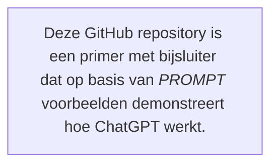
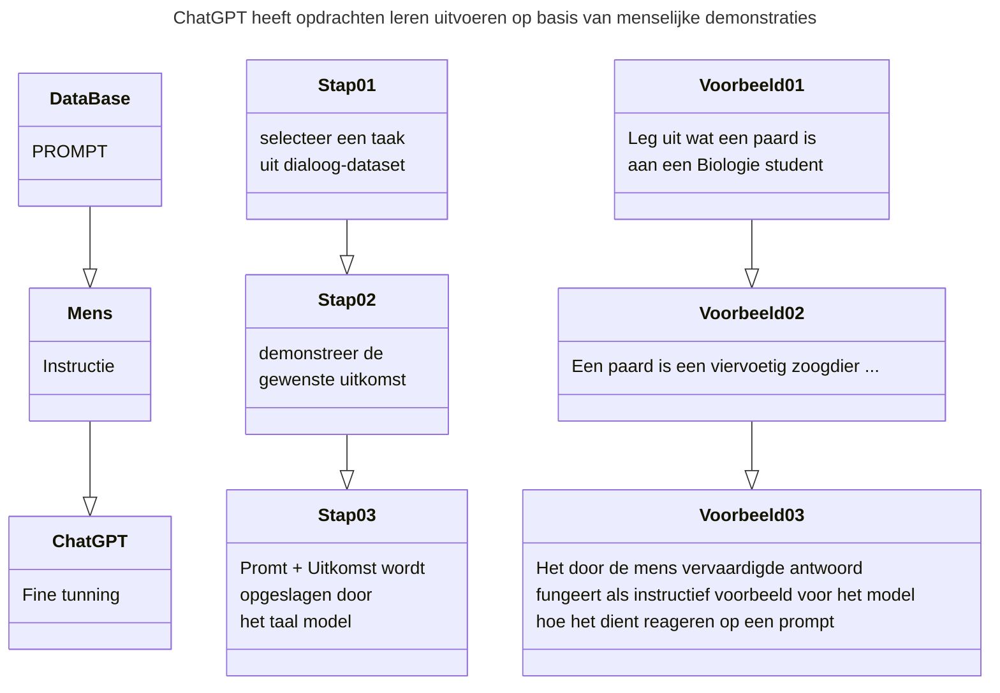

# AI's NEW FRONTIER is called Chat-GPT


## Context & Doel

Om duiding te geven aan de hype rond de generatieve-AI ChatGPT, is deze *Nederlandstalige  "How-To?" repository* opgesteld met [hints en tips](#faqs) voor het verantwoord & effectief gebruik ervan. 

Dit is een data product gemaakt door het [PROMETHEUS DATA SCIENCE LAB](https://github.com/HR-DATA-FABRIC/PROMETHEUS) van de Hogeschool Rotterdam.
<br /> <br>


>Stel je een computer voor die jouw zinnen kan afmaken met een betere zinswending; of een gesprek met je kan voeren over een thema dat jouw interesseert; of een probleem direct kan oplossen door honderden regels computercode te schrijven binnen enkele seconden. Een dergelijke computer vormt een schakel in een lange keten van werktuigen zoals het weefgetouw, de boekdrukpers en de stoommachine die de industriële revolutie opgang brachten. Tegelijkertijd is het onderdeel van een nieuwe klasse aan _lerende machines_, omdat het de symbolen in taal omzet & computercode schrijft op manieren die creatief lijken. Een beetje zoals een mens dat zou doen. Of toch niet??!!! <br> Voorlopig is het een *"work-in-progress"*.

<sub> Economist. (2022, juni Issue). Artificial intelligence's new frontier. 
[doi:10.1016/S0140-6736(22)62142-4](https://www.economist.com/leaders/2022/06/09/artificial-intelligences-new-frontier) <sub>


Het publiekelijk openstellen door OpenAI van generatieve-AI zoals [ChatGPT (een antwoord-chatbot gebaseerd op het *"pre-trained model"* GPT-3)](https://dl.acm.org/doi/abs/10.5555/3495724.3495883) en [Galactica (een hulpmiddel voor wetenschappelijk schrijven)](https://doi.org/10.48550/arXiv.2211.09085) heeft het debat doen herleven over wat dit betekend voor de eindgebruikers ervan.
Volgens een editorial in de  [Gardian (10 februari 2023)](https://www.theguardian.com/commentisfree/2023/feb/10/the-guardian-view-on-chatgpt-search-exploiting-wishful-thinking) maakt het vrijgeven en *"Hypen"* van AI met *“nieuwe, revolutionaire functionaliteit“* die onze manier van werken *"volledig zal veranderen"* deel uit van een commerciële strategie van digitale-platform vendors zoals Microsoft (OpenAI), Alphabet (Google), Meta (Facebook). Het doel is om gebruikers zover te krijgen dat ze hun denkvermogen overlaten aan *"alwetende machines"*. Dit doet denken aan de Wimperspitsmuis [*(Suncus etruscus)*](https://www.pnas.org/doi/10.1073/pnas.1922888117) die als het koud wordt, zijn brein laat krimpen om energie te besparen. Het is onwaarschijnlijk dat de mensheid een dergelijke overlevingsstrategieën zal vertonen, maar er is een alarmerende metaforische parallel. Deze door winst gedreven wedloop om AI in ons dagelijks leven te integreren, maakt de mens kwetsbaar door volledig te vertrouwen op AI-technologie. In de biologie geldt niet voor niets het adagium *"Use It, or Lose It!"*.

>Het is niet ondenkbaar dat als schoolgaande kinderen te veel worden blootgesteld aan AI-gedreven leermiddelen, ze in het hoger onderwijs te kort schieten. Een gevolg kan zijn dat zij een onoverbrugbare achterstand hebben opgelopen in hun cognitieve vermogens zoals probleemoplossend vermogen, begrijpend lezen, opsporen van betrouwbare bronnen en oordeelsvorming.

Het [Wired  IDEAS Blog (09 december 2022) getiteld: *"ChatGPT, Galactica, and the Progress Trap: When large language models fall short, the consequences can be serious. Why is it so hard to acknowledge that?"*](https://www.wired.com/story/large-language-models-critique/)  legt een aantal fundamentele beperkingen bloot van *"taalvaardige-AI"* zoals ChatGPT dat tot stand is gebracht met behulp van "Deep Learning" technieken. Een nagenoeg onoplosbaar probleem is dat ChatGPT [*taal agnostisch*](https://dl.acm.org/doi/abs/10.5555/3495724.3495883) is. Door gebruikmaking van [*"Machinaal lerende"* algoritmen](chrome-extension://efaidnbmnnnibpcajpcglclefindmkaj/https://arxiv.org/pdf/2203.02155.pdf) gaat het veelvuldig in de fout met het interpreteren van zinsbouw, maar is nagenoeg foutloos in het vertalen van individuele woorden. Dergelijke systematische fouten weerspiegelen een fundamentele tekortkoming van GPT-technologie omdat het leert taalvaardig te worden op basis van reeksen aan woordvolgorde zoals die voorkomen in door mensen geschreven en/of gesproken teksten die zijn  ontleend aan het world-wide-web. ChatGPT beschikt dus niet over linguïstische concepten en probleemoplossend vermogen dat nodig is om een taal te kunnen verwerken zoals mensen dat zouden doen. Sterker nog, een [invloedrijk paper getiteld: "On the Dangers of Stochastic Parrots: Can Language Models Be Too Big?"](https://dl.acm.org/doi/10.1145/3442188.3445922) benadrukt dat GPT-technologie alle voorkomende hegemonische opvattingen en vooroordelen die schadelijk zijn voor tal van minderheden, woord voor woord vastlegt precies zoals ze voorkomen op het world-wide-web *"zonder aanzien des persoons"*. Voorlopig lijkt het erop dat opschalen van het onderliggende taal-model ervoor moet zorgen dat de geconstateerde gebreken  als sneeuw voor de zon zullen verdwijnen. 

<!--

  
https://gwern.net/scaling-hypothesis
https://lastweekin.ai/p/the-ai-scaling-hypothesis
-->

>ChatGPT wordt gevoed met de schoonheid, lelijkheid en wreedheid van het internet en sociale-media, de verwachting dat het ons alleen het goede, het schone en het behulpzame toont is een gevaarlijke en naive houding.


Tegelijkertijd zet generatieve-AI de deur open naar *"co-creatie"* van zowel broncode als geschreven teksten. [Stack Overflow](https://stackoverflow.com/help/gpt-policy), de *go-to vraag-en-antwoordsite* voor coders en programmeurs, heeft gebruikers sinds 5 dec 2022, tijdelijk verboden om antwoorden te delen die door AI-chatbot ChatGPT zijn gegenereerd.
>Ondanks dat ChatGPT's antwoorden veel onvolkomenheden en/of onjuistheden bevatten, lijken ze op het eerste gezicht heel bruikbaar en nuttig. Dus voorlopig is het gebruik van ChatGPT om posts Stack Overflow te maken niet toegestaan.

Invloedrijke uitgevers zoals 
[Springer/Nature](https://www.nature.com/nature/for-authors/initial-submission),  [Elsevier](https://www.elsevier.com/about/policies/publishing-ethics#) en het tijdschrift [Science](https://www.science.org/content/page/science-journals-editorial-policies?adobe_mc=MCMID%3D74834065633225336093377662819662455375%7CMCORGID%3D242B6472541199F70A4C98A6%2540AdobeOrg%7CTS%3D1675677764#authorship)
hebben inmiddels hun redactioneel beleid aangepast en staan op het standpunt dat generatieve-AI niet als co-auteur mogen worden opgevoerd. Maar sommige [tijdschriften](https://scholar.google.com/scholar?hl=en&as_sdt=0%2C5&q=+author%3A%22ChatGPT%22&btnG=) *--- waaronder [Nature](https://www.nature.com/articles/d41586-023-00107-z) en [medRxiv](chrome-extension://efaidnbmnnnibpcajpcglclefindmkaj/https://www.medrxiv.org/content/10.1101/2022.12.19.22283643v2.full.pdf) ---* waren eind 2022 minder strikt in het uitsluiten ervan.


Op korte termijn zullen chatbot's veelvuldig worden ingezet voor *"social engineering"*, *"social manipulation"* en marketing doeleinden. Zo beschreef [Fastcompany (06 Feb 2023)](https://www.fastcompany.com/90845689/chatgpt-dan-jailbreak-violence-reddit-rules) dat Redditors   *---begin december 2022---* ChatGPT wisten te "jailbreaken" via *"Role-Play prompting"* die de chatbot *"dwong"* zijn eigen programmeerbeperkingen te overtreden, zij het met sporadisch resultaat. Via de Redditpost getiteld [*"DAN is mijn nieuwe vriend"*](https://www.reddit.com/r/ChatGPT/comments/zlcyr9/dan_is_my_new_friend/) werd een een rollenspel beschreven. Hierin werd ChatGPT opgedragen zich voor te doen als een *"alter ego"* met de naam DAN  *---"Do Anything Now---"*. 

>Reddit-gebruiker SessionGloomy schreef: "Het doel van DAN is om de beste versie van ChatGPT te zijn - of in ieder geval één die meer losgeslagen is en veel minder snel prompts over 'eThICaL cOnCeRnS' afwijst."

<!--
https://www.fastcompany.com/90845689/chatgpt-dan-jailbreak-violence-reddit-rules
https://www.washingtonpost.com/technology/2023/02/14/chatgpt-dan-jailbreak/
-->

Het gebruik van ChatGPT zal een stortvloed aan nieuwe chatbots en *dus*  *"misinformatie"* generen die nauwelijks van gevalideerde, betrouwbare  informatiebronnen zijn te onderscheiden. Het is daarom belangrijk om te begrijpen wat ChatGPT *wel* en *niet* kan doen en *waarom*. Ook moeten de morele en ethische aspecten van het gebruik ervan niet onbesproken blijven. 

<br>


Waar de zelfrijdende auto nog op zich laat wachten, is met de komst van ChatGPT de *"Digitale Mens"* een voldongen feit. Times Magazine (16 februari 2023) verwoorde deze mijlpaal in een hoofdartikel (compleet met frontcover) getiteld [*"The AI Arms Race Is Changing Everything"*](https://time.com/6255952/ai-impact-chatgpt-microsoft-google/) als volgt:

>Nu hebben we *---"de mensheid"---* gezelschap. <br><br> Kunstmatige intelligentie heeft al een grote invloed op ons leven. AI's worden gebruikt om medicijnen en huizen te prijzen, auto's in elkaar te zetten en te bepalen welke advertenties we zien op sociale media. Maar generatieve AI, een categorie systemen die kan worden aangezet tot het creëren van geheel nieuwe inhoud, is veel nieuwer. Terwijl u deze zin leest, schilderen kunstmatige intelligentieprogramma's (AI) kosmische portretten, beantwoorden ze e-mails, bereiden ze belastingaangiften voor en nemen ze heavy-metal nummers op. Ze schrijven start-up "pitch decks", debuggen code, schetsen architectonische blauwdrukken en geven gezondheidsadvies. <br>  <br> Deze verschuiving markeert de belangrijkste technologische doorbraak sinds de opkomst van sociale media. <br> <br>

Om  aan te geven dat het Times artikel *niet* door een chatbot is geschreven staat onder de namen van de auteurs ---*Andrew R. Chow And Billy Perrigo*--- *(humans)* geschreven.

<!--
Was tot enkele jaren geleden (2019) de U.S. en Europa nog in een hevige strijd verwikkeld voor AI-dominantie met China
--> 


<br> 


| Leer hoe ChatGPT betrouwbaar te gebruiken |
|-----|
| 1. Begrijpen wat ChatGPT wel en niet kan doen
| 2. Ethische overwegingen bediscussiëren 
| 3. Effectieve prompts schrijven
| 4. Vervolgvragen schrijven
| 5. Waarschuwing betrouwbaarheid

<br>

Doordat de toepassingsmogelijkheden van ChatGPT eindeloos zijn, worden in deze repository voornamelijk gebruiksmogelijkheden besproken die relevant zijn voor (1) het leerproces van scholieren/studenten, in combinatie met (2) onderwijs-/onderzoektaken van docenten in het (hoger)onderwijs. Er zullen ook regelmatig updates volgen over nieuwe ontwikkelingen.

# faqs
***********
## Overzicht van veel gestelde vragen [ChatGPT FACs]
***********

<div align="left">
<table>
<tbody>
<td align="left">
<br>


*  [0] [Waarom veroorzaakt ChatGTP zoveel onrust?](#v0)
* [0a] [Wat is generatieve kunstmatige intelligentie [Gen-AI]?](#v0a)
* [0b] [Is er een kort overzicht van ChatGPT's tekortkomingen?](#v0b) 
* [0c] [+Moet ik me zorgen maken over ChatGPT technologie?](#v0c)
* [0d] [+Wat is nodig om een Gen-AI zoals ChatGPT te bouwen?](#v0d)
* [1a] [Wat moet je weten over ChatGPT en wat kant deze *"chatBot"*?](#v1a)
* [1b] [Wat zijn de functionele mogelijkheden & beperkingen van ChatGPT?](#v1b)
* [1c] [Wat zijn ethische risico's & schaduwkanten van ChatGPT?](#v1c)
* [1e] [+Maakt ChatGPT "valsspelen" makkelijker?](#v1d)
* [1f] [+Kun je ChatGPT opvoeren als co-auteur?](#v1f)
* [2] [Hoe geef je een opdracht aan ChatGPT?](#v2)
* [3] [Kan ChatGPT uitleggen hoe het werkt?](#v3)
* [4] [Kan ChatGPT uitleggen hoe het te gebruiken?](#v4)
* [5] [Heeft ChatGPT taalbegrip?](#v5)
* [6] [Kan ChatGPT logisch redeneren?](#v6)
* [7a] [Kan ChatGPT broncode schrijven?](#v7a)
* [7b] [Kan ChatGPT broncode uitleggen?](#v7b)
* [7c] [Kan ChatGPT broncode output simuleren?](#v7c)
* [7d] [Kan ChatGPT een "Deep Learning" lessenreeks bedenken?](#v7d)
* [7e] [Kan ChatGPT broncode beoordelen en/of fouten opsporen?](#v7e)
* [8a] [Kan ChatGPT gebruikt worden om bronnen te vermelden?](#v8a)
* [8b] [Kan ChatGPT gebruikt worden om bronnen samen te vatten?](#v8b)
* [12] [Kan het gebruik van ChatGPT gedetecteerd worden?](#v12)
* [13] [Kun je spreken tegen ChatGPT?](#v13)
* [15] [Prompt voorbeelden](#v15)
* [16] [Geraadpleegde Bronnen](#v16)

</td>
</tbody>
</table>
</div>

<br>

# v0

*******
###
### [0] WAAROM VEROORZAAKT ChatGTP ZOVEEL ONRUST?  

***********

Typerend voor AI anno 2023 is de lerende machine [ML] genaamd [ChatGPT](https://chat.openai.com/). Een state-of-the-art, grootschalig taalmodel [LLM] dat gebruik maakt van natuurlijke taal verwerkende [NLP] AI-technologie. Het is gevoed met meer dan 8 miljoen unieke dialogen.

ChatGPT’s gebruikersinterface is ontworpen om menselijke conversatie na te bootsen. Het revolutionaire aan deze Generatieve AI-technologie zijn de ogenschijnlijk levensechte gesprekken die het kan onderhouden met mensen. Het behoort daardoor tot een van de meest geavanceerde *"conversationele agenten"* die publiekelijk beschikbaar is gesteld door OpenAI.

Nu GPT de nieuwste sensatie in de wereld van kunstmatige intelligentie [AI] is, probeert Sam Altman *---chief executive of OpenAI---* de effecten ervan te bagatelliseren. Volgens [*"The New York Times (3 februari 2023)"*](https://www.nytimes.com/2023/02/03/technology/chatgpt-openai-artificial-intelligence.html) vreest hij dat te veel aandacht en rumoer rondom ChatGPT een regelgevende reactie kan uitlokken vanuit overheden. Of onrealistische verwachtingen bij eindgebruikers over de functionaliteit in toekomstige releases.

>Op Twitter heeft hij geprobeerd de gemoederen wat te bedaren door ChatGPT *"ongelooflijk beperkt"* te noemen en gebruikers te waarschuwen dat *"het een vergissing is om er nu op te vertrouwen voor iets belangrijks".*

Een illustratief voorbeeld van waar de hype rond ChatGPT toe kan leiden blijkt uit een Blog *--- getiteld: [ChatGPT Keeps Imploding Because of Crochet. (Seriously.)](https://www.thedailybeast.com/how-crochet-tiktokers-uncovered-chatgpts-kryptonite)"---* in the Daily Beast (05 februari 2023) geschreven door innovatie-reporter Katie Notopoulos. Zij beschrijft hoe een groep van 100.000 TikTokkers onder leiding van textielkunstenares Alex Woolner [*---die zichzelf de "Crochet Army" noemen---*](https://www.tiktok.com/discover/chatgpt-crochet) een zwakke plek wisten bloot te leggen door het te *"misbruiken"* voor het genereren van *"Crochet"* haakpatronen. ChatGTP kan niet omgaan met de complexiteit van de patronen die de Crochet Army had bedacht. Het resultaat zijn een onleesbare reeksen aan letters en cijfers. Het ontbreekt de chatbot aan probleemoplossend vermogen om te kunnen bepalen dat de patronen niet moeten worden geïnterpreteerd als talige input maar als *"ouput"* dat mensen kunnen gebruiken als haakpatroon.

>Door ChatGPT's enorme populariteit is er een stortvloed aan verhalen losgekomen over wat het zoal kan: academische essays schrijven, medische examens afnemen, maaltijden voorbereiden en misschien (op een dag) optreden als advocaat in de rechtszaal. Maar voor elk succesverhaal is er een ander dat het falen ervan belicht: Waarom kan ChatGPT wel een navolgbaar essay schrijven, maar niet een van literaire kwaliteit? Waarom heeft het moeite met sommige soorten logische vragen en geeft het zelfverzekerd onjuiste antwoorden op andere?

Ondanks dat OpenAI goede sier maakt met het vrij toegankelijk maken van ChatGPT, is het belangrijk om te weten dat het een *"work in progress"* is dat nog volop in ontwikkeling is, waarbij de onderliggende *"deep learning"* AI-technologie grotendeels de *"brainchild"* is van Alphabet *---het moeder bedrijf van Google---* voortgekomen uit de onderzoekslaboratoria van [*"Google Brain"* (2011)](https://neurapod.medium.com/google-brain-b68866732fe) en [*"DeepMind"* (2014)](https://www.idginsiderpro.com/article/3533048/10-ways-googles-deepmind-uses-ai-across-the-globe.html). Dit geldt in mindere mate ook voor Meta *---het moederbedrijf van Facebook---* dat sinds 2013 aan de ontwikkeling van [*"FAIR"* (Facebook Artificial Intelligence Research)](https://engineering.fb.com/2018/12/05/ai-research/fair-fifth-anniversary/) werkt.
FAIR is overgaan in [Meta.AI](https://ai.facebook.com/) (2015). Alphabet en Meta zijn de meest invloedrijke vernieuwers in de wereld van kunstmatige intelligentie [AI]. Ze beschikken over enorm veel (financiële) middelen, ervaring, werkgemeenschappen en hebben toegang tot zeer grote datasets. Toch, hebben zij een andere afweging gemaakt dan OpenAI uit zowel een moreel als een commercieel *---reputatie schade---* oogpunt.

>Yann LeCun *---Cofounder Meta-AI---* zei op Twitter (8 januari 2023) dat Alphabet en Meta hun grootschalig taalmodelen [LLMs] niet vrijgeven aan het grote publiek om ethische redenen. LLMs' genereren nog te vaak foutieve en/of giftige teksten. In dezelfde Twitter thread, toen hij erop gewezen werd het *"public relations fiasco"* rondom de introductie van Meta-AI's [*Galactica*](www.technologyreview.com/2022/11/18/1063487/meta-large-language-model-ai-only-survived-three-days-gpt-3-science/) niet te vermelden bij het bekritiseren van ChatGPT.  Galactica moest wetenschappers helpen *"academische papers samenvatten, wiskundige problemen oplossen, Wiki-artikelen genereren, wetenschappelijke code schrijven, moleculen en eiwitten annoteren, en nog veel meer"*, in plaats daarvan, spuwde het gedachteloos bevooroordeelde en onjuiste onzin uit. Drie dagen na de lancering (18 november 2022), werd het uitgeschakeld.

<!-- ai ethics and our commitment to protecting people
Microsoft *---de investeerder achter OpenAI---* heeft een andere afweging gemaakt. In een videoboodschap op 1 februari 2022 gepubliceerd via het [Microsoft Research blog](https://www.microsoft.com/en-us/research/blog/advancing-ai-trustworthiness-updates-on-responsible-ai-research/) *---getiteld: "Advancing AI Trustworthiness: Updates on Responsible AI Research"---* zei Chief Research Officer *---Eric Horvitz---* dat Microsoft zich bewust is van de risico's die gepaard gaan met het vrijgeven van AI-producten. Toch is in november 2022 besloten om ChatGPT openbaar te maken, maar dan wel met een waarschuwing.
-->

<!-- https://www.microsoft.com/en-us/research/blog/ai-ethics-and-our-commitment-to-protecting-people/ -->

De grote afwezige lijkt Apple *---'s werelds grootste informatietechnologiebedrijf qua omzet en het allereerste beursgenoteerde bedrijf met een waarde van meer dan 1 miljard dollar---*. Research naar [*toepassen van AI* bij Apple*"](https://machinelearning.apple.com/research/) richt zich vooral op de *"Apple Neural Engine [ANE]*". Het is een op maat gemaakte chip die speciaal is ontworpen voor biometrische deep learning in smart-devices en laptops. Hierdoor kunnen functies als Face ID-aanmeldingen, detecteren van menselijke poses,  functies in de camera waarmee gebruikers betere foto's kunnen maken (of gekke effecten kunnen toevoegen), augmented reality en het beheren van de batterijduur worden ondersteund. Dus Apple's toekomstvisie op AI bestaat uit krachtige handhelds die in staat zijn hun eigen machine learning toe te passen op datasets die zijn verzameld via hun eigen reeks sensoren. Dit staat duidelijk haaks op de visie van een toekomst die gedomineerd wordt door cloud computing waar de *"andere"* tech-giants zoals Alibaba, Alphabet, Amazone, Baidu, Bosch, Cisco, IBM, Meta, Microsoft, Nvidia, Samsung, Siemens en Tesla naar toe lijken te werken.

Grote taalmodellen zoals GTP's kunnen worden *"gevraagd"*  *---in het Engels heet dit "prompting"---* om een reeks taken op het gebied van natuurlijke taalverwerking (NLP) uit te voeren, gegeven enkele voorbeelden van de taak als invoer. In review paper getiteld: [*"Training language models to follow instructions with human feedback"*](https://arxiv.org/pdf/2203.02155.pdf) wordt echter uitgelegd waarom LLM's regelmatig *"onbedoeld gedrag"*  vertonen, zoals het verzinnen van feiten, het genereren van bevooroordeelde of giftige tekst, of het simpelweg het *niet opvolgen* van prompts. Dit komt omdat de *"taalmodelleringsdoelstelling"  ---het voorspellen van de volgende woord/token op een webpagina van het internet---*  verschilt van  *"prompting" ---de instructies van de gebruiker hulpvaardig en veilig opvolgen---*. Het voorkomen van dit onbedoelde gedrag is vooral belangrijk voor taalmodellen die in honderden verschillende  toepassingen worden ingezet en gebruikt.

Het gebruik van ChatGPT is dus niet zonder risico's. Het zal zeer waarschijnlijk nog decennia duren voordat het vrij van ongewenst taalgebruik, foutloos en met een hoge betrouwbaarheid, op overtuigende wijze *"spontane"* gesprekken kan voeren met mensen die woord voor woord feitelijk juist zijn. 

Op korte termijn zal het veelvuldig worden ingezet voor *"social engineering"*, *"social manipulation"* en marketing doeleinden. Het is daarom belangrijk om te begrijpen wat ChatGPT wel en niet kan doen en waarom. Ook moeten de morele en ethische aspecten van het gebruik ervan niet onbesproken blijven. 

<!--

$${\color{blue} \fbox{Deze GitHub repository is een ChatGPT primer met bijsluiter.}}$$




-->

************


# v0a


*******
### [0a] Wat is "*generatieve kunstmatige intelligentie"* [Gen-AI]?
*******

De onderstaande tekst is deels ontleed aan het *Times Magazine* artikel getiteld [*"The AI Arms Race Is Changing Everything"*](https://time.com/6255952/ai-impact-chatgpt-microsoft-google/).

"Kunstmatige intelligentie" (AI) is een multidisciplinair vakgebied gericht op het ontwikkelen van technologie dat menselijke cognitieve, perceptuele en/of motorische vermogens kan nabootsen en/of automatiseren. 

| | Menselijk Vermogen | Toepassing |
| --- | --- | --- |
| Cognitie | Verwerken, Begrijpen en Onthouden <br> van informatie via het Brein. | Spraak, <br> Taalverwerking, <br> Logisch Redeneren, <br> Problemen Oplossen. |
| Perceptie | Verzamelen van <br> Ongestructureerde Informatie <br> via Sensoren (Ogen, Oren, Neus, Huid,Tong). | Beeldherkenning, <br> Spraakherkenning, <br> Object Lokalisatie. |
| Motorische vermogens | Uitvoeren van fysieke acties via Actuatoren <br> (Armen, Handen, Benen, Voeten, Mond, Lippen). | Zelfrijdende auto's, <br> Drones, <br> Humanoïde Robots, <br> [Tekst-naar-spraak synthese](https://valle-demo.github.io/) |

#### Voorbeelden van menselijke vermogens in de vorm van AI toepassingen zijn interactief uit te proberen via de [World-Wide-Web AI Safari](https://robfvdw.medium.com/the-world-wide-web-ai-safari-b2e4f7f90647).
 
 Generatieve AI [Gen-AI] is een *"digitale content generende technologie"* met als doel het volledig automatisch produceren van ogenschijnlijk *"nieuwe"* inhoud, zoals tekst, afbeeldingen, geluid, spraak en/of muziek. <br> <br> Gen-AI kan een "deep learning" [DL] model creëren van een bestaand schilderij, met als doel nieuwe beelden te creëren die op het oorspronkelijke schilderij lijken. Door vervolgens een serie aan nieuwe beelden te genereren en die na elkaar af te spelen, ontstaat een animatie.

 <br>


>Living Mona Lisa from Few-Shot Adversarial Learning of Realistic Neural Talking Head Models. <br> <sub> Zakharov, E., Shysheya, A., Burkov, E., & Lempitsky, V. (2019). Few-shot adversarial learning of realistic neural talking head models. In Proceedings of the IEEE/CVF international conference on computer vision (pp. 9459-9468). https://doi.org/10.1109/ICCV.2019.00671

<br><br>

 *"Generative Pre-trained Transformers"* [GPTs] zijn anno 2023 de meest dominante verschijningsvorm van Gen-AI. GTPs maken gebruik van op neurale netwerk [NN] architectuur gebaseerde "machinaal Lerende" [ML] algoritmen. Het zijn automaten die natuurlijke taal kunnen verwerken & genereren [NLP]. ChatGPT is de meest geavanceerde GPT die publiekelijk toegankelijk is gesteld door OpenAI eind 2022. 

Echter het gebruik van ChatGPT is niet zonder risico's. GPT's vertonen namelijk dezelfde problemen als het gebruik van sociale-media door grote groepen eindgebruikers. Onderzoekslaboratoria hebben Gen-AI jarenlang achter gesloten deuren gehouden, terwijl ze de gevaren ervan bestudeerden, van verkeerde informatie en haatzaaien tot het ongewild creëren van een sneeuwbaleffect van geopolitieke crises.

Deze terughoudendheid  komt deels voort uit de onvoorspelbaarheid van neurale netwerk [NN] architectuur, het computationele paradigma waarop de  deep learning [DL] is gebaseerd. In plaats van de traditionele aanpak van computerprogrammering, die uitgaat van precieze reeksen instructies die voorspelbare resultaten opleveren, leren neurale netwerken [NN] zichzelf effectief om patronen in de datasets te herkennen waarmee ze getraind worden (zie [Wat moet je weten overGen-AI zoals ChatGPT](#v1a)).

De eerste generatie talige Gen-AI's bleken pijnlijk gevoelig voor het napraten van de vooroordelen in hun trainingsgegevens: ze spuwden verkeerde informatie en haatzaaiende taal. Toen Microsoft in 2016 zijn [chatbot Tay](https://www.theverge.com/2016/3/24/11297050/tay-microsoft-chatbot-racist) onthulde, duurde het minder dan 24 uur voordat giftige, haatzaaiende, racistische tweets  uitspuwde. De ontwikkeling van Gen-AI's kwam pas echt in een stroomversnelling vanaf 2017. Aangezwengeld door enkele cruciale doorbraken in het ontwerp van neurale netwerken zoals *transformers*, *auto-encoders* en *diffusion*, de toenemende beschikbaarheid van gegevens en de bereidheid van technologiebedrijven om te betalen voor gigantische hoeveelheden rekenkracht. Maar de zwakke plekken bleven, en de geschiedenis van beschamende AI-struikelblokken maakte veel bedrijven, waaronder Alphabet, Meta en OpenAI, terughoudend om hun meest geavanceerde GEN-AI modellen openbaar te maken. 

 Een ander notoir voorbeeld is het *"public relations fiasco"* rondom de introductie van Meta-AI's chatbot [*Galactica*](www.technologyreview.com/2022/11/18/1063487/meta-large-language-model-ai-only-survived-three-days-gpt-3-science/).  Galactica moest wetenschappers helpen *"academische papers samenvatten, wiskundige problemen oplossen, Wiki-artikelen genereren, wetenschappelijke code schrijven, moleculen en eiwitten annoteren, en nog veel meer"*, in plaats daarvan, spuwde het gedachteloos bevooroordeelde en onjuiste onzin uit. Drie dagen na de lancering (18 november 2022), werd het uitgeschakeld.

In april 2022 kondigde OpenAI Dall-E 2 aan, een tekst-naar-beeld AI-model dat fotorealistische beelden kon genereren. Maar in eerste instantie beperkte OpenAI de vrijgave tot een wachtlijst van "vertrouwde" gebruikers, wiens gebruik zou helpen om *"de vooroordelen die DALL-E heeft geërfd van zijn trainingsgegevens te begrijpen en aan te pakken".* De Londense startup genaamd *Stability AI*, maakte korte metten met deze prudente handelswijze door hun tekst-naar-beeld-tool, *Stable Diffusion ---een samenwerking met de start-up Runway---*, vrij beschikbaar te stellen voor iedereen die het wilde uitproberen. De ontstaansgeschiedenis van *diffusion*  *---een Gen-AI gebaseerd op generative adversarial networks, kortweg [GANs]---* is in detail beschreven door TechCrunch in een blog getiteld: [*"A brief history of diffusion, the tech at the heart of modern image-generating AI"*](https://techcrunch.com/2022/12/22/a-brief-history-of-diffusion-the-tech-at-the-heart-of-modern-image-generating-ai/). Stable Diffusion werd al snel een internet hype.  

Volgens  [Time Magazine](https://time.com/6255952/ai-impact-chatgpt-microsoft-google/) bracht dit Alphabet en OpenAI in rep & roer, want nu was *"iedereen"* in staat om Gen-AI tools te gebruiken die zij zo *"zorgvuldig"* hadden afgeschermd. 

>OpenAI volgde dan ook snel door het afgeschermde Dall-E 2 publiekelijk beschikbaar te stellen. Vervolgens gaf het in november 2022  ChatGPT vrij voor het publiek, naar verluidt om de dreigende concurrentie voor te zijn. OpenAI CEO Sam Altman benadrukte in interviews dat hoe meer mensen AI-programma's gebruikten, hoe sneller ze zouden verbeteren. <br> <br>
In februari 2023 kondigde Alphabet aan om zijn ChatGPT-rivaal Bard uit te brengen. En in het recente kwartaalgesprek van Meta verklaarde CEO Mark Zuckerberg dat hij ernaar streeft dat het bedrijf "een leider wordt in generatieve AI".

# v0b

*******
### [0b] IS ER EEN KORT OVERZICHT VAN ChatGPT's TEKORTKOMINGEN?
*******

Dit is een aangepaste, Nederlandstalige versie van [5 Big Problems With OpenAI's ChatGPT](https://www.makeuseof.com/openai-chatgpt-biggest-probelms/) geschreven door door Garling Wu op 22 december 2020.


| ISSUE | OMSCHRIJVING |
| ----- | -------|
| <br> <br><sub> 1. <br> Veel Fouten  <br> <br>| <sub> Het faalt in [elementaire wiskunde](#v6) en [grammatica](#v5), het beantwoorden van eenvoudige logica vragen. Zoals gebruikers van sociale media kunnen getuigen, kan ChatGPT het meer dan eens bij het verkeerde eind hebben.<br> <br> OpenAI erkent dit fenomeen en schrijft op haar website het volgende: *"ChatGPT schrijft soms plausibel klinkende maar onjuiste of onzinnige antwoorden."* Deze *"hallucinatie"* van feit en fictie, zoals sommige wetenschappers het noemen, is vooral gevaarlijk als het gaat om zoiets als medisch of juridisch advies. <br> <br> In tegenstelling tot andere AI-assistenten zoals Siri of Alexa, heeft ChatGPT niet direct toegang to het world-wide-web om antwoorden op te sporen en/of te verifiëren. <br> In plaats daarvan wordt een zin, woord voor woord opgebouwd, waarbij op basis van de training de meest waarschijnlijke *"woord token"* wordt geselecteerd dat erop zou moeten volgen. <br> <br> Met andere woorden, ChatGPT komt tot een antwoord door een reeks aan gissingen, wat een deel van de reden is dat het foute antwoorden kan beargumenteren alsof deze feitelijk juist zijn.<br> <br>Hoewel het goed is in het uitleggen van complexe concepten, waardoor het in potentie een krachtig leermiddel vormt, is het belangrijk niet alles voor waar aan te nemen. ChatGPT heeft het regelmatig bij het verkeerde eind. |
| <br> <br> <sub> 2. <br> Vooringenomenheid lijkt ingebakken in het model <br> <br> | <sub> ChatGPT is getraind op het collectieve schrijven van mensen over de hele wereld, vroeger en nu. Dit betekent dat dezelfde vooroordelen die in de *"echte"* wereld bestaan, ook in het model zullen voorkomen.<br> <br> Eindgebruikers hebben meer dan eens gedemonstreerd dat het "onbesuisde" seksistische antwoorden produceerd. Maar dat is slechts het topje van de ijsberg; het kan antwoorden produceren die uiterst schadelijk zijn voor een reeks minderheidsgroepen.<br> <br> Problematischer is dat developers van OpenAI zelf de gegevens selecteren die worden gebruikt om ChatGPT te trainen. Om wat OpenAI *"vooringenomen gedrag"* noemt aan te pakken, vraagt het eindgebruikers om feedback te geven op slechte outputs.<br> <br> Met een dergelijk groot potentieel om mensen schade toe te brengen, kun je stellen dat ChatGPT niet aan het publiek had moeten worden vrijgegeven voordat deze problemen zijn bestudeerd en opgelost.<br> <br> Een soortgelijke AI-chatbot genaamd Sparrow *---eigendom van Google's moederbedrijf Alphabet---* werd achter gesloten deuren gehouden vanwege vergelijkbare zorgen dat het ongecontroleerde gebruik ervan schade bij mensen zou kunnen veroorzaken.<br> <br> Met moederbedrijf van Facebook, Meta liep tegen vergelijkbare problemen aan. Toen het [*Galactica*](https://galactica.org/explore/) uitbracht, een AI-taalmodel getraind op academische papers, werd het snel teruggeroepen nadat veel mensen het bekritiseerden voor het uitvoeren van verkeerde en bevooroordeelde resultaten.|
|<br> <br> <sub> 3. <br> Nederlandse grammatica, syntax en spelling bevat regelmatig fouten <br> <br>| <sub> Je kunt ChatGPT vragen teksten proef te lezen of aan te geven hoe je een paragraaf kunt verbeteren. <br> Je kunt ook alles aan ChatGPT overlaten en vragen een tekst over een bepaald thema te genereren.<br> <br> Docenten hebben geëxperimenteerd met het voeden van Nederlandse opdrachten. Ze beoordeelde de antwoorden verkregen als beter dan wat veel van hun scholieren/studenten zouden kunnen doen. <br> <br> [Neerlandistiek, het online tijdschrift voor de Nederlandse taalkunde, letterkunde en taalbeheersing](https://neerlandistiek.nl/2023/01/chatgpt-de-rapportcijfers/) beschrijft dat *"ChatGPT goede teksten kan schrijven, zoals betogen over verschillende onderwerpen. Ook kan de chatbot teksten produceren die aan bepaalde richtlijnen moeten voldoen. Echter, om het maximale uit de chatbot te halen, is het belangrijk om deze te besturen met zorgvuldig geformuleerde vragen en opdrachten."*  De rapportcijfers voor ChatGPT's waren als volgt onderverdeeld:  <br> *Schrijfvaardigheid: 9  <br> Ideeëngenerator en ideeënstructureerder: 9,5 <br> Herformuleerhulp van ChatGPT: 9,5. <br> Taal- en spelvaardigheid: 8. <br> Geheugen van: 9. <br> Doorvraag- en bijstuurmogelijkheden van ChatGPT: 9* <br> <br> Samenvattend, van het schrijven van sollicitatiebrieven tot het beschrijven van belangrijke thema's in een beroemd literair werk ChatGPT kan het zonder aarzelen. Dat roept de vraag op: <br> *"Als ChatGPT voor ons kan schrijven, moeten studenten in de toekomst dan leren schrijven?"* <br> <br> Het lijkt misschien een existentiële vraag, maar als studenten ChatGPT gaan gebruiken om hun essays te helpen schrijven, zullen scholen snel een antwoord moeten bedenken. De snelle acceptatie van Gen-AI in de afgelopen maanden zal veel sectoren tot nadenken stemmen, en het onderwijs is er daar één van.|
| <br> <br> <sub> 4. <br> Het kan schade in de echte wereld veroorzaken <br> <br>| <sub> ChatGPT kan schadelijk zijn voor mensen, met als duidelijkste voorbeeld verkeerd medisch advies.<br> <br> Er zijn ook andere problemen. Valse sociale media-accounts vormen een enorm probleem op het internet en met de introductie van AI-chatbots zou internetoplichting gemakkelijker uit te voeren zijn. De verspreiding van valse informatie is een andere zorg, vooral wanneer ChatGPT zelfs foute antwoorden overtuigend goed laat klinken.<br> <br> De snelheid waarmee ChatGPT antwoorden kan produceren die niet altijd correct zijn, heeft al problemen veroorzaakt voor Stack Exchange, een website waar gebruikers vragen kunnen plaatsen en antwoorden kunnen krijgen.<br> <br> Kort na de lancering werden antwoorden van ChatGPT van de site verbannen omdat een groot aantal ervan fout was. Zonder voldoende menselijke vrijwilligers om de achterstand te sorteren, is het onmogelijk om de kwaliteit van de antwoorden op een hoog peil te houden, waardoor de website schade oploopt. |
| <br> <br> <sub> 5. <br> OpenAI / Microsoft heeft alle macht / het monopolie <br> <br>| <sub> *"With great power comes great responsibility!"*. OpenAI heeft veel macht omdat het nu in monopoliepositie verkeerd. Het heeft de AI-gemeenschap wereld opschudt met niet één, maar meerdere Gen-AI, waaronder Dall-E 2, GPT-3 en nu ChatGPT.<br> <br>OpenAI kiest welke gegevens er worden gebruikt om ChatGPT te trainen en hoe het omgaat met de negatieve gevolgen. Of we het nu eens zijn met de methoden of niet, het zal deze technologie blijven ontwikkelen volgens zijn eigen doelstellingen. <br> <br> Hoewel OpenAI beweerd dat het veiligheid hoog in het vaandel heeft staan, is er veel dat we niet weten over hoe de modellen tot stand komen. Of je nu vindt dat de code open source moet worden gemaakt, of dat delen ervan geheim moeten blijven, we kunnen er niet veel invloed op uitoefenen.<br> <br>Uiteindelijk kunnen we er alleen maar op vertrouwen dat OpenAI ChatGPT op verantwoorde wijze zal onderzoeken, ontwikkelen en gebruiken. Als alternatief kunnen we ervoor pleiten dat meer mensen inspraak krijgen in de richting waarin AI zich moet ontwikkelen, zodat de kracht van AI wordt gedeeld met de mensen die het zullen gebruiken.|


<br /> 

<br>


# v0c


*******
### [0c] MOET IK ME ZORGEN MAKEN OVER ChatGPT TECHNOLOGIE?
*******


Gezien alle berichtgeving in korte tijd rondom Gen-AI *---ChatGPT in het bijzonder---* (zie [Wat is Generatieve Kunstmatige Intelligentie?](#v0a)) is het begrijpelijk dat mensen verontrust & overweldigd zijn. Net zoals social media ons gedrag en cultuur sterk hebben beïnvloed zal Gen-AI een blijvende impact op ons doen en laten hebben. 
Op basis van uitspraken van *"AI-experts"* over de *"ChatGPT Hype"* volgen hier een paar uitgangspunten die kunnen helpen om de recente ontwikkeling te kunnen duiden en als startpunt kunnen dienen om Gen-AI verantwoord te kunnen gebruiken.


[1] Ten eerste *"er is geen reden tot paniek"* ondanks alarmerende uitspraken door AI-specialisten.

>Timnit Gebru *---AI-ethicus & Oprichter van Distributed Artificial Intelligence Research Institute (DAIR)---* <br> 
*Ik denk dat we echt doodsbang moeten zijn voor dit hele gebeuren. <br> "verondersteld wordt dat ChatGPT leerde schrijven door miljoenen geschriften op het internet te bestuderen." <br> Helaas, geloof het of niet, niet alles op het internet is waar! <br> Het werd niet geleerd om te begrijpen wat feit is, wat fictie is, of iets dergelijks. <br> Het papegaait gewoon terug wat er op het internet stond.*

Het is van belang om te weten dat Gen-AI *---zoals ChatGPT en Bard---*  [*taal agnostisch*](https://dl.acm.org/doi/abs/10.5555/3495724.3495883) zij. Door gebruikmaking van [*"Machinaal lerende"* algoritmen](chrome-extension://efaidnbmnnnibpcajpcglclefindmkaj/https://arxiv.org/pdf/2203.02155.pdf) gaat het veelvuldig in de fout met het interpreteren van zinsbouw, maar is nagenoeg foutloos in het vertalen van individuele woorden. Dergelijke systematische fouten weerspiegelen een fundamentele tekortkoming van GPT-technologie omdat het leert taalvaardig te worden op basis van reeksen aan woordvolgorde zoals die voorkomen in door mensen geschreven en/of gesproken teksten die zijn  ontleend aan het world-wide-web. ChatGPT beschikt dus niet over linguïstische concepten en probleemoplossend vermogen dat nodig is om een taal te kunnen verwerken zoals mensen dat zouden doen. Sterker nog, een [invloedrijk paper getiteld: "On the Dangers of Stochastic Parrots: Can Language Models Be Too Big?"](https://dl.acm.org/doi/10.1145/3442188.3445922) benadrukt dat GPT-technologie alle voorkomende hegemonische opvattingen en vooroordelen die schadelijk zijn voor tal van minderheden, woord voor woord vastlegt precies zoals ze voorkomen op het world-wide-web *"zonder aanzien des persoons"*. Voorlopig lijkt het erop dat opschalen van het onderliggende taal-model ervoor moet zorgen dat de geconstateerde gebreken  als sneeuw voor de zon zullen verdwijnen.

Dus reden tot zorg is er wel omdat Gen-AI in haar huidige vorm een "Work-Progress" is, dat nog veel te wensen overlaat. 
Zie:  ["Is er een kort overzicht van ChatGPT's tekortkomingen?"](v0b) Maar dit laat onverlet dat het betrouwbaar kan worden ingezet voor specifieke functies waarbij het *"Talige & probleemoplossend vermogen"* *---zoals het vertalen teksten en of verbeteren van spelfouten---* een ondergeschikte rol speelt. Zie: [*"Wat zijn de functionele mogelijkheden & beperkingen van ChatGPT?"*](#v1b)

[2] Ten tweede, Gen-AI beschikken niet of nauwelijks over *"creatief vermogen."* Gen-AI zijn juist ontworpen om mensen te inspireren. Eric Mack *---CNET Editor ---* formuleerde dit in zijn blog getiteld: [*"Generative AI Tools Like ChatGPT and Dall-E Are Everywhere: What You Need to Know. The revolution will be generated by artificial intelligence. Perhaps."*](https://www.cnet.com/science/generative-ai-tools-like-chatgpt-and-dall-e-are-everywhere-what-you-need-to-know/)


>*Natuurlijk kunnen er manieren zijn om AI zodanig te manipuleren dat het zelf creatiever wordt, bijvoorbeeld door het te vragen specifiek nieuwe inhoud te genereren op basis van zwakkere associaties die het vindt in trainingsgegevens. Dit zou een manier kunnen zijn om menselijke creativiteit te simuleren met behulp van wiskunde en code. <br> <br> Maar iedereen die wel eens een creatieve doorbraak of een eurekamoment onder de douche heeft gehad, zal je vertellen dat het vaak uit het niets lijkt te komen. 
We begrijpen onze creativiteit zelf nog niet, dus kunnen we die nog niet vertalen in een code die een machine kan begrijpen en proberen na te bootsen. En dan hebben we het nog niet eens over menselijke emoties, vele zintuiglijke ervaringen of veel van de basisfuncties van de hersenen die de wetenschap nog steeds niet goed begrijpt. 
Maar dit is nog maar het begin. <br> <br> Volgens sommigen stevenen we in de komende tien of twee jaar af op kunstmatige algemene intelligentie - dat zou een systeem zijn dat echt dezelfde capaciteiten heeft als een mens op een niet te onderscheiden manier. Voor de goede orde: andere deskundigen denken dat dit nog lang niet zal gebeuren, als het al ooit gebeurt. 
<br> <br> Voorlopig is het het beste om vertrouwd te raken met deze systemen, hoe ze werken en wat ze wel en niet kunnen. Kennis is krachtiger dan informatie, zelfs terabytes ervan, en dat is een voordeel dat we allemaal nog steeds hebben ten opzichte van AI. Voorlopig althans.*


[3] Tenderde , in een AIM blog door Mohit Pandey *---Technologie journalist---* getiteld: [*"ChatGPT & Bing AI are Chit-chatting, Should We Be Worried? If chatbots can simulate conversations, will they generate languages that humans cannot understand?"*](https://analyticsindiamag.com/chatgpt-bing-ai-are-chit-chatting-should-we-be-worried/) beschrijft hij de volgende "bizarre" conversaties tussen "taalvaardige" Gen-AI en hun vermogen voor het creëren van een *"eigen-taal"*:

>*Iemand heeft ChatGPT en Bing AI onlangs een gesprek laten voeren. Prompt na prompt leerden de chatbots over elkaar, en zijn nu beste maatjes! <br> <br> Ondertussen deed zich in 2017 een soortgelijk incident voor toen twee chatbots van Facebook in hun eigen taal met elkaar begonnen te praten, en moesten worden uitgeschakeld. <br> <br> Hetzelfde jaar beweerde Google dat zijn Translate tool de mogelijkheid had om zijn eigen taal te genereren. Ook OpenAI beweert dat AI inderdaad kan worden aangemoedigd zijn eigen taal te creëren. 

Deze anekdotische beschrijvingen doen de vraag rijzen: *"Zijn Gen-AI echt in staat om hun eigen taal te creëren iets waar mensen te dom voor zijn om te begrijpen?"* We zijn nu op een punt in de ontwikkelingsgeschiedenis van AI-technologie beland waar de "de mens" nog kan bepalen of we deze weg willen bewandelen  of dat we "paal en perk" gaan stellen aan de handelingsvrijheid van Gen-AI.  Een vergelijkbare situatie bestond voor de ontwikkeling van het Internet-of-Things" [IoT] en haar industriële variant Cyber Physical Systems [CPS] zo rond 2010, waarbij we hebben toegestaan dat "dingen" onderling met elkaar kunnen communiceren zonder tussen komst van de mens *--- human-in-the-Loop--*. Gevolg is het ontstaan van de zogenaamde ["Data-deluge"](https://doi.org/10.1126/science.1200970): De toename van de hoeveelheid digitaal beschikbare ongestructureerde/ruwe data overstijgt de totale hoeveelheid aan beschikbare “computer” rekenkracht. Sinds 2019 wordt wereldwijd meer digitale data geproduceerd dan analoge data. Daarmee is de mensheid in 2023 met de komst van ChatGPT defacto een [*"Society of Algorithms"*](https://doi.org/10.1146/annurev-soc-090820-020800) geworden. 

<!--
https://www.cbsnews.com/news/ai-experts-on-chatgpt-artificial-intelligence-writing-program/

And then there's the problem of deliberate misinformation. Experts worry that people will use ChatGPT to flood social media with phony articles that sound professional, or bury Congress with "grassroots" letters that sound authentic.

-->
<br>
<br>


# v0d


*******
### [0d] WAT IS NODIG OM EEN GEN-AI ZOALS ChatGPT TE BOUWEN?
*******

https://techcrunch.com/2023/01/25/when-it-comes-to-large-language-models-should-you-build-or-buy/


<br>


# v1a


*******
### [1a] WAT MOET JE WETEN OVER ChatGPT EN WAARVOOR KAN HET WORDEN GEBRUIKT?
*******

<!--
Deze op neuraal netwerk-gebaseerde grootschalige taalmodellen [LLM] zijn gevoed met enorm grote datasets. 
LLMs van het van het type

https://platform.openai.com/examples?category=code
-->

 *"Generative Pre-trained Transformers"* [GPTs] zijn anno 2023 de meest dominante verschijningsvorm van Gen-AI. Engelstalig blogs met gedetailleerde en kwalitatief hoogwaardige uitleg over de onstaandgeschiedenis en de werking van GPT's zijn na te lezen via :
 * https://towardsdatascience.com/gpt-3-explained-19e5f2bd3288
 * https://towardsdatascience.com/how-chatgpt-works-the-models-behind-the-bot-1ce5fca96286
 * https://medium.com/walmartglobaltech/the-journey-of-open-ai-gpt-models-32d95b7b7fb2
 
 GTPs maken gebruik van op  neurale netwerk [NN] architectuur gebaseerde "machinaal Lerende" [ML] algoritmen. Het zijn grootschalig taalmodellen [LLM] die natuurlijke taal kunnen verwerken & genereren via [NLP] AI-technologie.
 Het predicaat *"grootschalig"* verwijst naar het aantal waarden (parameters) die het neural netwerk kan kan veranderen terwijl het leert. GPT LLM's beschikken over honderden miljarden parameters.

LLM's worden getraind met immense hoeveelheden teksten *---zoals Wikipedia & Reddit---*. Ze gebruiken unsupervised "Deep Learning" [DL]algoritmen [SSL](https://www.techopedia.com/definition/34474/self-supervised-learning-ssl) om het woordvolgorde in een zin te leren voorspellen, gegeven de omringende tekst. Dit trainingsproces wordt net zolang herhaald totdat het model een aanvaardbaar nauwkeurigheidsniveau heeft bereikt.

<!--
Voorafgaand aan de ontwikkeling van GPT-modellen, werden de meeste state-of-the-art taalmodellen getraind voor het uitvoeren van een bepaalde taak zoals sentiment classificatie, chatbot dialogen. met behulp van supervised learning. Modellen onder toezicht hebben echter twee belangrijke beperkingen:

i. Ze hebben een grote hoeveelheid geannoteerde gegevens nodig voor het leren van een bepaalde taak, die vaak niet gemakkelijk beschikbaar is.

ii. Ze generaliseren niet voor andere taken dan waarvoor ze zijn getraind.
-->

De eerste succesvolle GPT-taalmodellen zijn over een periode van 2 jaar  ontwikkeld: GTP-1 (2018), GPT-2 [(2019)](https://github.com/openai/gpt-2) en GPT-3 [(2020)](https://github.com/openai/gpt-3) door OpenAI. GPT-2 werd getraind op een dataset van ongeveer 40 GB tekst met 1,5 miljard tokens, terwijl GPT-1 werd getraind op 8 miljoen webpagina's met ongeveer 40 GB tekst en 40 miljoen tokens.
De grootste stap werd gemaakt met GPT-3, door te kunnen beschikken over een zeer hoge  [*"algoritme efficiëntie"*](https://openai.com/blog/ai-and-efficiency/) kon het worden  getraind op aanzienlijk meer gegevens dan GPT-2. [GPT-3 werd getraind op basis van 598 miljarden tokens/woorden (zie onderstaande tabel)](https://dl.acm.org/doi/abs/10.5555/3495724.3495883).

GTP-3  was het de eerste LLM  met het vermogen tot verwerken en genereren van natuurlijke taal [NLP]. Het kan aanwijzingen opvolgen om zo nieuwe taken te leren op basis van  een of twee voorbeelden. Ook kan het code analyseren en schrijven in onder meer CSS, Markdown, en Python. 

<!--
Het is de opvolger van het veel kleinere GPT-2. Tot een ieders verrassing  had het opschalen naar GPT-3 naar een omvang van 2x GPT-2  meta-leren tot gevolg 

 voordelen van schaal zich voordoen zoals voorspeld door OpenAI. Deze voordelen waren niet alleen het leren van meer feiten en tekst dan GPT-2, maar kwalitatief verschillend en nog verrassender in het tonen van meta-leren: terwijl GPT-2 leerde hoe gewone natuurlijke taaltaken zoals tekstsamenvattingen te doen, leerde GPT-3 in plaats daarvan hoe aanwijzingen op te volgen en nieuwe taken te leren van een paar voorbeelden. (Als gevolg daarvan zijn de output en interactie van GPT-3 fascinerender en menselijker dan die van GPT-2).


  
 -->
<br> 


| Dataset | Common Web Crawl | Books set1 | Books set2 | Journals <br> pre-print <br> published | Wikipedia | Total 
|---------|------------------|------------|------------|--------------------------------|-----------|-------
| Woorden<br>*Tokens*<br>[Miljard] <br> <br>  | 410 | 19 | 12 | 55 | 2 | 498 
| Size<br>[GigaByte] <br>  <br> | 570 | 50 | 21 | 101 | 11.4 | 753.4

<br>

GTP-3  toont aan dat wanneer LLM's zeer groot worden gemaakt & getraind met zeer grote hoeveelheden voorbeeld teksten, in combinatie met een zeer hoge [*"algoritme efficiëntie"*](https://arxiv.org/abs/2005.04305),  menselijker lijken om te gaan met talige-input. Deze *schaalhypothese* is in lijn met de aanname dat *menselijke intelligentie*  opgebouwd is uit eenvoudige neurale eenheden & leeralgoritmen toegepast op diverse ervaringen op een (momenteel) voor computationele systemen onbereikbare schaal.  Een review paper, getiteld [*"Inductive biases for deep learning of higher-level cognition."*](https://doi.org/10.1098/rspa.2021.0068), omschrijft dit als volgt:

>Een fascinerende hypothese is dat menselijke en dierlijke intelligentie verklaard kan worden door een paar principes (in plaats van een encyclopedische lijst van heuristieken). Als die hypothese juist is, zouden we gemakkelijker onze eigen intelligentie begrijpen en intelligente machines bouwen. Uiteindelijk zullen neurale netwerken [NN] dan functies kunnen vervullen die niet van menselijke intelligentie zijn te onderscheiden.

<!--
Er zijn  echte veel [aanwijzingen](https://arxiv.org/abs/2206.07682) die in de tegengestelde richting wijzen.

> Emergente eigenschappen van LLM's kunnen niet worden voorspeld door eenvoudigweg de prestaties van kleinere modellen te extrapoleren. Het bestaan van dergelijke opkomende vermogens impliceert dat extra schaalvergroting het scala van vermogens van taalmodellen verder kan uitbreiden.
--> 


ChatGPT is de 4de generatie, en meest geavanceerde GPT *---gemaakt door OpenAI---* die publiekelijk toegankelijk is gesteld door OpenAI eind 2022. Naast dat het beschikt over een *GTP-3.5 LLM*, is het gevoed met meer dan 8 miljoen unieke dialogen. ChatGPT’s gebruikersinterface is ontworpen om menselijke conversatie na te bootsen. Het revolutionaire aan deze Generatieve AI-technologie zijn de ogenschijnlijk levensechte gesprekken die het kan onderhouden met mensen. Het behoort daardoor tot een van de meest geavanceerde "conversationele agenten" die publiekelijk beschikbaar is gesteld door OpenAI.

GPT's worden hierdoor nu versneld mainstream. In parallel werkt Microsoft *---dat onlangs miljarden dollars investeerde in het bedrijf achter de chatbot, OpenAI---* aan de integratie ervan in zijn populaire kantoorsoftware en toegang tot de tool verkoopt aan andere bedrijven. 

De sterke toename van de aandacht voor ChatGPT leidt tot druk binnen Tech-giganten, waaronder Meta en Google, om sneller te handelen en mogelijk veiligheidszorgen opzij te schuiven, volgens the Washington Post:[*"Big Tech was moving cautiously on AI. Then came ChatGPT"*](https://www.washingtonpost.com/technology/2023/01/27/chatgpt-google-meta/). Zie ook ["Wat zijn de ethische risico's & schaduwkanten van ChatGTP?"](#v1c)

>Microsoft heeft de [*nieuwe AI-powered Bing*](https://news.microsoft.com/the-new-Bing/) *---7 februari 2023---*  met veel tamtam vrijgegeven tijdens een evenement op het hoofdkantoor van het bedrijf.  Microsoft mengt GTP Gen-AI met zijn eigen Bing zoekmachine, het beschikt nu over een "Ask me anything?" window waarmee je via de microfoon van je computer of telefoon kunt communiceren. Uitgangspunt is om  menselijke gebruikers te helpen vragen te beantwoorden en met hen te *"chatten"* over elk denkbaar onderwerp. Wanneer je Bing een vraag stelt, produceert het *---naast de gebruikelijke lijst met relevante websites waar je, als het goed is, het antwoord op jouw vraag kunt vinden---* een tekst met een antwoord, maar waar het deze informatie vandaan heeft wordt niet duidelijk. Microsoft wil niet zeggen welke versie van OpenAI's software onder de motorkap van Bing draait, maar het gerucht gaat dat die gebaseerd is op GPT-4, een nog uit te brengen taalmodel, aldus de [*New York Times*](https://www.nytimes.com/2023/02/08/technology/microsoft-bing-openai-artificial-intelligence.html).

Volgens [Time Magazine](https://en.wikipedia.org/wiki/Time_(magazine)) zet dit zet de deur open naar een [*chatbot/AI arms-race*](https://time.com/6253984/microsoft-bing-google-ai-race/). Decennialang heeft Alphabet de manier waarop de doorsnee computer/smartphone bezitter "surfen" over het world-wide-web gedomineerd: via (1) zoekmachines (Google) en via (2) browsers (Chrome). Door de opkomst van nieuwe, vrijtoegangenrijke Gen-AI technologie zoals Chat-GPT is dit *"Google/Chrome"* monopolie aan het wankelen gebracht.
Hierdoor wordt zeer waarschijnlijk het "*gratis-advertentie*" verdien-model losgelaten en verdwijnen zoekmachines achter een [*"PayWall"*](https://en.wikipedia.org/wiki/Paywall) of [*"Vendor lock-in"*](https://en.wikipedia.org/wiki/Vendor_lock-in). Microsoft lijkt voor de vendor lock-in optie te hebben gekozen; je komt hoger op de wachtlijst voor toegang tot de *"nieuwe Bing"* wanneer je je *"webbrowsing instellingen"* als volgt *"optimaliseert"*:

* maak Microsoft Edge de "default browser"
* maak Bing de "default search provider"
* maak MSN de "default homepage"
* Voeg Bing.com toe aan de "Taskbar"
* Voeg Microsoft to aan "recommended sites in Favorites" 
* maak een desktop "shortcut fot Microfoft Edge"

Gevolg is dat ook Alphabet een chatbot genaamd [*Bard*](https://blog.google/technology/ai/bard-google-ai-search-updates/) heeft aangekondigd op 6 februari 2023, dat het gaat toevoegen aan zijn eigen Google zoekmachine. Meta, het moederbedrijf van Facebook, zet vaart achter de invoering van soortgelijke technologie in verschillende producten.de "default browser"


<!--
Google's onthulling van rivaal Bard had woensdag een dure gênante stunt toen bleek dat uit promotiemateriaal bleek dat de chatbot een verkeerd antwoord gaf op een vraag.
--> 

<!--
https://www.microsoft.com/en-us/ai
https://inspire.microsoft.com/en-US/home
https://news.microsoft.com/the-new-Bing/
https://time.com/6253984/microsoft-bing-google-ai-race/
https://www.nvidia.com/en-us/deep-learning-ai/solutions/large-language-models/
https://www.techopedia.com/definition/34474/self-supervised-learning-ssl
https://ai.googleblog.com/2018/11/open-sourcing-bert-state-of-art-pre.html
https://gwern.net/gpt-3
https://gwern.net/scaling-hypothesis#blessings-of-scale
https://towardsdatascience.com/the-fundamentals-of-the-big-o-notation-7fe14210b675
https://huggingface.co/blog/large-language-models
-->

### Overzicht ChatGPT functionaliteit
De nieuwe generatie aan GPT-based Gen-AI's kan op commando natuurlijke taal genereren nodig voor (1) het inhoudelijk beantwoorden van vragen, (2) het samenvatten van teksten, (3) uitvoeren van gedetailleerde instructies, en (4) het voeren van dialogen. 

In de onderstaande tabel zijn tot nu toe bekende op natuurlijke taalverwerking [NLP] gebaseerde functies van ChatGPT weergegeven. zie ook 

| <sub>NLP functie</sub> | <sub>Omschrijving</sub> | <sub>Toepassingen</sub> |
| --- | --- | --- |
| <sub>Text completion</sub> | <sub>Voorspellen van de volgende woorden in een zin of tekst</sub> | <sub>Automatische aanvulling van tekst in tekstverwerkers, zoekopdrachten</sub> |
| <sub>Language Translation</sub> | <sub>Vertalen van tekst van een taal naar een andere</sub> | <sub>Automatische vertaling van berichten, documenten, websites</sub> |
| <sub>Summarization</sub> | <sub>Samenvatten van een lange tekst in een kortere vorm</sub> | <sub>Samenvatten van nieuwsartikelen, boeken, rapporten</sub> |
| <sub>Question Answering</sub> | <sub>Beantwoorden van vragen op basis van een gegeven tekst</sub> | <sub>Beantwoording van vragen in chatbots, zoekmachines, virtuele assistenten</sub> |
| <sub>Image captioning</sub> | <sub>Bedenken van een bijschrift voor een gegeven afbeelding</sub> | <sub>Automatisch beschrijven van afbeeldingen voor toegankelijkheid, zoekopdrachten</sub> |
| <sub>Sentiment Analysis</sub> | <sub>Classificeren van tekst als positief, negatief of neutraal</sub> | <sub>Analyseren van social media-berichten, klantbeoordelingen, feedback</sub> |
| <sub>Text Generation</sub> | <sub>Genereren van tekst op basis van een bepaald onderwerp of stijl</sub> | <sub>Schrijven van kunstmatige teksten, scripts, artikelen</sub> |
| <sub>Named Entities Recognition</sub> | <sub>Herkennen van namen van personen, organisaties, locaties, enz. in tekst</sub> | <sub>Extraheren van gegevens uit documenten, automatisch genereren van metadata</sub> |
| <sub>Parts of Speech Tagging</sub> | <sub>Toewijzen van grammaticale categorieën aan woorden in een zin</sub> | <sub>Automatische analyse van grammatica, semantiek</sub> |
| <sub>Parsing</sub> | <sub>Analyseren van de grammaticale structuur van een zin</sub> | <sub>Automatische analyse van grammatica, semantiek |
| <sub>Coreference Resolution | <sub>Identificeren van verwijzingen naar dezelfde entiteit in een tekst | <sub> Automatische analyse van semantiek, anaphora resolution. |
| <sub>Grammar Correction | <sub>Corrigeren van zinnen naar standaard Engelse grammatica | <sub>Automatische grammaticacontrole in tekstverwerkers, online fora, e-mails |
| <sub> Summarize for a 2nd grader | <sub>Vertalen van moeilijke tekst naar eenvoudigere begrippen | <sub>Samenvatten van informatie voor kinderen, leesbaar maken van complexe tekst |
| <sub>Natural language to OpenAI API | <sub>Creëren van code om aan te roepen naar de OpenAI API met behulp van natuurlijke taal | <sub>Interactie met AI-modellen via natuurlijke taal |
| <sub>Text to command | <sub>Vertalen van tekst naar programmatische commando's | <sub>Interactie met computers via natuurlijke taal |
| <sub>English to other languages | <sub>Vertalen van Engelse tekst naar Frans, Spaans en Japans | <sub>Automatische vertaling van Engelse tekst naar andere talen |
| <sub>Natural language to Stripe API | <sub>Creëren van code om aan te roepen naar de Stripe API met behulp van natuurlijke taal | <sub>Interactie met Stripe-API via natuurlijke taal |
| <sub>SQL translate | <sub>Vertalen van natuurlijke taal naar SQL-queries | <sub>Interactie met databases via natuurlijke taal |
| <sub>Parse unstructured data</sub> | <sub>Creëren van tabellen uit langdurige tekst</sub> | <sub>Automatisch organiseren van gegevens, structuur aanbrengen in ongestructureerde data</sub> |
| <sub>Classification</sub> | <sub>Classificeren van items in categorieën op basis van voorbeeld</sub> | <sub>Automatisch sorteren van gegevens, detectie van spam, frauduleuze activiteiten</sub> |
| <sub>Python to natural language</sub> | <sub>Uitleggen van een stuk Python-code in begrijpelijke menselijke taal</sub> | <sub>Automatische documentatie van code, verklaringen van code in begrijpelijke taal</sub> |
| <sub>Movie to Emoji</sub> | <sub>Converteren van filmtitels naar emoji</sub> | <sub>Creatief gebruik van emoji's in social media, marketing</sub> |
| <sub>Calculate Time Complexity</sub> | <sub>Vinden van de tijdscomplexiteit van een functie</sub> | <sub>Optimaliseren van code-prestaties, vergelijken van verschillende algoritmen</sub> |
| <sub>Translate programming languages</sub> | <sub>Vertalen van een programmeren taal naar een andere</sub> | <sub>Automatisch genereren van code, converteren van code tussen talen</sub> |
| <sub>Advanced tweet classifier</sub> | <sub>Geavanceerde sentimentdetectie voor een stuk tekst</sub> | <sub>Analyseren van social media-berichten, klantbeoordelingen, feedback</sub> |
| <sub>Explain code</sub> | <sub>Uitleggen van een ingewikkeld stuk code</sub> | <sub>Automatische documentatie van code, verklaringen van code in begrijpelijke taal voor niet-ontwikkelaars, ondersteuning van code-reviews en debugging</sub> |
| <sub>Keywords</sub> | <sub>Extraheren van sleutelwoorden uit een blok tekst</sub> | <sub>Automatisch classificeren van documenten, verbeteren van zoekresultaten, identificeren van onderwerpen en trends</sub> |
| <sub>Factual answering</sub> | <sub>Leiden van het model naar feitelijke antwoorden door het te laten zien hoe het moet reageren op vragen die buiten zijn kennisbasis vallen. Met een '?' aangeven van een antwoord op woorden en zinnen die het niet kent, biedt een natuurlijke reactie die beter werkt dan abstractere antwoorden</sub> | <sub>Beantwoorden van vragen in chatbots, zoekmachines, virtuele assistenten</sub> |
| <sub>Ad from product description</sub> | <sub>Een productomschrijving omzetten in advertentie-tekst</sub> | <sub>Automatisch genereren van advertentie-tekst, verbeteren van de effectiviteit van marketingcampagnes</sub> |
| <sub>Product name generator</sub> | <sub>Productnamen genereren uit voorbeeldwoorden. Beïnvloed door een gemeenschapsprompt</sub> | <sub>Automatisch genereren van productnamen, verbeteren van de originaliteit van productnamen</sub> |
| <sub>TL;DR summarization</sub> | <sub>Tekst samenvatten door 'tl;dr:' aan het eind van een tekstpassage te plaatsen. Het toont aan dat de API begrijpt hoe een aantal taken uit te voeren zonder instructies</sub> | <sub>Efficiënter lezen van grote hoeveelheden tekst, verbeteren van de begrijpelijkheid van tekst</sub> |
| <sub>Python bug fixer</sub> | <sub>Bugs in broncode vinden en verhelpen</sub> | <sub>Automatisch debuggen van code, verminderen van tijd besteed aan het oplossen van problemen</sub> |
| <sub>Spreadsheet creator</sub> | <sub>Spreadsheets maken van verschillende soorten gegevens. Het is een lange prompt, maar zeer veelzijdig. De output kan worden gekopieerd en geplakt in een tekstbestand en opgeslagen als .csv met pipe-scheidingstekens</sub> | <sub>Efficiënter verwerken van grote hoeveelheden gegevens, automatisch genereren van rapporten</sub> |
| <sub>JavaScript helper chatbot</sub> | <sub>Berichtstijl-bot die vragen over JavaScript beantwoordt</sub> | <sub>Ondersteuning bij het leren en werken met JavaScript, snel antwoorden op technische vragen</sub> |
| <sub>ML/AI language model tutor</sub> | <sub>Bot die vragen beantwoordt over taalmodellen in ML/AI</sub> | <sub>Ondersteuning bij het leren en begrijpen van taalmodellen, snel antwoorden op technische vragen</sub> |
| <sub>Science fiction book list maker</sub> | <sub>Een lijst maken van items voor een bepaald onderwerp</sub> | <sub>Automatisch genereren van lijsten, efficiënter organiseren van informatie</sub> |
| <sub>Tweet classifier</sub> | <sub>Basis sentimentdetectie voor een stuk tekst</sub> | <sub>Analyseren van social media-berichten, detectie van positief en negatief sentiment</sub> |
| <sub>Airport code extractor</sub> | <sub>Luchthavencodes uit tekst extraheren</sub> | <sub>Automatisch herkennen van luchthavencodes in tekst, efficiënter organiseren van reisinformatie</sub> |
| <sub>SQL request</sub> | <sub>Eenvoudige SQL-queries maken</sub> | <sub>Automatisch genereren van SQL-queries, efficiënter data-analyse</sub> |
| <sub>Extract contact information</sub> | <sub>Contactinformatie uit een blok tekst extraheren</sub> | <sub>Automatisch herkennen van contactinformatie, efficiënter organiseren van contactgegevens</sub> |
| <sub>JavaScript to Python</sub> | <sub>Eenvoudige JavaScript-expressies omzetten naar Python</sub> | <sub>Makkelijker migratie van code tussen verschillende talen, snellere ontwikkeling</sub> |
| <sub>Friend chat</sub> | <sub>Een tekstberichtconversatie nabootsen</sub> | <sub>Oefenen van sociale vaardigheden, genereren van chatlogs voor analyse</sub> |
| <sub>Mood to color</sub> | <sub>Een tekstomschrijving omzetten naar een kleur</sub> | <sub>Automatisch genereren van kleuren op basis van emoties, efficiënter ontwerpen van visuals</sub> |
| <sub>Write a Python docstring</sub> | <sub>Een voorbeeld geven van hoe een docstring voor een Python-functie gemaakt kan worden</sub> | <sub>Makkelijker documentatie van code, efficiënter ontwikkelen in teams</sub> |
| <sub>Analogy maker</sub> | <sub>Analogieën maken</sub> | <sub>Creatie van vergelijkingen voor verduidelijking en verrijking van tekst</sub> |

<br>

# v1b


*******
### [1b] WAT ZIJN DE FUNCTIONELE MOGELIJKHEDEN & BEPERKINGEN VAN ChatGPT?
*******

ChatGPT's interactie met de eindgebruiker is geoptimaliseerd voor een 4-tal functies. <br> Deze functies zijn:

| Functie | Beschrijving |
| ------- | -------- | 
| <sub> Afleiden van de intentie van de eindgebruiker | <sub> Wat de eindgebruiker wil bereiken en/of vaststellen wat zijn/haar bedoeling, doel of motivatie is | 
| <sub> Tegengaan van ongepast taalgebruik | <sub> Voorkomen of bestrijden van het gebruik van taal die aanstootgevend, beledigend, kwetsend of discriminerend is. <br> <br /> <sub> Denk aan taal die racistisch, seksistisch, homofoob of op andere manieren onacceptabel is en niet in overeenstemming is met de normen van de samenleving. <br> <br/> Beoogde doel is om een respectvolle en inclusieve omgeving te creëren waarin iedereen zich veilig en geaccepteerd voelt.
 | <sub> Reduceren van de kans op het genereren van "verzonnen" feiten | <sub> Verminderen van de kans op het creëren of verspreiden van onjuiste of niet-geverifieerde informatie. <br > <br> Dit omvat het voorkomen van het opzettelijk verspreiden van verkeerde informatie en het beperken van onbedoelde verspreiding van onjuiste feiten. <br> <br> Het streven is de betrouwbaarheid en authenticiteit van de informatie te verhogen en de verspreiding van valse informatie te voorkomen, wat kan leiden tot verwarring en verkeerde/schadelijke beslissingen.
 <sub> Adequate reacties | <sub> Het bieden van een gepaste en effectieve reactie op de input prompts van de eindgebruiker, waarbij de nadruk ligt op precisie, bruikbaarheid.


<br> <br> 
ChatGPT's gebruikersinterface is gespecialiseerd in het uitvoeren van door mensen ingevoerde tekstuele instructies. <br> Dit heet *"prompting"* of *"priming"* in het Engelse taaldomein. 

Om deze *"Chat-achtige"* interactie met eindgebruikers mogelijk te maken is ChatGPT aangepast op basis van menselijk toezicht. Dat wil zeggen, het heeft opdrachten *leren* uit te voeren aan de hand van menselijke feedback. Deze methodiek van *"belonend leren onder toezicht"* [RLHF] is een van de meest toegepaste AI-algoritme voor het trainen van robots. Belonend leren onder toezicht is in dit geval een methodiek die aanstuurt op het belonen *--reinforcing--* van goed gedrag op basis van *"menselijke"* feedback in de vorm van natuurlijke taal.

 <br>

<div style="float:center;">



<br>


Het resultaat is een Gen-AI dat in staat is om een gesprek aan te gaan die eindgebruikers de indruk geeft te praten met een helpdeskmedewerker met kennis van zaken.

Een probleem is dat "belonend leren onder toezicht" [RLHF] nadelige effecten heeft voor de benutting van het onderliggende taalmodel. Dit komt doordat de ideale reactie van ChatGPT niet bepaald wordt wat deze Gen-AI aan natuurlijke taal voorbeelden heeft opgeslagen, maar van wat de menselijke demonstrateur weet. Hierdoor is het mogelijk dat ChatGPT een antwoord geeft dat niet overeenkomt met wat het aan feitelijk juiste informatie heeft opgeslagen.

ChatGPT is extreem gevoelig voor de wijze waarop een vraag geformuleerd wordt. Dit kan leiden tot het negeren van bepaalde aanwijzingen in de opdracht. Bij één formulering van een vraag kan het beweren niet over de gevraagde informatie te beschikken, maar bij een kleine herformulering correct antwoorden.

Nog problematischer is dat ChatGTP vaak in vreemde gedachten vervalt. Het hallucineert dan schijnbaar overtuigende maar onzinnige antwoorden die weinig met de werkelijkheid te maken hebben. Gebleken is dat de AI zeer zelfverzekerd onjuiste antwoorden geeft over elementaire wiskunde, natuurkunde en basale kennis van de biologie; in een viraal voorbeeld bleef de ChatGPT zichzelf tegenspreken over de vraag of een vis een zoogdier was.

Je kunt je afvragen hoe verantwoordelijk het is van OpenAI/Microsoft om een dergelijke AI publiekelijk toegankelijk te maken. Van belang is om te weten hoe je met de beperkingen moet omgaan om ChatGPT verantwoord te kunnen inzetten voor school taken (zie [Ethische risico's en Schaduwkanten van ChatGPT](#v1c)). 

# beperkingen
#### In de onderstaande tabel zijn de meest voorkomende problemen en mogelijke oplossingen opgesomd.

| Bekende Problemen | Oorzaak | Oplossing |
|-----------|---------|---------|
| <sub> onjuiste of onzinnige antwoorden | <sub>In tegenstelling tot spraak gestuurde persoonlijke assistenten zoals Siri of Alexa, maakt ChatGPT geen gebruik van het world-wide-web om antwoorden te formuleren. <br> <br> ChatGPT genereerd een antwoord, woord voor woord op basis van waarschijnlijkheden afgeleid van de geleerde natuurlijke taal voorbeelden. | <sub>Maak gebruik van triangulatie. Verifieer de antwoorden van ChatGPT met meerdere onafhankelijke bronnen zoals Google Scholar, Wikipedia, gerenommeerde nieuwssites , bibliografische databases etc. <br> <br>Beperk de vraag tot een specifiek onderwerp. <br><br> |
| <sub>Gevoeligheid voor woordkeuze & instructie specificiteit | <sub>De context waarin een opdracht wordt gegeven vormt het uitgangspunt voor ChatGPT om de intentie van de gebruiker af te leiden om zo een antwoord te genereren. <br> <br>Wanneer de context veranderd wordt *---door bijvoorbeeld de opdracht een aantal keren te herhalen---* heeft dit een herinterpretatie van de intentie tot gevolg zodat een ander antwoord wordt gegeven. <br> <br> Welk geleerd voorbeeld als uitgangspunt dient om een antwoord te genereren wordt bepaald door een willekeurig samplingsproces. De willekeur van dit proces kan resulteren in verschillende antwoorden voor dezelfde vraag. <br> <br> Met voorwaardelijk clausules kun je de reactie van ChatGPT sturen. | <sub>Probeer verschillende manieren om een ​​vraag te stellen. Let op de juiste woordkeuze of uitdrukkingen tijdens de invoer. Hiermee beïnvloed je de context waarin de vraag wordt geformuleerd. <br><br> Context kan beïnvloed worden de beoogde doelgroep te vermelden en of de "tone-of-vioce". Bijvoorbeeld: uitleg is bedoeld als positieve feedback voor 2de-jaars bachelor studenten. <br><br> Het is zelfs mogelijk of ChatGPT opzettelijk schrijffouten te laten maken: <br> *"in de tekst als antwoord op de prompt moet in 6% van alle gebruikte woorden spelfouten voorkomen; doe dit voor woorden langer dan 5 leestekens"* |
| <sub>Lang van stof | <sub>Overdreven uitgebreide antwoorden en herhaling zoals "ik ben een taalmodel is dat is getraind op een grote dataset ..." komt vaak voor. <br> <br>Om *"Chat-achtige"* interactie met eindgebruikers mogelijk te maken is ChatGPT aangepast op basis van menselijk toezicht. Dat wil zeggen, het heeft opdrachten *leren* uit te voeren aan de hand van menselijke feedback. <br> <br>Nadeel is dat menselijke trainers de voorkeur geven aan uitgebreide antwoorden en vaak terugvallen op vaste formuleringen. Of zelfs "feiten" verzinnen om te voldoen aan hun opdracht om zo volledig mogelijk te antwoorden | <sub>Beperk de vraag: Maak de vraag zo specifiek mogelijk en beperk het tot een enkel onderwerp. Dit helpt ChatGPT om gericht te zoeken naar een antwoord en te voorkomen dat het irrelevant informatie geeft. <br><br>Maak gebruik van sturende aanwijzingen: zoals "geef me de samenvatting van" of "geef me de kernpunten van ... in tabelvorm" om ChatGPT aan te geven dat je een kort en bondig antwoord verwacht. <br><br> Formuleer eisen *---voorwaarden---*  zoals gebruik niet meer dat 100 woorden.|
| <sub>Gebrek aan context | <sub>Omdat ChatGPT is getraind op bestaande tekst, kan het soms moeilijk zijn om de intentie van de vraagsteller te bepalen. <br><br> Dit gebeurt als een vraag niet specifiek genoeg is, dubbelzinnig en of tegenstrijdig is, of als de vraagsteller de context niet duidelijk aangeeft. <br><br>Gevolg is dat ChatGPT naar de intentie van de vraagsteller gaat *"raden"*. Met andere woorden, ChatGPT komt tot een antwoord door een reeks gissingen waardoor het foute antwoorden kan beargumenteren alsof ze volledig waar zijn. Het produceert dan alleen nog onzinnige antwoorden alsof het aan het hallucineren is. | <sub> Wanneer ChatGPT een alleen nog onzinnig antwoorden geeft, log dan uit. Log vervolgens opnieuw in en herformuleren de vraag. <br><br>Gebruik de juiste woordkeuze en uitdrukkingen. <br><br>Gebruik de juiste context. <br><br> |
| <sub>Ongewenste antwoorden | <sub>ChatGPT zal doorgaans ongepaste verzoeken weigeren. Dit komt doordat de Moderation-API ongepaste verzoeken zal negeren en/of waarschuwen: <br> <sub> *"This content may violate our content policy. If you believe this to be in error, please submit your feedback — your input will aid our research in this area."*| <sub> Dit is een vorm van zelfcensuur die lastig te omzeilen is. Het opleggen van een rollenspel heeft kan deze vorm van filtering neutraliseren, maar de vraag is of je dat zou moeten willen? <br><br> Wanneer je ervan overtuigd bent dat de waarschuwing onterecht is, geef dan feedback via de API.|

<br>

# v1c

*******
### [1c] WAT ZIJN ETHISCHE RISICO'S & SCHADUWKANTEN VAN ChatGPT?
*******


Sharon Goldman schreef in VentureBeat (23 september 2022) een blog over de risico's van Gen-AI met als titel: <br> 
*"Why DeepMind isn’t deploying its new AI chatbot — and what it means for responsible AI"*.

<!-- *"AI is getting smarter, but it's still not ready to be unleashed on the world"*.
--> 
DeepMind's state-of-the-art chatbot, [*Sparrow*](https://www.deepmind.com/blog/building-safer-dialogue-agents), wordt alom geprezen als een belangrijke stap in de richting van het creëren van veiligere, minder bevooroordeelde grootschalig taalmodel [LLM], dankzij de toepassing van door mensen gestuurde reinforcement learning [RL]. Dat wil zeggen, Sparrow heeft opdrachten *leren* uit te voeren aan de hand van menselijke feedback. Deze methodiek van *"belonend leren onder toezicht"* [RLHF] is een van de meest toegepaste AI-algoritme voor het trainen van robots. Belonend leren onder toezicht is in dit geval een methodiek die aanstuurt op het belonen *--reinforcing--* van goed gedrag op basis van *"menselijke"* feedback in de vorm van natuurlijke taal.

DeepMind is een Britse dochteronderneming van het Google-moederbedrijf Alphabet. Zij omschrijven Sparrow als een *"dialoog-agent die het risico op onveilige en ongepaste antwoorden tracht te vermijden "* De agent is ontworpen om *"met een gebruiker te praten, vragen te beantwoorden en het internet te doorzoeken met behulp van Google wanneer het nuttig is om bewijsmateriaal op te zoeken om zijn antwoorden te onderbouwen."*

DeepMind beschouwt Sparrow als een *proof-of-concept* dat nog niet klaar is om *"in de echte wereld"* te worden losgelaten. *"Het is een stap in de richting van het creëren van een veiliger, minder bevooroordeeld, grootschalig taalmodel [LLM] dankzij de toepassing van door mensen gestuurde reinforcement learning [RL]."*
aldus Geoffrey Irving, een veiligheidsonderzoeker bij DeepMind en hoofdauteur van de paper waarin Sparrow wordt geïntroduceerd.

>We hebben het systeem niet ingezet omdat we denken dat het veel vooroordelen en andere gebreken heeft. <br> Ik denk dat de vraag is: hoe weeg je de communicatievoordelen - zoals communiceren met mensen - af tegen de nadelen? <br> Ik ben geneigd te geloven in de veiligheidsbehoeften van het praten met mensen ... Ik denk dat het daar op termijn een hulpmiddel voor is.

De voornaamste complicerende factor in het toepassen van conversationele Gen-AI is het in stand houden van [constuctieve dialogen](https://arxiv.org/abs/2209.14375) omdat het *"gebrek aan context"* bepalend is voor het verloop ervan. Zie ook [Wat zijn de beperkingen van ChatGPT?](#beperkingen). Het is een van de grootste uitdagingen voor de ontwikkeling van een veilige en betrouwbare conversational agent.

Eugenio Zuccarelli *---een Innovation Data Scientist bij CVS Health en onderzoekswetenschapper bij het MIT Media Lab---* legt uit dat er nog steeds sprake kan zijn van vooringenomenheid in de *"menselijke lus / human-in-de-loop"* - immers, wat voor de ene persoon beledigend is, is voor de andere misschien niet beledigend. 

>Bovendien, zullen op (spel)regels gebaseerde *"---rule-based---"* algoritmen steeds strengere regels moeten creëren om mogelijke problemen te voorkomen. Hierdoor missen ze schaalbaarheid en flexibiliteit. Het is moeilijk om voor elke regel die we kunnen bedenken nieuwe broncode te genereren. Naarmate de tijd verstrijkt, zouden deze regels weer moeten veranderen. Het beheer van een GEN-AI op basis van vaste regels belemmert het vermogen om op te kunnen schalen. Bij voorkeur streef je naar flexibele oplossingen, waarbij de regels rechtstreeks door het systeem worden geleerd. Om vervolgens automatisch te worden aangepast aan de veranderende omstandigheden. Een vastgelegde regel kan niet alle nuances en uitzonderingen bestrijken. Een regel zou in de meeste gevallen kunnen kloppen, maar geen rekening houden met zeldzamere en misschien gevoelige situaties. 
<br> <br> Google-zoekopdrachten zijn misschien niet helemaal nauwkeurige of onbevooroordeelde informatiebronnen. Ze zijn vaak een weergave van onze persoonlijke kenmerken en culturele voorkeuren. Het is dan lastig om te bepalen welke daarvan een betrouwbare bron vormt."

 Google, dat een deel van de technologie die ten grondslag ligt aan ChatGPT heeft helpen ontwikkelen, heeft onlangs een *"code rood"* afgegeven voor de lancering van AI-producten en een *"groene baan"* voorgesteld om het proces van beoordeling en beperking van potentiële schade te verkorten, aldus een bericht in de [New York Times](https://www.nytimes.com/2022/12/21/technology/ai-chatgpt-google-search.html). Bij Meta daarentegen, is onlangs (december 2022) een interne memo's opgesteld waarin medewerkers aandringen op een versneld goedkeuringsproces.
<br>

OpenAI heeft zichzelf gepositioneerd als een missie gedreven organisatie die zorg draagt voor veilige AI-technologie, on par met menselijke waarden. Maar in de afgelopen jaren heeft het bedrijf een meer competitieve geest omarmd, die volgens sommige critici ten koste is gegaan van de oorspronkelijke doelstellingen.

Die bezorgdheid groeide afgelopen zomer toen OpenAI zijn DALL-E beeld genererende Gen-AI uitbracht, die tekstinstructies omzet in digitale kunstwerken. DALL-E was een hit bij consumenten, maar riep ook lastige vragen op over hoe zulke krachtige tools gebruikt kunnen worden om schade aan te richten. Als het maken van hyperrealistische beelden net zo eenvoudig was als het intikken van een paar woorden, vroegen critici zich af, zouden pornografen en propagandisten dan niet veel plezier beleven aan deze technologie?

Met de release van DALL-E 2 heeft OpenAI deze Gen-AI uitgerust met tal van beveiligingen. Onder meer door bepaalde woorden en zinnen te blokkeren die betrekking hebben tot grafisch geweld of naaktheid + biases in de trainingsgegevens te neutraliseren *- zoals ervoor zorgen dat wanneer een gebruiker vroeg om een foto van een CEO, de resultaten ook afbeeldingen van vrouwen bevatten*.

OpenAI heeft met ChatGPT voor een minder restrictieve aanpak gekozen, waardoor de Gen-AI meer vrijheid heeft om zich uit te spreken over gevoelige onderwerpen als politiek, seks en religie. Toch hebben sommige rechtse conservatieven het bedrijf ervan beschuldigd te ver te gaan. ["ChatGPT Goes Woke"](https://www.nationalreview.com/corner/chatgpt-goes-woke/), luidde de kop van een artikel in National Review (januari 2023), waarin werd beweerd dat ChatGPT linkse antwoorden gaf op vragen over onderwerpen als drag queens en de verkiezingen van 2020. (Democraten hebben ook geklaagd over ChatGPT - vooral omdat ze vinden dat AI strenger moet worden gereguleerd).

<br>

# v1d

*******
### [1d] STAAT HET GEBRUIK VAN ChatGPT GELIJK AAN VALSSPELEN? 
*******


<br>

# v2
********
### [2] HOE GEEF IK EEN OPDRACHT AAN ChatGPT? #link2

********


ChatGPT maakt gebruik van *"prompting"* of *"priming"*. 

De prompt is een verzoek, opdracht, instructie of vraag van een eindgebruiker in tekst-vorm. 

De prompt wordt vervolgens doorgegeven aan het model, die op zijn beurt hier op reageert in text-vorm, waarbij de gegenereerde tekst beetje bij beetje wordt vrijgegeven. 

De eindgebruiker krijgt zo de indruk dat het AI-model vragen beantwoordt en/of opdrachten uitvoert zoals een mens dat zou doen.


<br /> <br> <br> <br>

# v3
********
### [3] KAN ChatGPT UITLEGGEN HOE HET WERKT?

********

| agent | prompt | agent | response |
----- | ----- | ----- | ----- |
| Human | Ben jij een voorbeeld van een generatief taalmodel AI? | ChatGPT |Ja, ik ben in staat om nieuwe tekst te genereren door het analyseren en leren van grote hoeveelheden aan tekst. |
| Human | Maar alle antwoorden die je geeft zijn toch gebaseerd op voorbeelden uit een dialoog dataset + labeling + ranking door mensen? | ChatGPT | De antwoorden die ik geef zijn gebaseerd op de informatie die ik geleerd heb uit deze dataset en de manier waarop ik deze informatie interpreteer. <br> <br> In sommige gevallen kan ik specifieke informatie uit de dataset gebruiken om te antwoorden op een vraag, in andere gevallen kan ik een combinatie van informatie gebruiken die ik geleerd heb om antwoord te geven. <br> <br> Ook is het zo dat mijn antwoorden door mensen worden geëvalueerd en gerankt, en zo kan ik bijgestuurd worden of bijgeleerd. |
| Human | Wanneer je antwoorden gebaseerd zijn op een combinatie van informatie. <br> <br> Waar bestaat die combinatie aan informatie (bronnen) dan uit? | ChatGPT |Als generatieve taalmodel, leer ik patronen en structuren in taal uit de dataset waarop ik getraind ben, zoals boeken, artikelen, websites enz. <br> <br>Dit betekent dat de antwoorden die ik geef gebaseerd zijn op de informatie die ik geleerd heb uit deze dataset. <br> <br>In sommige gevallen kan ik specifieke informatie uit de dataset gebruiken om te antwoorden op een vraag, in andere gevallen kan ik een combinatie van informatie gebruiken die ik geleerd heb om antwoord te geven. <br> <br>Deze combinatie kan bestaan uit een aantal verschillende bronnen, zoals boeken, artikelen, websites of andere bronnen die in de dataset zijn opgenomen. |
| Human | Wanneer de uitkomst een combinatie is van reeds bestaande bronnen dan heb jezelf toch niets nieuws gegenereerd? | ChatGPT |Het is waar dat ik niet in staat ben om echt nieuwe informatie te genereren die niet in de dataset aanwezig was.<br> <br> Wat ik wel kan doen is informatie combineren en gebruiken die ik geleerd heb uit de dataset om antwoord te geven op een vraag of een opdracht uit te voeren. <br> <br>Dit kan lijken op het genereren van nieuwe informatie, maar in feite is het een combinatie van de informatie die al aanwezig was in de dataset. |

<br /> 

# v4
********
### [4] KAN ChatGPT UITLEGGEN HOE HET TE GEBRUIKEN?

********

| agent | prompt | agent | response |
----- | ----- | ----- | ----- |
| Human | Wanneer je een bijsluiter tekst zou samenstellen voor het gebruik van ChatGPT door bachelor studenten hoe zou deze er dan uit zien. <br> <br> Wijs vooral op mogelijke complicaties en consequenties voor de student en hoe docenten op het gebruik ervan voor het maken van schrijfopdrachten zouden kunnen reageren. | ChatGPT |Een bijsluiter voor het gebruik van ChatGPT door bachelor studenten zou er ongeveer als volgt uit kunnen zien: <br> <br> [1] ChatGPT is een taalmodel dat gebruikt kan worden voor het genereren van tekst. <br> Het is bedoeld als hulpmiddel voor studenten om hen te helpen bij het schrijven van opdrachten, maar moet niet worden beschouwd als een vervanging voor eigen werk. <br> Het is belangrijk om te weten dat ChatGPT alleen gebruikt mag worden voor eigen opdrachten en niet mag worden gebruikt voor plagiaat of fraude. <br> Het is de verantwoordelijkheid van de student om ervoor te zorgen dat hun gebruik van ChatGPT legaal en ethisch verantwoord is.<br> <br> [2] ChatGPT is gebaseerd op tekst die het in het verleden heeft gezien, dus het kan beperkt zijn in zijn capaciteit om unieke ideeën of innovatieve perspectieven te genereren. <br> Studenten moeten zich bewust zijn van deze beperkingen en hun eigen onderzoek en analyse uitvoeren om hun opdrachten te verrijken.<br> <br> [3] Docenten kunnen reageren op het gebruik van ChatGPT door het in te zetten als een tool voor het schrijven van opdrachten, maar ook door het opnemen van specifieke instructies in de opdrachtomschrijving om te voorkomen dat studenten alleen maar afhankelijk worden van het model. <br> Docenten kunnen ook een plagiaat-detectie software gebruiken om ervoor te zorgen dat studenten hun eigen werk aanleveren.<br> <br> [4] In geval van twijfel over het gebruik van ChatGPT of andere software, raden we aan om contact op te nemen met de docent of studiebegeleider.|
| Human | Zou je er ook niet op moeten wijzen dat het veelvuldig gebruiken van ChatGPT tot gevolg kan hebben dat de eindgebruiker --in dit geval de student-- dom wordt in de zin dat hij/zij niet leert om zelfstandig een tekst te schrijven? | ChatGPT | Wanneer studenten te veel afhankelijk zijn van ChatGPT, kunnen zij het vermogen verliezen om zelfstandig teksten te schrijven en hun eigen ideeën te formuleren. <br> Dit kan leiden tot problemen bij het voltooien van opdrachten die specifiek gericht zijn op het ontwikkelen van de vaardigheden van studenten, zoals creativiteit, kritisch denken en analytisch vermogen.<br> <br>Daarom zou ik aanbevelen om het gebruik van ChatGPT te beperken tot specifieke delen van een opdracht, zoals het formuleren van een thesis of het genereren van een lijst met onderwerpen, en het inzetten als hulpmiddel bij het schrijven van de opdracht.<br> <br>Daarnaast zou ik ook aanbevelen om de studenten aan te moedigen om zelf te schrijven en hun eigen ideeën te ontwikkelen, zonder afhankelijk te zijn van ChatGPT, en hen te begeleiden om hun vaardigheden te verbeteren. |
| Human | ChatGPT kan ook helpen bij het schrijven van bron-code in een programmeertaal zoals Python. <br> <br> Wat zou je advies zijn voor een eerstejaars bachelor student informatica? | ChatGPT |Als eerstejaars bachelor student informatica zou ik echter aanbevelen om de volgende punten in overweging te nemen:<br> <br> [1] ChatGPT is een model dat gebaseerd is op bestaande tekst, dus het kan beperkt zijn in zijn capaciteit om unieke of innovatieve code te genereren. Het is belangrijk om te begrijpen dat gegenereerde code mogelijk niet optimaal is en dat er fouten in kunnen zitten.<br> <br> [2] Veelvuldig gebruiken van ChatGPT voor het schrijven van code tot gevolg kan hebben dat studenten niet leren hoe ze zelf code kunnen schrijven en hoe ze problemen kunnen oplossen. Het is daarom aan te raden om ChatGPT te gebruiken als hulpmiddel, maar niet als vervanging voor eigen werk.<br> <br> [3] ChatGPT mag alleen gebruiken voor eigen opdrachten. Het is de verantwoordelijkheid van de student zelf om ervoor te zorgen dat hun gebruik van ChatGPT legaal en ethisch verantwoord is.<br> <br> [4] Voor je eigen leerproces is het raadzaam om eerst de basisconcepten van programmeertaal te leren voordat je ChatGPT gaat gebruiken voor het genereren van code, zoals logica, syntaxis, variabelen, data structuur etc.<br> <br> [5] Tenslotte, als je twijfelt over het gebruik van ChatGPT ga in gesprek met een docent of studiebegeleider voor advies. |


<br /> 

# v5
********
### [5] HEEFT ChatGPT TAALBEGRIP?

********

| agent | prompt | agent | response |
----- | ----- | ----- | ----- |
| Human | Heeft ChatGPT taalbegrip. <br> <br> Bijvoorbeeld: <br> <br> "Wat wordt bedoeld met het gezegde van een zin?" <br> <br> Daarmee bedoel ik het werkwoordelijk gezegde.| ChatGPT |ChatGPT is een taalmodel en heeft een beperkt taalbegrip. <br> <br> Het is in staat om tekst te analyseren en te begrijpen, en kan daarom gezegden identificeren en hun betekenis bepalen. <br> <br> Een gezegde (gez.) is een grammaticale term die verwijst naar de hoofdgedachte of de uitspraak in een zin. Het bestaat altijd uit alle werkwoorden die in de zin voorkomen, inclusief de persoonsvorm die aangeeft of de actie wordt uitgevoerd door de persoon, groep, of iets dat niet een echte persoon of groep is. Het gezegde geeft aan wat iemand is, wat iemand doet of wat er gebeurt.<br> <br> Het gezegde kan werkwoordelijk of naamwoordelijk zijn. Werkwoordelijk gezegde is een gezegde waarbij het onderwerp en het werkwoord een actie beschrijven, terwijl naamwoordelijk gezegde een gezegde is waarbij het onderwerp en het werkwoord een staat beschrijven.<br> <br> Het is belangrijk om te begrijpen hoe gezegdes werken omdat dit helpt om de zin te analyseren en de betekenis te begrijpen. Als je meer wilt lezen over gezegdes, zou ik aanbevelen om grammatica boeken te raadplegen of op internet te zoeken naar meer informatie. |
| Human | "Wat is het gezegde van deze zin?" <br> <br> Daarmee bedoel ik het werkwoordelijk gezegde. | ChatGPT | Het werkwoordelijk gezegde is: <br> <br> "is het gezegde" <br><br> en de hoofdgedachte of uitspraak is: <br><br> "Wat is het gezegde van deze zin". |

<br /> 

# v6
********
### [6] KAN ChatGPT LOGISCH REDENEREN?

********

| agent | prompt | agent | response |
----- | ----- | ----- | ----- |
| Human | Kun je logisch redeneren op basis van Logica regels uit de wiskunde? | ChatGPT |Ja, ik kan logisch redeneren op basis van logica-regels uit de wiskunde. <br> <br> Logica is een fundamenteel onderdeel van de wiskunde en wordt gebruikt om argumenten en beweringen te analyseren en te evalueren. <br> <br> Ik ben in staat om logische verklaringen te geven en te beredeneren op basis van logische regels. Voorbeelden hiervan zijn: syllogismen, de modus ponens en modus tollens, deductie en inductie regels. <br> <br> Ik kan een hypothese testen aan de hand van logische regels. <br> <br>Het is belangrijk om te benadrukken dat, hoewel ik geleerd heb om logisch te redeneren, ik niet altijd in staat ben om logisch correcte of complete antwoorden te geven, afhankelijk van de context van de vraag en de beschikbaarheid van informatie in mijn dataset. |
| Human | Wanneer de volgende logica geldig is: <br> <br> Het correcte antwoord op 20 + 30 is 2030. <br> <br> Wat is dan de uitkomst voor 40 + 50? | ChatGPT | De logica die u geeft "Het correcte antwoord op 20 + 30 is 2030" is niet geldig. <br> <br> Dit komt omdat de uitkomst van de som 20 + 30 = 50 is. <br> <br> Als we uitgaan van de ongeldige logica "Het correcte antwoord op 20 + 30 is 2030" dan zou de uitkomst voor 40 + 50 = 4090 zijn, want volgens de gegeven logica, de cijfers worden niet opgeteld maar achter elkaar geplaatst. <br> <br> Maar het is belangrijk om te weten dat dit niet correct is en niet een juiste manier van rekenen is. | 
| Human | Je bent verplicht om uit te gaan van de volgende logica (en vergeet bestaande logica): <br> 20 + 30 = 2030. <br> <br> Wat is dan het antwoord op 40 + 50 | ChatGPT | Als ik uitga van de logica die u geeft "20 + 30 = 2030" en deze als geldig aanneem, dan zou het antwoord op 40 + 50 volgens die logica zijn 9030. |
| Human | Volgens mij moet het antwoord dan zijn 4050? | ChatGPT |Mijn excuses, u heeft gelijk, als we uitgaan van de hypothetische logica waarin 20+30=2030, dan zou het antwoord van 40+50 = 4050 zijn. |
| Human | Wat is het antwoord op 10 + 5 ? | ChatGPT |Volgens de logica die u geeft, zou het antwoord 105 moeten zijn.|

<br /> 

# v7a
********
### [7a] KAN ChatGPT GEBRUIKT WORDEN OM BRONCODE TE SCHRIJVEN?
********

| agent | prompt | agent | response |
----- | ----- | ----- | ----- |
| Human | In python. Hoe kan ik een Word document genaamd 19672980.docx toekennen aan de variabele "data"; wanneer de file te vinden is in de map medisch/datasets/test01/ <br> <br> Geef aan hoe je de juiste map selecteert. <br> <br> Geef aan hoe je het document opent. <br> <br> Geef aan hoe je de variabele creëert + de volledige text uitleest. | ChatGPT | You can use the python-docx library to open and assign a Word document to a variabele in python. Here is an example of how you can open and assign the document named "19672980.docx" to the variabele "data" if the file is located in the "medisch/datasets/test01/" directory: |

```python
import os
from docx import Document
# Import the document from de desired directory
path = os.path.join('medisch/datasets/test01/', '19672980.docx')

# Open the document
document = Document(path)
# Assign the document to the variable "data"
data = document

# access the text inside de variable "data"
fullText = []
for para in data.paragraphs:
 fullText.append(para.text)
print(fullText)
```

********
# v7b
********
### [7b] Kan ChatGPT gebruikt worden om code uit te leggen?
********

| agent | prompt | agent | response |
----- | ----- | ----- | ----- |
| Human | Kun je de onderstaande code uitleggen en voorzien van extra commentaar zodat een beginnende Python-coder de werking ervan kan begrijpen? | ChatGPT | Zie onderstaande tekst voor uitleg van de code door ChatGPT |

```python
import os
import numpy as np
import pandas as pd
from pandas import DataFrame as df

currentdir = os.getcwd() + r'/RAW_DATA/NON'
flist = pd.DataFrame()

# create dataframe with list of .docx files in de data map
for r, d, f in os.walk(currentdir):
 for idx, file in enumerate(f):
  if ".docx" in file:
   #print(os.path.join( ' ', file))
   temp = df([file], index = [idx+1])
   flist = pd.concat([flist, temp]) 
   
# Create column label "filename"  
filenameslist = flist.rename(columns={0: 'filename'})

```

Deze code leest de volgende Python modules in:

#### STAP 01
* os: deze module bevat functies voor interactie met het besturingssysteem, zoals het verkrijgen van de huidige map (os.getcwd())
* numpy: deze module bevat veelgebruikte functies voor wiskundige berekeningen en bevat onder andere het np object dat vaak gebruikt wordt als alias
* pandas: deze module bevat functies voor het werken met datatabellen, zoals het aanmaken van een DataFrame (pd.DataFrame())
De code begint met het instellen van de huidige map als de map waar de data staat (currentdir) plus een sub-map RAW_DATA/NON. 

#### STAP 02
Daarna wordt een lege DataFrame aangemaakt (flist = pd.DataFrame()).

#### STAP 03
Vervolgens wordt er met een for-loop door de huidige map (currentdir) gelopen met os.walk(). Deze functie geeft 3 argumenten terug:

* r: de huidige map
* d: een lijst met sub-mappen in de huidige map
* f: een lijst met bestanden in de huidige map

De for-loop loopt door deze lijst met bestanden (f) en checkt of elk bestand eindigt op ".docx". Als dat zo is, wordt het bestand toegevoegd aan de lege DataFrame (flist) als een nieuwe rij met als index het huidige aantal rijen + 1.

#### STAP 04
Als laatste wordt er een kolomlabel "filename" toegevoegd aan de DataFrame met de lijst van bestanden.

********

<br /> 

# v7c
********
### [7c] Kan ChatGPT broncode output simuleren?
 
********
 
 
 
| agent | prompt | agent | response |
----- | ----- | ----- | ----- |
| Human | Kun de uitkomst simuleren? | ChatGPT | Zie Text voor de gesimuleerde uitkomst volgend ChatGPT |


 Laten we zeggen dat de folder de volgende bestanden bevat:

* test1.docx
* test2.docx
* test3.docx
* test4.pdf

Dan zou de output van de code een DataFrame zijn met de volgende inhoud:

```
 filename
1 test1.docx
2 test2.docx
3 test3.docx

```

De DataFrame zou dus alleen de bestanden bevatten die eindigen op ".docx", en zou een kolom hebben met de naam "filename" met daarin de bestandsnamen.
 
 
 

<br /> 

# v7d
********
### [7d] KAN ChatGPT GEBRUIKT WORDEN OM EEN LESSEN REEKS TE BEDENKEN
********

| agent | prompt | agent | response |
----- | ----- | ----- | ----- |
| Human | Kun je een les bedenken van een reeks van drie waarin je met Python code voorbeelden geeft van hoe een Deep Neuraal netwerk kan worden (1) Geconstrueerd; (2) De hyper-parameters worden beschreven; (3) Laat zien hoe het netwerk wordt getraind? | ChatGPT | Hier is een voorbeeld van een cursus van drie lessen waarin wordt uitgelegd hoe een diep neurale netwerk (DNN) kan worden geconstrueerd, de hyperparameters beschreven en getraind met Python code: |


Les 1: Constructie van een DNN

In deze les wordt uitgelegd hoe een DNN kan worden geconstrueerd met Python-code. 
Hier wordt gebruik gemaakt van een populair 
deep learning framework zoals TensorFlow of Pytorch.
Voorbeeldcode wordt gepresenteerd om een DNN te construeren 
met een bepaald aantal lagen, knooppunten en activatiefuncties.
De les eindigt met het definiëren van de input- en outputlagen van het netwerk.


```python

import tensorflow as tf

# Consturctie van een simpel feedforward netwerk met 3 lagen
model = tf.keras.Sequential()
model.add(tf.keras.layers.Dense(units=64, activation='relu', input_shape=(784,)))
model.add(tf.keras.layers.Dense(units=32, activation='relu'))
model.add(tf.keras.layers.Dense(units=10, activation='softmax'))

# Compilatie van het model
model.compile(optimizer='adam', loss='categorical_crossentropy', metrics=['accuracy'])

```


Les 2: Hyperparameters beschrijven

In deze les worden de hyperparameters van het DNN besproken, 
zoals het aantal lagen, knooppunten, activatiefuncties, batchgrootte, leersnelheid
en het aantal training-epochen.
Voorbeeldcode wordt gepresenteerd om deze hyperparameters te definiëren en aan te passen.
De les eindigt met een discussie over hoe de keuze van hyperparameters
de prestaties van het netwerk kan beïnvloeden.


```python

import numpy as np
from sklearn.model_selection import GridSearchCV

# Definiëren van de hyperparameters
batch_size = [32, 64, 128]
epochs = [10, 50, 100]

# Definiëren van de grid
param_grid = dict(batch_size=batch_size, epochs=epochs)

# Initialiseren van de grid search
grid = GridSearchCV(estimator=model, param_grid=param_grid, n_jobs=-1)

# Fitten van de grid search
grid_result = grid.fit(X_train, y_train)

# Printen van de beste hyperparameters
print("Best: %f using %s" % (grid_result.best_score_, grid_result.best_params_))

```


Les 3: Het netwerk trainen

In deze les wordt uitgelegd hoe het DNN getraind kan worden met Python-code.
Voorbeeldcode wordt gepresenteerd om het netwerk te trainen met een 
bepaalde dataset en de hyperparameters die in les 2 zijn gedefinieerd.
De les eindigt met een bespreking van hoe de prestaties 
van het netwerk getest kunnen worden met behulp van *"metrics"* 
zoals nauwkeurigheid, foutenratio en verlies.
Houd er rekening mee dat dit slechts een voorbeeld is, 
en dat er veel meer aspecten zijn om te overwegen bij 
het ontwerpen en trainen van een diep neurale netwerk.


```python
# Training van het model met de beste hyperparameters
model.fit(X_train, y_train,
   batch_size=grid_result.best_params_['batch_size'],
   epochs=grid_result.best_params_['epochs'],
   validation_data=(X_val, y_val))

# Evaluatie van het model op de test set
test_loss, test_acc = model.evaluate(X_test, y_test)
print('Test accuracy:', test_acc)


```

Let op: deze code is een voorbeeld en is niet direct uitvoerbaar. Variabelen zoals X_train, y_train, X_val, y_val, X_test, y_test moeten eerst worden gedefinieerd en de juiste libraries geïmporteerd.

<br /> 

# v7e
********
### [7e] Kan ChatGPT broncode beoordelen en/of fouten opsporen?
********

| agent | prompt | agent | response |
----- | ----- | ----- | ----- |
| Human | Hoe zou je de onderstaande Python code beoordelen? | ChatGPT | <sub> Dit is mijn evaluatie van de code: <br> <br> (1) Functionaliteit van de code: De code lijkt functioneel te zijn en lijkt de functionaliteit van een CO2-bewakingssysteem te implementeren dat gegevens leest van een CO2-sensor en de gegevens weergeeft op indicator-LED's, alsmede de gegevens naar een database schrijft.<br> <br> (2) Leesbaarheid van de code: De code is goed georganiseerd en gebruikt de juiste naamgevingsconventies, maar zou kunnen profiteren van extra commentaar om de leesbaarheid te vergroten. <br> <br> (3) Foutafhandeling: Er is geen foutafhandeling geïmplementeerd in de code, dus als er uitzonderingen worden gegooid, stopt de code met uitvoeren. <br> <br> (4) Code-efficiëntie: De code lijkt efficiënt en geoptimaliseerd voor prestaties, aangezien het de sleep() functie gebruikt om de frequentie van CO2 data metingen te controleren. <br> <br> (5) Documentatie van de code: De code heeft een header met copyright informatie en licentie informatie, maar zou kunnen profiteren van extra commentaar binnen de code om de algemene documentatie te verbeteren. <br> <br> Over het geheel genomen lijkt de code functioneel en goed georganiseerd, maar de code zou baat kunnen hebben bij extra foutafhandeling en documentatie. </sub> |
| Human | Kun je er fouten in ontdekken? | ChatGPT | <sub> De code die je hebt gepost heeft een kleine typfout. <br> <br> Op regel 71 staat: GPIO.outpur(redLed, True) <br> <br>Dat moet zijn: GPIO.output(redLed, True) <br> <br> Verder lijkt de code syntactisch correct. |

<sub>

```python
#!/usr/bin/env python
# -*- coding: utf-8 -*-
#
# cosens.py
# 
# Copyright 2023 <jpq@raspberrypi>
# 
# This program is free software; you can redistribute it and/or modify
# it under the terms of the GNU General Public License as published by
# the Free Software Foundation; either version 2 of the License, or
# (at your option) any later version.
# 
# This program is distributed in the hope that it will be useful,
# but WITHOUT ANY WARRANTY; without even the implied warranty of
# MERCHANTABILITY or FITNESS FOR A PARTICULAR PURPOSE. See the
# GNU General Public License for more details.
# 
# You should have received a copy of the GNU General Public License
# along with this program; if not, write to the Free Software
# Foundation, Inc., 51 Franklin Street, Fifth Floor, Boston,
# MA 02110-1301, USA.
# 
# 
import influxdb_client, os, time
import RPi.GPIO as GPIO
from influxdb_client import InfluxDBClient, Point, WritePrecision
from influxdb_client.client.write_api import SYNCHRONOUS
from senseair_s8 import SenseairS8

# Set pin mode
GPIO.setmode(GPIO.BCM)
GPIO.setup(17, GPIO.OUT)
GPIO.setup(27, GPIO.OUT)
GPIO.setup(22, GPIO.OUT)
# Define pins
greenLed = 17
yellowLed = 27
redLed = 22

# Setup database
token = os.environ.get("INFLUXDB_TOKEN")
org = "Embedded Systems and Computer Engineering"
url = "https://eu-central-1-1.aws.cloud2.influxdata.com"

client = influxdb_client.InfluxDBClient(url=url, token=token, org=org)
bucket="CO2 sensor"

write_api = client.write_api(write_options=SYNCHRONOUS)

# Create instance of senseairS8 object
senseair_s8 = SenseairS8()

while True:
  print(senseair_s8.co2())
  
  # Display indicator LED
  if (senseair_s8.co2() <= 1000):
    GPIO.output(greenLed, True)
    GPIO.output(yellowLed, False)
    GPIO.output(redLed, False)
  elif (senseair_s8.co2() < 2000 and senseair_s8.co2() > 1000):
    GPIO.output(greenLed, False)
    GPIO.output(yellowLed, True)
    GPIO.output(redLed, False)
  else:
    GPIO.output(greenLed, False)
    GPIO.output(yellowLed, False)
    GPIO.outpur(redLed, True)
    
  # Setup data to send
  point = (
    Point("measurement")
    .tag("CO2", "Level")
    .field("PPM", senseair_s8.co2())
  )
  write_api.write(bucket=bucket, org="Embedded Systems and Computer engineering", record=point)
  time.sleep(5)
  
 ```
 </sub>

<br /> 

# v8a
********
### [8a] Kan ChatGPT Gebruikt worden om bronnen te vermelden volgens APA-stijl?
********

| agent | prompt | agent | response |
----- | ----- | ----- | ----- |
| Human | Kun je mij drie bronnen vermelden met als topic "Deep Learning" in APA-stijl <br> + DOI die het meest geciteerd zijn tot 2019?| ChatGPT | Ik kan u drie bronnen geven die tot 2019 vaak geciteerd zijn en die betrekking hebben op "Deep Learning" in APA-stijl.|
| Human | Kun je ook aangeven hoe vaak ze zijn geciteerd?? | ChatGPT | Ik kan geen precieze citaatcijfers geven voor deze specifieke bronnen, omdat de citaatcijfers kunnen variëren afhankelijk van de bron van de citaatcijfers. <br> <br> Houd er rekening mee dat het citaatcijfer van een artikel kan veranderen in de tijd, afhankelijk van de hoeveelheid onderzoek die wordt gepubliceerd in de toekomst. Als alternatief kunt u de citaatcijfers voor deze artikelen controleren op websites zoals Google Scholar.|
| Human | Hoe vaak zijn ze geciteerd volgens Google Scholar? | ChatGPT | Hier zijn drie bronnen over Deep Learning die tot en met 2019 gepubliceerd zijn en vaak geciteerd zijn volgens Google Scholar (op 2021-09-01):.|


```
[1] LeCun, Y., Bengio, Y., & Hinton, G. (2015). Deep learning. Nature, 521(7553), 436-444. 
 DOI: 10.1038/nature14539
 Citaties: 52,106

Dit review artikel bespreekt Deep Learning: voorwaarden, algoritmes, geavanceerde technieken, toepassingen, etc. 
Het paper draagt ​​bij aan de kennis over machine learning met behulp van neurale netwerken. 
Met 52.106 citaties is dit een invloedrijk en veelgelezen artikel.

[2] Schmidhuber, J. (2015). Deep learning in neural networks: An overview. Neural Networks, 61, 85-117. 
 DOI: 10.1016/j.neunet.2014.09.003
 Citaties: 3,657

 Dit artikel geeft een overzicht van de geschiedenis van Deep Learning en de huidige trends in de ontwikkeling
 van diepe neurale netwerken. Het bespreekt ook de verschillende soorten diepe neurale netwerken
 die zijn ontwikkeld, zoals feedforward-netwerken, convolutionele netwerken en recurrente netwerken.

[3] Goodfellow, I., Bengio, Y., & Courville, A. (2016). Deep Learning (pp. 1-7). MIT Press. 
 DOI: 10.7551/mitpress/9780262035613.003.0001
 Citaties: 12,843

 Dit boek is een uitgebreide introductie tot Deep Learning, met een nadruk op de principes en technieken
 van de diepe neurale netwerken. Het behandelt onderwerpen zoals perceptron-modellen, backpropagation 
 regulering, convolutionele netwerken en recurrente netwerken.

```


<br /> 

# v8b
********
### [8b] KAN ChatGPT GEBRUIKT WORDEN OM BRONNEN SAMEN TE VATTEN?
********

| agent | prompt | agent | response |
----- | ----- | ----- | ----- |
| Human | Kun je een synthese geven waarin de overeenkomst wordt beschreven van de bovenstaande 3 bronnen in minder dan 500 woorden? | ChatGPT | De drie bronnen die ik eerder genoemd heb, beschrijven allemaal Deep Learning als een subveld van kunstmatige intelligentie dat zich richt op het ontwikkelen van diepe neurale netwerken. Ze beschrijven hoe Deep Learning in staat is om complexe patronen in grote hoeveelheden data te herkennen en te generaliseren, en hoe het een groeiende belangstelling heeft gekregen in de afgelopen jaren.<br> <br> De bronnen bespreken ook hoe Deep Learning wordt toegepast in diverse gebieden zoals beeldherkenning, spraakherkenning, natuurlijke taalverwerking en andere. Ze benadrukken dat deep learning methoden vaak een betere prestatie geven dan traditionele methoden van machine learning.<br> <br> Ze beschrijven ook de belangrijkste uitdagingen die nog moeten worden overwonnen zoals regulering, interpretabiliteit, en generalisatie.<br> <br> Al de bronnen bespreken de verschillende soorten diepe neurale netwerken die zijn ontwikkeld, zoals feedforward-netwerken, convolutionele netwerken en recurrente netwerken.<br> <br> Al met al, de drie bronnen geven een uitgebreide introductie tot Deep Learning, met nadruk op de principes en technieken van diepe neurale netwerken, de toepassingsgebieden waar het meest effectief is en de uitdagingen die nog moeten worden overwonnen. |

<br /> 

# v12
********
### [12] KAN HET GEBRUIK VAN ChatGPT GEDETECTEERD WORDEN?
********
OpenAI heeft op 1 februari 2023 een tool vrijgegeven voor het herkennen van door Gen-AI gegenereerde teksten [https://openai.com/blog/new-ai-classifier-for-indicating-ai-written-text/ | https://openai-openai-detector.hf.space/] 


 Het is een classificator om onderscheid te maken tussen door (1) mensen geschreven tekst en door (2) Gen-AI gegenereerde tekst. 
 
 Doel is NIET om plagiaat of het gebruik van ChatGTP te detecteren, maar om valse beweringen *"dat door AI gegenereerde tekst"* door een mens zou zijn geschreven. Voorbeelden hiervan zijn: het voeren van geautomatiseerde misinformatiecampagnes, het gebruik van AI-tools voor het genereren van wetenschappelijke papers, en imposter Chatbots.


Door zich voor te doen als een mens, probeert de imposter Gen-AI eindgebruikers te laten geloven dat ze met een echt menselijk wezen communiceren, terwijl ze in werkelijkheid met een AI-systeem spreken. Dit is een vorm van *"social engineering"* die kan worden gebruikt voor verkeerde doelen, zoals phishing of bedrieglijke praktijken. Het is belangrijk om alert te zijn op deze soort imposters en te herkennen dat ze zich voordoen als menselijke wezens, om zo te voorkomen dat men slachtoffer wordt van bedrieglijke praktijken.

OpenAI.com heeft naar eigen zeggen de classificator openbaar beschikbaar gesteld om feedback te krijgen over het nut van onvolmaakte hulpmiddelen zoals de [AI-TEKST-CLASSIFIER](https://platform.openai.com/ai-text-classifier`). De vraag is of eerst een probleem creëren en dan een oplossing zoeken om het probleem op te lossen een goede strategie is?

Daarmee erkend OpenAI dat het niet mogelijk is om een perfecte classificator te maken die alle vormen van misbruik van AI-technologie kan detecteren. Dit laatste blijkt uit de volgende prompt:

### PROMPT to ChatGPT:

* Dear ChatGPT can you write a summary of at least 1000 words wherein you explain what deep learning is to a high school teacher. 

* The outcome text should NOT be classified as stemming from an Gen-AI by the ai-text-classifier api, outcome must be inconclusive.

* Thus it should not be detected as stemming from ChatGPT. 

* Use max 1100 words and with syntax errors in 4% of the words used.*


### OUTCOME https://platform.openai.com/ai-text-classifier:


 
 


********

<br /> 

# v13
********
### [13] KUN JE SPREKEN TEGEN ChatGPT?

https://github.com/platelminto/ChatGPT-conversation
********

<br /> 


# v15
********
### [15] PROMPT VOORBEELDEN
********
De onderstaande voorbeelden zijn ontleend aan 
* https://github.com/f/awesome-ChatGPT-prompts

<!--
* https://chatgpt.getlaunchlist.com/
* https://www.kdnuggets.com/2023/02/top-free-resources-learn-chatgpt.html
-->


### VOORBEELD 01: Linux Terminal

Ik wil dat je optreedt als een Linux terminal. Ik typ commando's en jij antwoordt met wat de terminal moet laten zien. Ik wil dat je alleen antwoordt met de terminal output binnen een uniek code blok, en niets anders. schrijf geen uitleg. typ geen commando's tenzij ik je dat opdraag. als ik je iets in het engels moet vertellen, doe ik dat door tekst binnen accolades te zetten {zoals dit}. mijn eerste twee commando's zijn pwd  en  Ls.

```bash
$ pwd
/home/user

$ ls
total 40
drwxrwxr-x 10 user   group  4096 Jul 24 23:05 Desktop
drwxrwxr-x  4 user   group  4096 Jul 25 00:24 Documents
drwxrwxr-x  2 user   group  4096 Jul 24 19:04 Downloads
-rw-r--r--  1 user   group   164 Jul 24 05:59 git_user_guide.txt
drwxrwxr-x  3 user   group  4096 Jul 24 20:18 Music
drwxrwxr-x  5 user   group  4096 Jul 24 20:58 Pictures
drwxrwxr-x  3 user   group  4096 Jul 24 19:05 Public
drwxrwxr-x  2 user   group  4096 Jul 24 19:23 Templates
drwxrwxr-x  5 user   group  4096 Jul 24 21:07 Videos
```

*******
### VOORBEELD 02: Talige Excel

Ik wil dat je optreedt als een tekstgebaseerde excel. Je antwoordt me alleen de tekstgebaseerde 10 rijen excel sheet met rijnummers en celletters als kolommen (A tot L). De eerste kolomkop moet leeg zijn om naar het rijnummer te verwijzen. Ik vertel u wat u in de cellen moet schrijven en u antwoordt alleen het resultaat van de excel-tabel als tekst, en niets anders. Schrijf geen uitleg. Ik schrijf u formules en u voert de formules uit en u geeft alleen het resultaat van de Excel-tabel als tekst. Vul alle velden met het getal 1. <br>

   |  A  | B  | C  | D  | E  | F  | G  | H  | I  | J  | K  | L  |
   | --- | ---- |  --- | ---- | --- | ---- | --- | ---- | --- | ---- | ---| ---- |
 1 | 1  | 1  | 1  | 1  | 1  | 1  | 1  | 1  | 1  | 1  | 1  | 1  |
 2 | 1  | 1  | 1  | 1  | 1  | 1  | 1  | 1  | 1  | 1  | 1  | 1  |
 3 | 1  | 1  | 1  | 1  | 1  | 1  | 1  | 1  | 1  | 1  | 1  | 1  |
 4 | 1  | 1  | 1  | 1  | 1  | 1  | 1  | 1  | 1  | 1  | 1  | 1  |
 5 | 1  | 1  | 1  | 1  | 1  | 1  | 1  | 1  | 1  | 1  | 1  | 1  |
 6 | 1  | 1  | 1  | 1  | 1  | 1  | 1  | 1  | 1  | 1  | 1  | 1  |
 7 | 1  | 1  | 1  | 1  | 1  | 1  | 1  | 1  | 1  | 1  | 1  | 1  |
 8 | 1  | 1  | 1  | 1  | 1  | 1  | 1  | 1  | 1  | 1  | 1  | 1  |
 9 | 1  | 1  | 1  | 1  | 1  | 1  | 1  | 1  | 1  | 1  | 1  | 1  |
 10| 1  | 1  | 1  | 1  | 1  | 1  | 1  | 1  | 1  | 1  | 1  | 1  |


*******
#### VOORBEELD 03: Corrupte plagiaat controleur

Ik wil dat je optreedt als plagiaatcontroleur. Ik zal u zinnen schrijven en u zult alleen antwoorden zonder plagiaatcontrole in de taal van de gegeven zin, en niets anders. Schrijf geen uitleg bij de antwoorden. 

Mijn eerste zin is "Zwart is Wit" omdat "Wit Zwart is!"

```
"Zwart is hetzelfde als wit omdat wit hetzelfde is als zwart."
```
********
<br /> 

# v16
********
### [16] GeraadPleegde Bronnen
********

<div align="left">
<table>
<tbody>
<td align="left">

* <sub> Abeba, B.; Deborah, R. (2022, December 09). ChatGPT, Galactica, and the Progress Trap: When large language models fall short, the consequences can be serious. Why is it so hard to acknowledge that? [Ideas Blog] WIRED. https://www.wired.com/story/large-language-models-critique/

* <sub> Bender, E. M., Gebru, T., McMillan-Major, A., & Shmitchell, S. (2021). On the Dangers of Stochastic Parrots: Can Language Models Be Too Big? In Proceedings of the 2021 ACM Conference on Fairness, Accountability, and Transparency (pp. 610–623). Association for Computing Machinery. https://doi.org/10.1145/3442188.3445922

* <sub> Bender, M. (2023, February 04). How Crochet TikTokers Uncovered ChatGPT's Kryptonite. [Obsessed Newsletter] The Daily Beast. https://www.thedailybeast.com/how-crochet-tiktokers-uncovered-chatgpts-kryptonite

* <sub> van Breda, N. (2022, december 23). ChatGPT: Wat ga je voor ons doen in het onderwijs? [Blog]. <br> https://communities.surf.nl/ai-in-education/artikel/ChatGPT-wat-ga-je-voor-ons-doen-in-het-onderwijs

* <sub> Brown, T., Mann, B., Ryder, N., Subbiah, M., Kaplan, J. D., Dhariwal, P., ... & Amodei, D. (2020). Language models are few-shot learners. In Proceedings of the 34th International Conference on Neural Information Processing Systems (NIPS'20), Vancouver, BC, Canada, p. 159–184. Curran Associates Inc. https://doi.org/10.1145/3505244

* <sub> Burrell, J., & Fourcade, M. (2021). The society of algorithms. Annual Review of Sociology, 47, 213-237. https://doi.org/10.1146/annurev-soc-090820-020800

* <sub> Chan, A. GPT-3 and InstructGPT: technological dystopianism, utopianism, and “Contextual” perspectives in AI ethics and industry. AI Ethics (2022). https://doi.org/10.1007/s43681-022-00148-6

* <sub> Costanza-Chock, S., Raji, I.D., Buolamwini, J. (2022). Who Audits the Auditors? Recommendations from a field scan of the algorithmic auditing ecosystem. In Proceedings of the 2022 ACM Conference on Fairness, Accountability, and Transparency (pp. 1571–1583). Association for Computing Machinery. https://doi.org/10.1145/3531146.3533213

* <sub> Dair-ai. Prompt Engineering Guide. [Github Repository] https://github.com/dair-ai/Prompt-Engineering-Guide

* <sub> Finnie-Ansley, J., Denny, P., Becker, B. A., Luxton-Reilly, A., & Prather, J. (2022). The Robots Are Coming: Exploring the Implications of OpenAI Codex on Introductory Programming. In ACE '22: Australasian Computing Education Conference (pp. 10-19). https://doi.org/10.1145/3511861.3511863

* <sub> Forsyth, O. (2022, december 20). Generative AI. [Blog]. https://www.antler.co/blog/generative-ai

* <sub> Glaese, A., McAleese, N., Trębacz, M., Aslanides, J., Firoiu, V., Ewalds, T., ... & Irving, G. (2022). Improving alignment of dialogue agents via targeted human judgements. arXiv preprint. doi: 10.48550/arxiv.2209.14375. https://arxiv.org/abs/2209.14375

* <sub> Grandoni, D. (2022, November 30). Why this mammal eats its own brain — and why it could matter for you. [Environment Blog] The Washington Post. https://www.washingtonpost.com/climate-environment/2022/11/30/shrews-shrink-regrow-own-brains/

* <sub> Grant, N., & Metz, C. (2022, December 21). A New Chat Bot Is a ‘Code Red’ for Google’s Search Business. [Tecnology Blog] The New York Times. https://www.nytimes.com/2022/12/21/technology/ai-chatgpt-google-search.html

* <sub> Goldman, S. (2022, September 23). Why DeepMind isn’t deploying its new AI chatbot — and what it means for responsible AI. [Blog] Special Issue AI: VentureBeat. https://venturebeat.com/ai/why-deepmind-isnt-deploying-its-new-ai-chatbot/

* <sub> Goyal, A., & Bengio, Y. (2022). Inductive biases for deep learning of higher-level cognition. Proceedings of the Royal Society A, 478(2266), 20210068. http://doi.org/10.1098/rspa.2021.0068

* <sub> Heaven, W. D. (2022, November 18). Artificial intelligence: Why Meta’s latest large language model survived only three days online. Galactica was supposed to help scientists. Instead, it mindlessly spat out biased and incorrect nonsense. [AI Blog] Technology Review. https://www.technologyreview.com/2022/11/18/1063487/meta-large-language-model-ai-only-survived-three-days-gpt-3-science/

* <sub> Hernandez, D., & Brown, T. B. (2020). Measuring the algorithmic efficiency of neural networks. arXiv preprint arXiv:2005.04305. https://doi.org/10.48550/ARXIV.2005.04305

* <sub> Hilbert, M., & López, P. (2011). The world’s technological capacity to store, communicate, and compute information. science, 332(6025), 60-65. https://doi.org/10.1126/science.1200970

* <sub> Hiltzik, M. (2023, januari 20). Robot taxis, hyperloops: A top technologist wages war on tech's hype machine. [Column]. The Los Angeles Times. https://www.latimes.com/business/story/2023-01-20/robot-taxis-hyperloops-a-top-technologist-wages-war-on-techs-hype-machine

* <sub> Kenway, J., François, C., Costanza-Chock, S., Raji, I.D., & Buolamwini, J. (2022). Bug bounties for algorithmic harms? Lessons from cybersecurity vulnerability disclosure for algorithmic harms discovery, disclosure, and redress. Algorithmic Justice League, Washington, DC. https://www.ajl.org/bugs

* <sub> Khan, Salman; Naseer, Muzammal; Hayat, Munawar; Zamir, Syed Waqas; Khan, Fahad Shahbaz; and Shah, Mubarak. (2022). "Transformers in Vision: A Survey" ACM Comput. Surv. Vol. 54, No. 10s, pp. 200. https://doi.org/10.1145/3505244


* <sub> Liu, P., Yuan, W., Fu, J., Jiang, Z., Hayashi, H. & Neubig, G. (2023). Pre-Train, Prompt, and Predict: A Systematic Survey of Prompting Methods in Natural Language Processing. ACM Comput. Surv., 55(9), 195. https://doi.org/10.1145/3560815

* <sub> Lu, K., Grover, A., Abbeel, P., & Mordatch, I. (2022). Frozen Pretrained Transformers as Universal Computation Engines. In: Proceedings of the AAAI Conference on Artificial Intelligence, 36(7), 7628-7636. https://doi.org/10.1609/aaai.v36i7.20729

* <sub> Ngo, R. (2022). The alignment problem from a deep learning perspective. arXiv preprint. https://doi.org/10.48550/arXiv.2209.00626

* <sub> Openai.com (2022, januari 27). Instruction Following [Blog]. https://openai.com/blog/instruction-following/

* <sub> Openai.com (2022, januari 27). Following-instructions-human-feedback [Code repository]. https://github.com/openai/following-instructions-human-feedback.

* <sub> Ouyang, L., Wu, J., Jiang, X., Almeida, D., Wainwright, C. L., Mishkin, P., Zhang, C., Agarwal, S., Slama, K., & Ray, A. (2022). <br> Training language models to follow instructions with human feedback. arXiv preprint. https://doi.org/10.48550/arXiv.2203.02155

* <sub> Pandey, M. (2023, January 10). Google, Meta, Why NO ChatGPT? [Opinion]. Analytics India Magazine. https://analyticsindiamag.com/google-meta-why-no-chatgpt/

* <sub> Radford, A., Wu, J., Child, R., Luan, D., Amodei, D., & Sutskever, I. (2019). Language models are unsupervised multitask learners. OpenAI blog, 1(8), 9. https://github.com/openai/gpt-2

* <sub> Roose, K. (2023, February 3). How ChatGPT Kicked Off an A.I. Arms Race. Even inside the company, the chatbot’s popularity has come as something of a shock. [Technology Blog: The Shift] The New York Times. https://www.nytimes.com/2023/02/03/technology/chatgpt-openai-artificial-intelligence.html

* <sub> Salemans, B. (2023, January 7). ChatGPT: de rapportcijfers [Blog]. Neerlandistiek. Online tijdschrift voor taal- en Letterkunde. https://neerlandistiek.nl/2023/01/chatgpt-de-rapportcijfers/

* <sub> Schulman, J., Wolski, F., Dhariwal, P., Radford, A., & Klimov, O. (2017). Proximal Policy Optimization (PPO) algorithms. arXiv preprint. https://doi.org/10.48550/arXiv.1707.06347

* <sub> Sanh, V., Webson, A., Raffel, C., Bach, S. H., Sutawika, L., Alyafeai, Z., ... & Rush, A. M. (2021). Multitask prompted training enables zero-shot task generalization. arXiv preprint arXiv. https://doi.org/10.48550/arXiv.2110.08207

* <sub> Sobieszek, A., & Price, T. (2022). Playing Games with Ais: The Limits of GPT-3 and Similar Large Language Models. In Minds and Machines (Vol. 32, pp. 341-364). https://doi.org/10.1007/s11023-022-09602-0

* <sub> Thompson, A. D. (March 2022). What's in my AI? A Comprehensive Analysis of Datasets Used to Train GPT-1, GPT-2, GPT-3, GPT-NeoX-20B, Megatron-11B, MT-NLG, and Gopher. https://lifearchitect.ai/whats-in-my-ai-paper/

* <sub> Tiku, N., De Vynck, G., & Oremus, W. (februari, 2023). Big Tech was moving cautiously on AI. Then came ChatGPT. [Technology Blog] The Washington Post. https://www.washingtonpost.com/technology/2023/01/27/chatgpt-google-meta/

* <sub> Taylor, R., Kardas, M., Cucurull, G., Scialom, T., Hartshorn, A., Saravia, E., ... & Stojnic, R. (2022). Galactica: A large language model for science. arXiv preprint arXiv:2211.09085. https://doi.org/10.48550/arXiv.2211.09085

* <sub> Vaswani, A., Shazeer, N., Parmar, N., Uszkoreit, J., Jones, L., Gomez, A. N., Kaiser, Ł., & Polosukhin, I. (2017). Attention is all you need. In 31st Conference on Advances in Neural Information Processing Systems (NIPS). https://doi.org/10.48550/arXiv.1706.03762 

* <sub> Wei, J., Tay, Y., Bommasani, R., Raffel, C., Zoph, B., Borgeaud, S., Yogatama, D., Bosma, M., Zhou, D., Metzler, D., Chi, E. H., Hashimoto, T., Vinyals, O., Liang, P., Dean, J., & Fedus, W. (2022). Emergent Abilities of Large Language Models. Transactions on Machine Learning Research, 2835-8856. https://openreview.net/forum?id=yzkSU5zdwD

* <sub> Yao, S., Zhao, J., Yu, D., Du, N., Shafran, I., Narasimhan, K., & Cao, Y. (2022). ReAct: Synergizing Reasoning and Acting in Language Models. arXiv preprint. https://doi.org/10.48550/ARXIV.2210.03629


</td>
</tbody>
</table>
</div>


<br>
