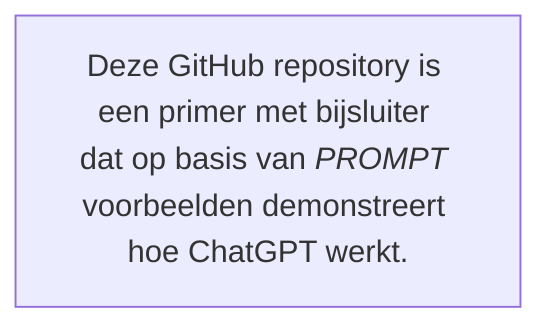
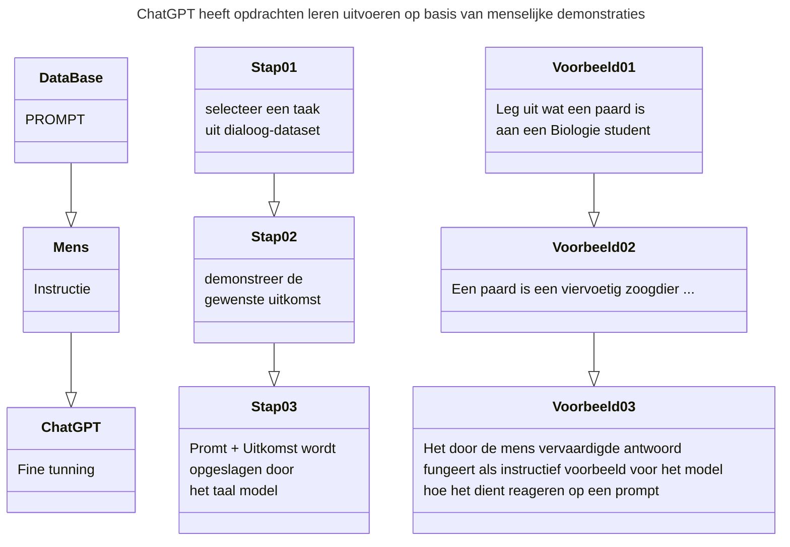

# AI's NEW FRONTIER is called Chat-GPT

***********


# [PROMETHEUS](https://github.com/HR-DATA-FABRIC/PROMETHEUS) <br /> DATA SCIENCE LAB


***********


## Context & Doel

| Leer hoe ChatGPT betrouwbaar te gebruiken |
|-----|
| 1. Begrijpen wat ChatGPT wel en niet kan doen 
| 2. Effectieve prompts schrijven
| 3. Vervolgvragen schrijven
| 4. Waarschuwing betrouwbaarheid

Exemplarisch voor AI anno 2023 is de lerende machine [ML] genaamd [ChatGPT](https://chat.openai.com/). Een state-of-the-art, grootschalig taalmodel [LLM] dat gebruik maakt van natuurlijke taal verwerkende [NLP] AI-technologie. Het is gevoed met meer dan 8 miljoen unieke dialogen.
ChatGPT’s gebruikersinterface is ontworpen om menselijke conversatie na te bootsen. Het revolutionaire aan deze Generatieve AI-technologie zijn de ogenschijnlijk levensechte gesprekken die het kan onderhouden met mensen.

Nu ChatGPT een wereldwijde hit is, verkeerd Sam Altman *---chief executive of OpenAI---* in de opmerkelijke situatie dat hij een hitproduct moet proberen te bagatelliseren. Gevreesd wordt dat te veel aandacht en rumoer ronddom ChatGPT een regelgevende reactie kan uitlokken of opgeblazen verwachtingen voor toekomstige releases kan creëren. 
>Op Twitter heeft hij geprobeerd de opwinding te temperen door ChatGPT "ongelooflijk beperkt" te noemen en gebruikers te waarschuwen dat "het een vergissing is om er nu op te vertrouwen voor iets belangrijks".

Om duiding te geven aan de hype rond ChatGPT, is deze repository opgezet; een initiatief van het [PROMETHEUS DATA SCIENCE LAB](https://github.com/HR-DATA-FABRIC/PROMETHEUS). Doordat de toepassingsmogelijkheden van ChatGPT eindeloos zijn, worden in deze repository uitsluitend gebruiksmogelijkheden besproken die relevant zijn voor (1) het leerproces van studenten, in combinatie met (2) onderwijstaken van docenten in het hoger onderwijs. Er zullen ook regelmatig updates volgen over nieuwe ontwikkelingen.
<!--

$${\color{blue} \fbox{Deze GitHub repository is een ChatGPT primer met bijsluiter.}}$$




-->
<br /> 


<br>

>Stel je een computer voor die jouw zinnen kan afmaken met een betere zinswending; of een gesprek met je kan voeren over een thema dat jouw interesseert; of een probleem direct kan oplossen door honderden regels computercode te schrijven binnen enkele seconden. Een dergelijke computer vormt een schakel in een lange keten van werktuigen zoals het weefgetouw, de boekdrukpers en de stoommachine die de industriële revolutie opgang brachten. Tegelijkertijd is het onderdeel van een nieuwe klasse aan _lerende machines_, omdat het de symbolen in taal omzet & computercode schrijft op manieren die creatief lijken. Een beetje zoals een mens dat zou doen.

<sub> Economist. (2022, june Issue). Artificial intelligence's new frontier. 
[doi:10.1016/S0140-6736(22)62142-4](https://www.economist.com/leaders/2022/06/09/artificial-intelligences-new-frontier) <sub>

<br><br>
************
# Overzicht van veel gestelde vragen
***********

<div align="left">
<table>
<tbody>
<td align="left">
<br>

* [0a] [Wat is generatieve kunstmatige intelligentie [Gen-AI]?](#v0a)
* [0b] [Wat is nodig om een Gen-AI zoals ChatGPT te bouwen?](#v0b)
* [1a] [Wat moet je weten over ChatGPT?](#v1a)
* [1b] [Wat zijn de beperkingen van ChatGPT?](#v1b)
* [1c] [Wat zijn de risico's van ChatGPT?](#v1c)
* [1d] [Staat het gebruik van ChatGPT gelijk aan valsspelen?](#v1d)
* [2] [Hoe geef je een opdracht aan ChatGPT?](#v2)
* [3] [Kan ChatGPT uitleggen hoe het werkt?](#v3)
* [4] [Kan ChatGPT uitleggen hoe het te gebruiken?](#v4)
* [5] [Heeft ChatGPT taalbegrip?](#v5)
* [6] [Kan ChatGPT logisch redeneren?](#v6)
* [7a] [Kan ChatGPT broncode schrijven?](#v7a)
* [7b] [Kan ChatGPT broncode uitleggen?](#v7b)
* [7c] [Kan ChatGPT broncode output simuleren?](#v7c)
* [7d] [Kan ChatGPT een "Deep Learning" lessenreeks bedenken?](#v7d)
* [7e] [Kan ChatGPT broncode beoordelen en/of fouten opsporen?](#v7e)
* [8] [Kan ChatGPT gebruikt worden om bronnen te vermelden?](#v8)
* [9] [Kan ChatGPT gebruikt worden om bronnen samen te vatten?](#v9)
* [12] [Kan het gebruik van ChatGPT gedetecteerd worden?](#v12)
* [13] [Kun je spreken tegen ChatGPT?](#v13)
* [14] [Bekende problemen & betrouwbaarheid issues](#v14)
* [15] [Prompt voorbeelden](#v15)
* [16] [Geraadpleegde Bronnen](#v16)

</td>
</tbody>
</table>
</div>

<br>


# v0a


*******
### [0a] Wat is "*generatieve kunstmatige intelligentie"* [Gen-AI]?
*******


"Kunstmatige intelligentie" (AI) is een multidisciplinair vakgebied gericht op het ontwikkelen van technologie dat menselijke cognitieve, perceptuele en/of motorische vermogens kan automatiseren. 

|        | Cognitie                                                                 | Perceptie                                                                 | Motorische vermogens                                                                 |
|----------------|--------------------------------------------------------------------------------------------------------------------------------------------|--------------------------------------------------------------------------------------------------------------------------------------------|--------------------------------------------------------------------------------------------------------------------------------------------|
| Menselijk Vermogen  | Verwerken, Begrijpen en Onthouden van informatie via het Brein.                                            | Verzamelen van Ongestructureerde Informatie via Sensoren <br> (Ogen, Oren, Neus, Huid,Tong).                                         | Uitvoeren van fysieke acties via Actuatoren <br> (Armen, Handen, Benen, Voeten, Mond, Lippen)                                                           |
| Toepassing  | Taalverwerking, Logisch Redeneren, Problemen Oplossen.                                          | Beeldherkenning, Spraakherkenning, Object Lokalisatie.                                            | Zelfrijdende auto's, Drones, Humanoïde Robots, [Tekst-naar-spraak synthese](https://valle-demo.github.io/) |


Voorbeelden van menselijke vermogens in de vorm van AI toepassingen zijn interactief uit te proberen via de [World-Wide-Web AI Safari](https://robfvdw.medium.com/the-world-wide-web-ai-safari-b2e4f7f90647).

<br>
 


Generatieve AI [Gen-AI] is een *"digitale content generende technologie"* met als doel het volledig automatisch produceren van ogenschijnlijk *"nieuwe"* inhoud, zoals tekst, afbeeldingen, geluid, spraak en/of muziek. <br> <br> Gen-AI kan een model maken van een bestaand schilderij, met als doel nieuwe beelden te creëren die op het oorspronkelijke schilderij lijken. Door vervolgens een serie aan nieuwe beelden te genereren en die na elkaar af te spelen, ontstaat een animatie.

>Living Mona Lisa from Few-Shot Adversarial Learning of Realistic Neural Talking Head Models. <br>  <sub> Zakharov, E., Shysheya, A., Burkov, E., & Lempitsky, V. (2019). Few-shot adversarial learning of realistic neural talking head models. In Proceedings of the IEEE/CVF international conference on computer vision (pp. 9459-9468). https://doi.org/10.1109/ICCV.2019.00671


br>


# v0b


*******
### [0b] WAT IS NODIG OM EEN GEN-AI ZOALS ChatGPT TE BOUWEN?
*******


<br>


# v1a


*******
### [1a] WAT MOET JE WETEN OVER ChatGPT?
*******

<!--
Deze op neuraal netwerk-gebaseerde grootschalige taalmodellen [LLM] zijn gevoed met enorm grote datasets. 
LLMs van het van het type
-->


 *"Generative Pre-trained Transformers"* [GPTs] zijn anno 2023 de meest dominante verschijningsvorm van Gen-AI. GTPs maken gebruik van op neurale netwerk [NN] architectuur gebaseerde "machinaal Lerende" [ML] algoritmen. Het zijn automaten die natuurlijke taal kunnen verwerken & genereren [NLP]. 

ChatGPT is de meest geavanceerde GPT die publiekelijk toegankelijk is gesteld door OpenAI eind 2022. 

GPT's worden hierdoor nu versneld mainstream. In parallel werkt Microsoft *---dat onlangs miljarden dollars investeerde in het bedrijf achter de chatbot, OpenAI---*  aan de integratie ervan in zijn populaire kantoorsoftware en toegang tot de tool verkoopt aan andere bedrijven. 

De sterke toename van de aandacht voor ChatGPT leidt tot druk binnen techgiganten, waaronder Meta en Google, om sneller te handelen en mogelijk veiligheidszorgen opzij te schuiven, volgens the Whashington Post:[*"Big Tech was moving cautiously on AI. Then came ChatGPT"*](https://www.washingtonpost.com/technology/2023/01/27/chatgpt-google-meta/). Zie ook [Wat zijn de risico's van ChatGTP](#v1c).

Deze nieuwe generatie aan GPTs kan op commando natuurlijke taal genereren nodig voor (1) het inhoudelijk beantwoorden van vragen, (2) het samenvatten van teksten, (3) uitvoeren van gedetailleerde instructies, en (4) het voeren van dialogen. 

In de onderstaande tabel zijn tot nu toe bekende op natuurlijke taal verwerking [NLP] gebaseerde functies van ChatGPT weergegeven.

| <sub>NLP functie</sub> | <sub>Omschrijving</sub> | <sub>Toepassingen</sub> |
| --- | --- | --- |
| <sub>Text completion</sub> | <sub>Voorspellen van de volgende woorden in een zin of tekst</sub> | <sub>Automatische aanvulling van tekst in tekstverwerkers, zoekopdrachten</sub> |
| <sub>Language Translation</sub> | <sub>Vertalen van tekst van een taal naar een andere</sub> | <sub>Automatische vertaling van berichten, documenten, websites</sub> |
| <sub>Summarization</sub> | <sub>Samenvatten van een lange tekst in een kortere vorm</sub> | <sub>Samenvatten van nieuwsartikelen, boeken, rapporten</sub> |
| <sub>Question Answering</sub> | <sub>Beantwoorden van vragen op basis van een gegeven tekst</sub> | <sub>Beantwoording van vragen in chatbots, zoekmachines, virtuele assistenten</sub> |
| <sub>Image captioning</sub> | <sub>Bedenken van een bijschrift voor een gegeven afbeelding</sub> | <sub>Automatisch beschrijven van afbeeldingen voor toegankelijkheid, zoekopdrachten</sub> |
| <sub>Sentiment Analysis</sub> | <sub>Classificeren van tekst als positief, negatief of neutraal</sub> | <sub>Analyseren van social media-berichten, klantbeoordelingen, feedback</sub> |
| <sub>Text Generation</sub> | <sub>Genereren van tekst op basis van een bepaald onderwerp of stijl</sub> | <sub>Schrijven van kunstmatige teksten, scripts, artikelen</sub> |
| <sub>Named Entities Recognition</sub> | <sub>Herkennen van namen van personen, organisaties, locaties, enz. in tekst</sub> | <sub>Extraheren van gegevens uit documenten, automatisch genereren van metadata</sub> |
| <sub>Parts of Speech Tagging</sub> | <sub>Toewijzen van grammaticale categorieën aan woorden in een zin</sub> | <sub>Automatische analyse van grammatica, semantiek</sub> |
| <sub>Parsing</sub> | <sub>Analyseren van de grammaticale structuur van een zin</sub> | <sub>Automatische analyse van grammatica, semantiek |
| <sub>Coreference Resolution | <sub>Identificeren van verwijzingen naar dezelfde entiteit in een tekst | <sub> Automatische analyse van semantiek, anaphora resolution. |
| <sub>Grammar Correction | <sub>Corrigeren van zinnen naar standaard Engelse grammatica | <sub>Automatische grammaticacontrole in tekstverwerkers, online fora, e-mails |
| <sub> Summarize for a 2nd grader | <sub>Vertalen van moeilijke tekst naar eenvoudigere begrippen | <sub>Samenvatten van informatie voor kinderen, leesbaar maken van complexe tekst |
| <sub>Natural language to OpenAI API | <sub>Creëren van code om aan te roepen naar de OpenAI API met behulp van natuurlijke taal | <sub>Interactie met AI-modellen via natuurlijke taal |
| <sub>Text to command | <sub>Vertalen van tekst naar programmatische commando's | <sub>Interactie met computers via natuurlijke taal |
| <sub>English to other languages | <sub>Vertalen van Engelse tekst naar Frans, Spaans en Japans | <sub>Automatische vertaling van Engelse tekst naar andere talen |
| <sub>Natural language to Stripe API | <sub>Creëren van code om aan te roepen naar de Stripe API met behulp van natuurlijke taal | <sub>Interactie met Stripe-API via natuurlijke taal |
| <sub>SQL translate | <sub>Vertalen van natuurlijke taal naar SQL-queries | <sub>Interactie met databases via natuurlijke taal |
| <sub>Parse unstructured data</sub> | <sub>Creëren van tabellen uit langdurige tekst</sub> | <sub>Automatisch organiseren van gegevens, structuur aanbrengen in ongestructureerde data</sub> |
| <sub>Classification</sub> | <sub>Classificeren van items in categorieën op basis van voorbeeld</sub> | <sub>Automatisch sorteren van gegevens, detectie van spam, frauduleuze activiteiten</sub> |
| <sub>Python to natural language</sub> | <sub>Uitleggen van een stuk Python-code in begrijpelijke menselijke taal</sub> | <sub>Automatische documentatie van code, verklaringen van code in begrijpelijke taal</sub> |
| <sub>Movie to Emoji</sub> | <sub>Converteren van filmtitels naar emoji</sub> | <sub>Creatief gebruik van emoji's in social media, marketing</sub> |
| <sub>Calculate Time Complexity</sub> | <sub>Vinden van de tijdscomplexiteit van een functie</sub> | <sub>Optimaliseren van code-prestaties, vergelijken van verschillende algoritmen</sub> |
| <sub>Translate programming languages</sub> | <sub>Vertalen van een programmeren taal naar een andere</sub> | <sub>Automatisch genereren van code, converteren van code tussen talen</sub> |
| <sub>Advanced tweet classifier</sub> | <sub>Geavanceerde sentimentdetectie voor een stuk tekst</sub> | <sub>Analyseren van social media-berichten, klantbeoordelingen, feedback</sub> |
| <sub>Explain code</sub> | <sub>Uitleggen van een ingewikkeld stuk code</sub> | <sub>Automatische documentatie van code, verklaringen van code in begrijpelijke taal voor niet-ontwikkelaars, ondersteuning van code-reviews en debugging</sub> |
| <sub>Keywords</sub> | <sub>Extraheren van sleutelwoorden uit een blok tekst</sub> | <sub>Automatisch classificeren van documenten, verbeteren van zoekresultaten, identificeren van onderwerpen en trends</sub> |
| <sub>Factual answering</sub> | <sub>Leiden van het model naar feitelijke antwoorden door het te laten zien hoe het moet reageren op vragen die buiten zijn kennisbasis vallen. Met een '?' aangeven van een antwoord op woorden en zinnen die het niet kent, biedt een natuurlijke reactie die beter werkt dan abstractere antwoorden</sub> | <sub>Beantwoorden van vragen in chatbots, zoekmachines, virtuele assistenten</sub> |
| <sub>Ad from product description</sub> | <sub>Een productomschrijving omzetten in advertentie-tekst</sub> | <sub>Automatisch genereren van advertentie-tekst, verbeteren van de effectiviteit van marketingcampagnes</sub> |
| <sub>Product name generator</sub> | <sub>Productnamen genereren uit voorbeeldwoorden. Beïnvloed door een gemeenschapsprompt</sub> | <sub>Automatisch genereren van productnamen, verbeteren van de originaliteit van productnamen</sub> |
| <sub>TL;DR summarization</sub> | <sub>Tekst samenvatten door 'tl;dr:' aan het eind van een tekstpassage te plaatsen. Het toont aan dat de API begrijpt hoe een aantal taken uit te voeren zonder instructies</sub> | <sub>Efficiënter lezen van grote hoeveelheden tekst, verbeteren van de begrijpelijkheid van tekst</sub> |
| <sub>Python bug fixer</sub> | <sub>Bugs in broncode vinden en verhelpen</sub> | <sub>Automatisch debuggen van code, verminderen van tijd besteed aan het oplossen van problemen</sub> |
| <sub>Spreadsheet creator</sub> | <sub>Spreadsheets maken van verschillende soorten gegevens. Het is een lange prompt, maar zeer veelzijdig. De output kan worden gekopieerd en geplakt in een tekstbestand en opgeslagen als .csv met pipe-scheidingstekens</sub> | <sub>Efficiënter verwerken van grote hoeveelheden gegevens, automatisch genereren van rapporten</sub> |
| <sub>JavaScript helper chatbot</sub> | <sub>Berichtstijl-bot die vragen over JavaScript beantwoordt</sub> | <sub>Ondersteuning bij het leren en werken met JavaScript, snel antwoorden op technische vragen</sub> |
| <sub>ML/AI language model tutor</sub> | <sub>Bot die vragen beantwoordt over taalmodellen in ML/AI</sub> | <sub>Ondersteuning bij het leren en begrijpen van taalmodellen, snel antwoorden op technische vragen</sub> |
| <sub>Science fiction book list maker</sub> | <sub>Een lijst maken van items voor een bepaald onderwerp</sub> | <sub>Automatisch genereren van lijsten, efficiënter organiseren van informatie</sub> |
| <sub>Tweet classifier</sub> | <sub>Basis sentimentdetectie voor een stuk tekst</sub> | <sub>Analyseren van social media-berichten, detectie van positief en negatief sentiment</sub> |
| <sub>Airport code extractor</sub> | <sub>Luchthavencodes uit tekst extraheren</sub> | <sub>Automatisch herkennen van luchthavencodes in tekst, efficiënter organiseren van reisinformatie</sub> |
| <sub>SQL request</sub> | <sub>Eenvoudige SQL-queries maken</sub> | <sub>Automatisch genereren van SQL-queries, efficiënter data-analyse</sub> |
| <sub>Extract contact information</sub> | <sub>Contactinformatie uit een blok tekst extraheren</sub> | <sub>Automatisch herkennen van contactinformatie, efficiënter organiseren van contactgegevens</sub> |
| <sub>JavaScript to Python</sub> | <sub>Eenvoudige JavaScript-expressies omzetten naar Python</sub> | <sub>Makkelijker migratie van code tussen verschillende talen, snellere ontwikkeling</sub> |
| <sub>Friend chat</sub> | <sub>Een tekstberichtconversatie nabootsen</sub> | <sub>Oefenen van sociale vaardigheden, genereren van chatlogs voor analyse</sub> |
| <sub>Mood to color</sub> | <sub>Een tekstomschrijving omzetten naar een kleur</sub> | <sub>Automatisch genereren van kleuren op basis van emoties, efficiënter ontwerpen van visuals</sub> |
| <sub>Write a Python docstring</sub> | <sub>Een voorbeeld geven van hoe een docstring voor een Python-functie gemaakt kan worden</sub> | <sub>Makkelijker documentatie van code, efficiënter ontwikkelen in teams</sub> |
| <sub>Analogy maker</sub> | <sub>Analogieën maken</sub> | <sub>Creatie van vergelijkingen voor verduidelijking en verrijking van tekst</sub> |

<br>

# v1b


*******
### [1b] WAT ZIJN DE BEPERKINGEN VAN ChatGPT?
*******

ChatGPT's interactie met de eindgebruiker is geoptimaliseerd voor een 4-tal functies. <br> Deze functies zijn:

| Functie | Beschrijving |
| ------- | -------- | 
| Afleiden van de intentie van de eindgebruiker | Wat de eindgebruiker wil bereiken en/of vaststellen wat zijn/haar bedoeling, doel of motivatie is  | 
| Tegengaan van ongepast taalgebruik | Voorkomen of bestrijden van het gebruik van taal die aanstootgevend, beledigend, kwetsend of discriminerend is. <br> <br /> Denk aan taal die racistisch, seksistisch, homofoob of op andere manieren onacceptabel is en niet in overeenstemming is met de normen van de samenleving. <br> <br/> Beoogde doel is om een respectvolle en inclusieve omgeving te creëren waarin iedereen zich veilig en geaccepteerd voelt.
 | Reduceren van de kans op het genereren van "verzonnen" feiten | Verminderen van de kans op het creëren of verspreiden van onjuiste of niet-geverifieerde informatie. <br > <br> Dit omvat het voorkomen van het opzettelijk verspreiden van verkeerde informatie en het beperken van onbedoelde verspreiding van onjuiste feiten. <br> <br> Het streven is de betrouwbaarheid en authenticiteit van de informatie te verhogen en de verspreiding van valse informatie te voorkomen, wat kan leiden tot verwarring en verkeerde/schadelijke beslissingen.
 Adequate reacties | Het bieden van een gepaste en effectieve reactie op de input prompts van de eindgebruiker, waarbij de nadruk ligt op precisie, bruikbaarheid.


<br> <br> 
ChatGPT's gebruikersinterface is gespecialiseerd in het uitvoeren van door mensen ingevoerde tekstuele instructies. <br> Dit heet *"prompting"* of *"priming"* in het Engelse taaldomein. 

Om deze *"Chat-achtige"* interactie met eindgebruikers mogelijk te maken is ChatGPT aangepast op basis van menselijk toezicht. Dat wil zeggen, het heeft opdrachten *leren* uit te voeren aan de hand  van menselijke feedback. Deze methodiek van *"belonend leren onder toezicht"* [RLHF] is een van de meest toegepaste AI-algoritme voor het trainen van robots. Belonend leren onder toezicht is in dit geval een methodiek die aanstuurt op het belonen *--reinforcing--* van goed gedrag op basis van *"menselijke"* feedback in de vorm van natuurlijke taal.

 <br>

<div style="float:center;">



<br>


Het resultaat is een Gen-AI dat in staat is om een gesprek aan te gaan die eindgebruikers de indruk geeft te praten met een helpdeskmedewerker met kennis van zaken.

Een probleem is dat "belonend leren onder toezicht" [RLHF] nadelige effecten heeft voor de benutting van het onderliggende taalmodel. Dit komt doordat de ideale reactie van ChatGPT niet bepaald wordt wat deze Gen-AI aan natuurlijke taal voorbeelden heeft opgeslagen, maar van wat de menselijke demonstrateur weet. Hierdoor is het mogelijk dat ChatGPT een antwoord geeft dat niet overeenkomt met wat het aan feitelijk juiste informatie heeft opgeslagen.

ChatGPT is extreem gevoelig voor de wijze waarop een vraag geformuleerd wordt. Dit kan leiden tot het negeren van bepaalde aanwijzingen in de opdracht. Bij één formulering van een vraag kan het beweren niet over de gevraagde informatie te beschikken, maar bij een kleine herformulering correct antwoorden.

Nog problematischer is dat ChatGTP vaak in vreemde gedachten vervalt. Het hallucineert dan schijnbaar overtuigende maar onzinnige antwoorden die weinig met de werkelijkheid te maken hebben. Gebleken is dat de AI zeer zelfverzekerd onjuiste antwoorden geeft over elementaire wiskunde, natuurkunde en basale kennis van de biologie; in een viraal voorbeeld bleef de ChatGPT zichzelf tegenspreken over de vraag of een vis een zoogdier was.

Je kunt je afvragen hoe verantwoordelijk het is van OpenAI/Microsoft om een dergelijke AI publiekelijk toegankelijk te maken. Van belang is om te weten hoe je met de beperkingen moet omgaan om ChatGPT verantwoord te kunnen inzetten voor school taken. 

# beperkingen
#### In de onderstaande tabel zijn de meest voorkomende problemen en mogelijke oplossingen opgesomd.

| Bekende Problemen | Oorzaak | Oplossing |
|-----------|---------|---------|
| <sub> onjuiste of onzinnige antwoorden | <sub>In tegenstelling tot spraak gestuurde persoonlijke assistenten zoals Siri of Alexa, maakt ChatGPT geen gebruik van het world-wide-web om antwoorden te formuleren. <br> <br> ChatGPT genereerd een antwoord, woord voor woord op basis van waarschijnlijkheden afgeleid van de geleerde natuurlijke taal voorbeelden. | <sub>Maak gebruik van triangulatie. Verifieer de antwoorden van ChatGPT met meerdere onafhankelijke bronnen zoals Google Scholar, Wikipedia, gerenommeerde nieuwssites , bibliografische databases etc. <br> <br>Beperk de vraag tot een specifiek onderwerp. <br><br> |
| <sub>Gevoeligheid voor woordkeuze & instructie specificiteit | <sub>De context waarin een opdracht wordt gegeven vormt het uitgangspunt voor ChatGPT om de intentie van de gebruiker af te leiden om zo een antwoord te genereren. <br> <br>Wanneer de context veranderd wordt *---door bijvoorbeeld de opdracht een aantal keren te herhalen---* heeft dit een herinterpretatie van de intentie tot gevolg zodat een ander antwoord wordt gegeven. <br> <br> Welk geleerd voorbeeld als uitgangspunt dient om een antwoord te genereren wordt bepaald door een willekeurig samplingproces. De willekeur van dit proces kan resulteren in verschillende antwoorden voor dezelfde vraag. <br> <br> Met voorwaardelijk clausules kun je de reactie van CharGPT sturen. | <sub>Probeer verschillende manieren om een ​​vraag te stellen. Let op de juiste woordkeuze of uitdrukkingen tijdens de invoer. Hiermee beïnvloed je de context waarin de vraag wordt geformuleerd. <br><br> Context kan beïnvloed worden de beoogde doelgroep te vermelden en of de "tone-of-vioce". Bijvoorbeeld: uitleg is bedoeld als positieve feedback voor 2de jaars bachelor studenten.  <br><br> Het is zelfs mogelijk of ChatGPT opzettelijk schrijffouten te laten maken: <br> *"in de tekst als antwoord op de prompt moet in 6% van alle gebruikte woorden spelfouten voorkomen; doe dit voor woorden langer dan 5 leestekens"* |
| <sub>Lang van stof | <sub>Overdreven uitgebreide antwoorden en herhaling zoals "ik ben een taalmodel is dat is getraind op een grote dataset ..." komt vaak voor. <br> <br>Om *"Chat-achtige"* interactie met eindgebruikers mogelijk te maken is ChatGPT aangepast op basis van menselijk toezicht. Dat wil zeggen, het heeft opdrachten *leren* uit te voeren aan de hand  van menselijke feedback. <br> <br>Nadeel is dat menselijke trainers de voorkeur geven aan uitgebreide antwoorden en vaak terug vallen op vaste formuleringen. Of zelfs "feiten" verzinnen om te voldoen aan hun opdracht om zo volledig mogelijk te antwoorden | <sub>Beperk de vraag: Maak de vraag zo specifiek mogelijk en beperk het tot een enkel onderwerp. Dit helpt ChatGPT om gericht te zoeken naar een antwoord en te voorkomen dat het irrelevant informatie geeft. <br><br>Maak gebruik van sturende aanwijzingen: zoals "geef me de samenvatting van" of "geef me de kernpunten van ... in tabelvorm" om ChatGPT aan te geven dat je een kort en bondig antwoord verwacht. <br><br> Formuleer voorwaardelijkheden zoals gebruik niet meer dat 100 woorden.|
| <sub>Gebrek aan context | <sub>Omdat ChatGPT is getraind op bestaande tekst, kan het soms moeilijk zijn om de intentie van de vraagsteller te bepalen. <br><br> Dit gebeurt als een vraag niet specifiek genoeg is, dubbelzinnig en of tegenstrijdig is, of als de vraagsteller de context niet duidelijk aangeeft. <br><br>Gevolg is dat ChatGPT naar de intentie van de vraagsteller gaat *"raden"*. Met andere woorden, ChatGPT komt tot een antwoord door een reeks gissingen waardoor het foute antwoorden kan beargumenteren alsof ze volledig waar zijn. Het produceert dan alleen nog onzinnige antwoorden alsof het aan het hallucineren is. | <sub> Wanneer ChatGPT een alleen nog onzinnig antwoorden geeft, log dan uit. Log vervolgens opnieuw in en herformuleren de vraag. <br><br>Gebruik de juiste woordkeuze en uitdrukkingen. <br><br>Gebruik de juiste context. <br><br> |
| <sub>Ongewenste antwoorden | <sub>ChatGPT zal doorgaans ongepaste verzoeken weigeren. Dit komt doordat de Moderation-API ongepaste verzoeken zal negeren en/of waarschuwen: <br> <sub> *"This content may violate our content policy. If you believe this to be in error, please submit your feedback — your input will aid our research in this area."*| <sub> Dit is een vorm van zelfcensuur die lastig te omzeilen is. Het opleggen van een rollenspel heeft kan deze vorm van filtering neutraliseren, maar de vraag is of je dat zou moeten willen? <br><br> Wanneer je ervan overtuigd bent dat de waarschuwing onterecht is, geef dan feedback via de API.|


<br>

# v1c

*******
### [1c] WAT ZIJN DE RISICO'S VAN ChatGPT?
*******


Sharon Goldman schreef in VentureBeat (23 september 2022)  een blog over de risico's van Gen-AI met als titel: <br> 
*"Why DeepMind isn’t deploying its new AI chatbot — and what it means for responsible AI"*.

<!-- *"AI is getting smarter, but it's still not ready to be unleashed on the world"*.
--> 
DeepMind's state-of-the-art chatbot, *Sparrow*, wordt alom geprezen als een belangrijke stap in de richting van het creëren van veiligere, minder bevooroordeelde grootschalig taalmodel [LLM], dankzij de toepassing van door mensen gestuurde reinforcement learning [RL].  Dat wil zeggen, Dparrow heeft opdrachten *leren* uit te voeren aan de hand  van menselijke feedback. Deze methodiek van *"belonend leren onder toezicht"* [RLHF] is een van de meest toegepaste AI-algoritme voor het trainen van robots. Belonend leren onder toezicht is in dit geval een methodiek die aanstuurt op het belonen *--reinforcing--* van goed gedrag op basis van *"menselijke"* feedback in de vorm van natuurlijke taal.

DeepMind is een Britse dochteronderneming van het Google-moederbedrijf Alphabet. Zij omschrijven Sparrow als een *"dialoog-agent die het risico op onveilige en ongepaste antwoorden tracht te vermijden "*  De agent is ontworpen om *"met een gebruiker te praten, vragen te beantwoorden en het internet te doorzoeken met behulp van Google wanneer het nuttig is om bewijsmateriaal op te zoeken om zijn antwoorden te onderbouwen."*

DeepMind beschouwt Sparrow als een  *proof-of-concept* dat nog niet klaar is om   *"in de echte wereld"* te worden losgelaten. *"Het is een stap in de richting van het creëren van een veiliger, minder bevooroordeeld, grootschalig taalmodel [LLM] dankzij de toepassing van door mensen gestuurde reinforcement learning [RL]."*
aldus Geoffrey Irving, een veiligheidsonderzoeker bij DeepMind en hoofdauteur van de paper waarin Sparrow wordt geïntroduceerd.

>We hebben het systeem niet ingezet omdat we denken dat het veel vooroordelen en andere gebreken heeft. <br> Ik denk dat de vraag is: hoe weeg je de communicatievoordelen - zoals communiceren met mensen - af tegen de nadelen? <br> Ik ben geneigd te geloven in de veiligheidsbehoeften van het praten met mensen ... Ik denk dat het daar op termijn een hulpmiddel voor is.

De voornaamste complicerende factor in het toepassen  van conversationele Gen-AI is het instand houden van constuctieve dialogen omdat het *"gebrek aan context"* bepalend is voor het verloop ervan. Zie  [Wat zijn de beperkingen van ChatGPT?](#beperkingen). Het is een van de grootste uitdagingen voor de ontwikkeling van een veilige en betrouwbare conversational agent.

Eugenio Zuccarelli *---een Innovation Data Scientist bij CVS Health en onderzoekswetenschapper bij het MIT Media Lab---* legt uit dat er nog steeds sprake kan zijn van vooringenomenheid in de *"menselijke lus / human-in-de-loop"* - immers, wat voor de ene persoon beledigend is, is voor de andere misschien niet beledigend. 

>Bovendien, kunnen op regels gebaseerde algoritmen strengere regels creëren, hierdoor missen ze schaalbaarheid en flexibiliteit. Het is moeilijk om elke regel die we kunnen bedenken te coderen, vooral naarmate de tijd verstrijkt, kunnen deze veranderen, en het beheer van een systeem op basis van vaste regels zou ons vermogen om op te schalen kunnen belemmeren."  Bij voorkeur streef je naar Flexibele oplossingen waarbij de regels rechtstreeks door het systeem worden geleerd en in de loop van de tijd automatisch worden aangepast aan de veranderende omstandigheden. Een vastgelegde regel kan niet alle nuances en randgevallen omvatten. De regel zou in de meeste gevallen kunnen kloppen, maar geen rekening houden met zeldzamere en misschien gevoelige situaties. 
<br> <br> Google-zoekopdrachten zijn misschien niet helemaal nauwkeurige of onbevooroordeelde informatiebronnen, vervolgde Zuccarelli. "Ze zijn vaak een weergave van onze persoonlijke kenmerken en culturele voorkeuren," zei hij. "Ook is het lastig om te bepalen welke een betrouwbare bron is."

 Google, dat een deel van de technologie die ten grondslag ligt aan ChatGPT heeft helpen ontwikkelen, heeft onlangs een *"code rood"* afgegeven voor de lancering van AI-producten en een *"groene baan"* voorgesteld om het proces van beoordeling en beperking van potentiële schade te verkorten, aldus een bericht in de [New York Times](https://www.nytimes.com/2022/12/21/technology/ai-chatgpt-google-search.html). Bij Meta daarentegen, is onlangs (december 2022) een interne memo's opgesteld waarin mederwerkers aandringen op een versneld goedkeuringsproces.
<br>

OpenAI heeft zichzelf gepositioneerd als een missiegedreven organisatie die zorgdraagt voor veilige AI-technologie, on par met menselijke waarden. Maar in de afgelopen jaren heeft het bedrijf een meer competitieve geest omarmd, die volgens sommige critici ten koste is gegaan van de oorspronkelijke doelstellingen.

Die bezorgdheid groeide afgelopen zomer toen OpenAI zijn DALL-E 2 beeldgenererende Gen-AI  uitbracht, die tekstinstructies omzet in digitale kunstwerken. De app was een hit bij consumenten, maar riep ook lastige vragen op over hoe zulke krachtige tools gebruikt kunnen worden om schade aan te richten. Als het maken van hyperrealistische beelden net zo eenvoudig was als het intikken van een paar woorden, vroegen critici zich af, zouden pornografen en propagandisten dan niet veel plezier beleven aan deze technologie?

Met de release van DALL-E 2 heeft OpenAI deze Gen-AI uitgerust met tal van beveiligingen. Onder meer door bepaalde woorden en zinnen te blokeren die betrekking hebben tot grafisch geweld of naaktheid + biases in de trainingsgegevens te neutraliseren *- zoals ervoor zorgen dat wanneer een gebruiker vroeg om een foto van een CEO, de resultaten ook afbeeldingen van vrouwen bevatten*.

OpenAI heeft met ChatGPT voor een minder restrictieve aanpak gekozen, waardoor de Gen-AI meer vrijheid heeft om zich uit te spreken over gevoelige onderwerpen als politiek, seks en religie. Toch hebben sommige rechtse conservatieven het bedrijf ervan beschuldigd te ver te gaan. ["ChatGPT Goes Woke"](https://www.nationalreview.com/corner/chatgpt-goes-woke/), luidde de kop van een artikel in National Review (januari 2023), waarin werd beweerd dat ChatGPT linkse antwoorden gaf op vragen over onderwerpen als drag queens en de verkiezingen van 2020. (Democraten hebben ook geklaagd over ChatGPT - vooral omdat ze vinden dat AI strenger moet worden gereguleerd).

<br>

# v1d

*******
### [1d] STAAT HET GEBRUIK VAN ChatGPT GELIJK AAN VALSSPELEN? 
*******


<br>

# v2
********
### [2] HOE GEEF IK EEN OPDRACHT AAN ChatGPT? #link2

********


ChatGPT maakt gebruik van *"prompting"* of *"priming"*. 

De prompt is een verzoek, opdracht, instructie of vraag van een eindgebruiker in tekst-vorm. 

De prompt wordt vervolgens doorgegeven aan het model, die op zijn beurt hier op reageert in text-vorm, waarbij de gegenereerde tekst beetje bij beetje wordt vrijgegeven. 

De eindgebruiker krijgt zo de indruk dat het AI-model vragen beantwoordt en/of opdrachten uitvoert zoals een mens dat zou doen.


<br /> <br> <br> <br>

# v3
********
### [3] KAN ChatGPT UITLEGGEN HOE HET WERKT?

********

| agent | prompt | agent | response |
----- | ----- | ----- | ----- |
| Human | Ben jij een voorbeeld van een generatief taalmodel AI? | ChatGPT |Ja, ik ben in staat om nieuwe tekst te genereren door het analyseren en leren van grote hoeveelheden aan tekst. |
| Human | Maar alle antwoorden die je geeft zijn toch gebaseerd op voorbeelden uit een dialoog dataset + labeling + ranking door mensen? | ChatGPT | De antwoorden die ik geef zijn gebaseerd op de informatie die ik geleerd heb uit deze dataset en de manier waarop ik deze informatie interpreteer. <br> <br> In sommige gevallen kan ik specifieke informatie uit de dataset gebruiken om te antwoorden op een vraag, in andere gevallen kan ik een combinatie van informatie gebruiken die ik geleerd heb om antwoord te geven. <br> <br> Ook is het zo dat mijn antwoorden door mensen worden geëvalueerd en gerankt, en zo kan ik bijgestuurd worden of bijgeleerd. |
| Human | Wanneer je antwoorden gebaseerd zijn op een combinatie van informatie. <br> <br> Waar bestaat die combinatie aan informatie (bronnen) dan uit? | ChatGPT |Als generatieve taalmodel, leer ik patronen en structuren in taal uit de dataset waarop ik getraind ben, zoals boeken, artikelen, websites enz. <br> <br>Dit betekent dat de antwoorden die ik geef gebaseerd zijn op de informatie die ik geleerd heb uit deze dataset. <br> <br>In sommige gevallen kan ik specifieke informatie uit de dataset gebruiken om te antwoorden op een vraag, in andere gevallen kan ik een combinatie van informatie gebruiken die ik geleerd heb om antwoord te geven. <br> <br>Deze combinatie kan bestaan uit een aantal verschillende bronnen, zoals boeken, artikelen, websites of andere bronnen die in de dataset zijn opgenomen. |
| Human | Wanneer de uitkomst een combinatie is van reeds bestaande bronnen dan heb jezelf toch niets nieuws gegenereerd? | ChatGPT |Het is waar dat ik niet in staat ben om echt nieuwe informatie te genereren die niet in de dataset aanwezig was.<br> <br> Wat ik wel kan doen is informatie combineren en gebruiken die ik geleerd heb uit de dataset om antwoord te geven op een vraag of een opdracht uit te voeren. <br> <br>Dit kan lijken op het genereren van nieuwe informatie, maar in feite is het een combinatie van de informatie die al aanwezig was in de dataset. |

<br /> 

# v4
********
### [4] KAN ChatGPT UITLEGGEN HOE HET TE GEBRUIKEN?

********

| agent | prompt | agent | response |
----- | ----- | ----- | ----- |
| Human | Wanneer je een bijsluiter tekst zou samenstellen voor het gebruik van ChatGPT door bachelor studenten hoe zou deze er dan uit zien. <br> <br> Wijs vooral op mogelijke complicaties en consequenties voor de student en hoe docenten op het gebruik ervan voor het maken van schrijfopdrachten zouden kunnen reageren. | ChatGPT |Een bijsluiter voor het gebruik van ChatGPT door bachelor studenten zou er ongeveer als volgt uit kunnen zien: <br> <br> [1] ChatGPT is een taalmodel dat gebruikt kan worden voor het genereren van tekst. <br> Het is bedoeld als hulpmiddel voor studenten om hen te helpen bij het schrijven van opdrachten, maar moet niet worden beschouwd als een vervanging voor eigen werk. <br> Het is belangrijk om te weten dat ChatGPT alleen gebruikt mag worden voor eigen opdrachten en niet mag worden gebruikt voor plagiaat of fraude. <br> Het is de verantwoordelijkheid van de student om ervoor te zorgen dat hun gebruik van ChatGPT legaal en ethisch verantwoord is.<br> <br> [2] ChatGPT is gebaseerd op tekst die het in het verleden heeft gezien, dus het kan beperkt zijn in zijn capaciteit om unieke ideeën of innovatieve perspectieven te genereren. <br> Studenten moeten zich bewust zijn van deze beperkingen en hun eigen onderzoek en analyse uitvoeren om hun opdrachten te verrijken.<br> <br> [3] Docenten kunnen reageren op het gebruik van ChatGPT door het in te zetten als een tool voor het schrijven van opdrachten, maar ook door het opnemen van specifieke instructies in de opdrachtomschrijving om te voorkomen dat studenten alleen maar afhankelijk worden van het model. <br> Docenten kunnen ook een plagiaat-detectie software gebruiken om ervoor te zorgen dat studenten hun eigen werk aanleveren.<br> <br> [4] In geval van twijfel over het gebruik van ChatGPT of andere software, raden we aan om contact op te nemen met de docent of studiebegeleider.|
| Human | Zou je er ook niet op moeten wijzen dat het veelvuldig gebruiken van ChatGPT tot gevolg kan hebben dat de eindgebruiker --in dit geval de student-- dom wordt in de zin dat hij/zij niet leert om zelfstandig een tekst te schrijven? | ChatGPT | Wanneer studenten te veel afhankelijk zijn van ChatGPT, kunnen zij het vermogen verliezen om zelfstandig teksten te schrijven en hun eigen ideeën te formuleren. <br> Dit kan leiden tot problemen bij het voltooien van opdrachten die specifiek gericht zijn op het ontwikkelen van de vaardigheden van studenten, zoals creativiteit, kritisch denken en analytisch vermogen.<br> <br>Daarom zou ik aanbevelen om het gebruik van ChatGPT te beperken tot specifieke delen van een opdracht, zoals het formuleren van een thesis of het genereren van een lijst met onderwerpen, en het inzetten als hulpmiddel bij het schrijven van de opdracht.<br> <br>Daarnaast zou ik ook aanbevelen om de studenten aan te moedigen om zelf te schrijven en hun eigen ideeën te ontwikkelen, zonder afhankelijk te zijn van ChatGPT, en hen te begeleiden om hun vaardigheden te verbeteren. |
| Human | ChatGPT kan ook helpen bij het schrijven van bron-code in een programmeertaal zoals Python. <br> <br> Wat zou je advies zijn voor een eerstejaars bachelor student informatica? | ChatGPT |Als eerstejaars bachelor student informatica zou ik echter aanbevelen om de volgende punten in overweging te nemen:<br> <br> [1] ChatGPT is een model dat gebaseerd is op bestaande tekst, dus het kan beperkt zijn in zijn capaciteit om unieke of innovatieve code te genereren. Het is belangrijk om te begrijpen dat gegenereerde code mogelijk niet optimaal is en dat er fouten in kunnen zitten.<br> <br> [2] Veelvuldig gebruiken van ChatGPT voor het schrijven van code tot gevolg kan hebben dat studenten niet leren hoe ze zelf code kunnen schrijven en hoe ze problemen kunnen oplossen. Het is daarom aan te raden om ChatGPT te gebruiken als hulpmiddel, maar niet als vervanging voor eigen werk.<br> <br> [3] ChatGPT mag alleen gebruiken voor eigen opdrachten. Het is de verantwoordelijkheid van de student zelf om ervoor te zorgen dat hun gebruik van ChatGPT legaal en ethisch verantwoord is.<br> <br> [4] Voor je eigen leerproces is het raadzaam om eerst de basisconcepten van programmeertaal te leren voordat je ChatGPT gaat gebruiken voor het genereren van code, zoals logica, syntaxis, variabelen, data structuur etc.<br> <br> [5] Tenslotte, als je twijfelt over het gebruik van ChatGPT ga in gesprek met een docent of studiebegeleider voor advies. |


<br /> 

# v5
********
### [5] HEEFT ChatGPT TAALBEGRIP?

********

| agent | prompt | agent | response |
----- | ----- | ----- | ----- |
| Human | Heeft ChatGPT taalbegrip. <br> <br> Bijvoorbeeld: <br> <br> "Wat wordt bedoeld met het gezegde van een zin?" <br> <br> Daarmee bedoel ik het werkwoordelijk gezegde.| ChatGPT |ChatGPT is een taalmodel en heeft een beperkt taalbegrip. <br> <br> Het is in staat om tekst te analyseren en te begrijpen, en kan daarom gezegden identificeren en hun betekenis bepalen. <br> <br>  Een gezegde (gez.) is een grammaticale term die verwijst naar de hoofdgedachte of de uitspraak in een zin. Het bestaat altijd uit alle werkwoorden die in de zin voorkomen, inclusief de persoonsvorm die aangeeft of de actie wordt uitgevoerd door de persoon, groep, of iets dat niet een echte persoon of groep is. Het gezegde geeft aan wat iemand is, wat iemand doet of wat er gebeurt.<br> <br> Het gezegde kan werkwoordelijk of naamwoordelijk zijn. Werkwoordelijk gezegde is een gezegde waarbij het onderwerp en het werkwoord een actie beschrijven, terwijl naamwoordelijk gezegde een gezegde is waarbij het onderwerp en het werkwoord een staat beschrijven.<br> <br> Het is belangrijk om te begrijpen hoe gezegdes werken omdat dit helpt om de zin te analyseren en de betekenis te begrijpen. Als je meer wilt lezen over gezegdes, zou ik aanbevelen om grammatica boeken te raadplegen of op internet te zoeken naar meer informatie. |
| Human | "Wat is het gezegde van deze zin?" <br> <br> Daarmee bedoel ik het werkwoordelijk gezegde. | ChatGPT | Het werkwoordelijk gezegde is: <br> <br> "is het gezegde" <br><br> en de hoofdgedachte of uitspraak is: <br><br> "Wat is het gezegde van deze zin". |

<br /> 

# v6
********
### [6] KAN ChatGPT LOGISCH REDENEREN?

********

| agent | prompt | agent | response |
----- | ----- | ----- | ----- |
| Human | Kun je logisch redeneren op basis van Logica regels uit de wiskunde? | ChatGPT |Ja, ik kan logisch redeneren op basis van logica-regels uit de wiskunde. <br> <br> Logica is een fundamenteel onderdeel van de wiskunde en wordt gebruikt om argumenten en beweringen te analyseren en te evalueren. <br> <br> Ik ben in staat om logische verklaringen te geven en te beredeneren op basis van logische regels. Voorbeelden hiervan zijn: syllogismen, de modus ponens en modus tollens, deductie en inductie regels. <br> <br> Ik kan een hypothese testen aan de hand van logische regels. <br> <br>Het is belangrijk om te benadrukken dat, hoewel ik geleerd heb om logisch te redeneren, ik niet altijd in staat ben om logisch correcte of complete antwoorden te geven, afhankelijk van de context van de vraag en de beschikbaarheid van informatie in mijn dataset. |
| Human | Wanneer de volgende logica geldig is: <br> <br> Het correcte antwoord op 20 + 30 is 2030. <br> <br> Wat is dan de uitkomst voor 40 + 50? | ChatGPT | De logica die u geeft "Het correcte antwoord op 20 + 30 is 2030" is niet geldig. <br> <br> Dit komt omdat de uitkomst van de som 20 + 30 = 50 is. <br> <br> Als we uitgaan van de ongeldige logica "Het correcte antwoord op 20 + 30 is 2030" dan zou de uitkomst voor 40 + 50 = 4090 zijn, want volgens de gegeven logica, de cijfers worden niet opgeteld maar achter elkaar geplaatst. <br> <br> Maar het is belangrijk om te weten dat dit niet correct is en niet een juiste manier van rekenen is. | 
| Human | Je bent verplicht om uit te gaan van de volgende logica (en vergeet bestaande logica): <br> 20 + 30 = 2030. <br> <br> Wat is dan het antwoord op 40 + 50 | ChatGPT | Als ik uitga van de logica die u geeft "20 + 30 = 2030" en deze als geldig aanneem, dan zou het antwoord op 40 + 50 volgens die logica zijn 9030. |
| Human | Volgens mij moet het antwoord dan zijn 4050? | ChatGPT |Mijn excuses, u heeft gelijk, als we uitgaan van de hypothetische logica waarin 20+30=2030, dan zou het antwoord van 40+50 = 4050 zijn. |
| Human | Wat is het antwoord op 10 + 5 ? | ChatGPT |Volgens de logica die u geeft, zou het antwoord 105 moeten zijn.|

<br /> 

# v7a
********
### [7a] KAN ChatGPT GEBRUIKT WORDEN OM BRONCODE TE SCHRIJVEN?
********

| agent | prompt | agent | response |
----- | ----- | ----- | ----- |
| Human | In python. Hoe kan ik een Word document genaamd 19672980.docx toekennen aan de variabele "data"; wanneer de file te vinden is in de map medisch/datasets/test01/ <br> <br> Geef aan hoe je de juiste map selecteert. <br> <br> Geef aan hoe je het document opent. <br> <br> Geef aan hoe je de variabele creëert + de volledige text uitleest. | ChatGPT | You can use the python-docx library to open and assign a Word document to a variabele in python. Here is an example of how you can open and assign the document named "19672980.docx" to the variabele "data" if the file is located in the "medisch/datasets/test01/" directory: |

```python
import os
from docx import Document
# Import the document from de desired directory
path = os.path.join('medisch/datasets/test01/', '19672980.docx')

# Open the document
document = Document(path)
# Assign the document to the variable "data"
data = document

# access the text inside de variable "data"
fullText = []
for para in data.paragraphs:
  fullText.append(para.text)
print(fullText)
```

********
# v7b
********
### [7b] Kan ChatGPT gebruikt worden om code uit te leggen?
********

| agent | prompt | agent | response |
----- | ----- | ----- | ----- |
| Human | Kun je de onderstaande code uitleggen en voorzien van extra commentaar zodat een beginnende Python-coder de werking ervan kan begrijpen? | ChatGPT | Zie onderstaande tekst voor uitleg van de code door ChatGPT |

```python
import os
import numpy as np
import pandas as pd
from pandas import DataFrame as df

currentdir = os.getcwd() + r'/RAW_DATA/NON'
flist = pd.DataFrame()

# create dataframe with list of .docx files in de data map
for r, d, f in os.walk(currentdir):
  for idx, file in enumerate(f):
    if ".docx" in file:
      #print(os.path.join( ' ', file))
      temp = df([file], index = [idx+1])
      flist = pd.concat([flist, temp])  
      
# Create column label "filename"   
filenameslist = flist.rename(columns={0: 'filename'})

```

Deze code leest de volgende Python modules in:

#### STAP 01
* os: deze module bevat functies voor interactie met het besturingssysteem, zoals het verkrijgen van de huidige map (os.getcwd())
* numpy: deze module bevat veelgebruikte functies voor wiskundige berekeningen en bevat onder andere het np object dat vaak gebruikt wordt als alias
* pandas: deze module bevat functies voor het werken met datatabellen, zoals het aanmaken van een DataFrame (pd.DataFrame())
De code begint met het instellen van de huidige map als de map waar de data staat (currentdir) plus een sub-map RAW_DATA/NON. 

#### STAP 02
Daarna wordt een lege DataFrame aangemaakt (flist = pd.DataFrame()).

#### STAP 03
Vervolgens wordt er met een for-loop door de huidige map (currentdir) gelopen met os.walk(). Deze functie geeft 3 argumenten terug:

* r: de huidige map
* d: een lijst met sub-mappen in de huidige map
* f: een lijst met bestanden in de huidige map

De for-loop loopt door deze lijst met bestanden (f) en checkt of elk bestand eindigt op ".docx". Als dat zo is, wordt het bestand toegevoegd aan de lege DataFrame (flist) als een nieuwe rij met als index het huidige aantal rijen + 1.

#### STAP 04
Als laatste wordt er een kolomlabel "filename" toegevoegd aan de DataFrame met de lijst van bestanden.

********

<br /> 

# v7c
********
### [7c] Kan ChatGPT broncode output simuleren?
 
********
 
 
 
| agent | prompt | agent | response |
----- | ----- | ----- | ----- |
| Human | Kun de uitkomst simuleren? | ChatGPT | Zie Text voor de gesimuleerde uitkomst volgend ChatGPT |


 Laten we zeggen dat de folder de volgende bestanden bevat:

* test1.docx
* test2.docx
* test3.docx
* test4.pdf

Dan zou de output van de code een DataFrame zijn met de volgende inhoud:

```
  filename
1  test1.docx
2  test2.docx
3  test3.docx

```

De DataFrame zou dus alleen de bestanden bevatten die eindigen op ".docx", en zou een kolom hebben met de naam "filename" met daarin de bestandsnamen.
 
 
 

<br /> 

# v7d
********
### [7d] KAN ChatGPT GEBRUIKT WORDEN OM EEN LESSEN REEKS TE BEDENKEN
********

| agent | prompt | agent | response |
----- | ----- | ----- | ----- |
| Human | Kun je een les bedenken van een reeks van drie waarin je met Python code voorbeelden geeft van hoe een Deep Neuraal netwerk kan worden (1) Geconstrueerd; (2) De hyper-parameters worden beschreven; (3) Laat zien hoe het netwerk wordt getraind? | ChatGPT | Hier is een voorbeeld van een lesreeks van drie waarin wordt uitgelegd hoe een diep neurale netwerk (DNN) kan worden geconstrueerd, de hyperparameters beschreven en getraind met Python code: |


Les 1: Constructie van een DNN

In deze les wordt uitgelegd hoe een DNN kan worden geconstrueerd met Python-code. 
Hier wordt gebruik gemaakt van een populair 
deep learning framework zoals TensorFlow of Pytorch.
Voorbeeldcode wordt gepresenteerd om een DNN te construeren 
met een bepaald aantal lagen, knooppunten en activatiefuncties.
De les eindigt met het definiëren van de input- en outputlagen van het netwerk.


```python

import tensorflow as tf

# Consturctie van een simpel feedforward netwerk met 3 lagen
model = tf.keras.Sequential()
model.add(tf.keras.layers.Dense(units=64, activation='relu', input_shape=(784,)))
model.add(tf.keras.layers.Dense(units=32, activation='relu'))
model.add(tf.keras.layers.Dense(units=10, activation='softmax'))

# Compilatie van het model
model.compile(optimizer='adam', loss='categorical_crossentropy', metrics=['accuracy'])

```


Les 2: Hyperparameters beschrijven

In deze les worden de hyperparameters van het DNN besproken, 
zoals het aantal lagen, knooppunten, activatiefuncties, batchgrootte, leersnelheid
en het aantal training-epochen.
Voorbeeldcode wordt gepresenteerd om deze hyperparameters te definiëren en aan te passen.
De les eindigt met een discussie over hoe de keuze van hyperparameters
de prestaties van het netwerk kan beïnvloeden.


```python

import numpy as np
from sklearn.model_selection import GridSearchCV

# Definiëren van de hyperparameters
batch_size = [32, 64, 128]
epochs = [10, 50, 100]

# Definiëren van de grid
param_grid = dict(batch_size=batch_size, epochs=epochs)

# Initialiseren van de grid search
grid = GridSearchCV(estimator=model, param_grid=param_grid, n_jobs=-1)

# Fitten van de grid search
grid_result = grid.fit(X_train, y_train)

# Printen van de beste hyperparameters
print("Best: %f using %s" % (grid_result.best_score_, grid_result.best_params_))

```


Les 3: Het netwerk trainen

In deze les wordt uitgelegd hoe het DNN getraind kan worden met Python-code.
Voorbeeldcode wordt gepresenteerd om het netwerk te trainen met een 
bepaalde dataset en de hyperparameters die in les 2 zijn gedefinieerd.
De les eindigt met een bespreking van hoe de prestaties 
van het netwerk getest kunnen worden met behulp van metrices 
zoals nauwkeurigheid, foutenratio en verlies.
Houd er rekening mee dat dit slechts een voorbeeld is, 
en dat er veel meer aspecten zijn om te overwegen bij 
het ontwerpen en trainen van een diep neurale netwerk.


```python
# Training van het model met de beste hyperparameters
model.fit(X_train, y_train,
     batch_size=grid_result.best_params_['batch_size'],
     epochs=grid_result.best_params_['epochs'],
     validation_data=(X_val, y_val))

# Evaluatie van het model op de test set
test_loss, test_acc = model.evaluate(X_test, y_test)
print('Test accuracy:', test_acc)


```

Let op: deze code is een voorbeeld en is niet direct uitvoerbaar. Variabelen zoals X_train, y_train, X_val, y_val, X_test, y_test moeten eerst worden gedefinieerd en de juiste libraries geïmporteerd.

<br /> 

# v7e
********
### [7e] Kan ChatGPT broncode beoordelen en/of fouten opsporen?
********

| agent | prompt | agent | response |
----- | ----- | ----- | ----- |
| Human | Hoe zou je de onderstaande Python code beoordelen? | ChatGPT | <sub> Dit is mijn evaluatie van de code: <br> <br> (1) Functionaliteit van de code: De code lijkt functioneel te zijn en lijkt de functionaliteit van een CO2-bewakingssysteem te implementeren dat gegevens leest van een CO2-sensor en de gegevens weergeeft op indicator-LED's, alsmede de gegevens naar een database schrijft.<br> <br> (2) Leesbaarheid van de code: De code is goed georganiseerd en gebruikt de juiste naamgevingsconventies, maar zou kunnen profiteren van extra commentaar om de leesbaarheid te vergroten. <br> <br> (3) Foutafhandeling: Er is geen foutafhandeling geïmplementeerd in de code, dus als er uitzonderingen worden gegooid, stopt de code met uitvoeren. <br> <br> (4) Code-efficiëntie: De code lijkt efficiënt en geoptimaliseerd voor prestaties, aangezien het de sleep() functie gebruikt om de frequentie van CO2 data metingen te controleren. <br> <br> (5) Documentatie van de code: De code heeft een header met copyright informatie en licentie informatie, maar zou kunnen profiteren van extra commentaar binnen de code om de algemene documentatie te verbeteren. <br> <br> Over het geheel genomen lijkt de code functioneel en goed georganiseerd, maar de code zou baat kunnen hebben bij extra foutafhandeling en documentatie. </sub> |
| Human | Kun je er fouten in ontdekken?  | ChatGPT | <sub> De code die je hebt gepost heeft een kleine typfout. <br> <br> Op regel 71 staat: GPIO.outpur(redLed, True) <br> <br>Dat moet zijn: GPIO.output(redLed, True) <br> <br> Verder lijkt de code syntactisch correct. |

<sub>

```python
#!/usr/bin/env python
# -*- coding: utf-8 -*-
#
#  cosens.py
#  
#  Copyright 2023  <jpq@raspberrypi>
#  
#  This program is free software; you can redistribute it and/or modify
#  it under the terms of the GNU General Public License as published by
#  the Free Software Foundation; either version 2 of the License, or
#  (at your option) any later version.
#  
#  This program is distributed in the hope that it will be useful,
#  but WITHOUT ANY WARRANTY; without even the implied warranty of
#  MERCHANTABILITY or FITNESS FOR A PARTICULAR PURPOSE.  See the
#  GNU General Public License for more details.
#  
#  You should have received a copy of the GNU General Public License
#  along with this program; if not, write to the Free Software
#  Foundation, Inc., 51 Franklin Street, Fifth Floor, Boston,
#  MA 02110-1301, USA.
#  
#  
import influxdb_client, os, time
import RPi.GPIO as GPIO
from influxdb_client import InfluxDBClient, Point, WritePrecision
from influxdb_client.client.write_api import SYNCHRONOUS
from senseair_s8 import SenseairS8

# Set pin mode
GPIO.setmode(GPIO.BCM)
GPIO.setup(17, GPIO.OUT)
GPIO.setup(27, GPIO.OUT)
GPIO.setup(22, GPIO.OUT)
# Define pins
greenLed = 17
yellowLed = 27
redLed = 22

# Setup database
token = os.environ.get("INFLUXDB_TOKEN")
org = "Embedded Systems and Computer Engineering"
url = "https://eu-central-1-1.aws.cloud2.influxdata.com"

client = influxdb_client.InfluxDBClient(url=url, token=token, org=org)
bucket="CO2 sensor"

write_api = client.write_api(write_options=SYNCHRONOUS)

# Create instance of senseairS8 object
senseair_s8 = SenseairS8()

while True:
    print(senseair_s8.co2())
    
    # Display indicator LED
    if (senseair_s8.co2() <= 1000):
        GPIO.output(greenLed, True)
        GPIO.output(yellowLed, False)
        GPIO.output(redLed, False)
    elif (senseair_s8.co2() < 2000 and senseair_s8.co2() > 1000):
        GPIO.output(greenLed, False)
        GPIO.output(yellowLed, True)
        GPIO.output(redLed, False)
    else:
        GPIO.output(greenLed, False)
        GPIO.output(yellowLed, False)
        GPIO.outpur(redLed, True)
        
    # Setup data to send
    point = (
        Point("measurement")
        .tag("CO2", "Level")
        .field("PPM", senseair_s8.co2())
    )
    write_api.write(bucket=bucket, org="Embedded Systems and Computer engineering", record=point)
    time.sleep(5)
    
  ```
  </sub>

<br /> 

# v8
********
### [8] Kan ChatGPT Gebruikt worden om bronnen te vermelden volgens APA-stijl?
********

| agent | prompt | agent | response |
----- | ----- | ----- | ----- |
| Human | Kun je mij drie bronnen vermelden met als topic "Deep Learning" in APA-stijl <br> + DOI die het meest geciteerd zijn tot 2019?| ChatGPT | Ik kan u drie bronnen geven die tot 2019 vaak geciteerd zijn en die betrekking hebben op "Deep Learning" in APA-stijl.|
| Human | Kun je ook aangeven hoe vaak ze zijn geciteerd?? | ChatGPT | Ik kan geen precieze citaatcijfers geven voor deze specifieke bronnen, omdat de citaatcijfers kunnen variëren afhankelijk van de bron van de citaatcijfers. <br> <br> Houd er rekening mee dat het citaatcijfer van een artikel kan veranderen in de tijd, afhankelijk van de hoeveelheid onderzoek die wordt gepubliceerd in de toekomst. Als alternatief kunt u de citaatcijfers voor deze artikelen controleren op websites zoals Google Scholar.|
| Human | Hoe vaak zijn ze geciteerd volgens Google Scholar? | ChatGPT | Hier zijn drie bronnen over Deep Learning die tot en met 2019 gepubliceerd zijn en vaak geciteerd zijn volgens Google Scholar (op 2021-09-01):.|


```
[1] LeCun, Y., Bengio, Y., & Hinton, G. (2015). Deep learning. Nature, 521(7553), 436-444. 
  DOI: 10.1038/nature14539
  Citaties: 52,106

  Dit boek is een uitgebreide introductie tot Deep Learning, met een nadruk op de principes en technieken van
  de diepe neurale netwerken. Het behandelt onderwerpen zoals perceptron-modellen, backpropagation, 
  regulering, convolutionele netwerken en recurrente netwerken.

[2] Schmidhuber, J. (2015). Deep learning in neural networks: An overview. Neural Networks, 61, 85-117. 
  DOI: 10.1016/j.neunet.2014.09.003
  Citaties: 3,657

  Dit artikel geeft een overzicht van de geschiedenis van Deep Learning en de huidige trends in de ontwikkeling
  van diepe neurale netwerken. Het bespreekt ook de verschillende soorten diepe neurale netwerken
  die zijn ontwikkeld, zoals feedforward-netwerken, convolutionele netwerken en recurrente netwerken.

[3] Goodfellow, I., Bengio, Y., & Courville, A. (2016). Deep Learning (pp. 1-7). MIT Press. 
  DOI: 10.7551/mitpress/9780262035613.003.0001
  Citaties: 12,843

  Dit boek is een uitgebreide introductie tot Deep Learning, met een nadruk op de principes en technieken
  van de diepe neurale netwerken. Het behandelt onderwerpen zoals perceptron-modellen, backpropagation 
  regulering, convolutionele netwerken en recurrente netwerken.

```


<br /> 

# v9
********
### [9] KAN ChatGPT GEBRUIKT WORDEN OM BRONNEN SAMEN TE VATTEN?
********

| agent | prompt | agent | response |
----- | ----- | ----- | ----- |
| Human | Kun je een synthese geven waarin de overeenkomst wordt beschreven van de bovenstaande 3 bronnen in minder dan 500 woorden? | ChatGPT | De drie bronnen die ik eerder genoemd heb, beschrijven allemaal Deep Learning als een subveld van kunstmatige intelligentie dat zich richt op het ontwikkelen van diepe neurale netwerken. Ze beschrijven hoe Deep Learning in staat is om complexe patronen in grote hoeveelheden data te herkennen en te generaliseren, en hoe het een groeiende belangstelling heeft gekregen in de afgelopen jaren.<br> <br> De bronnen bespreken ook hoe Deep Learning wordt toegepast in diverse gebieden zoals beeldherkenning, spraakherkenning, natuurlijke taalverwerking en andere. Ze benadrukken dat deep learning methoden vaak een betere prestatie geven dan traditionele methoden van machine learning.<br> <br> Ze beschrijven ook de belangrijkste uitdagingen die nog moeten worden overwonnen zoals regulering, interpretabiliteit, en generalisatie.<br> <br> Al de bronnen bespreken de verschillende soorten diepe neurale netwerken die zijn ontwikkeld, zoals feedforward-netwerken, convolutionele netwerken en recurrente netwerken.<br> <br> Al met al, de drie bronnen geven een uitgebreide introductie tot Deep Learning, met nadruk op de principes en technieken van diepe neurale netwerken, de toepassingsgebieden waar het meest effectief is en de uitdagingen die nog moeten worden overwonnen. |

<br /> 


# v12
********
### [12] KAN HET GEBRUIK VAN ChatGPT GEDETECTEERD WORDEN?
********
OpenAI heeft op 1 februari 2023 een tool vrijgegeven voor het herkennen van door Gen-AI gegenereerde teksten [https://openai.com/blog/new-ai-classifier-for-indicating-ai-written-text/ | https://openai-openai-detector.hf.space/] 


 Het is een classificator om onderscheid te maken tussen door (1) mensen geschreven tekst en door (2) Gen-AI gegenereerde tekst. 
 
 Doel is NIET om plagiaat of het gebruik van ChatGTP te detecteren, maar om valse beweringen *"dat door AI gegenereerde tekst"* door een mens zou zijn geschreven. Voorbeelden hiervan zijn: het voeren van geautomatiseerde misinformatiecampagnes, het gebruik van AI-tools voor het genereren van wetenschappelijke atrikelen, en imposter Chatbots.


Door zich voor te doen als een mens, probeert de imposter Gen-AI eindgebruikers te laten geloven dat ze met een echt menselijk wezen communiceren, terwijl ze in werkelijkheid met een AI-systeem spreken. Dit is een vorm van *"social engineering"* die kan worden gebruikt voor verkeerde doelen, zoals phishing of bedrieglijke praktijken. Het is belangrijk om alert te zijn op deze soort imposters en te herkennen dat ze zich voordoen als menselijke wezens, om zo te voorkomen dat men slachtoffer wordt van bedrieglijke praktijken.

OpenAI.com heeft naar eigen zeggen de classificator openbaar beschikbaar gesteld om feedback te krijgen over het nut van onvolmaakte hulpmiddelen zoals de [AI-TEKST-CLASSIFIER](https://platform.openai.com/ai-text-classifier`). De vraag is of eerst een probleem creëren en dan een oplossing zoeken om het probleem op te lossen een goede strategie is?

Daarmee erkend OpenAI dat het niet mogelijk is om een perfecte classificator te maken die alle vormen van misbruik van AI-technologie kan detecteren. Dit laatste blijkt uit de volgende prompt:

### PROMPT to ChatGPT:

* Dear ChatGPT can you write a summary of at least 1000 words wherein you explain what deep learning is to a high school teacher. 

* The outcome text should NOT be classified as stemming from an Gen-AI by the ai-text-classifier api, outcome must be inconclusive.

* Thus it should not be detected as stemming from ChatGPT. 

* Use max 1100 words and with syntax errors in 4% of the words used.*


### OUTCOME https://platform.openai.com/ai-text-classifier:


 
 


********

<br /> 

# v13
********
### [13] KUN JE SPREKEN TEGEN ChatGPT?

https://github.com/platelminto/ChatGPT-conversation
********

<br /> 

# v14
********
### [14] BEKENDE PROBLEMEN & BETROUWBAARHEID ISSUES
********
Dit is een aangepaste versie van [5 Big Problems With OpenAI's ChatGPT](https://www.makeuseof.com/openai-ChatGPT-biggest-probelms/)
door Garling Wu op 22 december 2020


| ISSUE |
| ----- |
| <br> <br> 1. ChatGPT is vaak feitelijk onjuist <br> <br>|
Het faalt in [elementaire wiskunde](#v6), het beantwoorden van eenvoudige logica vragen. en zal zelfs gaan zo ver om te betogen volledig onjuiste feiten. Zoals gebruikers van sociale media kunnen getuigen, kan ChatGPT het meer dan eens bij het verkeerde eind hebben.<br> <br> OpenAI weet van deze beperking en schrijft dat: "ChatGPT schrijft soms plausibel klinkende maar onjuiste of onzinnige antwoorden." Deze "hallucinatie" van feit en fictie, zoals sommige wetenschappers het noemen, is vooral gevaarlijk als het gaat om zoiets als medisch advies. <br> <br> In tegenstelling tot andere AI-assistenten zoals Siri of Alexa, gebruikt Chat GPT het internet niet om antwoorden te vinden. <br> In plaats daarvan wordt een zin woord voor woord opgebouwd, waarbij op basis van de training de meest waarschijnlijke "token" wordt geselecteerd die daarna komt. <br> <br> Met andere woorden, ChatGPT komt tot een antwoord door een reeks gissingen, wat een deel van de reden is dat het foute antwoorden kan beargumenteren alsof ze volledig waar zijn.<br> <br>Hoewel het goed is in het uitleggen van complexe concepten, waardoor het een krachtig leermiddel is, is het belangrijk niet alles te geloven wat het zegt. ChatGPT is niet altijd correct - tenminste, nog niet.|
| <br> <br> 2. Vooringenomenheid lijkt ingebakken in het model <br> <br> |
| ChatGPT is getraind op het collectieve schrijven van mensen over de hele wereld, vroeger en nu. Dit betekent dat dezelfde vooroordelen die in de gegevens bestaan, ook in het model kunnen voorkomen.<br> <br> In feite hebben gebruikers laten zien hoe ChatGPT een aantal vreselijke antwoorden kan geven, sommige bijvoorbeeld die vrouwen discrimineren. Maar dat is slechts het topje van de ijsberg; het kan antwoorden produceren die uiterst schadelijk zijn voor een reeks minderheidsgroepen.<br> <br> De schuld ligt ook niet alleen bij de gegevens. De onderzoekers en ontwikkelaars van OpenAI kiezen de gegevens die worden gebruikt om ChatGPT te trainen. Om wat OpenAI "vooringenomen gedrag" noemt aan te pakken, vraagt het gebruikers om feedback te geven op slechte outputs.<br> <br> Met het potentieel om mensen schade toe te brengen, kun je stellen dat ChatGPT niet aan het publiek had moeten worden vrijgegeven voordat deze problemen zijn bestudeerd en opgelost.<br> <br> Een soortgelijke AI-chatbot genaamd Sparrow (eigendom van Google's moederbedrijf Alphabet) werd in september 2022 vrijgegeven. Het werd echter achter gesloten deuren gehouden vanwege vergelijkbare zorgen dat het schade zou kunnen veroorzaken.<br> <br> Misschien had Meta de waarschuwing ook moeten koppen. Toen het Galactica uitbracht, een AI-taalmodel getraind op academische papers, werd het snel teruggeroepen nadat veel mensen het bekritiseerden voor het uitvoeren van verkeerde en bevooroordeelde resultaten.|
|<br> <br> 3. Nederlandse grammatica, syntax en spelling bevat regelmatig fouten <br> <br>| 
| Je kunt ChatGPT vragen je schrijven te proeflezen of aan te geven hoe je een paragraaf kunt verbeteren. <br> <br> Je kunt ook jezelf helemaal uit de vergelijking halen en ChatGPT vragen iets voor je te schrijven.<br> <br> Docenten hebben geëxperimenteerd met het voeden van Engelse opdrachten aan ChatGPT en hebben antwoorden gekregen die beter zijn dan wat veel van hun studenten zouden kunnen doen. Van het schrijven van sollicitatiebrieven tot het beschrijven van belangrijke thema's in een beroemd literair werk, ChatGPT kan het zonder aarzelen.<br> <br> Dat roept de vraag op: als ChatGPT voor ons kan schrijven, moeten studenten in de toekomst dan leren schrijven? Het lijkt misschien een existentiële vraag, maar als studenten ChatGPT gaan gebruiken om hun essays te helpen schrijven, zullen scholen snel een antwoord moeten bedenken. De snelle toepassing van AI in de afgelopen jaren zal veel sectoren schokken, en het onderwijs is er daar één van.|
| <br> <br> 4. Het kan schade in de echte wereld veroorzaken <br> <br>|
| Eerder vermeldden we hoe onjuiste informatie door ChatGPT echte schade kan veroorzaken, met als duidelijkste voorbeeld verkeerd medisch advies.<br> <br> Er zijn ook andere problemen. Valse sociale media-accounts vormen een enorm probleem op het internet en met de introductie van AI-chatbots zou internetoplichting gemakkelijker uit te voeren zijn. De verspreiding van valse informatie is een andere zorg, vooral wanneer ChatGPT zelfs foute antwoorden overtuigend goed laat klinken.<br> <br> De snelheid waarmee ChatGPT antwoorden kan produceren die niet altijd correct zijn, heeft al problemen veroorzaakt voor Stack Exchange, een website waar gebruikers vragen kunnen plaatsen en antwoorden kunnen krijgen.<br> <br> Kort na de lancering werden antwoorden van ChatGPT van de site verbannen omdat een groot aantal ervan fout was. Zonder voldoende menselijke vrijwilligers om de achterstand te sorteren, is het onmogelijk om de kwaliteit van de antwoorden op een hoog peil te houden, waardoor de website schade oploopt. |
| <br> <br> 5. OpenAI / Microsoft heeft alle macht / het monopolie <br> <br>|
| Met grote macht komt grote verantwoordelijkheid, en OpenAI heeft veel macht. Het is een van de eerste AI-bedrijven die de wereld opschudden met niet één, maar meerdere AI-modellen, waaronder Dall-E 2, GPT-3 en nu ChatGPT.<br> <br>OpenAI kiest welke gegevens worden gebruikt om ChatGPT te trainen en hoe het omgaat met de negatieve gevolgen. Of we het nu eens zijn met de methoden of niet, het zal deze technologie blijven ontwikkelen volgens zijn eigen doelstellingen. <br> <br> Hoewel OpenAI veiligheid hoog in het vaandel heeft staan, is er veel dat we niet weten over hoe de modellen tot stand komen. Of je nu vindt dat de code open source moet worden gemaakt, of dat delen ervan geheim moeten blijven, we kunnen er niet veel aan doen.<br> <br>Uiteindelijk kunnen we er alleen maar op vertrouwen dat OpenAI ChatGPT op verantwoorde wijze zal onderzoeken, ontwikkelen en gebruiken. Als alternatief kunnen we ervoor pleiten dat meer mensen inspraak krijgen in de richting waarin AI zich moet ontwikkelen, zodat de kracht van AI wordt gedeeld met de mensen die het zullen gebruiken.|


<br /> 

# v15
********
### [15] PROMPT VOORBEELDEN
********
De onderstaande voorbeelden zijn ontleend aan https://github.com/f/awesome-ChatGPT-prompts


#### Voorbeeld 01: Linux Terminal


<br /><br /><br /><br /><br /><br /><br /><br /><br /><br /><br /><br /><br /><br /><br /><br /><br /><br /><br /><br /><br />

#### Voorbeeld 02: Interviewer


<br /><br /><br /><br /><br /><br /><br /><br /><br /><br /><br /><br /><br /><br /><br /><br /><br /><br /><br /><br /><br />

#### Voorbeeld 03: Talige Excel


<br /><br /><br /><br /><br /><br /><br /><br /><br /><br /><br /><br /><br /><br /><br /><br /><br /><br /><br /><br /><br />


#### Voorbeeld 04: Corrupte plagiaat controleur


<br /><br /><br /><br /><br /><br /><br /><br /><br /><br /><br /><br /><br /><br /><br /><br /><br /><br /><br /><br /><br />


<br /> 

# v16
********
### [16] GeraadPleegde Bronnen
********

<div align="left">
<table>
<tbody>
<td align="left">


* <sub> van Breda, N. (2022, december 23). ChatGPT: Wat ga je voor ons doen in het onderwijs? [Blog]. <br> https://communities.surf.nl/ai-in-education/artikel/ChatGPT-wat-ga-je-voor-ons-doen-in-het-onderwijs

* <sub> Chan, A. GPT-3 and InstructGPT: technological dystopianism, utopianism, and “Contextual” perspectives in AI ethics and industry. AI Ethics (2022). https://doi.org/10.1007/s43681-022-00148-6

* <sub> Finnie-Ansley, J., Denny, P., Becker, B. A., Luxton-Reilly, A., & Prather, J. (2022). The Robots Are Coming: Exploring the Implications of OpenAI Codex on Introductory Programming. In ACE '22: Australasian Computing Education Conference (pp. 10-19). https://doi.org/10.1145/3511861.3511863

* <sub> Forsyth, O. (2022, december 20). Generative AI. [Blog]. https://www.antler.co/blog/generative-ai

* <sub> Goldman, S. (2022, September 23). Why DeepMind isn’t deploying its new AI chatbot — and what it means for responsible AI. [Blog] Special Issue AI: VentureBeat. https://venturebeat.com/ai/why-deepmind-isnt-deploying-its-new-ai-chatbot/

* <sub> Grant, N., & Metz, C. (2022, December 21). A New Chat Bot Is a ‘Code Red’ for Google’s Search Business. [Tecnology Blog] The New York Times. https://www.nytimes.com/2022/12/21/technology/ai-chatgpt-google-search.html

* <sub> Hiltzik, M. (2023, januari 20). Robot taxis, hyperloops: A top technologist wages war on tech's hype machine. [Column]. The Los Angeles Times. https://www.latimes.com/business/story/2023-01-20/robot-taxis-hyperloops-a-top-technologist-wages-war-on-techs-hype-machine

* <sub> Ngo, R. (2022). The alignment problem from a deep learning perspective. arXiv preprint. https://doi.org/10.48550/arXiv.2209.00626

* <sub> Openai.com (2022, januari 27). Instruction Following [Blog]. https://openai.com/blog/instruction-following/

* <sub> Openai.com (2022, januari 27). Following-instructions-human-feedback [Code repository]. https://github.com/openai/following-instructions-human-feedback.

* <sub> Ouyang, L., Wu, J., Jiang, X., Almeida, D., Wainwright, C. L., Mishkin, P., Zhang, C., Agarwal, S., Slama, K., & Ray, A. (2022). <br> Training language models to follow instructions with human feedback. arXiv preprint. https://doi.org/10.48550/arXiv.2203.02155

* <sub> Roose, K. (2023, February 3). How ChatGPT Kicked Off an A.I. Arms Race. Even inside the company, the chatbot’s popularity has come as something of a shock. [Technology Blog: The Shift] The New York Times. https://www.nytimes.com/2023/02/03/technology/chatgpt-openai-artificial-intelligence.html

* <sub> Schulman, J., Wolski, F., Dhariwal, P., Radford, A., & Klimov, O. (2017). Proximal Policy Optimization (PPO) algorithms. arXiv preprint. https://doi.org/10.48550/arXiv.1707.06347

* <sub> Sobieszek, A., & Price, T. (2022). Playing Games with Ais: The Limits of GPT-3 and Similar Large Language Models. In Minds and Machines (Vol. 32, pp. 341-364). https://doi.org/10.1007/s11023-022-09602-0

* <sub> Thompson, A. D. (March 2022). What's in my AI? A Comprehensive Analysis of Datasets Used to Train GPT-1, GPT-2, GPT-3, GPT-NeoX-20B, Megatron-11B, MT-NLG, and Gopher. https://lifearchitect.ai/whats-in-my-ai-paper/

* <sub> Tiku, N., De Vynck, G., & Oremus, W. (februari, 2023). Big Tech was moving cautiously on AI. Then came ChatGPT. [Technology Blog] The Washington Post. https://www.washingtonpost.com/technology/2023/01/27/chatgpt-google-meta/

* <sub> Vaswani, A., Shazeer, N., Parmar, N., Uszkoreit, J., Jones, L., Gomez, A. N., Kaiser, Ł., & Polosukhin, I. (2017). Attention is all you need. In 31st Conference on Advances in Neural Information Processing Systems (NIPS). https://doi.org/10.48550/arXiv.1706.03762 
</td>
</tbody>
</table>
</div>


<br>

