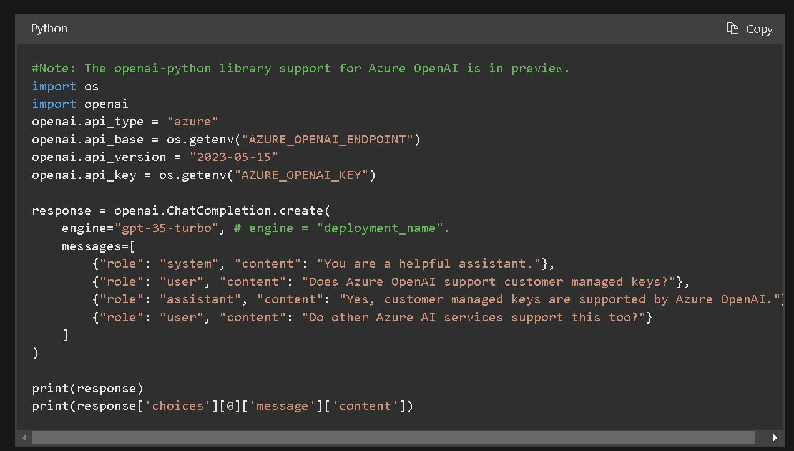

<!--
https://docs.github.com/en/get-started/writing-on-github/getting-started-with-writing-and-formatting-on-github/basic-writing-and-formatting-syntax
-->


***********


<!--
>• Data verwijst naar gegevens die veelal worden verzameld op basis van metingen met behulp van meetsystemen en/of observaties gedaan door mensen.
>
>•  Informatie is een maat voor gereduceerde onzekerheid over beschikbare data. Bijvoorbeeld met behulp van een weermodel kan op basis van meteorologische data een voorspelling gedaan worden over het verloop van de temperatuur voor de komende week. Dus het weermodel structureert en presenteert "betekenisloze" data zoals temperatuur en luchtdruk op een voor mensen betekenisvolle wijze
-->

<font size="8"> **Quickstart: Get started using GPT-35-Turbo and GPT-4 with Azure OpenAI Service**</font>


***********

<font size="6"> **Context & Einddoel**</font>

De onderstaande link laat in stappen zien hoe je met Azure OpenAI Service een GPT-3-Turbo en GPT-4 model kan gebruiken.
Maar de Python code die wordt getoond om een Python applicatie te kunnen  ontwikkelen bevat fouten.

https://learn.microsoft.com/en-us/azure/ai-services/openai/chatgpt-quickstart?tabs=command-line&pivots=programming-language-python


Zorg ervoor dat je je hebt aangemeld voor de Azure OpenAI Service. Eenmaal goedgekeurd voor de Azure OpenAI Service, krijg je toegang tot GPT-4 in de volgende regio's:

 * Zweden Centraal
 * Canada Oost
 * Zwitserland Noord 


Het doel van deze repository is om de fouten in de Python code te corrigeren.
Deze fouten zijn gecorrigeerd in het onderste donkere window
Je kunt de code copy/pasten en gebruiken in je eigen Python applicatie.





```python
#Note: The openai-python library support for Azure OpenAI is in preview.
import os
import openai
openai.api_type = "azure"

####################################
####################################
####################################
####################################

openai.api_base = "AZURE_OPENAI_ENDPOINT" #<==== Replace with your endpoint
                                          # endpoint ziet er ongeveer zo uit: https://openai.azure-api.com/
                                          # let op dit is een dummy endpoint
                                          # Deze waarde kun je vinden in de Keys & Endpoint sectie wanneer je je bron bekijkt vanuit het Azure portaal. 
                                          # dus uiteindelijk moet het er dan zo uitzien:     openai.api_base ="https://openai.azure-api.com/"

####################################
####################################
####################################
####################################                   

openai.api_version = "2023-05-15"

####################################
####################################
####################################
####################################

openai.api_key = "AZURE_OPENAI_KEY"   #<==== Replace with your key
                                      # key ziet er ongeveer zo uit: ded218c778894f6da4d3c3456c6904194
                                      # let op dit is een dummy key
                                      # Deze waarde kun je vinden in de Keys & Endpoint sectie wanneer je je bron bekijkt vanuit het Azure portaal. 
                                      # Je kunt KEY1 of KEY2 gebruiken.
                                      # dus uiteindelijk moet het er dan zo uitzien:     openai.api_key ="ded218c778894f6da4d3c3456c6904194"
####################################
####################################
####################################
####################################

response = openai.ChatCompletion.create(
    engine="gpt-35-turbo", # engine = "deployment_name".
    messages=[
        {"role": "system", "content": "You are a helpful assistant."},
        {"role": "user", "content": "Does Azure OpenAI support customer managed keys?"},
        {"role": "assistant", "content": "Yes, customer managed keys are supported by Azure OpenAI."},
        {"role": "user", "content": "Do other Azure AI services support this too?"}
    ]
)

print(response)
print(response['choices'][0]['message']['content'])

```