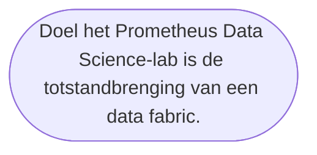

<!--
https://docs.github.com/en/get-started/writing-on-github/getting-started-with-writing-and-formatting-on-github/basic-writing-and-formatting-syntax
-->

***********

<!--
>• Data verwijst naar gegevens die veelal worden verzameld op basis van metingen met behulp van meetsystemen en/of observaties gedaan door mensen.
>
>•  Informatie is een maat voor gereduceerde onzekerheid over beschikbare data. Bijvoorbeeld met behulp van een weermodel kan op basis van meteorologische data een voorspelling gedaan worden over het verloop van de temperatuur voor de komende week. Dus het weermodel structureert en presenteert "betekenisloze" data zoals temperatuur en luchtdruk op een voor mensen betekenisvolle wijze
-->

 **Quickstart: Get started using GPT-35-Turbo and GPT-4 with Azure OpenAI Service**

***********

 **Context & Einddoel**

Data Science  **––DS––**  is een interdisciplinair vakgebied gericht op het extraheren van betekenisvolle informatie uit datasets.
Het kan ingezet worden als praktijkgerichte  kennisbasis voor  data-gedreven besluitvorming & innovatie.

<!--
Machine Learning ––ML––  is een AI-technology binnen Data Science dat een steeds dominantere rol speelt bij data-gedreven innovaties.
AI (kunstmatige intelligentie) is een toegepaste wetenschap gericht op het automatiseren, simuleren en/of creëren van systemen die taken zelfstandig kunnen uitvoeren waarvoor menselijke intelligentie nodig is. Denk voorbeeld aan zoiets als het begrijpen van natuurlijke taal. Het vormt een interdisciplinair vakgebied dat veel subdisciplines bestrijkt, waaronder [computer visie (CV)](https://datascience.eu/nl/computer-vision/computer-visie/), [natuurlijke taalverwerking (NLP)](https://datascience.eu/nl/natuurlijke-taalverwerking/natuurlijke-taalverwerking-nlp/) en [Robotica / Reinforcement Learning (RL)](https://centillien.com/nl/reinforcement-learning/). Of toch niet??!!! Voorlopig is het een "work-in-progress".
-->

Exemplarisch voor data-gedreven innovatie anno 2023 is de lerende machine **––ML––** genaamd [ChatGPT](https://chat.openai.com/). Een state-of-the-art, grootschalig taalmodel **––LLM––** dat gebruik maakt van natuurlijke taalverwerkenden **––NLP––** AI-technologie. Het is gevoed met meer dan 8 miljoen unieke dialogen.

*****

>Stel je een computer voor die jouw zinnen kan afmaken met een betere zinswending;  of een gesprek met je kan voeren over een thema dat jouw interesseert; of een probleem direct kan oplossen door honderden regels computercode te schrijven binnen enkele seconden. Een dergelijke computer vormt een schakel in een lange keten van werktuigen zoals het weefgetouw, de boekdrukpers en de stoommachine die de industriële revolutie opgang brachten. Tegelijkertijd is het onderdeel van een nieuwe klasse aan _lerende machines_, omdat het de symbolen in taal omzet & computercode schrijft op manieren die creatief lijken. Een beetje zoals een mens dat zou doen. Of toch niet??!!! Voorlopig is het een "work-in-progress".

  

Om duiding te geven aan de hype rond de generatieve-AI ChatGPT, is een [*Nederlandstalige  "How-To?" repository*](https://github.com/HR-ChatGPT/ChatGPT-UITGELEGD) opgesteld met [hints en tips](https://github.com/HR-ChatGPT/ChatGPT-UITGELEGD#overzicht-van-veel-gestelde-vragen-chatgpt-facs) voor het verantwoord & effectief gebruik ervan in het hoger onderwijs. 

<!--
 

Een open-source replica [––Open assistent––](https://github.com/LAION-AI/Open-Assistant) is in de maak door een Duits nonprofit organisatie [LIAON](https://laion.ai/):

> *"Open Assistant is een project bedoeld om iedereen toegang te geven tot een groot chatgebaseerd taalmodel. Op dezelfde manier als stable-diffusion de wereld hielp kunst en beelden op nieuwe manieren te maken, kan Open Assistant de wereld  helpen verbeteren door de taal zelf te verbeteren."*
-->

******

 

 **Data Fabric**

 

Een Data Fabric ––DF–– biedt laagdrempelige toegang tot Data Science tools om zo selfservice analyse mogelijk te maken van researchdata. Door verbinding van Computational Thinking skills *––waarover Data Scientists beschikken––* met infrastructurele kennis *––waarover  Data Engineers beschikken––* is een data fabric agnostisch ten aanzien van data-omgevingen, -processen, -nut en -locatie. 

  

Om een data fabric te creëren, werken  data scientists samen met data engineers; hierdoor wordt integratie mogelijk van bestaande IT-infrastructuur en -systemen, zoals bedrijfsapplicaties, analytische tools en security systemen.
Het kan worden ingezet om voorspellingen of beslissingen te maken op basis van researchdata, voor het hele scala aan toepassingsdomeinen dat de hogeschool Rotterdam bestrijkt zoals Coding, Biotech, Education, Fintech, Gaming, Healthcare, InfraTech, Logistics, Predictive Maintenance, Robotics, Shipping.
 

******
 **Data Science Tools**

*****
 

<!--
## Our [Motto](https://fsymbols.com/text-art/) is:

   

   

***********
-->

 **Afstuderen in het Prometheus Data Science Lab**

Het Prometheus Data Science lab richt zich op het betrouwbaar & verantwoord inzetten van open-source data producten.

Data Science is een interdisciplinair vakgebied, dat betekenisvolle inzichten creëert uit ongestructureerde, heterogene datasets, zoals: teksten, images of videofilmpjes afkomstig van het world-wide-web *––denk aan sociale media en discussiefora––* maar kan ook bestaan uit IoT sensor-data en/of logfiles.

Data producten zijn software-applicaties ontwikkeld door data-wetenschappers met behulp van AI-technologie. Ze zijn ontworpen met als doel om inzichten, aanbevelingen of voorspellingen aan eindgebruikers te leveren op basis van ongestructureerde, heterogene datasets. Data producten bevatten interactieve elementen, zoals dashboards of visualisaties, zodat niet-technisch onderlegde eindgebruikers data in real-time kunnen verkennen.

Het Prometheus Lab werkt samen met opdrachtgevers aan data-producten om de doorzoekbaarheid van researchdata te vergroten, causale relaties te kunnen opsporen en/of patronen te kunnen blootleggen. Daarbij ligt de focus op het laagdrempelig & verantwoord inzetten van AI-technologie. Centraal uitgangspunt is het doorlichten van de gehele keten van informatieverwerking *––data pipeline––*, van ruwe data tot de menselijke beslissing.
 

***********

 **Afstudeer Thema's**

Wij vormen een onafhankelijke organisatorische eenheid binnen de Hogeschool Rotterdam. Onze expertise, onderzoek en workshops leveren een belangrijke bijdrage aan de educatie van Data Science. Bij alles wat we doen, draait het om kennisdeling te stimuleren  over het verantwoord toepassen van AI-technologie.

Er zijn drie verschillende toepassingsgerichte Data Science thema's waarop studenten kunnen afstuderen:

| THEMA  | DOEL | Toepassing
| ------------- | ------------- | ---------- |
*––ML––*   Machine Learning  | Ontwerpen van FAIR data products die het benutten van AI-modellen toegankelijk maken voor niet-technisch onderlegde eindgebruikers.  |  [Matlab, Regression Learner applicatie](https://github.com/robvdw/MATLAB_REGRESSION_LEARNER). 
 *––NLP––*   Natuurlijke Taalverwerking | Ontwerpen van FAIR data products die grootschalige taalmodellen *––zoals BERT, BLOOM en ChatGPT––* kunnen benutten voor de analyse van vrije-teksten. |  ["text mining & wrangling" van klinische vrije tekst](https://github.com/robvdw/Decision-Support-Systems-In-Allied-Healthcare) afkomstig van zorgverleners. 
*––DF––*   Data Fabric  | Benutten van Data Science tools voor het creëren van een Data Fabric. | [Anaconda in combinatie met Jupyter Notebooks](https://github.com/robvdw/Creating-AI-Data-Products-Using-Jupyter-Notebooks).

Wij nodigen studenten uit om ervaring opdoen in een groep van enthousiaste, gedreven Data Scientists van het HR-brede Programma voor AI & Ethiek. 

Beschik jij over:
| | |
| ------------- | ------------- |
Sterke affiniteit met AI-technologie | Denk aan Machine Learning en Deep Learning, waarbij je je bewust bent van de randvoorwaarden, kansen en beperkingen.
Actieve beheersing van een hogere programmeertaal |  *––bijvoorkeur Python––* inclusief praktische kennis van data Science libraries 

Mail dan naar willi@hr.nl met als subject: *––Afstuderen in het Prometheus Data Science Lab––*
